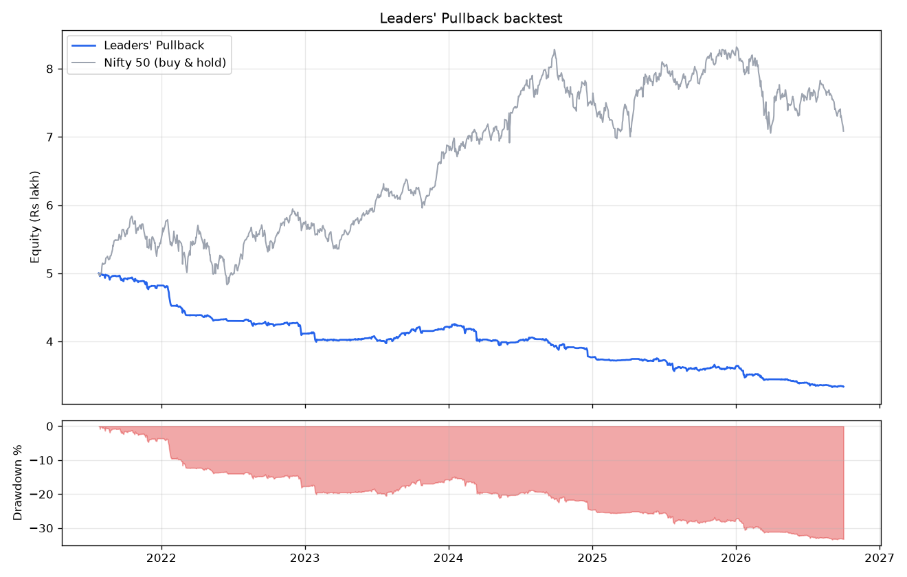

# Leaders' Pullback - backtest summary

## Results

| Metric | Value |
|---|---|
| period | 2021-07-26 to 2026-10-01 |
| start_capital | 500000.0 |
| final_equity | 333799.0 |
| total_return_pct | -33.24 |
| cagr_pct | -7.5 |
| max_drawdown_pct | -33.38 |
| max_drawdown_window | 2021-07-26 to 2026-09-03 |
| sharpe | -1.6 |
| avg_capital_in_use_pct | 9.5 |
| nifty_return_pct | 41.69 |
| nifty_cagr_pct | 6.96 |
| nifty_max_drawdown_pct | -17.23 |
| total_charges_rs | 197694.0 |
| trades | 1230 |
| trades_per_month | 20.1 |
| win_rate_pct | 40.1 |
| first_target_hit_pct | 83.6 |
| avg_win_pct | 1.52 |
| avg_loss_pct | -1.78 |
| avg_trade_pct | -0.454 |
| avg_trade_rs | -135.0 |
| expectancy_r | -0.041 |
| profit_factor | 0.57 |
| best_trade_pct | 11.8 |
| worst_trade_pct | -23.1 |
| avg_days_held | 2.1 |
| longest_losing_streak | 17 |
| exit_reasons | {'sma_exit': 611, 'breakeven': 279, 'gap_breakeven': 271, 'stop': 40, 'first_target': 18, 'gap_stop': 4, 'end_of_test': 4, 'time_stop': 3} |

## Monthly returns (%)

| year | Jan | Feb | Mar | Apr | May | Jun | Jul | Aug | Sep | Oct | Nov | Dec | Year |
|---|---|---|---|---|---|---|---|---|---|---|---|---|---|
| 2021 |  |  |  |  |  |  | -0.27 | -0.5 | -0.77 | -0.59 | -2.14 | 0.64 | -3.6 |
| 2022 | -6.16 | -1.54 | -1.7 | 0.09 | -1.4 | -0.46 | -0.03 | -0.95 | 0.37 | -0.56 | 0.42 | -3.59 | -14.62 |
| 2023 | -2.07 | -0.09 | -0.03 | 0.02 | 0.34 | 0.1 | -0.41 | 1.73 | 1.92 | -0.52 | 0.4 | 1.1 | 2.45 |
| 2024 | 0.36 | -1.48 | -3.36 | -0.31 | -1.05 | 0.95 | 1.15 | -0.77 | -2.14 | -0.74 | -0.07 | -3.62 | -10.66 |
| 2025 | -0.95 | -0.31 | 0.29 | 0.29 | -0.65 | 0.27 | -3.11 | -1.2 | 0.23 | 1.08 | -0.55 | 0.85 | -3.77 |
| 2026 | -3.0 | -0.35 | -1.67 | -0.11 | -0.79 | -0.59 | -1.09 | -0.42 | 0.03 | -0.19 |  |  | -7.92 |

## By year (closed trades)

| year | trades | win_rate_pct | avg_trade_pct | pnl_rs | profit_factor |
|---|---|---|---|---|---|
| 2021 | 106.0 | 42.45 | -0.28 | -17997.5 | 0.62 |
| 2022 | 191.0 | 31.94 | -1.14 | -70477.78 | 0.26 |
| 2023 | 201.0 | 51.24 | 0.27 | 10494.81 | 1.23 |
| 2024 | 263.0 | 37.26 | -0.58 | -44642.88 | 0.5 |
| 2025 | 253.0 | 45.06 | -0.31 | -15051.92 | 0.76 |
| 2026 | 216.0 | 33.33 | -0.62 | -28526.15 | 0.34 |

## By market light

| market | trades | win_rate_pct | avg_trade_pct | pnl_rs |
|---|---|---|---|---|
| amber (index below SMA) | 332.0 | 31.02 | -0.6 | -28040.3 |
| green | 898.0 | 43.43 | -0.4 | -138161.12 |

## Settings

| Setting | Value |
|---|---|
| data_dir | /tmp/claude-0/-home-user-AccessLLM/6bfa55fa-477e-5947-aed7-4241922a6415/scratchpad/data |
| metadata | all_profile_metadata.json |
| index_symbol | ^NSEI |
| history_period | 6y |
| capital | 500000.0 |
| risk_pct | 1.0 |
| max_positions | 5 |
| max_per_sector | 2 |
| max_position_pct | 25.0 |
| monthly_dd_stop_pct | 6.0 |
| min_turnover_cr | 20.0 |
| turnover_days | 20 |
| rs_lookback | 126 |
| rs_min_pct | 70.0 |
| sma_mid | 50 |
| sma_long | 200 |
| rsi_len | 2 |
| rsi_max | 5.0 |
| sma_fast | 5 |
| atr_len | 14 |
| stop_atr | 3.0 |
| t1_pct | 1.0 |
| t1_fraction | 0.5 |
| move_stop_to_entry | True |
| max_hold_days | 10 |
| rank_by | rs |
| regime_sma | 200 |
| regime_mode | half |
| brokerage_per_order | 20.0 |
| stt_pct | 0.1 |
| exchange_pct | 0.00297 |
| sebi_pct | 0.0001 |
| stamp_pct | 0.015 |
| gst_pct | 18.0 |
| dp_charge | 15.93 |
| slippage_pct | 0.05 |
| start |  |
| end |  |

