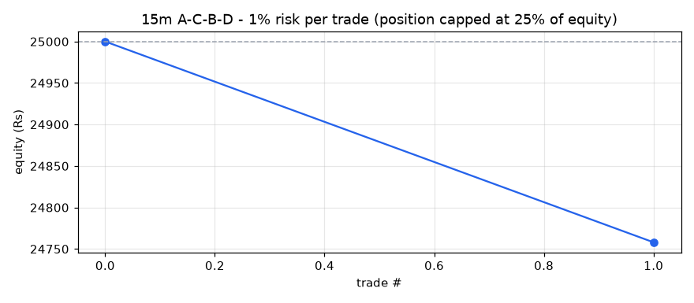
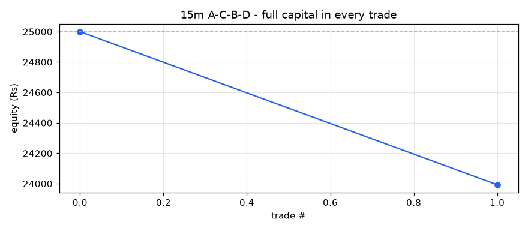

# A-C-B-D backtest report - 15m timeframe

- Stocks scanned: **597** (0 skipped with fewer than 400 candles)
- Data: **13-Jul-2026 09:15 to 01-Oct-2026 15:15, 849,216 candles**
- Costs: 0.35% (overnight) / 0.15% (same-day) round trip, plus Rs 15 / Rs 47 flat charges per trade
- Entry at the close of the breakout candle; exit on the first close above the 1.618 target or below the D low.

## Profit / loss: 1% risk per trade (position capped at 25% of equity)

**Rs 25,000 -> Rs 24,758 = LOSS of Rs 242 (-0.97%)**

Trades 1, winners 0, charges paid Rs 35, max drawdown -0.97%

| symbol | entry | exit_date | status | qty | position_rs | net_return_pct | charges_rs | pnl_rs | equity_rs |
|---|---|---|---|---|---|---|---|---|---|
| HDBFS | 18-Sep-2026 15:00 | 22-Sep-2026 15:00 | STOPPED | 8 | 5596 | -4.05 | 35 | -242 | 24758 |

## Profit / loss: full capital in every trade

**Rs 25,000 -> Rs 23,993 = LOSS of Rs 1,007 (-4.03%)**

Trades 1, winners 0, charges paid Rs 101, max drawdown -4.03%

| symbol | entry | exit_date | status | qty | position_rs | net_return_pct | charges_rs | pnl_rs | equity_rs |
|---|---|---|---|---|---|---|---|---|---|
| HDBFS | 18-Sep-2026 15:00 | 22-Sep-2026 15:00 | STOPPED | 35 | 24484 | -4.05 | 101 | -1007 | 23993 |

## Trade statistics (after costs)

| period | setups_entered | target_hit | stopped | open | win_rate_pct | avg_gross_pct | avg_net_pct | avg_win_pct | avg_loss_pct | avg_r | profit_factor | avg_hold_candles |
|---|---|---|---|---|---|---|---|---|---|---|---|---|
| 2026 | 1 | 0 | 1 | 0 | 0.0 | -3.7 | -4.05 |  | -4.05 | -1.12 | 0.0 | 50.0 |
| ALL | 1 | 0 | 1 | 0 | 0.0 | -3.7 | -4.05 |  | -4.05 | -1.12 | 0.0 | 50.0 |

## Trades entered

| symbol | D | entry | entry_close | stop | target | status | exit_date | return_pct | net_return_pct | hold_candles |
|---|---|---|---|---|---|---|---|---|---|---|
| HDBFS | 18-Sep-2026 12:15 | 18-Sep-2026 15:00 | 699.5499877929688 | 674.1500244140625 | 704.38 | STOPPED | 22-Sep-2026 15:00 | -3.7 | -4.05 | 50.0 |

## All setups found (A-C-B-D located, with why most were not traded)

| status | setups |
|---|---|
| D broken | 12 |
| STOPPED | 1 |

| symbol | A | C | B | D | fib_B | fib_D | status |
|---|---|---|---|---|---|---|---|
| CUB | 29-Jul-2026 15:15 | 04-Aug-2026 15:15 | 12-Aug-2026 10:45 | 13-Aug-2026 15:15 | 0.601 | 0.356 | D broken |
| HEXT | 29-Jul-2026 11:45 | 05-Aug-2026 09:45 | 13-Aug-2026 10:45 | 17-Aug-2026 10:45 | 0.486 | 0.353 | D broken |
| SUZLON | 27-Jul-2026 15:15 | 29-Jul-2026 11:15 | 17-Aug-2026 13:15 | 19-Aug-2026 10:15 | 0.466 | 0.266 | D broken |
| NTPC | 03-Aug-2026 15:00 | 19-Aug-2026 14:00 | 21-Aug-2026 10:45 | 24-Aug-2026 14:15 | 0.533 | 0.413 | D broken |
| ABB | 04-Aug-2026 10:15 | 19-Aug-2026 15:00 | 26-Aug-2026 10:00 | 27-Aug-2026 11:30 | 0.611 | 0.4 | D broken |
| LEMONTREE | 05-Aug-2026 09:45 | 10-Aug-2026 09:30 | 26-Aug-2026 09:15 | 27-Aug-2026 11:30 | 0.423 | 0.298 | D broken |
| ULTRACEMCO | 06-Aug-2026 10:30 | 19-Aug-2026 12:15 | 26-Aug-2026 14:45 | 28-Aug-2026 11:30 | 0.526 | 0.31 | D broken |
| DELHIVERY | 31-Jul-2026 14:00 | 25-Aug-2026 10:00 | 28-Aug-2026 15:00 | 02-Sep-2026 09:15 | 0.607 | 0.432 | D broken |
| AJANTPHARM | 18-Aug-2026 10:15 | 02-Sep-2026 10:30 | 09-Sep-2026 09:15 | 10-Sep-2026 09:15 | 0.485 | 0.321 | D broken |
| HDBFS | 04-Sep-2026 09:15 | 16-Sep-2026 09:15 | 17-Sep-2026 10:15 | 18-Sep-2026 12:15 | 0.614 | 0.43 | STOPPED |
| VGUARD | 18-Aug-2026 09:15 | 16-Sep-2026 09:45 | 18-Sep-2026 10:00 | 21-Sep-2026 10:00 | 0.617 | 0.324 | D broken |
| VEDL | 27-Aug-2026 09:15 | 16-Sep-2026 09:45 | 23-Sep-2026 15:00 | 28-Sep-2026 09:30 | 0.488 | 0.306 | D broken |
| DIXON | 28-Aug-2026 09:15 | 16-Sep-2026 09:30 | 28-Sep-2026 12:30 | 29-Sep-2026 15:15 | 0.442 | 0.435 | D broken |
