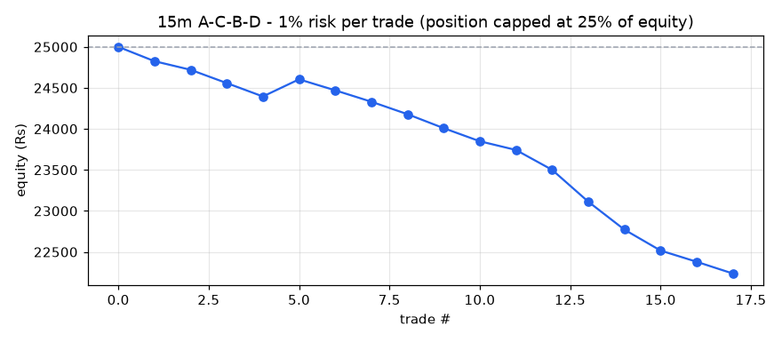
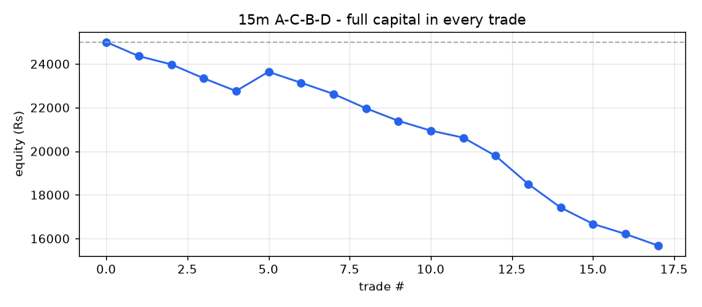

# A-C-B-D backtest report - 15m timeframe

- Stocks scanned: **588** (0 skipped with fewer than 400 candles)
- Data: **13-Jul-2026 09:15 to 01-Oct-2026 15:15, 847,766 candles**
- Costs: 0.35% (overnight) / 0.15% (same-day) round trip, plus Rs 15 / Rs 47 flat charges per trade
- Entry at the close of the breakout candle; exit on the first close above the 1.618 target or below the D low.

## Profit / loss: 1% risk per trade (position capped at 25% of equity)

**Rs 25,000 -> Rs 22,237 = LOSS of Rs 2,763 (-11.05%)**

Trades 17, winners 1, charges paid Rs 623, max drawdown -11.05%

| symbol | entry | exit_date | status | qty | position_rs | net_return_pct | charges_rs | pnl_rs | equity_rs |
|---|---|---|---|---|---|---|---|---|---|
| DEEPAKNTR | 24-Aug-2026 09:15 | 24-Aug-2026 14:30 | STOPPED | 3 | 5295 | -2.41 | 55 | -175 | 24825 |
| SAFARI | 31-Aug-2026 11:30 | 02-Sep-2026 14:30 | STOPPED | 4 | 6040 | -1.5 | 36 | -106 | 24720 |
| GABRIEL | 02-Sep-2026 15:15 | 03-Sep-2026 11:00 | STOPPED | 4 | 5600 | -2.62 | 35 | -162 | 24558 |
| DELHIVERY | 03-Sep-2026 10:30 | 09-Sep-2026 09:15 | STOPPED | 13 | 5970 | -2.48 | 36 | -163 | 24395 |
| SARDAEN | 07-Sep-2026 14:30 | 09-Sep-2026 10:15 | TARGET HIT | 11 | 5645 | 3.96 | 35 | 209 | 24604 |
| AADHARHFC | 08-Sep-2026 13:00 | 10-Sep-2026 11:00 | STOPPED | 12 | 5678 | -2.09 | 35 | -134 | 24470 |
| CREDITACC | 08-Sep-2026 14:00 | 11-Sep-2026 09:15 | STOPPED | 4 | 5652 | -2.19 | 35 | -139 | 24331 |
| AFFLE | 10-Sep-2026 12:15 | 11-Sep-2026 09:15 | STOPPED | 3 | 4821 | -2.85 | 32 | -152 | 24179 |
| GNA | 10-Sep-2026 10:15 | 15-Sep-2026 14:15 | STOPPED | 11 | 6039 | -2.56 | 36 | -170 | 24009 |
| TATAPOWER | 15-Sep-2026 09:15 | 15-Sep-2026 15:00 | STOPPED | 16 | 5912 | -1.91 | 56 | -160 | 23849 |
| COROMANDEL | 15-Sep-2026 09:45 | 16-Sep-2026 09:15 | STOPPED | 3 | 5823 | -1.57 | 35 | -106 | 23743 |
| HDBFS | 18-Sep-2026 15:00 | 22-Sep-2026 15:00 | STOPPED | 8 | 5596 | -4.05 | 35 | -242 | 23501 |
| UJJIVANSFB | 17-Sep-2026 09:15 | 24-Sep-2026 09:15 | STOPPED | 89 | 5827 | -6.4 | 35 | -388 | 23113 |
| CANHLIFE | 21-Sep-2026 13:15 | 24-Sep-2026 09:15 | STOPPED | 37 | 5646 | -5.78 | 35 | -341 | 22772 |
| TATAPOWER | 18-Sep-2026 15:15 | 28-Sep-2026 15:00 | STOPPED | 15 | 5622 | -4.27 | 35 | -255 | 22517 |
| PRESTIGE | 28-Sep-2026 15:00 | 29-Sep-2026 13:15 | STOPPED | 3 | 4412 | -2.76 | 30 | -137 | 22380 |
| KAYNES | 24-Sep-2026 11:45 | 01-Oct-2026 12:30 | STOPPED | 1 | 3520 | -3.65 | 27 | -143 | 22237 |

## Profit / loss: full capital in every trade

**Rs 25,000 -> Rs 15,683 = LOSS of Rs 9,317 (-37.27%)**

Trades 17, winners 1, charges paid Rs 1,470, max drawdown -37.27%

| symbol | entry | exit_date | status | qty | position_rs | net_return_pct | charges_rs | pnl_rs | equity_rs |
|---|---|---|---|---|---|---|---|---|---|
| DEEPAKNTR | 24-Aug-2026 09:15 | 24-Aug-2026 14:30 | STOPPED | 14 | 24711 | -2.41 | 84 | -643 | 24357 |
| SAFARI | 31-Aug-2026 11:30 | 02-Sep-2026 14:30 | STOPPED | 16 | 24158 | -1.5 | 100 | -377 | 23980 |
| GABRIEL | 02-Sep-2026 15:15 | 03-Sep-2026 11:00 | STOPPED | 17 | 23798 | -2.62 | 98 | -639 | 23342 |
| DELHIVERY | 03-Sep-2026 10:30 | 09-Sep-2026 09:15 | STOPPED | 50 | 22962 | -2.48 | 95 | -584 | 22757 |
| SARDAEN | 07-Sep-2026 14:30 | 09-Sep-2026 10:15 | TARGET HIT | 44 | 22579 | 3.96 | 94 | 879 | 23636 |
| AADHARHFC | 08-Sep-2026 13:00 | 10-Sep-2026 11:00 | STOPPED | 49 | 23184 | -2.09 | 96 | -500 | 23137 |
| CREDITACC | 08-Sep-2026 14:00 | 11-Sep-2026 09:15 | STOPPED | 16 | 22608 | -2.19 | 94 | -510 | 22627 |
| AFFLE | 10-Sep-2026 12:15 | 11-Sep-2026 09:15 | STOPPED | 14 | 22498 | -2.85 | 94 | -656 | 21970 |
| GNA | 10-Sep-2026 10:15 | 15-Sep-2026 14:15 | STOPPED | 40 | 21960 | -2.56 | 92 | -577 | 21393 |
| TATAPOWER | 15-Sep-2026 09:15 | 15-Sep-2026 15:00 | STOPPED | 57 | 21062 | -1.91 | 79 | -449 | 20944 |
| COROMANDEL | 15-Sep-2026 09:45 | 16-Sep-2026 09:15 | STOPPED | 10 | 19411 | -1.57 | 83 | -320 | 20624 |
| HDBFS | 18-Sep-2026 15:00 | 22-Sep-2026 15:00 | STOPPED | 29 | 20287 | -4.05 | 86 | -837 | 19788 |
| UJJIVANSFB | 17-Sep-2026 09:15 | 24-Sep-2026 09:15 | STOPPED | 302 | 19772 | -6.4 | 84 | -1280 | 18507 |
| CANHLIFE | 21-Sep-2026 13:15 | 24-Sep-2026 09:15 | STOPPED | 121 | 18465 | -5.78 | 80 | -1082 | 17425 |
| TATAPOWER | 18-Sep-2026 15:15 | 28-Sep-2026 15:00 | STOPPED | 46 | 17241 | -4.27 | 75 | -751 | 16674 |
| PRESTIGE | 28-Sep-2026 15:00 | 29-Sep-2026 13:15 | STOPPED | 11 | 16179 | -2.76 | 72 | -462 | 16212 |
| KAYNES | 24-Sep-2026 11:45 | 01-Oct-2026 12:30 | STOPPED | 4 | 14079 | -3.65 | 64 | -529 | 15683 |

## Trade statistics (after costs)

| period | setups_entered | target_hit | stopped | open | win_rate_pct | avg_gross_pct | avg_net_pct | avg_win_pct | avg_loss_pct | avg_r | profit_factor | avg_hold_candles |
|---|---|---|---|---|---|---|---|---|---|---|---|---|
| 2026 | 18 | 1 | 16 | 1 | 5.9 | -2.33 | -2.65 | 3.96 | -3.07 | -1.25 | 0.08 | 56.9 |
| ALL | 18 | 1 | 16 | 1 | 5.9 | -2.33 | -2.65 | 3.96 | -3.07 | -1.25 | 0.08 | 56.9 |

## Trades entered

| symbol | D | entry | entry_close | stop | target | status | exit_date | return_pct | net_return_pct | hold_candles |
|---|---|---|---|---|---|---|---|---|---|---|
| DEEPAKNTR | 21-Aug-2026 10:45 | 24-Aug-2026 09:15 | 1765.0999755859375 | 1725.5 | 1879.29 | STOPPED | 24-Aug-2026 14:30 | -2.26 | -2.41 | 21.0 |
| SAFARI | 31-Aug-2026 09:45 | 31-Aug-2026 11:30 | 1509.9000244140625 | 1493.5999755859375 | 1581.73 | STOPPED | 02-Sep-2026 14:30 | -1.15 | -1.5 | 62.0 |
| GABRIEL | 02-Sep-2026 12:15 | 02-Sep-2026 15:15 | 1399.9000244140625 | 1372.699951171875 | 1561.47 | STOPPED | 03-Sep-2026 11:00 | -2.27 | -2.62 | 8.0 |
| DELHIVERY | 03-Sep-2026 09:15 | 03-Sep-2026 10:30 | 459.25 | 449.6499938964844 | 490.48 | STOPPED | 09-Sep-2026 09:15 | -2.13 | -2.48 | 94.0 |
| SARDAEN | 07-Sep-2026 09:15 | 07-Sep-2026 14:30 | 513.1500244140625 | 503.8999938964844 | 533.84 | TARGET HIT | 09-Sep-2026 10:15 | 4.31 | 3.96 | 33.0 |
| AADHARHFC | 08-Sep-2026 12:00 | 08-Sep-2026 13:00 | 473.1499938964844 | 468.2999877929688 | 503.8 | STOPPED | 10-Sep-2026 11:00 | -1.74 | -2.09 | 42.0 |
| CREDITACC | 08-Sep-2026 12:15 | 08-Sep-2026 14:00 | 1413.0 | 1392.699951171875 | 1541.79 | STOPPED | 11-Sep-2026 09:15 | -1.84 | -2.19 | 56.0 |
| AFFLE | 09-Sep-2026 10:30 | 10-Sep-2026 12:15 | 1607.0 | 1578.4000244140625 | 1756.22 | STOPPED | 11-Sep-2026 09:15 | -2.5 | -2.85 | 13.0 |
| GNA | 09-Sep-2026 15:15 | 10-Sep-2026 10:15 | 549.0 | 536.9000244140625 | 588.72 | STOPPED | 15-Sep-2026 14:15 | -2.21 | -2.56 | 66.0 |
| COROMANDEL | 11-Sep-2026 09:15 | 15-Sep-2026 09:45 | 1941.0999755859373 | 1918.300048828125 | 2035.46 | STOPPED | 16-Sep-2026 09:15 | -1.22 | -1.57 | 23.0 |
| TATAPOWER | 11-Sep-2026 09:15 | 15-Sep-2026 09:15 | 369.5 | 363.1499938964844 | 390.2 | STOPPED | 15-Sep-2026 15:00 | -1.76 | -1.91 | 23.0 |
| UJJIVANSFB | 16-Sep-2026 09:45 | 17-Sep-2026 09:15 | 65.47000122070312 | 63.13999938964844 | 69.96 | STOPPED | 24-Sep-2026 09:15 | -6.05 | -6.4 | 125.0 |
| TATAPOWER | 16-Sep-2026 15:00 | 18-Sep-2026 15:15 | 374.7999877929688 | 360.3999938964844 | 394.81 | STOPPED | 28-Sep-2026 15:00 | -3.92 | -4.27 | 149.0 |
| HDBFS | 18-Sep-2026 12:15 | 18-Sep-2026 15:00 | 699.5499877929688 | 674.1500244140625 | 704.38 | STOPPED | 22-Sep-2026 15:00 | -3.7 | -4.05 | 50.0 |
| CANHLIFE | 21-Sep-2026 10:00 | 21-Sep-2026 13:15 | 152.60000610351562 | 149.80999755859375 | 161.72 | STOPPED | 24-Sep-2026 09:15 | -5.43 | -5.78 | 59.0 |
| KAYNES | 24-Sep-2026 09:15 | 24-Sep-2026 11:45 | 3519.699951171875 | 3416.199951171875 | 3904.51 | STOPPED | 01-Oct-2026 12:30 | -3.3 | -3.65 | 126.0 |
| PRESTIGE | 28-Sep-2026 09:30 | 28-Sep-2026 15:00 | 1470.800048828125 | 1437.4000244140625 | 1568.15 | STOPPED | 29-Sep-2026 13:15 | -2.41 | -2.76 | 17.0 |
| ICICIGI | 29-Sep-2026 10:15 | 30-Sep-2026 09:15 | 1532.199951171875 | 1498.300048828125 | 1686.55 | OPEN | 01-Oct-2026 15:00 | 2.01 | 1.66 | 47.0 |

## All setups found (A-C-B-D located, with why most were not traded)

| status | setups |
|---|---|
| D broken | 44 |
| STOPPED | 16 |
| no breakout | 4 |
| TARGET HIT | 1 |
| OPEN | 1 |

| symbol | A | C | B | D | fib_B | fib_D | status |
|---|---|---|---|---|---|---|---|
| DALBHARAT | 23-Jul-2026 09:30 | 27-Jul-2026 09:15 | 10-Aug-2026 13:00 | 13-Aug-2026 10:00 | 0.75 | 0.426 | no breakout |
| CUB | 29-Jul-2026 15:15 | 04-Aug-2026 15:15 | 12-Aug-2026 10:45 | 13-Aug-2026 15:15 | 0.601 | 0.356 | D broken |
| ABDL | 30-Jul-2026 11:30 | 07-Aug-2026 12:15 | 13-Aug-2026 11:15 | 14-Aug-2026 12:30 | 0.757 | 0.281 | D broken |
| HEXT | 29-Jul-2026 11:45 | 05-Aug-2026 09:45 | 13-Aug-2026 10:45 | 17-Aug-2026 10:45 | 0.486 | 0.353 | D broken |
| BIRLACORPN | 07-Aug-2026 14:15 | 11-Aug-2026 13:00 | 14-Aug-2026 10:00 | 18-Aug-2026 10:30 | 0.706 | 0.252 | D broken |
| ICICIPRULI | 03-Aug-2026 15:15 | 11-Aug-2026 09:30 | 14-Aug-2026 12:15 | 18-Aug-2026 13:30 | 0.667 | 0.446 | D broken |
| SUZLON | 27-Jul-2026 15:15 | 29-Jul-2026 11:15 | 17-Aug-2026 13:15 | 19-Aug-2026 10:15 | 0.466 | 0.266 | D broken |
| DEEPAKNTR | 05-Aug-2026 09:15 | 13-Aug-2026 14:15 | 19-Aug-2026 09:30 | 21-Aug-2026 10:45 | 0.732 | 0.268 | STOPPED |
| STARHEALTH | 30-Jul-2026 14:45 | 10-Aug-2026 10:30 | 14-Aug-2026 12:45 | 24-Aug-2026 11:00 | 0.522 | 0.458 | no breakout |
| NTPC | 03-Aug-2026 15:00 | 19-Aug-2026 14:00 | 21-Aug-2026 10:45 | 25-Aug-2026 10:30 | 0.533 | 0.31 | D broken |
| RPOWER | 07-Aug-2026 09:30 | 19-Aug-2026 15:15 | 24-Aug-2026 09:15 | 25-Aug-2026 12:45 | 0.593 | 0.452 | no breakout |
| LEMONTREE | 05-Aug-2026 09:45 | 10-Aug-2026 09:30 | 26-Aug-2026 09:15 | 27-Aug-2026 11:30 | 0.423 | 0.298 | D broken |
| ABB | 04-Aug-2026 10:15 | 19-Aug-2026 15:00 | 26-Aug-2026 10:00 | 27-Aug-2026 13:45 | 0.611 | 0.359 | D broken |
| IOC | 06-Aug-2026 12:00 | 21-Aug-2026 09:15 | 26-Aug-2026 09:15 | 27-Aug-2026 14:15 | 0.611 | 0.27 | D broken |
| NATIONALUM | 12-Aug-2026 09:30 | 14-Aug-2026 15:00 | 24-Aug-2026 13:00 | 27-Aug-2026 15:00 | 0.636 | 0.431 | D broken |
| ULTRACEMCO | 05-Aug-2026 11:00 | 19-Aug-2026 12:15 | 26-Aug-2026 14:45 | 28-Aug-2026 11:30 | 0.505 | 0.31 | D broken |
| ABCAPITAL | 03-Aug-2026 11:15 | 18-Aug-2026 11:15 | 26-Aug-2026 09:45 | 28-Aug-2026 12:00 | 0.612 | 0.511 | D broken |
| PRESTIGE | 29-Jul-2026 11:15 | 12-Aug-2026 10:00 | 26-Aug-2026 11:00 | 28-Aug-2026 12:15 | 0.629 | 0.333 | D broken |
| TATASTEEL | 06-Aug-2026 09:15 | 14-Aug-2026 10:30 | 27-Aug-2026 09:30 | 28-Aug-2026 12:30 | 0.755 | 0.412 | D broken |
| GODREJPROP | 29-Jul-2026 11:15 | 19-Aug-2026 09:30 | 27-Aug-2026 12:45 | 28-Aug-2026 13:15 | 0.6 | 0.435 | D broken |
| SUNDARMFIN | 03-Aug-2026 15:15 | 12-Aug-2026 11:45 | 27-Aug-2026 10:30 | 31-Aug-2026 09:15 | 0.467 | 0.388 | no breakout |
| SAFARI | 29-Jul-2026 12:15 | 04-Aug-2026 14:30 | 27-Aug-2026 09:30 | 31-Aug-2026 09:45 | 0.446 | 0.281 | STOPPED |
| SWIGGY | 06-Aug-2026 10:30 | 19-Aug-2026 09:30 | 26-Aug-2026 10:00 | 31-Aug-2026 15:00 | 0.659 | 0.274 | D broken |
| GABRIEL | 05-Aug-2026 11:45 | 28-Aug-2026 12:00 | 01-Sep-2026 10:15 | 02-Sep-2026 12:15 | 0.535 | 0.371 | STOPPED |
| DELHIVERY | 31-Jul-2026 14:00 | 25-Aug-2026 10:00 | 28-Aug-2026 15:00 | 03-Sep-2026 09:15 | 0.607 | 0.326 | STOPPED |
| ONGC | 19-Aug-2026 11:30 | 26-Aug-2026 09:15 | 02-Sep-2026 09:30 | 04-Sep-2026 09:15 | 0.738 | 0.345 | D broken |
| SARDAEN | 14-Aug-2026 15:15 | 01-Sep-2026 14:00 | 04-Sep-2026 09:15 | 07-Sep-2026 09:15 | 0.617 | 0.519 | TARGET HIT |
| AADHARHFC | 06-Aug-2026 11:15 | 21-Aug-2026 14:15 | 04-Sep-2026 11:45 | 08-Sep-2026 12:00 | 0.472 | 0.308 | STOPPED |
| CREDITACC | 14-Aug-2026 09:30 | 01-Sep-2026 09:45 | 04-Sep-2026 09:30 | 08-Sep-2026 12:15 | 0.548 | 0.369 | STOPPED |
| AFFLE | 24-Aug-2026 15:15 | 03-Sep-2026 12:00 | 07-Sep-2026 10:45 | 09-Sep-2026 10:30 | 0.637 | 0.538 | STOPPED |
| GNA | 18-Aug-2026 15:00 | 01-Sep-2026 14:15 | 08-Sep-2026 12:30 | 09-Sep-2026 15:15 | 0.645 | 0.323 | STOPPED |
| AJANTPHARM | 18-Aug-2026 10:15 | 02-Sep-2026 10:30 | 09-Sep-2026 09:15 | 10-Sep-2026 09:15 | 0.485 | 0.321 | D broken |
| SIGNATURE | 10-Aug-2026 13:15 | 31-Aug-2026 10:45 | 04-Sep-2026 09:15 | 10-Sep-2026 11:30 | 0.683 | 0.338 | D broken |
| CENTRALBK | 05-Aug-2026 09:30 | 02-Sep-2026 09:15 | 04-Sep-2026 13:15 | 11-Sep-2026 09:15 | 0.7 | 0.421 | D broken |
| COROMANDEL | 17-Aug-2026 10:15 | 02-Sep-2026 12:15 | 07-Sep-2026 15:15 | 11-Sep-2026 09:15 | 0.406 | 0.315 | STOPPED |
| TATAPOWER | 14-Aug-2026 11:45 | 31-Aug-2026 15:15 | 09-Sep-2026 10:15 | 11-Sep-2026 09:15 | 0.615 | 0.605 | STOPPED |
| BOSCHLTD | 31-Aug-2026 15:15 | 02-Sep-2026 11:00 | 09-Sep-2026 15:15 | 15-Sep-2026 10:00 | 0.749 | 0.489 | D broken |
| UJJIVANSFB | 20-Aug-2026 09:30 | 02-Sep-2026 09:30 | 10-Sep-2026 12:30 | 16-Sep-2026 09:45 | 0.422 | 0.329 | STOPPED |
| TATAPOWER | 14-Aug-2026 11:45 | 31-Aug-2026 15:15 | 15-Sep-2026 09:15 | 16-Sep-2026 15:00 | 0.681 | 0.453 | STOPPED |
| HDBFS | 20-Aug-2026 09:15 | 16-Sep-2026 09:15 | 17-Sep-2026 10:15 | 18-Sep-2026 12:15 | 0.523 | 0.43 | STOPPED |
| CANHLIFE | 04-Sep-2026 13:45 | 16-Sep-2026 09:45 | 17-Sep-2026 15:15 | 21-Sep-2026 10:00 | 0.664 | 0.272 | STOPPED |
| VGUARD | 18-Aug-2026 09:15 | 16-Sep-2026 09:45 | 18-Sep-2026 10:00 | 21-Sep-2026 10:00 | 0.617 | 0.324 | D broken |
| IDFCFIRSTB | 03-Sep-2026 14:45 | 17-Sep-2026 09:45 | 18-Sep-2026 09:45 | 21-Sep-2026 13:15 | 0.72 | 0.282 | D broken |
| SUNPHARMA | 31-Aug-2026 15:15 | 15-Sep-2026 10:00 | 21-Sep-2026 10:15 | 22-Sep-2026 11:45 | 0.402 | 0.283 | D broken |
| HDBFS | 20-Aug-2026 09:15 | 16-Sep-2026 09:15 | 18-Sep-2026 15:00 | 22-Sep-2026 14:00 | 0.773 | 0.254 | D broken |
| KAYNES | 26-Aug-2026 12:30 | 16-Sep-2026 09:45 | 21-Sep-2026 14:45 | 24-Sep-2026 09:15 | 0.458 | 0.309 | STOPPED |
| SAPPHIRE | 26-Aug-2026 09:15 | 11-Sep-2026 09:15 | 21-Sep-2026 09:45 | 24-Sep-2026 10:00 | 0.571 | 0.307 | D broken |
| TVSMOTOR | 26-Aug-2026 10:45 | 16-Sep-2026 09:45 | 21-Sep-2026 09:15 | 24-Sep-2026 13:45 | 0.427 | 0.266 | D broken |
| DALBHARAT | 20-Aug-2026 12:00 | 08-Sep-2026 13:30 | 21-Sep-2026 09:15 | 24-Sep-2026 14:00 | 0.557 | 0.278 | D broken |
| NAM-INDIA | 26-Aug-2026 09:15 | 17-Sep-2026 09:45 | 23-Sep-2026 11:00 | 24-Sep-2026 14:15 | 0.512 | 0.363 | D broken |
| JUBLFOOD | 26-Aug-2026 09:15 | 15-Sep-2026 13:30 | 21-Sep-2026 09:15 | 25-Sep-2026 09:15 | 0.65 | 0.298 | D broken |
| TENNIND | 21-Aug-2026 13:00 | 02-Sep-2026 11:30 | 23-Sep-2026 09:30 | 25-Sep-2026 09:45 | 0.534 | 0.263 | D broken |
| GLENMARK | 28-Aug-2026 14:45 | 16-Sep-2026 09:45 | 23-Sep-2026 10:15 | 25-Sep-2026 10:30 | 0.759 | 0.335 | D broken |
| IRCTC | 26-Aug-2026 15:15 | 16-Sep-2026 09:45 | 18-Sep-2026 15:15 | 25-Sep-2026 12:45 | 0.725 | 0.33 | D broken |
| CARRARO | 31-Aug-2026 09:45 | 16-Sep-2026 09:45 | 23-Sep-2026 14:15 | 28-Sep-2026 09:30 | 0.768 | 0.327 | D broken |
| MUTHOOTFIN | 28-Aug-2026 12:30 | 15-Sep-2026 15:15 | 21-Sep-2026 14:45 | 28-Sep-2026 09:30 | 0.394 | 0.313 | D broken |
| PRESTIGE | 26-Aug-2026 11:00 | 16-Sep-2026 09:45 | 23-Sep-2026 10:45 | 28-Sep-2026 09:30 | 0.413 | 0.288 | STOPPED |
| ATULAUTO | 01-Sep-2026 11:45 | 16-Sep-2026 09:30 | 23-Sep-2026 11:15 | 28-Sep-2026 10:15 | 0.474 | 0.375 | D broken |
| THYROCARE | 31-Aug-2026 15:15 | 16-Sep-2026 09:45 | 22-Sep-2026 11:45 | 28-Sep-2026 10:15 | 0.764 | 0.347 | D broken |
| MARICO | 20-Aug-2026 15:15 | 15-Sep-2026 15:15 | 23-Sep-2026 09:45 | 28-Sep-2026 11:15 | 0.625 | 0.316 | D broken |
| LICI | 25-Aug-2026 09:45 | 16-Sep-2026 09:45 | 24-Sep-2026 09:30 | 29-Sep-2026 09:30 | 0.753 | 0.243 | D broken |
| VEDL | 27-Aug-2026 09:15 | 16-Sep-2026 09:45 | 23-Sep-2026 15:00 | 29-Sep-2026 10:00 | 0.488 | 0.258 | D broken |
| ICICIGI | 20-Aug-2026 13:00 | 15-Sep-2026 13:45 | 25-Sep-2026 09:15 | 29-Sep-2026 10:15 | 0.718 | 0.461 | OPEN |
| JSWSTEEL | 27-Aug-2026 09:15 | 16-Sep-2026 09:45 | 23-Sep-2026 12:00 | 29-Sep-2026 10:15 | 0.627 | 0.256 | D broken |
| DIXON | 25-Aug-2026 15:00 | 16-Sep-2026 09:30 | 28-Sep-2026 12:30 | 30-Sep-2026 15:15 | 0.428 | 0.271 | D broken |
| TECHNOE | 21-Sep-2026 09:15 | 29-Sep-2026 10:00 | 30-Sep-2026 09:15 | 01-Oct-2026 09:15 | 0.692 | 0.558 | D broken |
