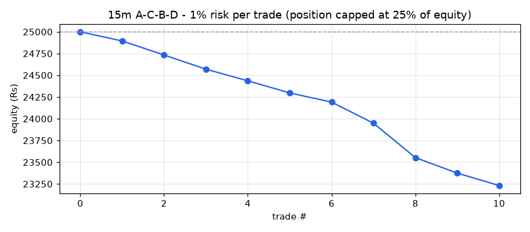
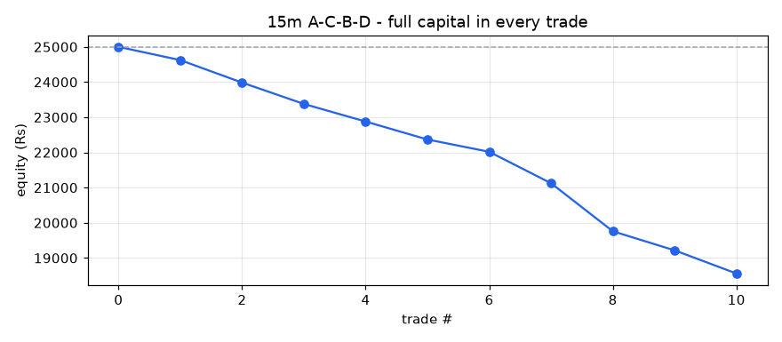

# A-C-B-D backtest report - 15m timeframe

- Stocks scanned: **588** (0 skipped with fewer than 400 candles)
- Data: **13-Jul-2026 09:15 to 01-Oct-2026 15:15, 847,766 candles**
- Costs: 0.35% (overnight) / 0.15% (same-day) round trip, plus Rs 15 / Rs 47 flat charges per trade
- Entry at the close of the breakout candle; exit on the first close above the 1.618 target or below the D low.

## Profit / loss: 1% risk per trade (position capped at 25% of equity)

**Rs 25,000 -> Rs 23,232 = LOSS of Rs 1,768 (-7.07%)**

Trades 10, winners 0, charges paid Rs 346, max drawdown -7.07%

| symbol | entry | exit_date | status | qty | position_rs | net_return_pct | charges_rs | pnl_rs | equity_rs |
|---|---|---|---|---|---|---|---|---|---|
| SAFARI | 31-Aug-2026 11:30 | 02-Sep-2026 14:30 | STOPPED | 4 | 6040 | -1.5 | 36 | -106 | 24894 |
| GABRIEL | 02-Sep-2026 15:15 | 03-Sep-2026 11:00 | STOPPED | 4 | 5600 | -2.62 | 35 | -162 | 24733 |
| DELHIVERY | 03-Sep-2026 10:30 | 09-Sep-2026 09:15 | STOPPED | 13 | 5970 | -2.48 | 36 | -163 | 24570 |
| AADHARHFC | 08-Sep-2026 13:00 | 10-Sep-2026 11:00 | STOPPED | 12 | 5678 | -2.09 | 35 | -134 | 24436 |
| CREDITACC | 08-Sep-2026 14:00 | 11-Sep-2026 09:15 | STOPPED | 4 | 5652 | -2.19 | 35 | -139 | 24297 |
| COROMANDEL | 15-Sep-2026 09:45 | 16-Sep-2026 09:15 | STOPPED | 3 | 5823 | -1.57 | 35 | -106 | 24191 |
| HDBFS | 18-Sep-2026 15:00 | 22-Sep-2026 15:00 | STOPPED | 8 | 5596 | -4.05 | 35 | -242 | 23949 |
| UJJIVANSFB | 17-Sep-2026 09:15 | 24-Sep-2026 09:15 | STOPPED | 91 | 5958 | -6.4 | 36 | -396 | 23553 |
| PRESTIGE | 28-Sep-2026 15:00 | 29-Sep-2026 13:15 | STOPPED | 4 | 5883 | -2.76 | 36 | -177 | 23375 |
| KAYNES | 24-Sep-2026 11:45 | 01-Oct-2026 12:30 | STOPPED | 1 | 3520 | -3.65 | 27 | -143 | 23232 |

## Profit / loss: full capital in every trade

**Rs 25,000 -> Rs 18,559 = LOSS of Rs 6,441 (-25.76%)**

Trades 10, winners 0, charges paid Rs 916, max drawdown -25.76%

| symbol | entry | exit_date | status | qty | position_rs | net_return_pct | charges_rs | pnl_rs | equity_rs |
|---|---|---|---|---|---|---|---|---|---|
| SAFARI | 31-Aug-2026 11:30 | 02-Sep-2026 14:30 | STOPPED | 16 | 24158 | -1.5 | 100 | -377 | 24623 |
| GABRIEL | 02-Sep-2026 15:15 | 03-Sep-2026 11:00 | STOPPED | 17 | 23798 | -2.62 | 98 | -639 | 23984 |
| DELHIVERY | 03-Sep-2026 10:30 | 09-Sep-2026 09:15 | STOPPED | 52 | 23881 | -2.48 | 99 | -607 | 23377 |
| AADHARHFC | 08-Sep-2026 13:00 | 10-Sep-2026 11:00 | STOPPED | 49 | 23184 | -2.09 | 96 | -500 | 22877 |
| CREDITACC | 08-Sep-2026 14:00 | 11-Sep-2026 09:15 | STOPPED | 16 | 22608 | -2.19 | 94 | -510 | 22367 |
| COROMANDEL | 15-Sep-2026 09:45 | 16-Sep-2026 09:15 | STOPPED | 11 | 21352 | -1.57 | 90 | -350 | 22017 |
| HDBFS | 18-Sep-2026 15:00 | 22-Sep-2026 15:00 | STOPPED | 31 | 21686 | -4.05 | 91 | -893 | 21124 |
| UJJIVANSFB | 17-Sep-2026 09:15 | 24-Sep-2026 09:15 | STOPPED | 322 | 21081 | -6.4 | 89 | -1364 | 19759 |
| PRESTIGE | 28-Sep-2026 15:00 | 29-Sep-2026 13:15 | STOPPED | 13 | 19120 | -2.76 | 82 | -543 | 19217 |
| KAYNES | 24-Sep-2026 11:45 | 01-Oct-2026 12:30 | STOPPED | 5 | 17598 | -3.65 | 77 | -657 | 18559 |

## Trade statistics (after costs)

| period | setups_entered | target_hit | stopped | open | win_rate_pct | avg_gross_pct | avg_net_pct | avg_win_pct | avg_loss_pct | avg_r | profit_factor | avg_hold_candles |
|---|---|---|---|---|---|---|---|---|---|---|---|---|
| 2026 | 10 | 0 | 10 | 0 | 0.0 | -2.58 | -2.93 |  | -2.93 | -1.42 | 0.0 | 60.3 |
| ALL | 10 | 0 | 10 | 0 | 0.0 | -2.58 | -2.93 |  | -2.93 | -1.42 | 0.0 | 60.3 |

## Trades entered

| symbol | D | entry | entry_close | stop | target | status | exit_date | return_pct | net_return_pct | hold_candles |
|---|---|---|---|---|---|---|---|---|---|---|
| SAFARI | 31-Aug-2026 09:45 | 31-Aug-2026 11:30 | 1509.9000244140625 | 1493.5999755859375 | 1581.73 | STOPPED | 02-Sep-2026 14:30 | -1.15 | -1.5 | 62.0 |
| GABRIEL | 02-Sep-2026 12:15 | 02-Sep-2026 15:15 | 1399.9000244140625 | 1372.699951171875 | 1561.47 | STOPPED | 03-Sep-2026 11:00 | -2.27 | -2.62 | 8.0 |
| DELHIVERY | 03-Sep-2026 09:15 | 03-Sep-2026 10:30 | 459.25 | 449.6499938964844 | 490.48 | STOPPED | 09-Sep-2026 09:15 | -2.13 | -2.48 | 94.0 |
| AADHARHFC | 08-Sep-2026 12:00 | 08-Sep-2026 13:00 | 473.1499938964844 | 468.2999877929688 | 503.8 | STOPPED | 10-Sep-2026 11:00 | -1.74 | -2.09 | 42.0 |
| CREDITACC | 08-Sep-2026 12:15 | 08-Sep-2026 14:00 | 1413.0 | 1392.699951171875 | 1541.79 | STOPPED | 11-Sep-2026 09:15 | -1.84 | -2.19 | 56.0 |
| COROMANDEL | 11-Sep-2026 09:15 | 15-Sep-2026 09:45 | 1941.0999755859373 | 1918.300048828125 | 2035.46 | STOPPED | 16-Sep-2026 09:15 | -1.22 | -1.57 | 23.0 |
| UJJIVANSFB | 16-Sep-2026 09:45 | 17-Sep-2026 09:15 | 65.47000122070312 | 63.13999938964844 | 69.96 | STOPPED | 24-Sep-2026 09:15 | -6.05 | -6.4 | 125.0 |
| HDBFS | 18-Sep-2026 12:15 | 18-Sep-2026 15:00 | 699.5499877929688 | 674.1500244140625 | 704.38 | STOPPED | 22-Sep-2026 15:00 | -3.7 | -4.05 | 50.0 |
| KAYNES | 24-Sep-2026 09:15 | 24-Sep-2026 11:45 | 3519.699951171875 | 3416.199951171875 | 3904.51 | STOPPED | 01-Oct-2026 12:30 | -3.3 | -3.65 | 126.0 |
| PRESTIGE | 28-Sep-2026 09:30 | 28-Sep-2026 15:00 | 1470.800048828125 | 1437.4000244140625 | 1568.15 | STOPPED | 29-Sep-2026 13:15 | -2.41 | -2.76 | 17.0 |

## All setups found (A-C-B-D located, with why most were not traded)

| status | setups |
|---|---|
| D broken | 20 |
| STOPPED | 10 |
| no breakout | 3 |

| symbol | A | C | B | D | fib_B | fib_D | status |
|---|---|---|---|---|---|---|---|
| CUB | 29-Jul-2026 15:15 | 04-Aug-2026 15:15 | 12-Aug-2026 10:45 | 13-Aug-2026 15:15 | 0.601 | 0.356 | D broken |
| HEXT | 29-Jul-2026 11:45 | 05-Aug-2026 09:45 | 13-Aug-2026 10:45 | 17-Aug-2026 10:45 | 0.486 | 0.353 | D broken |
| SUZLON | 27-Jul-2026 15:15 | 29-Jul-2026 11:15 | 17-Aug-2026 13:15 | 19-Aug-2026 10:15 | 0.466 | 0.266 | D broken |
| STARHEALTH | 30-Jul-2026 14:45 | 10-Aug-2026 10:30 | 14-Aug-2026 12:45 | 24-Aug-2026 11:00 | 0.522 | 0.458 | no breakout |
| NTPC | 03-Aug-2026 15:00 | 19-Aug-2026 14:00 | 21-Aug-2026 10:45 | 25-Aug-2026 10:30 | 0.533 | 0.31 | D broken |
| RPOWER | 07-Aug-2026 09:30 | 19-Aug-2026 15:15 | 24-Aug-2026 09:15 | 25-Aug-2026 12:45 | 0.593 | 0.452 | no breakout |
| LEMONTREE | 05-Aug-2026 09:45 | 10-Aug-2026 09:30 | 26-Aug-2026 09:15 | 27-Aug-2026 11:30 | 0.423 | 0.298 | D broken |
| ABB | 04-Aug-2026 10:15 | 19-Aug-2026 15:00 | 26-Aug-2026 10:00 | 27-Aug-2026 13:45 | 0.611 | 0.359 | D broken |
| IOC | 06-Aug-2026 12:00 | 21-Aug-2026 09:15 | 26-Aug-2026 09:15 | 27-Aug-2026 14:15 | 0.611 | 0.27 | D broken |
| ULTRACEMCO | 05-Aug-2026 11:00 | 19-Aug-2026 12:15 | 26-Aug-2026 14:45 | 28-Aug-2026 11:30 | 0.505 | 0.31 | D broken |
| GODREJPROP | 29-Jul-2026 11:15 | 19-Aug-2026 09:30 | 27-Aug-2026 12:45 | 28-Aug-2026 13:15 | 0.6 | 0.435 | D broken |
| SUNDARMFIN | 03-Aug-2026 15:15 | 12-Aug-2026 11:45 | 27-Aug-2026 10:30 | 31-Aug-2026 09:15 | 0.467 | 0.388 | no breakout |
| SAFARI | 29-Jul-2026 12:15 | 04-Aug-2026 14:30 | 27-Aug-2026 09:30 | 31-Aug-2026 09:45 | 0.446 | 0.281 | STOPPED |
| GABRIEL | 05-Aug-2026 11:45 | 28-Aug-2026 12:00 | 01-Sep-2026 10:15 | 02-Sep-2026 12:15 | 0.535 | 0.371 | STOPPED |
| DELHIVERY | 31-Jul-2026 14:00 | 25-Aug-2026 10:00 | 28-Aug-2026 15:00 | 03-Sep-2026 09:15 | 0.607 | 0.326 | STOPPED |
| AADHARHFC | 06-Aug-2026 11:15 | 21-Aug-2026 14:15 | 04-Sep-2026 11:45 | 08-Sep-2026 12:00 | 0.472 | 0.308 | STOPPED |
| CREDITACC | 14-Aug-2026 09:30 | 01-Sep-2026 09:45 | 04-Sep-2026 09:30 | 08-Sep-2026 12:15 | 0.548 | 0.369 | STOPPED |
| AJANTPHARM | 18-Aug-2026 10:15 | 02-Sep-2026 10:30 | 09-Sep-2026 09:15 | 10-Sep-2026 09:15 | 0.485 | 0.321 | D broken |
| COROMANDEL | 17-Aug-2026 10:15 | 02-Sep-2026 12:15 | 07-Sep-2026 15:15 | 11-Sep-2026 09:15 | 0.406 | 0.315 | STOPPED |
| UJJIVANSFB | 20-Aug-2026 09:30 | 02-Sep-2026 09:30 | 10-Sep-2026 12:30 | 16-Sep-2026 09:45 | 0.422 | 0.329 | STOPPED |
| HDBFS | 20-Aug-2026 09:15 | 16-Sep-2026 09:15 | 17-Sep-2026 10:15 | 18-Sep-2026 12:15 | 0.523 | 0.43 | STOPPED |
| VGUARD | 18-Aug-2026 09:15 | 16-Sep-2026 09:45 | 18-Sep-2026 10:00 | 21-Sep-2026 10:00 | 0.617 | 0.324 | D broken |
| SUNPHARMA | 31-Aug-2026 15:15 | 15-Sep-2026 10:00 | 21-Sep-2026 10:15 | 22-Sep-2026 11:45 | 0.402 | 0.283 | D broken |
| KAYNES | 26-Aug-2026 12:30 | 16-Sep-2026 09:45 | 21-Sep-2026 14:45 | 24-Sep-2026 09:15 | 0.458 | 0.309 | STOPPED |
| SAPPHIRE | 26-Aug-2026 09:15 | 11-Sep-2026 09:15 | 21-Sep-2026 09:45 | 24-Sep-2026 10:00 | 0.571 | 0.307 | D broken |
| DALBHARAT | 20-Aug-2026 12:00 | 08-Sep-2026 13:30 | 21-Sep-2026 09:15 | 24-Sep-2026 14:00 | 0.557 | 0.278 | D broken |
| NAM-INDIA | 26-Aug-2026 09:15 | 17-Sep-2026 09:45 | 23-Sep-2026 11:00 | 24-Sep-2026 14:15 | 0.512 | 0.363 | D broken |
| TENNIND | 21-Aug-2026 13:00 | 02-Sep-2026 11:30 | 23-Sep-2026 09:30 | 25-Sep-2026 09:45 | 0.534 | 0.263 | D broken |
| MUTHOOTFIN | 28-Aug-2026 12:30 | 15-Sep-2026 15:15 | 21-Sep-2026 14:45 | 28-Sep-2026 09:30 | 0.394 | 0.313 | D broken |
| PRESTIGE | 26-Aug-2026 11:00 | 16-Sep-2026 09:45 | 23-Sep-2026 10:45 | 28-Sep-2026 09:30 | 0.413 | 0.288 | STOPPED |
| ATULAUTO | 01-Sep-2026 11:45 | 16-Sep-2026 09:30 | 23-Sep-2026 11:15 | 28-Sep-2026 10:15 | 0.474 | 0.375 | D broken |
| VEDL | 27-Aug-2026 09:15 | 16-Sep-2026 09:45 | 23-Sep-2026 15:00 | 29-Sep-2026 10:00 | 0.488 | 0.258 | D broken |
| DIXON | 25-Aug-2026 15:00 | 16-Sep-2026 09:30 | 28-Sep-2026 12:30 | 30-Sep-2026 15:15 | 0.428 | 0.271 | D broken |
