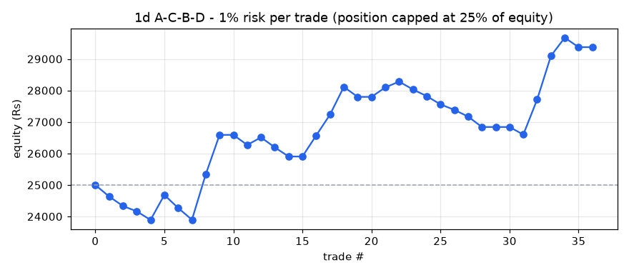
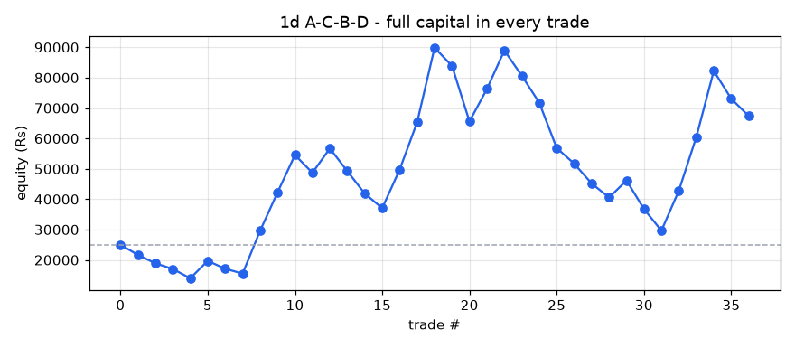

# A-C-B-D backtest report - 1d timeframe

- Stocks scanned: **591** (52 skipped with fewer than 400 candles)
- Data: **05-Oct-2020 00:00 to 01-Oct-2026 00:00, 741,329 candles**
- Costs: 0.35% (overnight) / 0.15% (same-day) round trip, plus Rs 15 / Rs 47 flat charges per trade
- Entry at the close of the breakout candle; exit on the first close above the 1.618 target or below the D low.

## Profit / loss: 1% risk per trade (position capped at 25% of equity)

**Rs 25,000 -> Rs 29,374 = PROFIT of Rs 4,374 (+17.49%)**

Trades 30, winners 12, charges paid Rs 683, max drawdown -5.95%

| symbol | entry | exit_date | status | qty | position_rs | net_return_pct | charges_rs | pnl_rs | equity_rs |
|---|---|---|---|---|---|---|---|---|---|
| AFFLE | 11-Nov-2022 | 16-Dec-2022 | STOPPED | 2 | 2526 | -13.87 | 24 | -365 | 24635 |
| EMAMILTD | 29-Nov-2022 | 23-Dec-2022 | STOPPED | 5 | 2218 | -12.93 | 23 | -302 | 24333 |
| COLPAL | 29-Aug-2022 | 25-Jan-2023 | STOPPED | 1 | 1491 | -10.32 | 20 | -169 | 24164 |
| NBCC | 02-Jan-2023 | 20-Feb-2023 | STOPPED | 55 | 1437 | -17.98 | 20 | -273 | 23891 |
| SHRIRAMFIN | 21-Nov-2022 | 05-Jul-2023 | TARGET HIT | 8 | 1935 | 41.8 | 22 | 794 | 24684 |
| IGL | 29-Aug-2023 | 20-Oct-2023 | STOPPED | 14 | 3023 | -13.2 | 26 | -414 | 24270 |
| SAREGAMA | 19-Oct-2023 | 25-Oct-2023 | STOPPED | 11 | 3888 | -9.22 | 29 | -373 | 23897 |
| NIACL | 02-May-2023 | 24-Nov-2023 | TARGET HIT | 15 | 1595 | 91.37 | 21 | 1442 | 25339 |
| JKCEMENT | 08-Feb-2023 | 09-Jan-2024 | TARGET HIT | 1 | 2710 | 46.7 | 24 | 1251 | 26590 |
| APOLLOHOSP | 15-Feb-2023 | 11-Jan-2024 | SKIPPED (price above position size) | 0 | 0 | 30.86 | 0 | 0 | 26590 |
| RHIM | 21-Nov-2023 | 14-Feb-2024 | STOPPED | 4 | 2826 | -10.74 | 25 | -318 | 26271 |
| CAMS | 13-Nov-2023 | 23-Feb-2024 | TARGET HIT | 3 | 1532 | 16.57 | 20 | 239 | 26510 |
| HCL-INSYS | 02-Nov-2023 | 12-Mar-2024 | STOPPED | 143 | 2288 | -13.16 | 23 | -316 | 26194 |
| INDIACEM | 28-Nov-2023 | 13-Mar-2024 | STOPPED | 8 | 1838 | -15.0 | 21 | -291 | 25903 |
| TATAELXSI | 03-Apr-2024 | 24-Apr-2024 | SKIPPED (price above position size) | 0 | 0 | -12.45 | 0 | 0 | 25903 |
| BIOCON | 13-Dec-2023 | 07-Jun-2024 | TARGET HIT | 8 | 1987 | 34.43 | 22 | 669 | 26572 |
| DEEPAKNTR | 06-Nov-2023 | 18-Jul-2024 | TARGET HIT | 1 | 2114 | 32.01 | 22 | 662 | 27234 |
| TECHM | 26-Apr-2024 | 23-Oct-2024 | TARGET HIT | 2 | 2357 | 37.92 | 23 | 879 | 28113 |
| GNA | 06-Jun-2023 | 30-Jan-2025 | STOPPED | 12 | 4530 | -6.68 | 31 | -318 | 27796 |
| MPHASIS | 12-Jul-2024 | 07-Apr-2025 | SKIPPED (price above position size) | 0 | 0 | -22.22 | 0 | 0 | 27796 |
| KOTAKBANK | 20-Jan-2025 | 21-Apr-2025 | TARGET HIT | 5 | 1915 | 16.36 | 22 | 298 | 28094 |
| USHAMART | 16-Sep-2025 | 29-Sep-2025 | TARGET HIT | 3 | 1212 | 16.69 | 19 | 187 | 28281 |
| GODREJCP | 07-Jul-2025 | 01-Oct-2025 | STOPPED | 2 | 2478 | -9.42 | 24 | -248 | 28033 |
| VINATIORGA | 29-Sep-2025 | 21-Nov-2025 | STOPPED | 1 | 1775 | -11.12 | 21 | -212 | 27820 |
| RAILTEL | 15-Sep-2025 | 08-Dec-2025 | STOPPED | 3 | 1186 | -20.83 | 19 | -262 | 27558 |
| COCHINSHIP | 12-Sep-2025 | 15-Dec-2025 | STOPPED | 1 | 1736 | -9.19 | 21 | -175 | 27384 |
| SOBHA | 11-Sep-2025 | 20-Jan-2026 | STOPPED | 1 | 1551 | -12.73 | 20 | -212 | 27171 |
| CESC | 15-Sep-2025 | 21-Jan-2026 | STOPPED | 20 | 3105 | -10.2 | 26 | -332 | 26840 |
| 3MINDIA | 03-Nov-2025 | 09-Feb-2026 | SKIPPED (price above position size) | 0 | 0 | 18.49 | 0 | 0 | 26840 |
| TATACOMM | 10-Oct-2025 | 04-Mar-2026 | SKIPPED (price above position size) | 0 | 0 | -21.06 | 0 | 0 | 26840 |
| ANANTRAJ | 02-Jan-2026 | 09-Mar-2026 | STOPPED | 2 | 1166 | -19.33 | 19 | -240 | 26599 |
| BHEL | 11-Sep-2025 | 21-Apr-2026 | TARGET HIT | 11 | 2512 | 44.84 | 24 | 1111 | 27710 |
| SKYGOLD | 01-Apr-2026 | 06-May-2026 | TARGET HIT | 10 | 3378 | 41.47 | 27 | 1386 | 29096 |
| SOLARA | 18-Aug-2026 | 11-Sep-2026 | TARGET HIT | 3 | 1647 | 36.09 | 21 | 579 | 29675 |
| OLECTRA | 23-Sep-2026 | 29-Sep-2026 | STOPPED | 2 | 2552 | -11.24 | 24 | -302 | 29374 |
| ATUL | 24-Jul-2026 | 30-Sep-2026 | SKIPPED (price above position size) | 0 | 0 | -8.03 | 0 | 0 | 29374 |

## Profit / loss: full capital in every trade

**Rs 25,000 -> Rs 67,387 = PROFIT of Rs 42,387 (+169.55%)**

Trades 36, winners 14, charges paid Rs 6,533, max drawdown -67.02%

| symbol | entry | exit_date | status | qty | position_rs | net_return_pct | charges_rs | pnl_rs | equity_rs |
|---|---|---|---|---|---|---|---|---|---|
| AFFLE | 11-Nov-2022 | 16-Dec-2022 | STOPPED | 19 | 23996 | -13.87 | 99 | -3343 | 21657 |
| EMAMILTD | 29-Nov-2022 | 23-Dec-2022 | STOPPED | 48 | 21290 | -12.93 | 90 | -2768 | 18889 |
| COLPAL | 29-Aug-2022 | 25-Jan-2023 | STOPPED | 12 | 17893 | -10.32 | 78 | -1862 | 17027 |
| NBCC | 02-Jan-2023 | 20-Feb-2023 | STOPPED | 651 | 17013 | -17.98 | 75 | -3074 | 13954 |
| SHRIRAMFIN | 21-Nov-2022 | 05-Jul-2023 | TARGET HIT | 57 | 13786 | 41.8 | 63 | 5747 | 19701 |
| IGL | 29-Aug-2023 | 20-Oct-2023 | STOPPED | 91 | 19652 | -13.2 | 84 | -2609 | 17092 |
| SAREGAMA | 19-Oct-2023 | 25-Oct-2023 | STOPPED | 48 | 16966 | -9.22 | 74 | -1579 | 15513 |
| NIACL | 02-May-2023 | 24-Nov-2023 | TARGET HIT | 145 | 15416 | 91.37 | 69 | 14070 | 29583 |
| JKCEMENT | 08-Feb-2023 | 09-Jan-2024 | TARGET HIT | 10 | 27104 | 46.7 | 110 | 12643 | 42226 |
| APOLLOHOSP | 15-Feb-2023 | 11-Jan-2024 | TARGET HIT | 9 | 39957 | 30.86 | 155 | 12316 | 54541 |
| RHIM | 21-Nov-2023 | 14-Feb-2024 | STOPPED | 77 | 54393 | -10.74 | 205 | -5857 | 48685 |
| CAMS | 13-Nov-2023 | 23-Feb-2024 | TARGET HIT | 95 | 48527 | 16.57 | 185 | 8026 | 56711 |
| HCL-INSYS | 02-Nov-2023 | 12-Mar-2024 | STOPPED | 3544 | 56704 | -13.16 | 213 | -7477 | 49233 |
| INDIACEM | 28-Nov-2023 | 13-Mar-2024 | STOPPED | 214 | 49156 | -15.0 | 187 | -7388 | 41845 |
| TATAELXSI | 03-Apr-2024 | 24-Apr-2024 | STOPPED | 5 | 38471 | -12.45 | 150 | -4805 | 37040 |
| BIOCON | 13-Dec-2023 | 07-Jun-2024 | TARGET HIT | 149 | 37001 | 34.43 | 145 | 12724 | 49765 |
| DEEPAKNTR | 06-Nov-2023 | 18-Jul-2024 | TARGET HIT | 23 | 48631 | 32.01 | 185 | 15552 | 65317 |
| TECHM | 26-Apr-2024 | 23-Oct-2024 | TARGET HIT | 55 | 64828 | 37.92 | 242 | 24568 | 89884 |
| GNA | 06-Jun-2023 | 30-Jan-2025 | STOPPED | 238 | 89849 | -6.68 | 329 | -6017 | 83867 |
| MPHASIS | 12-Jul-2024 | 07-Apr-2025 | STOPPED | 32 | 82212 | -22.22 | 303 | -18282 | 65585 |
| KOTAKBANK | 20-Jan-2025 | 21-Apr-2025 | TARGET HIT | 171 | 65492 | 16.36 | 244 | 10700 | 76285 |
| USHAMART | 16-Sep-2025 | 29-Sep-2025 | TARGET HIT | 188 | 75964 | 16.69 | 281 | 12663 | 88948 |
| GODREJCP | 07-Jul-2025 | 01-Oct-2025 | STOPPED | 71 | 87978 | -9.42 | 323 | -8303 | 80646 |
| VINATIORGA | 29-Sep-2025 | 21-Nov-2025 | STOPPED | 45 | 79878 | -11.12 | 295 | -8897 | 71748 |
| RAILTEL | 15-Sep-2025 | 08-Dec-2025 | STOPPED | 181 | 71584 | -20.83 | 266 | -14926 | 56822 |
| COCHINSHIP | 12-Sep-2025 | 15-Dec-2025 | STOPPED | 32 | 55541 | -9.19 | 209 | -5119 | 51703 |
| SOBHA | 11-Sep-2025 | 20-Jan-2026 | STOPPED | 33 | 51184 | -12.73 | 194 | -6531 | 45172 |
| CESC | 15-Sep-2025 | 21-Jan-2026 | STOPPED | 290 | 45018 | -10.2 | 173 | -4607 | 40565 |
| 3MINDIA | 03-Nov-2025 | 09-Feb-2026 | TARGET HIT | 1 | 30262 | 18.49 | 121 | 5580 | 46146 |
| TATACOMM | 10-Oct-2025 | 04-Mar-2026 | STOPPED | 24 | 44480 | -21.06 | 171 | -9383 | 36763 |
| ANANTRAJ | 02-Jan-2026 | 09-Mar-2026 | STOPPED | 63 | 36735 | -19.33 | 144 | -7116 | 29647 |
| BHEL | 11-Sep-2025 | 21-Apr-2026 | TARGET HIT | 129 | 29456 | 44.84 | 118 | 13193 | 42841 |
| SKYGOLD | 01-Apr-2026 | 06-May-2026 | TARGET HIT | 126 | 42556 | 41.47 | 164 | 17633 | 60474 |
| SOLARA | 18-Aug-2026 | 11-Sep-2026 | TARGET HIT | 110 | 60395 | 36.09 | 226 | 21782 | 82255 |
| OLECTRA | 23-Sep-2026 | 29-Sep-2026 | STOPPED | 64 | 81658 | -11.24 | 301 | -9193 | 73062 |
| ATUL | 24-Jul-2026 | 30-Sep-2026 | STOPPED | 11 | 70482 | -8.03 | 262 | -5675 | 67387 |

## Trade statistics (after costs)

| period | setups_entered | target_hit | stopped | open | win_rate_pct | avg_gross_pct | avg_net_pct | avg_win_pct | avg_loss_pct | avg_r | profit_factor | avg_hold_candles |
|---|---|---|---|---|---|---|---|---|---|---|---|---|
| 2022 | 4 | 1 | 3 | 0 | 25.0 | 1.52 | 1.17 | 41.8 | -12.37 | -0.05 | 1.13 | 75.0 |
| 2023 | 13 | 6 | 7 | 0 | 46.2 | 13.12 | 12.77 | 41.99 | -12.28 | 1.08 | 2.93 | 126.0 |
| 2024 | 3 | 1 | 2 | 0 | 33.3 | 1.43 | 1.08 | 37.92 | -17.34 | 0.53 | 1.09 | 105.7 |
| 2025 | 11 | 4 | 7 | 0 | 36.4 | 0.52 | 0.17 | 24.1 | -13.51 | 0.13 | 1.02 | 69.9 |
| 2026 | 10 | 2 | 3 | 5 | 40.0 | 8.14 | 7.79 | 38.78 | -12.87 | 0.86 | 2.01 | 26.8 |
| ALL | 41 | 14 | 22 | 5 | 38.9 | 6.31 | 5.96 | 36.11 | -13.22 | 0.59 | 1.74 | 87.7 |

## Trades entered

| symbol | D | entry | entry_close | stop | target | status | exit_date | return_pct | net_return_pct | hold_candles |
|---|---|---|---|---|---|---|---|---|---|---|
| COLPAL | 17-Jun-2022 | 29-Aug-2022 | 1491.087646484375 | 1344.7233482990805 | 1675.03 | STOPPED | 25-Jan-2023 | -9.97 | -10.32 | 103.0 |
| SHRIRAMFIN | 27-Sep-2022 | 21-Nov-2022 | 241.85610961914065 | 213.18083768567303 | 340.27 | TARGET HIT | 05-Jul-2023 | 42.15 | 41.8 | 154.0 |
| AFFLE | 28-Oct-2022 | 11-Nov-2022 | 1262.949951171875 | 1138.050048828125 | 1676.42 | STOPPED | 16-Dec-2022 | -13.52 | -13.87 | 25.0 |
| EMAMILTD | 23-Nov-2022 | 29-Nov-2022 | 443.5364990234375 | 398.10563770123 | 561.24 | STOPPED | 23-Dec-2022 | -12.58 | -12.93 | 18.0 |
| NBCC | 23-Dec-2022 | 02-Jan-2023 | 26.13314819335937 | 21.78299459490213 | 35.2 | STOPPED | 20-Feb-2023 | -17.63 | -17.98 | 34.0 |
| JKCEMENT | 27-Jan-2023 | 08-Feb-2023 | 2710.407958984375 | 2501.021443669185 | 3985.16 | TARGET HIT | 09-Jan-2024 | 47.05 | 46.7 | 225.0 |
| APOLLOHOSP | 30-Jan-2023 | 15-Feb-2023 | 4439.6416015625 | 4078.6650218175073 | 5796.58 | TARGET HIT | 11-Jan-2024 | 31.21 | 30.86 | 222.0 |
| NIACL | 28-Mar-2023 | 02-May-2023 | 106.3164291381836 | 90.93611594237278 | 175.14 | TARGET HIT | 24-Nov-2023 | 91.72 | 91.37 | 142.0 |
| GNA | 31-May-2023 | 06-Jun-2023 | 377.5172424316406 | 355.71683634249115 | 618.9 | STOPPED | 30-Jan-2025 | -6.33 | -6.68 | 408.0 |
| IGL | 18-Aug-2023 | 29-Aug-2023 | 215.9527740478516 | 199.31228024606887 | 300.79 | STOPPED | 20-Oct-2023 | -12.85 | -13.2 | 36.0 |
| SAREGAMA | 09-Oct-2023 | 19-Oct-2023 | 353.457275390625 | 333.11400773546984 | 570.58 | STOPPED | 25-Oct-2023 | -8.87 | -9.22 | 3.0 |
| DEEPAKNTR | 26-Oct-2023 | 06-Nov-2023 | 2114.41015625 | 1900.3338314219163 | 2776.52 | TARGET HIT | 18-Jul-2024 | 32.36 | 32.01 | 169.0 |
| HCL-INSYS | 26-Oct-2023 | 02-Nov-2023 | 16.0 | 14.149999618530272 | 26.76 | STOPPED | 12-Mar-2024 | -12.81 | -13.16 | 86.0 |
| RHIM | 26-Oct-2023 | 21-Nov-2023 | 706.4048461914062 | 642.6335351876256 | 901.39 | STOPPED | 14-Feb-2024 | -10.39 | -10.74 | 56.0 |
| BIOCON | 31-Oct-2023 | 13-Dec-2023 | 248.3255920410156 | 216.6498980339121 | 333.87 | TARGET HIT | 07-Jun-2024 | 34.78 | 34.43 | 117.0 |
| CAMS | 01-Nov-2023 | 13-Nov-2023 | 510.81097412109375 | 424.5494076521037 | 587.96 | TARGET HIT | 23-Feb-2024 | 16.92 | 16.57 | 68.0 |
| INDIACEM | 01-Nov-2023 | 28-Nov-2023 | 229.6999969482422 | 198.0 | 328.51 | STOPPED | 13-Mar-2024 | -14.65 | -15.0 | 72.0 |
| TATAELXSI | 13-Mar-2024 | 03-Apr-2024 | 7694.1083984375 | 7056.387846758095 | 10952.41 | STOPPED | 24-Apr-2024 | -12.1 | -12.45 | 13.0 |
| TECHM | 19-Apr-2024 | 26-Apr-2024 | 1178.69287109375 | 1071.9536741153129 | 1617.48 | TARGET HIT | 23-Oct-2024 | 38.27 | 37.92 | 122.0 |
| MPHASIS | 04-Jun-2024 | 12-Jul-2024 | 2569.111328125 | 2044.0085174017383 | 3357.24 | STOPPED | 07-Apr-2025 | -21.87 | -22.22 | 182.0 |
| KOTAKBANK | 13-Nov-2024 | 20-Jan-2025 | 382.9964294433594 | 334.845175127518 | 436.56 | TARGET HIT | 21-Apr-2025 | 16.71 | 16.36 | 59.0 |
| GODREJCP | 13-Jun-2025 | 07-Jul-2025 | 1239.124267578125 | 1133.226132985578 | 1478.75 | STOPPED | 01-Oct-2025 | -9.07 | -9.42 | 60.0 |
| USHAMART | 11-Aug-2025 | 16-Sep-2025 | 404.0643615722656 | 331.11241552102297 | 464.98 | TARGET HIT | 29-Sep-2025 | 17.04 | 16.69 | 9.0 |
| VINATIORGA | 14-Aug-2025 | 29-Sep-2025 | 1775.0574951171875 | 1604.2362237804443 | 2400.91 | STOPPED | 21-Nov-2025 | -10.77 | -11.12 | 36.0 |
| BHEL | 29-Aug-2025 | 11-Sep-2025 | 228.34341430664065 | 204.46044916421653 | 329.73 | TARGET HIT | 21-Apr-2026 | 45.19 | 44.84 | 147.0 |
| CESC | 29-Aug-2025 | 15-Sep-2025 | 155.23324584960938 | 141.81744400952547 | 207.63 | STOPPED | 21-Jan-2026 | -9.85 | -10.2 | 87.0 |
| COCHINSHIP | 29-Aug-2025 | 12-Sep-2025 | 1735.6591796875 | 1582.6724433358277 | 3364.37 | STOPPED | 15-Dec-2025 | -8.84 | -9.19 | 63.0 |
| RAILTEL | 29-Aug-2025 | 15-Sep-2025 | 395.49322509765625 | 323.55837579169497 | 603.49 | STOPPED | 08-Dec-2025 | -20.48 | -20.83 | 57.0 |
| TATACOMM | 29-Aug-2025 | 10-Oct-2025 | 1853.346923828125 | 1506.401842632005 | 2137.12 | STOPPED | 04-Mar-2026 | -20.71 | -21.06 | 97.0 |
| SOBHA | 05-Sep-2025 | 11-Sep-2025 | 1551.0423583984375 | 1396.3763338934632 | 2131.22 | STOPPED | 20-Jan-2026 | -12.38 | -12.73 | 88.0 |
| 3MINDIA | 29-Sep-2025 | 03-Nov-2025 | 30261.73828125 | 28354.36257274688 | 35945.52 | TARGET HIT | 09-Feb-2026 | 18.84 | 18.49 | 66.0 |
| ANANTRAJ | 09-Dec-2025 | 02-Jan-2026 | 583.0919189453125 | 483.2060248285431 | 969.45 | STOPPED | 09-Mar-2026 | -18.98 | -19.33 | 43.0 |
| STARHEALTH | 27-Jan-2026 | 16-Apr-2026 | 496.6499938964844 | 416.5499877929688 | 661.74 | OPEN | 01-Oct-2026 | 8.27 | 7.92 | 116.0 |
| SKYGOLD | 24-Mar-2026 | 01-Apr-2026 | 337.75 | 310.79998779296875 | 474.84 | TARGET HIT | 06-May-2026 | 41.82 | 41.47 | 22.0 |
| ALKEM | 02-Apr-2026 | 15-Apr-2026 | 5565.5390625 | 5065.93337960459 | 6762.41 | OPEN | 01-Oct-2026 | -6.21 | -6.56 | 117.0 |
| MRPL | 20-May-2026 | 09-Jun-2026 | 160.33999633789062 | 143.1199951171875 | 283.15 | OPEN | 01-Oct-2026 | 2.76 | 2.41 | 80.0 |
| ATUL | 14-Jul-2026 | 24-Jul-2026 | 6407.5 | 5962.598596786479 | 8140.71 | STOPPED | 30-Sep-2026 | -7.68 | -8.03 | 47.0 |
| SOLARA | 27-Jul-2026 | 18-Aug-2026 | 549.0499877929688 | 471.5499877929688 | 742.93 | TARGET HIT | 11-Sep-2026 | 36.44 | 36.09 | 18.0 |
| AIIL | 11-Sep-2026 | 18-Sep-2026 | 559.0 | 503.0 | 736.06 | OPEN | 01-Oct-2026 | -3.52 | -3.87 | 9.0 |
| MANKIND | 11-Sep-2026 | 21-Sep-2026 | 2437.800048828125 | 2222.0 | 3094.56 | OPEN | 01-Oct-2026 | 3.99 | 3.64 | 8.0 |
| OLECTRA | 16-Sep-2026 | 23-Sep-2026 | 1275.9000244140625 | 1154.4157555985123 | 1981.05 | STOPPED | 29-Sep-2026 | -10.89 | -11.24 | 4.0 |

## All setups found (A-C-B-D located, with why most were not traded)

| status | setups |
|---|---|
| D broken | 31 |
| STOPPED | 22 |
| TARGET HIT | 14 |
| FORMING | 6 |
| no breakout | 5 |
| consolidation too wide | 5 |
| OPEN | 5 |
| target already reached at breakout | 1 |
| WATCH | 1 |

| symbol | A | C | B | D | fib_B | fib_D | status |
|---|---|---|---|---|---|---|---|
| COLPAL | 26-Jul-2021 | 25-Jan-2022 | 02-May-2022 | 17-Jun-2022 | 0.697 | 0.384 | STOPPED |
| SHRIRAMFIN | 09-Nov-2021 | 08-Mar-2022 | 25-Jul-2022 | 27-Sep-2022 | 0.755 | 0.299 | TARGET HIT |
| PFC | 18-Oct-2021 | 20-Jun-2022 | 12-Aug-2022 | 03-Oct-2022 | 0.578 | 0.315 | D broken |
| WHIRLPOOL | 12-Oct-2021 | 26-May-2022 | 17-Aug-2022 | 17-Oct-2022 | 0.461 | 0.348 | D broken |
| AFFLE | 14-Jan-2022 | 26-May-2022 | 26-Aug-2022 | 28-Oct-2022 | 0.778 | 0.536 | STOPPED |
| GODREJCP | 15-Sep-2021 | 08-Mar-2022 | 12-Sep-2022 | 10-Nov-2022 | 0.619 | 0.452 | no breakout |
| BATAINDIA | 16-Nov-2021 | 17-Jun-2022 | 17-Aug-2022 | 21-Nov-2022 | 0.669 | 0.243 | D broken |
| EMAMILTD | 24-Aug-2021 | 20-Jun-2022 | 26-Sep-2022 | 23-Nov-2022 | 0.596 | 0.272 | STOPPED |
| CROMPTON | 16-Sep-2021 | 17-Jun-2022 | 13-Sep-2022 | 07-Dec-2022 | 0.597 | 0.313 | D broken |
| DEEPAKNTR | 19-Oct-2021 | 01-Jul-2022 | 03-Nov-2022 | 23-Dec-2022 | 0.511 | 0.297 | D broken |
| NBCC | 17-Jan-2022 | 17-Jun-2022 | 30-Nov-2022 | 23-Dec-2022 | 0.657 | 0.434 | STOPPED |
| SBICARD | 01-Sep-2021 | 20-Jun-2022 | 17-Aug-2022 | 23-Dec-2022 | 0.737 | 0.294 | D broken |
| ERIS | 19-Oct-2021 | 20-Jun-2022 | 04-Oct-2022 | 11-Jan-2023 | 0.6 | 0.267 | D broken |
| JKCEMENT | 08-Nov-2021 | 23-Jun-2022 | 05-Dec-2022 | 27-Jan-2023 | 0.697 | 0.431 | TARGET HIT |
| APOLLOHOSP | 26-Nov-2021 | 26-May-2022 | 05-Dec-2022 | 30-Jan-2023 | 0.604 | 0.497 | TARGET HIT |
| HDFCAMC | 09-Sep-2021 | 24-May-2022 | 20-Dec-2022 | 01-Feb-2023 | 0.404 | 0.268 | D broken |
| JMFINANCIL | 13-Oct-2021 | 17-Jun-2022 | 05-Dec-2022 | 15-Feb-2023 | 0.781 | 0.244 | D broken |
| ECLERX | 13-Jan-2022 | 26-Dec-2022 | 06-Feb-2023 | 10-Mar-2023 | 0.44 | 0.381 | D broken |
| NIACL | 17-Sep-2021 | 01-Jul-2022 | 20-Dec-2022 | 28-Mar-2023 | 0.645 | 0.259 | TARGET HIT |
| COFORGE | 04-Jan-2022 | 15-Jun-2022 | 02-Feb-2023 | 29-Mar-2023 | 0.46 | 0.292 | consolidation too wide |
| GNA | 14-Oct-2021 | 24-Feb-2022 | 24-Feb-2023 | 31-May-2023 | 0.774 | 0.57 | STOPPED |
| IGL | 14-Sep-2021 | 07-Mar-2022 | 09-May-2023 | 18-Aug-2023 | 0.784 | 0.574 | STOPPED |
| KOTAKBANK | 27-Oct-2021 | 30-Jun-2022 | 31-May-2023 | 18-Aug-2023 | 0.699 | 0.271 | D broken |
| PIDILITIND | 15-Sep-2022 | 24-Feb-2023 | 13-Jun-2023 | 04-Oct-2023 | 0.725 | 0.299 | D broken |
| SAREGAMA | 03-Jan-2022 | 26-May-2023 | 19-Jul-2023 | 09-Oct-2023 | 0.78 | 0.267 | STOPPED |
| BPCL | 18-Oct-2021 | 20-Oct-2022 | 07-Jul-2023 | 26-Oct-2023 | 0.676 | 0.429 | consolidation too wide |
| DEEPAKNTR | 19-Oct-2021 | 01-Jul-2022 | 08-Sep-2023 | 26-Oct-2023 | 0.53 | 0.36 | TARGET HIT |
| HCL-INSYS | 18-Jan-2022 | 28-Mar-2023 | 07-Aug-2023 | 26-Oct-2023 | 0.479 | 0.311 | STOPPED |
| PVRINOX | 04-Aug-2022 | 17-May-2023 | 08-Sep-2023 | 26-Oct-2023 | 0.614 | 0.425 | D broken |
| RHIM | 06-Jan-2023 | 28-Mar-2023 | 07-Sep-2023 | 26-Oct-2023 | 0.669 | 0.374 | STOPPED |
| BIOCON | 08-Feb-2022 | 21-Mar-2023 | 15-Sep-2023 | 31-Oct-2023 | 0.412 | 0.302 | TARGET HIT |
| CAMS | 17-Nov-2021 | 26-May-2022 | 14-Sep-2023 | 01-Nov-2023 | 0.587 | 0.356 | TARGET HIT |
| INDIACEM | 20-Sep-2022 | 28-Mar-2023 | 04-Sep-2023 | 01-Nov-2023 | 0.757 | 0.309 | STOPPED |
| JUBLINGREA | 11-Nov-2022 | 29-Mar-2023 | 07-Sep-2023 | 01-Nov-2023 | 0.742 | 0.327 | no breakout |
| DMART | 02-Sep-2022 | 16-Mar-2023 | 07-Dec-2023 | 12-Feb-2024 | 0.694 | 0.385 | consolidation too wide |
| TATAELXSI | 17-Aug-2022 | 26-Dec-2022 | 18-Dec-2023 | 13-Mar-2024 | 0.705 | 0.472 | STOPPED |
| TECHM | 30-Dec-2021 | 17-Jun-2022 | 23-Jan-2024 | 19-Apr-2024 | 0.665 | 0.537 | TARGET HIT |
| LTM | 04-Jan-2022 | 26-May-2022 | 27-Dec-2023 | 13-May-2024 | 0.72 | 0.339 | D broken |
| MPHASIS | 03-Jan-2022 | 17-Apr-2023 | 19-Feb-2024 | 04-Jun-2024 | 0.718 | 0.467 | STOPPED |
| SBICARD | 17-Aug-2022 | 04-Jun-2024 | 13-Sep-2024 | 07-Oct-2024 | 0.454 | 0.454 | D broken |
| CUB | 15-Dec-2022 | 23-Jun-2023 | 01-Aug-2024 | 21-Oct-2024 | 0.686 | 0.567 | no breakout |
| KOTAKBANK | 31-May-2023 | 03-May-2024 | 23-Sep-2024 | 13-Nov-2024 | 0.771 | 0.342 | TARGET HIT |
| ATUL | 13-Sep-2022 | 04-Jun-2024 | 10-Oct-2024 | 28-Jan-2025 | 0.66 | 0.303 | D broken |
| GODREJCP | 11-Sep-2024 | 04-Mar-2025 | 19-May-2025 | 13-Jun-2025 | 0.607 | 0.554 | STOPPED |
| VTL | 30-Jul-2024 | 04-Mar-2025 | 19-May-2025 | 20-Jun-2025 | 0.747 | 0.544 | D broken |
| NUVOCO | 27-Dec-2023 | 17-Mar-2025 | 06-Jun-2025 | 23-Jun-2025 | 0.715 | 0.607 | no breakout |
| USHAMART | 15-Oct-2024 | 18-Feb-2025 | 15-Jul-2025 | 11-Aug-2025 | 0.694 | 0.482 | TARGET HIT |
| ANGELONE | 09-Jan-2024 | 13-Mar-2025 | 05-Jun-2025 | 12-Aug-2025 | 0.722 | 0.429 | D broken |
| VINATIORGA | 08-Aug-2024 | 07-Apr-2025 | 08-Jul-2025 | 14-Aug-2025 | 0.69 | 0.334 | STOPPED |
| CRISIL | 31-Dec-2024 | 07-Apr-2025 | 27-Jun-2025 | 28-Aug-2025 | 0.744 | 0.426 | D broken |
| BHEL | 09-Jul-2024 | 03-Mar-2025 | 30-Jun-2025 | 29-Aug-2025 | 0.604 | 0.308 | TARGET HIT |
| CESC | 26-Sep-2024 | 17-Feb-2025 | 15-Jul-2025 | 29-Aug-2025 | 0.733 | 0.516 | STOPPED |
| COCHINSHIP | 08-Jul-2024 | 18-Feb-2025 | 06-Jun-2025 | 29-Aug-2025 | 0.767 | 0.303 | STOPPED |
| RAILTEL | 12-Jul-2024 | 03-Mar-2025 | 10-Jun-2025 | 29-Aug-2025 | 0.617 | 0.295 | STOPPED |
| TATACOMM | 03-Oct-2024 | 04-Mar-2025 | 02-Jul-2025 | 29-Aug-2025 | 0.628 | 0.454 | STOPPED |
| SOBHA | 13-Jun-2024 | 07-Apr-2025 | 22-Jul-2025 | 05-Sep-2025 | 0.611 | 0.499 | STOPPED |
| 3MINDIA | 05-Nov-2024 | 03-Mar-2025 | 07-Aug-2025 | 29-Sep-2025 | 0.616 | 0.504 | TARGET HIT |
| APTUS | 14-Oct-2024 | 28-Jan-2025 | 18-Aug-2025 | 17-Oct-2025 | 0.754 | 0.383 | D broken |
| BIKAJI | 27-Sep-2024 | 18-Feb-2025 | 04-Sep-2025 | 03-Dec-2025 | 0.581 | 0.51 | D broken |
| ANANTRAJ | 08-Jan-2025 | 07-Apr-2025 | 07-Oct-2025 | 09-Dec-2025 | 0.644 | 0.294 | STOPPED |
| DMART | 24-Sep-2024 | 03-Mar-2025 | 04-Sep-2025 | 18-Dec-2025 | 0.75 | 0.25 | D broken |
| EIHOTEL | 10-Apr-2024 | 18-Feb-2025 | 09-Sep-2025 | 18-Dec-2025 | 0.672 | 0.414 | D broken |
| PVRINOX | 08-Sep-2023 | 07-Apr-2025 | 30-Oct-2025 | 12-Jan-2026 | 0.401 | 0.301 | D broken |
| STARHEALTH | 11-Sep-2023 | 07-Apr-2025 | 17-Nov-2025 | 27-Jan-2026 | 0.594 | 0.432 | OPEN |
| BLUESTARCO | 06-Jan-2025 | 30-May-2025 | 04-Sep-2025 | 28-Jan-2026 | 0.59 | 0.249 | consolidation too wide |
| AMBUJACEM | 02-Jul-2024 | 21-Nov-2024 | 22-Jul-2025 | 02-Feb-2026 | 0.686 | 0.242 | D broken |
| ASIANPAINT | 24-Jul-2023 | 05-Mar-2025 | 04-Dec-2025 | 16-Feb-2026 | 0.639 | 0.288 | D broken |
| SKYGOLD | 17-Dec-2024 | 06-Aug-2025 | 19-Feb-2026 | 24-Mar-2026 | 0.583 | 0.458 | TARGET HIT |
| ALKEM | 13-Sep-2024 | 28-Feb-2025 | 13-Jan-2026 | 02-Apr-2026 | 0.765 | 0.436 | OPEN |
| TORNTPOWER | 22-Oct-2024 | 06-Oct-2025 | 27-Feb-2026 | 02-Apr-2026 | 0.529 | 0.254 | consolidation too wide |
| SUNPHARMA | 30-Sep-2024 | 05-Mar-2025 | 11-Mar-2026 | 24-Apr-2026 | 0.779 | 0.248 | no breakout |
| ASTRAL | 02-Jul-2024 | 13-Mar-2025 | 11-Mar-2026 | 20-May-2026 | 0.445 | 0.375 | D broken |
| MRPL | 19-Feb-2024 | 03-Mar-2025 | 17-Mar-2026 | 20-May-2026 | 0.627 | 0.402 | OPEN |
| ATUL | 07-Jul-2025 | 21-Jan-2026 | 07-May-2026 | 14-Jul-2026 | 0.736 | 0.266 | STOPPED |
| SOLARA | 02-Dec-2024 | 30-Mar-2026 | 15-Jun-2026 | 27-Jul-2026 | 0.43 | 0.25 | TARGET HIT |
| VBL | 29-Jul-2024 | 23-Mar-2026 | 17-Jun-2026 | 28-Jul-2026 | 0.591 | 0.244 | D broken |
| TVSSRICHAK | 25-Nov-2025 | 30-Mar-2026 | 02-Jul-2026 | 13-Aug-2026 | 0.763 | 0.548 | target already reached at breakout |
| MAXHEALTH | 04-Jul-2025 | 07-Apr-2026 | 06-Jul-2026 | 07-Sep-2026 | 0.649 | 0.272 | D broken |
| AIIL | 13-Jan-2026 | 09-Mar-2026 | 06-Aug-2026 | 11-Sep-2026 | 0.734 | 0.496 | OPEN |
| MANKIND | 23-Dec-2024 | 23-Mar-2026 | 29-Jul-2026 | 11-Sep-2026 | 0.64 | 0.426 | OPEN |
| GODREJPROP | 16-Jul-2024 | 02-Apr-2026 | 29-Jul-2026 | 16-Sep-2026 | 0.384 | 0.293 | D broken |
| JBMA | 13-Sep-2024 | 16-Mar-2026 | 22-Jun-2026 | 16-Sep-2026 | 0.459 | 0.416 | D broken |
| OLECTRA | 22-Feb-2024 | 16-Mar-2026 | 02-Jul-2026 | 16-Sep-2026 | 0.509 | 0.418 | STOPPED |
| PAGEIND | 27-Jun-2025 | 16-Mar-2026 | 01-Jul-2026 | 16-Sep-2026 | 0.702 | 0.318 | WATCH |
| INDUSINDBK | 08-Apr-2024 | 12-Mar-2025 | 22-Jul-2026 | 29-Sep-2026 | 0.497 | 0.577 | FORMING |
| ATGL | 03-Jun-2024 | 09-Mar-2026 | 29-May-2026 | 01-Oct-2026 | 0.547 | 0.276 | FORMING |
| HYUNDAI | 22-Sep-2025 | 06-Apr-2026 | 27-Aug-2026 | 01-Oct-2026 | 0.523 | 0.563 | FORMING |
| JSWENERGY | 24-Sep-2024 | 17-Feb-2025 | 29-May-2026 | 01-Oct-2026 | 0.521 | 0.298 | FORMING |
| UNITDSPR | 03-Jan-2025 | 07-Apr-2026 | 21-Aug-2026 | 01-Oct-2026 | 0.781 | 0.318 | FORMING |
| YESBANK | 09-Feb-2024 | 12-Mar-2025 | 18-Jun-2026 | 01-Oct-2026 | 0.58 | 0.46 | FORMING |
