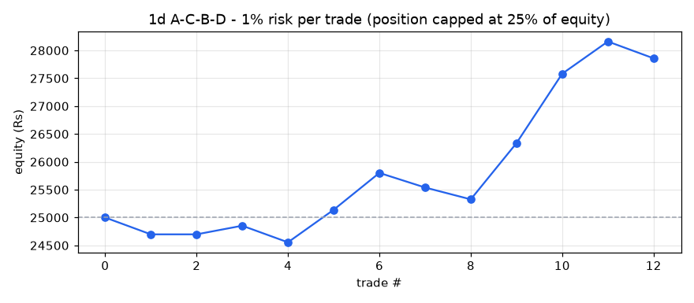
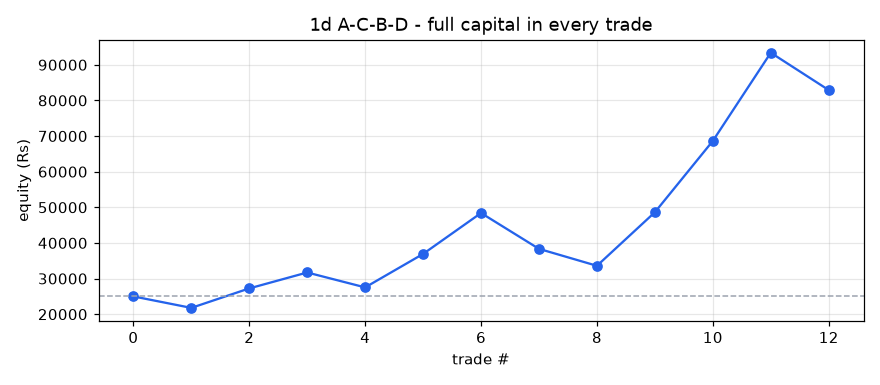

# A-C-B-D backtest report - 1d timeframe

- Stocks scanned: **591** (52 skipped with fewer than 400 candles)
- Data: **05-Oct-2020 00:00 to 01-Oct-2026 00:00, 741,329 candles**
- Costs: 0.35% (overnight) / 0.15% (same-day) round trip, plus Rs 15 / Rs 47 flat charges per trade
- Entry at the close of the breakout candle; exit on the first close above the 1.618 target or below the D low.

## Profit / loss: 1% risk per trade (position capped at 25% of equity)

**Rs 25,000 -> Rs 27,858 = PROFIT of Rs 2,858 (+11.43%)**

Trades 11, winners 6, charges paid Rs 241, max drawdown -1.84%

| symbol | entry | exit_date | status | qty | position_rs | net_return_pct | charges_rs | pnl_rs | equity_rs |
|---|---|---|---|---|---|---|---|---|---|
| EMAMILTD | 29-Nov-2022 | 23-Dec-2022 | STOPPED | 5 | 2218 | -12.93 | 23 | -302 | 24698 |
| APOLLOHOSP | 15-Feb-2023 | 11-Jan-2024 | SKIPPED (price above position size) | 0 | 0 | 30.86 | 0 | 0 | 24698 |
| CAMS | 13-Nov-2023 | 23-Feb-2024 | TARGET HIT | 2 | 1022 | 16.57 | 19 | 154 | 24853 |
| HCL-INSYS | 02-Nov-2023 | 12-Mar-2024 | STOPPED | 134 | 2144 | -13.16 | 23 | -297 | 24555 |
| BIOCON | 13-Dec-2023 | 07-Jun-2024 | TARGET HIT | 7 | 1738 | 34.43 | 21 | 583 | 25139 |
| DEEPAKNTR | 06-Nov-2023 | 18-Jul-2024 | TARGET HIT | 1 | 2114 | 32.01 | 22 | 662 | 25801 |
| RAILTEL | 15-Sep-2025 | 08-Dec-2025 | STOPPED | 3 | 1186 | -20.83 | 19 | -262 | 25539 |
| SOBHA | 11-Sep-2025 | 20-Jan-2026 | STOPPED | 1 | 1551 | -12.73 | 20 | -212 | 25326 |
| BHEL | 11-Sep-2025 | 21-Apr-2026 | TARGET HIT | 10 | 2283 | 44.84 | 23 | 1009 | 26335 |
| SKYGOLD | 01-Apr-2026 | 06-May-2026 | TARGET HIT | 9 | 3040 | 41.47 | 26 | 1246 | 27581 |
| SOLARA | 18-Aug-2026 | 11-Sep-2026 | TARGET HIT | 3 | 1647 | 36.09 | 21 | 579 | 28160 |
| OLECTRA | 23-Sep-2026 | 29-Sep-2026 | STOPPED | 2 | 2552 | -11.24 | 24 | -302 | 27858 |

## Profit / loss: full capital in every trade

**Rs 25,000 -> Rs 82,906 = PROFIT of Rs 57,906 (+231.62%)**

Trades 12, winners 7, charges paid Rs 1,908, max drawdown -30.62%

| symbol | entry | exit_date | status | qty | position_rs | net_return_pct | charges_rs | pnl_rs | equity_rs |
|---|---|---|---|---|---|---|---|---|---|
| EMAMILTD | 29-Nov-2022 | 23-Dec-2022 | STOPPED | 56 | 24838 | -12.93 | 102 | -3227 | 21773 |
| APOLLOHOSP | 15-Feb-2023 | 11-Jan-2024 | TARGET HIT | 4 | 17759 | 30.86 | 77 | 5465 | 27239 |
| CAMS | 13-Nov-2023 | 23-Feb-2024 | TARGET HIT | 53 | 27073 | 16.57 | 110 | 4471 | 31710 |
| HCL-INSYS | 02-Nov-2023 | 12-Mar-2024 | STOPPED | 1981 | 31696 | -13.16 | 126 | -4186 | 27524 |
| BIOCON | 13-Dec-2023 | 07-Jun-2024 | TARGET HIT | 110 | 27316 | 34.43 | 111 | 9390 | 36913 |
| DEEPAKNTR | 06-Nov-2023 | 18-Jul-2024 | TARGET HIT | 17 | 35945 | 32.01 | 141 | 11491 | 48404 |
| RAILTEL | 15-Sep-2025 | 08-Dec-2025 | STOPPED | 122 | 48250 | -20.83 | 184 | -10066 | 38339 |
| SOBHA | 11-Sep-2025 | 20-Jan-2026 | STOPPED | 24 | 37225 | -12.73 | 145 | -4754 | 33585 |
| BHEL | 11-Sep-2025 | 21-Apr-2026 | TARGET HIT | 147 | 33566 | 44.84 | 132 | 15036 | 48621 |
| SKYGOLD | 01-Apr-2026 | 06-May-2026 | TARGET HIT | 143 | 48298 | 41.47 | 184 | 20014 | 68636 |
| SOLARA | 18-Aug-2026 | 11-Sep-2026 | TARGET HIT | 125 | 68631 | 36.09 | 255 | 24754 | 93390 |
| OLECTRA | 23-Sep-2026 | 29-Sep-2026 | STOPPED | 73 | 93141 | -11.24 | 341 | -10484 | 82906 |

## Trade statistics (after costs)

| period | setups_entered | target_hit | stopped | open | win_rate_pct | avg_gross_pct | avg_net_pct | avg_win_pct | avg_loss_pct | avg_r | profit_factor | avg_hold_candles |
|---|---|---|---|---|---|---|---|---|---|---|---|---|
| 2022 | 1 | 0 | 1 | 0 | 0.0 | -12.58 | -12.93 |  | -12.93 | -1.26 | 0.0 | 18.0 |
| 2023 | 5 | 4 | 1 | 0 | 80.0 | 20.49 | 20.14 | 28.47 | -13.16 | 1.9 | 8.65 | 132.4 |
| 2025 | 3 | 1 | 2 | 0 | 33.3 | 4.11 | 3.76 | 44.84 | -16.78 | 0.62 | 1.34 | 97.3 |
| 2026 | 4 | 2 | 1 | 1 | 66.7 | 22.46 | 22.11 | 38.78 | -11.24 | 2.19 | 6.9 | 14.7 |
| ALL | 13 | 7 | 5 | 1 | 58.3 | 14.13 | 13.78 | 33.75 | -14.18 | 1.39 | 3.33 | 84.7 |

## Trades entered

| symbol | D | entry | entry_close | stop | target | status | exit_date | return_pct | net_return_pct | hold_candles |
|---|---|---|---|---|---|---|---|---|---|---|
| EMAMILTD | 23-Nov-2022 | 29-Nov-2022 | 443.5364990234375 | 398.10563770123 | 561.24 | STOPPED | 23-Dec-2022 | -12.58 | -12.93 | 18.0 |
| APOLLOHOSP | 30-Jan-2023 | 15-Feb-2023 | 4439.6416015625 | 4078.6650218175073 | 5796.58 | TARGET HIT | 11-Jan-2024 | 31.21 | 30.86 | 222.0 |
| DEEPAKNTR | 26-Oct-2023 | 06-Nov-2023 | 2114.41015625 | 1900.3338314219163 | 2776.52 | TARGET HIT | 18-Jul-2024 | 32.36 | 32.01 | 169.0 |
| HCL-INSYS | 26-Oct-2023 | 02-Nov-2023 | 16.0 | 14.149999618530272 | 26.76 | STOPPED | 12-Mar-2024 | -12.81 | -13.16 | 86.0 |
| BIOCON | 31-Oct-2023 | 13-Dec-2023 | 248.3255920410156 | 216.6498980339121 | 333.87 | TARGET HIT | 07-Jun-2024 | 34.78 | 34.43 | 117.0 |
| CAMS | 01-Nov-2023 | 13-Nov-2023 | 510.81097412109375 | 424.5494076521037 | 587.96 | TARGET HIT | 23-Feb-2024 | 16.92 | 16.57 | 68.0 |
| BHEL | 29-Aug-2025 | 11-Sep-2025 | 228.34341430664065 | 204.46044916421653 | 329.73 | TARGET HIT | 21-Apr-2026 | 45.19 | 44.84 | 147.0 |
| RAILTEL | 29-Aug-2025 | 15-Sep-2025 | 395.49322509765625 | 323.55837579169497 | 603.49 | STOPPED | 08-Dec-2025 | -20.48 | -20.83 | 57.0 |
| SOBHA | 05-Sep-2025 | 11-Sep-2025 | 1551.0423583984375 | 1396.3763338934632 | 2131.22 | STOPPED | 20-Jan-2026 | -12.38 | -12.73 | 88.0 |
| STARHEALTH | 27-Jan-2026 | 16-Apr-2026 | 496.6499938964844 | 416.5499877929688 | 661.74 | OPEN | 01-Oct-2026 | 8.27 | 7.92 | 116.0 |
| SKYGOLD | 24-Mar-2026 | 01-Apr-2026 | 337.75 | 310.79998779296875 | 474.84 | TARGET HIT | 06-May-2026 | 41.82 | 41.47 | 22.0 |
| SOLARA | 27-Jul-2026 | 18-Aug-2026 | 549.0499877929688 | 471.5499877929688 | 742.93 | TARGET HIT | 11-Sep-2026 | 36.44 | 36.09 | 18.0 |
| OLECTRA | 16-Sep-2026 | 23-Sep-2026 | 1275.9000244140625 | 1154.4157555985123 | 1981.05 | STOPPED | 29-Sep-2026 | -10.89 | -11.24 | 4.0 |

## All setups found (A-C-B-D located, with why most were not traded)

| status | setups |
|---|---|
| D broken | 14 |
| TARGET HIT | 7 |
| STOPPED | 5 |
| consolidation too wide | 3 |
| FORMING | 3 |
| OPEN | 1 |

| symbol | A | C | B | D | fib_B | fib_D | status |
|---|---|---|---|---|---|---|---|
| PFC | 18-Oct-2021 | 20-Jun-2022 | 12-Aug-2022 | 03-Oct-2022 | 0.578 | 0.315 | D broken |
| WHIRLPOOL | 12-Oct-2021 | 26-May-2022 | 17-Aug-2022 | 17-Oct-2022 | 0.461 | 0.348 | D broken |
| EMAMILTD | 24-Aug-2021 | 20-Jun-2022 | 26-Sep-2022 | 23-Nov-2022 | 0.596 | 0.272 | STOPPED |
| CROMPTON | 16-Sep-2021 | 17-Jun-2022 | 13-Sep-2022 | 07-Dec-2022 | 0.597 | 0.313 | D broken |
| DEEPAKNTR | 19-Oct-2021 | 01-Jul-2022 | 03-Nov-2022 | 23-Dec-2022 | 0.511 | 0.297 | D broken |
| ERIS | 19-Oct-2021 | 20-Jun-2022 | 04-Oct-2022 | 11-Jan-2023 | 0.6 | 0.267 | D broken |
| APOLLOHOSP | 26-Nov-2021 | 26-May-2022 | 05-Dec-2022 | 30-Jan-2023 | 0.604 | 0.497 | TARGET HIT |
| HDFCAMC | 09-Sep-2021 | 24-May-2022 | 20-Dec-2022 | 01-Feb-2023 | 0.404 | 0.268 | D broken |
| ECLERX | 13-Jan-2022 | 26-Dec-2022 | 06-Feb-2023 | 10-Mar-2023 | 0.44 | 0.381 | D broken |
| COFORGE | 04-Jan-2022 | 15-Jun-2022 | 02-Feb-2023 | 29-Mar-2023 | 0.46 | 0.292 | consolidation too wide |
| DEEPAKNTR | 19-Oct-2021 | 01-Jul-2022 | 08-Sep-2023 | 26-Oct-2023 | 0.53 | 0.36 | TARGET HIT |
| HCL-INSYS | 18-Jan-2022 | 28-Mar-2023 | 07-Aug-2023 | 26-Oct-2023 | 0.479 | 0.311 | STOPPED |
| PVRINOX | 04-Aug-2022 | 17-May-2023 | 08-Sep-2023 | 26-Oct-2023 | 0.614 | 0.425 | D broken |
| BIOCON | 08-Feb-2022 | 21-Mar-2023 | 15-Sep-2023 | 31-Oct-2023 | 0.412 | 0.302 | TARGET HIT |
| CAMS | 17-Nov-2021 | 26-May-2022 | 14-Sep-2023 | 01-Nov-2023 | 0.587 | 0.356 | TARGET HIT |
| SBICARD | 17-Aug-2022 | 04-Jun-2024 | 13-Sep-2024 | 07-Oct-2024 | 0.454 | 0.454 | D broken |
| BHEL | 09-Jul-2024 | 03-Mar-2025 | 30-Jun-2025 | 29-Aug-2025 | 0.604 | 0.308 | TARGET HIT |
| RAILTEL | 12-Jul-2024 | 03-Mar-2025 | 10-Jun-2025 | 29-Aug-2025 | 0.617 | 0.295 | STOPPED |
| SOBHA | 13-Jun-2024 | 07-Apr-2025 | 22-Jul-2025 | 05-Sep-2025 | 0.611 | 0.499 | STOPPED |
| PVRINOX | 08-Sep-2023 | 07-Apr-2025 | 30-Oct-2025 | 12-Jan-2026 | 0.401 | 0.301 | D broken |
| STARHEALTH | 11-Sep-2023 | 07-Apr-2025 | 17-Nov-2025 | 27-Jan-2026 | 0.594 | 0.432 | OPEN |
| BLUESTARCO | 06-Jan-2025 | 30-May-2025 | 04-Sep-2025 | 28-Jan-2026 | 0.59 | 0.249 | consolidation too wide |
| SKYGOLD | 17-Dec-2024 | 06-Aug-2025 | 19-Feb-2026 | 24-Mar-2026 | 0.583 | 0.458 | TARGET HIT |
| TORNTPOWER | 22-Oct-2024 | 06-Oct-2025 | 27-Feb-2026 | 02-Apr-2026 | 0.529 | 0.254 | consolidation too wide |
| ASTRAL | 02-Jul-2024 | 13-Mar-2025 | 11-Mar-2026 | 20-May-2026 | 0.445 | 0.375 | D broken |
| SOLARA | 02-Dec-2024 | 30-Mar-2026 | 15-Jun-2026 | 27-Jul-2026 | 0.43 | 0.25 | TARGET HIT |
| VBL | 29-Jul-2024 | 23-Mar-2026 | 17-Jun-2026 | 28-Jul-2026 | 0.591 | 0.244 | D broken |
| GODREJPROP | 16-Jul-2024 | 02-Apr-2026 | 29-Jul-2026 | 16-Sep-2026 | 0.384 | 0.293 | D broken |
| JBMA | 13-Sep-2024 | 16-Mar-2026 | 22-Jun-2026 | 16-Sep-2026 | 0.459 | 0.416 | D broken |
| OLECTRA | 22-Feb-2024 | 16-Mar-2026 | 02-Jul-2026 | 16-Sep-2026 | 0.509 | 0.418 | STOPPED |
| ATGL | 03-Jun-2024 | 09-Mar-2026 | 29-May-2026 | 01-Oct-2026 | 0.547 | 0.276 | FORMING |
| JSWENERGY | 24-Sep-2024 | 17-Feb-2025 | 29-May-2026 | 01-Oct-2026 | 0.521 | 0.298 | FORMING |
| YESBANK | 09-Feb-2024 | 12-Mar-2025 | 18-Jun-2026 | 01-Oct-2026 | 0.58 | 0.46 | FORMING |
