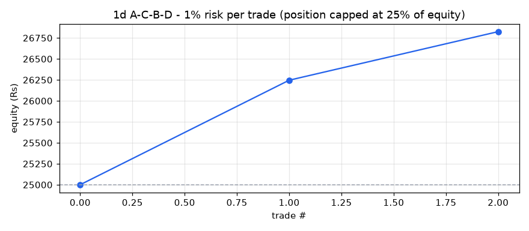
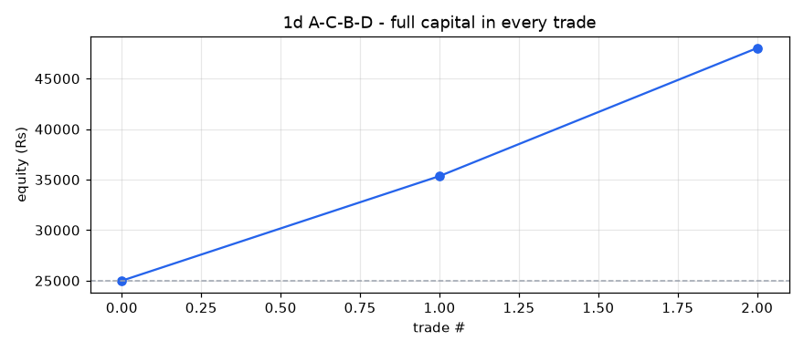

# A-C-B-D backtest report - 1d timeframe

- Stocks scanned: **591** (52 skipped with fewer than 400 candles)
- Data: **05-Oct-2020 00:00 to 01-Oct-2026 00:00, 741,329 candles**
- Costs: 0.35% (overnight) / 0.15% (same-day) round trip, plus Rs 15 / Rs 47 flat charges per trade
- Entry at the close of the breakout candle; exit on the first close above the 1.618 target or below the D low.

## Profit / loss: 1% risk per trade (position capped at 25% of equity)

**Rs 25,000 -> Rs 26,825 = PROFIT of Rs 1,825 (+7.30%)**

Trades 2, winners 2, charges paid Rs 47, max drawdown 0.0%

| symbol | entry | exit_date | status | qty | position_rs | net_return_pct | charges_rs | pnl_rs | equity_rs |
|---|---|---|---|---|---|---|---|---|---|
| SKYGOLD | 01-Apr-2026 | 06-May-2026 | TARGET HIT | 9 | 3040 | 41.47 | 26 | 1246 | 26246 |
| SOLARA | 18-Aug-2026 | 11-Sep-2026 | TARGET HIT | 3 | 1647 | 36.09 | 21 | 579 | 26825 |

## Profit / loss: full capital in every trade

**Rs 25,000 -> Rs 48,017 = PROFIT of Rs 23,017 (+92.07%)**

Trades 2, winners 2, charges paid Rs 240, max drawdown 0.0%

| symbol | entry | exit_date | status | qty | position_rs | net_return_pct | charges_rs | pnl_rs | equity_rs |
|---|---|---|---|---|---|---|---|---|---|
| SKYGOLD | 01-Apr-2026 | 06-May-2026 | TARGET HIT | 74 | 24994 | 41.47 | 102 | 10350 | 35350 |
| SOLARA | 18-Aug-2026 | 11-Sep-2026 | TARGET HIT | 64 | 35139 | 36.09 | 138 | 12667 | 48017 |

## Trade statistics (after costs)

| period | setups_entered | target_hit | stopped | open | win_rate_pct | avg_gross_pct | avg_net_pct | avg_win_pct | avg_loss_pct | avg_r | profit_factor | avg_hold_candles |
|---|---|---|---|---|---|---|---|---|---|---|---|---|
| 2026 | 2 | 2 | 0 | 0 | 100.0 | 39.13 | 38.78 | 38.78 |  | 3.88 |  | 20.0 |
| ALL | 2 | 2 | 0 | 0 | 100.0 | 39.13 | 38.78 | 38.78 |  | 3.88 |  | 20.0 |

## Trades entered

| symbol | D | entry | entry_close | stop | target | status | exit_date | return_pct | net_return_pct | hold_candles |
|---|---|---|---|---|---|---|---|---|---|---|
| SKYGOLD | 24-Mar-2026 | 01-Apr-2026 | 337.75 | 310.79998779296875 | 474.84 | TARGET HIT | 06-May-2026 | 41.82 | 41.47 | 22.0 |
| SOLARA | 27-Jul-2026 | 18-Aug-2026 | 549.0499877929688 | 471.5499877929688 | 742.93 | TARGET HIT | 11-Sep-2026 | 36.44 | 36.09 | 18.0 |

## All setups found (A-C-B-D located, with why most were not traded)

| status | setups |
|---|---|
| D broken | 7 |
| no breakout | 5 |
| TARGET HIT | 2 |

| symbol | A | C | B | D | fib_B | fib_D | status |
|---|---|---|---|---|---|---|---|
| PFC | 18-Oct-2021 | 20-Jun-2022 | 12-Aug-2022 | 03-Oct-2022 | 0.578 | 0.315 | D broken |
| EMAMILTD | 24-Aug-2021 | 20-Jun-2022 | 26-Sep-2022 | 18-Oct-2022 | 0.596 | 0.482 | D broken |
| APOLLOHOSP | 26-Nov-2021 | 26-May-2022 | 05-Dec-2022 | 30-Jan-2023 | 0.604 | 0.497 | no breakout |
| ECLERX | 13-Jan-2022 | 26-Dec-2022 | 06-Feb-2023 | 28-Feb-2023 | 0.44 | 0.492 | D broken |
| DEEPAKNTR | 19-Oct-2021 | 01-Jul-2022 | 08-Sep-2023 | 26-Oct-2023 | 0.53 | 0.36 | no breakout |
| BIOCON | 08-Feb-2022 | 21-Mar-2023 | 15-Sep-2023 | 31-Oct-2023 | 0.412 | 0.302 | no breakout |
| RAILTEL | 12-Jul-2024 | 03-Mar-2025 | 10-Jun-2025 | 11-Aug-2025 | 0.617 | 0.364 | D broken |
| PVRINOX | 08-Sep-2023 | 07-Apr-2025 | 30-Oct-2025 | 30-Dec-2025 | 0.401 | 0.388 | D broken |
| STARHEALTH | 11-Sep-2023 | 07-Apr-2025 | 17-Nov-2025 | 27-Jan-2026 | 0.594 | 0.432 | no breakout |
| SKYGOLD | 17-Dec-2024 | 06-Aug-2025 | 19-Feb-2026 | 24-Mar-2026 | 0.583 | 0.458 | TARGET HIT |
| TORNTPOWER | 22-Oct-2024 | 06-Oct-2025 | 27-Feb-2026 | 02-Apr-2026 | 0.529 | 0.254 | no breakout |
| ASTRAL | 02-Jul-2024 | 13-Mar-2025 | 11-Mar-2026 | 20-May-2026 | 0.445 | 0.375 | D broken |
| SOLARA | 02-Dec-2024 | 30-Mar-2026 | 15-Jun-2026 | 27-Jul-2026 | 0.43 | 0.25 | TARGET HIT |
| GODREJPROP | 16-Jul-2024 | 02-Apr-2026 | 29-Jul-2026 | 16-Sep-2026 | 0.384 | 0.293 | D broken |
