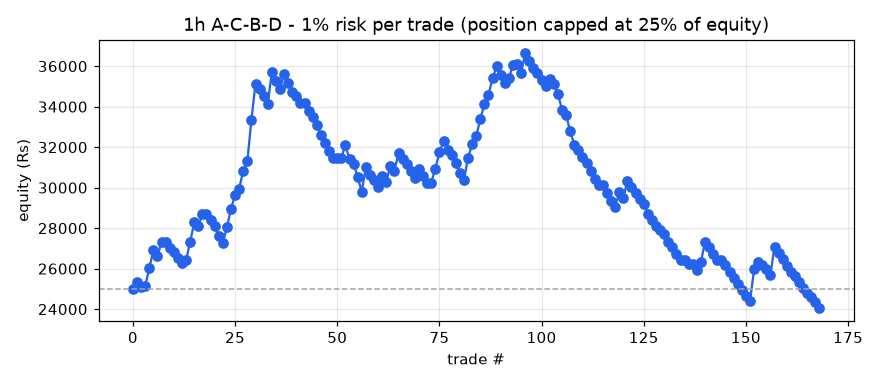
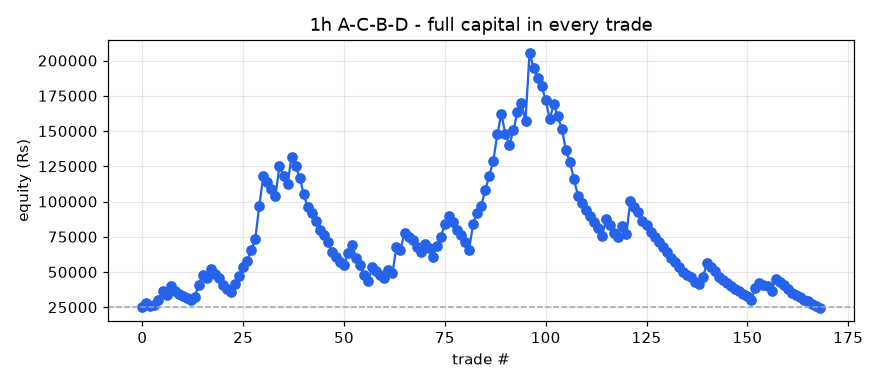

# A-C-B-D backtest report - 1h timeframe

- Stocks scanned: **567** (5 skipped with fewer than 400 candles)
- Data: **26-Oct-2023 09:15 to 01-Oct-2026 15:15, 2,579,969 candles**
- Costs: 0.35% (overnight) / 0.15% (same-day) round trip, plus Rs 15 / Rs 47 flat charges per trade
- Entry at the close of the breakout candle; exit on the first close above the 1.618 target or below the D low.

## Profit / loss: 1% risk per trade (position capped at 25% of equity)

**Rs 25,000 -> Rs 24,061 = LOSS of Rs 939 (-3.75%)**

Trades 158, winners 48, charges paid Rs 5,503, max drawdown -34.38%

| symbol | entry | exit_date | status | qty | position_rs | net_return_pct | charges_rs | pnl_rs | equity_rs |
|---|---|---|---|---|---|---|---|---|---|
| NYKAA | 21-Mar-2024 09:15 | 08-Apr-2024 10:15 | TARGET HIT | 20 | 3165 | 11.59 | 26 | 352 | 25352 |
| NESTLEIND | 28-Mar-2024 09:15 | 18-Apr-2024 10:15 | STOPPED | 3 | 3913 | -6.02 | 29 | -251 | 25101 |
| TRENT | 10-Apr-2024 12:15 | 22-Apr-2024 09:15 | TARGET HIT | 1 | 2727 | 2.05 | 25 | 41 | 25142 |
| KPRMILL | 18-Mar-2024 12:15 | 24-Apr-2024 09:15 | TARGET HIT | 8 | 6175 | 14.38 | 37 | 873 | 26015 |
| TITAGARH | 16-Apr-2024 09:15 | 07-May-2024 09:15 | TARGET HIT | 5 | 4674 | 19.54 | 31 | 898 | 26913 |
| LICI | 23-Apr-2024 09:15 | 07-May-2024 10:15 | STOPPED | 7 | 3503 | -8.0 | 27 | -295 | 26618 |
| NETWEB | 16-Apr-2024 09:15 | 09-May-2024 09:15 | TARGET HIT | 2 | 3294 | 21.26 | 27 | 685 | 27303 |
| BAJFINANCE | 03-May-2024 09:15 | 09-May-2024 12:15 | SKIPPED (price above position size) | 0 | 0 | -8.82 | 0 | 0 | 27303 |
| HOMEFIRST | 30-Apr-2024 11:15 | 09-May-2024 13:15 | STOPPED | 4 | 3650 | -6.93 | 28 | -268 | 27036 |
| GNA | 22-Apr-2024 09:15 | 10-May-2024 15:15 | STOPPED | 16 | 6546 | -3.25 | 38 | -228 | 26808 |
| MTARTECH | 23-Apr-2024 12:15 | 13-May-2024 09:15 | STOPPED | 3 | 5530 | -4.54 | 34 | -266 | 26542 |
| BANDHANBNK | 09-May-2024 09:15 | 16-May-2024 12:15 | STOPPED | 35 | 6482 | -3.99 | 38 | -274 | 26268 |
| ENDURANCE | 10-May-2024 09:15 | 17-May-2024 09:15 | TARGET HIT | 1 | 2092 | 7.12 | 22 | 134 | 26402 |
| ENGINERSIN | 24-Apr-2024 15:15 | 21-May-2024 09:15 | TARGET HIT | 16 | 3454 | 26.61 | 27 | 904 | 27306 |
| GLAXO | 16-May-2024 12:15 | 22-May-2024 12:15 | TARGET HIT | 3 | 6112 | 16.25 | 36 | 978 | 28285 |
| CRAFTSMAN | 14-May-2024 10:15 | 28-May-2024 11:15 | STOPPED | 1 | 4423 | -4.0 | 30 | -192 | 28093 |
| COROMANDEL | 25-Apr-2024 15:15 | 28-May-2024 14:15 | TARGET HIT | 4 | 4532 | 13.35 | 31 | 590 | 28683 |
| BAYERCROP | 16-May-2024 09:15 | 29-May-2024 13:15 | SKIPPED (price above position size) | 0 | 0 | -6.41 | 0 | 0 | 28683 |
| MFSL | 26-Mar-2024 09:15 | 30-May-2024 10:15 | STOPPED | 4 | 3965 | -6.52 | 29 | -274 | 28409 |
| THYROCARE | 15-May-2024 09:15 | 04-Jun-2024 09:15 | STOPPED | 13 | 2854 | -10.7 | 25 | -320 | 28089 |
| SHYAMMETL | 03-Jun-2024 09:15 | 04-Jun-2024 10:15 | STOPPED | 11 | 6842 | -6.73 | 39 | -475 | 27613 |
| HINDPETRO | 15-May-2024 09:15 | 05-Jun-2024 09:15 | STOPPED | 15 | 5013 | -6.37 | 33 | -334 | 27279 |
| CHOLAFIN | 24-Apr-2024 09:15 | 10-Jun-2024 13:15 | TARGET HIT | 4 | 4674 | 16.5 | 31 | 756 | 28035 |
| SUNTV | 28-May-2024 12:15 | 11-Jun-2024 14:15 | TARGET HIT | 10 | 6562 | 14.23 | 38 | 919 | 28954 |
| UPL | 10-May-2024 13:15 | 11-Jun-2024 15:15 | TARGET HIT | 11 | 5381 | 13.0 | 34 | 685 | 29638 |
| FEDERALBNK | 29-Apr-2024 13:15 | 12-Jun-2024 12:15 | TARGET HIT | 25 | 4001 | 8.33 | 29 | 318 | 29957 |
| VINATIORGA | 17-May-2024 10:15 | 12-Jun-2024 14:15 | TARGET HIT | 4 | 6445 | 13.96 | 38 | 885 | 30841 |
| DCMSHRIRAM | 26-Apr-2024 10:15 | 14-Jun-2024 09:15 | TARGET HIT | 4 | 3860 | 12.48 | 29 | 467 | 31308 |
| NBCC | 19-Apr-2024 13:15 | 20-Jun-2024 09:15 | TARGET HIT | 78 | 6500 | 31.61 | 38 | 2040 | 33348 |
| BIRLACABLE | 01-Jul-2024 11:15 | 16-Jul-2024 09:15 | TARGET HIT | 33 | 8198 | 22.03 | 44 | 1791 | 35139 |
| ASIANPAINT | 10-Jul-2024 13:15 | 24-Jul-2024 09:15 | STOPPED | 2 | 5990 | -3.92 | 36 | -250 | 34889 |
| LICI | 04-Jul-2024 10:15 | 03-Oct-2024 11:15 | STOPPED | 17 | 8659 | -4.12 | 45 | -372 | 34517 |
| CLEAN | 26-Sep-2024 14:15 | 07-Oct-2024 10:15 | STOPPED | 5 | 7800 | -4.64 | 42 | -377 | 34140 |
| USHAMART | 20-Sep-2024 09:15 | 11-Oct-2024 10:15 | TARGET HIT | 22 | 7707 | 20.55 | 42 | 1569 | 35709 |
| ABCAPITAL | 13-Sep-2024 09:15 | 22-Oct-2024 11:15 | STOPPED | 32 | 7166 | -5.89 | 40 | -437 | 35272 |
| EXIDEIND | 08-Oct-2024 10:15 | 22-Oct-2024 11:15 | STOPPED | 17 | 8357 | -4.5 | 44 | -391 | 34881 |
| CRISIL | 29-Jul-2024 09:15 | 24-Oct-2024 12:15 | TARGET HIT | 1 | 4320 | 17.13 | 30 | 725 | 35606 |
| LINDEINDIA | 08-Oct-2024 14:15 | 25-Oct-2024 09:15 | STOPPED | 1 | 8171 | -4.89 | 44 | -415 | 35191 |
| BAYERCROP | 31-Oct-2024 09:15 | 13-Nov-2024 09:15 | STOPPED | 1 | 6528 | -6.7 | 38 | -452 | 34739 |
| BEML | 30-Oct-2024 11:15 | 19-Nov-2024 15:15 | STOPPED | 1 | 2033 | -9.97 | 22 | -218 | 34521 |
| KIRLOSENG | 14-Nov-2024 12:15 | 21-Nov-2024 09:15 | STOPPED | 3 | 3538 | -9.14 | 27 | -338 | 34183 |
| BAJAJHLDNG | 11-Nov-2024 10:15 | 27-Nov-2024 09:15 | SKIPPED (price above position size) | 0 | 0 | -4.46 | 0 | 0 | 34183 |
| GAIL | 24-Dec-2024 09:15 | 30-Dec-2024 14:15 | STOPPED | 30 | 5995 | -6.01 | 36 | -375 | 33808 |
| SHRIPISTON | 30-Dec-2024 14:15 | 06-Jan-2025 14:15 | STOPPED | 2 | 4303 | -7.43 | 30 | -335 | 33473 |
| ANURAS | 14-Nov-2024 14:15 | 08-Jan-2025 15:15 | STOPPED | 10 | 7354 | -5.03 | 41 | -385 | 33088 |
| KPITTECH | 30-Dec-2024 14:15 | 10-Jan-2025 09:15 | STOPPED | 5 | 7359 | -6.7 | 41 | -508 | 32580 |
| BEL | 25-Nov-2024 09:15 | 13-Jan-2025 09:15 | STOPPED | 13 | 3832 | -9.36 | 28 | -374 | 32206 |
| GRAVITA | 07-Jan-2025 09:15 | 13-Jan-2025 09:15 | STOPPED | 3 | 6785 | -5.29 | 39 | -374 | 31832 |
| SBFC | 27-Dec-2024 11:15 | 13-Jan-2025 13:15 | STOPPED | 57 | 5110 | -6.8 | 33 | -362 | 31470 |
| ABBOTINDIA | 27-Dec-2024 09:15 | 15-Jan-2025 11:15 | SKIPPED (price above position size) | 0 | 0 | -5.89 | 0 | 0 | 31470 |
| FORCEMOT | 03-Mar-2025 12:15 | 10-Mar-2025 10:15 | SKIPPED (price above position size) | 0 | 0 | 15.75 | 0 | 0 | 31470 |
| JSWSTEEL | 03-Mar-2025 12:15 | 21-Mar-2025 15:15 | TARGET HIT | 8 | 7811 | 8.31 | 42 | 634 | 32104 |
| JUBLINGREA | 03-Apr-2025 09:15 | 07-Apr-2025 09:15 | STOPPED | 8 | 5364 | -12.8 | 34 | -702 | 31402 |
| LUPIN | 03-Apr-2025 09:15 | 07-Apr-2025 09:15 | STOPPED | 1 | 2100 | -9.31 | 22 | -210 | 31192 |
| RAILTEL | 03-Apr-2025 10:15 | 07-Apr-2025 09:15 | STOPPED | 17 | 5305 | -12.38 | 34 | -672 | 30520 |
| USHAMART | 04-Apr-2025 14:15 | 07-Apr-2025 09:15 | STOPPED | 23 | 7486 | -9.47 | 41 | -724 | 29796 |
| CEATLTD | 08-Apr-2025 09:15 | 30-Apr-2025 12:15 | TARGET HIT | 2 | 5419 | 22.92 | 34 | 1227 | 31023 |
| GOODLUCK | 05-May-2025 11:15 | 06-May-2025 14:15 | STOPPED | 31 | 7697 | -4.67 | 42 | -374 | 30649 |
| ADANIENT | 05-May-2025 09:15 | 08-May-2025 15:15 | STOPPED | 2 | 4794 | -5.66 | 32 | -286 | 30362 |
| HAVELLS | 21-May-2025 09:15 | 02-Jun-2025 12:15 | STOPPED | 4 | 6358 | -5.11 | 37 | -340 | 30022 |
| CIEINDIA | 12-May-2025 09:15 | 11-Jun-2025 10:15 | TARGET HIT | 10 | 4200 | 13.66 | 30 | 559 | 30581 |
| GRAVITA | 02-May-2025 13:15 | 16-Jun-2025 09:15 | STOPPED | 3 | 5454 | -5.01 | 34 | -288 | 30293 |
| TDPOWERSYS | 08-Apr-2025 09:15 | 18-Jun-2025 09:15 | TARGET HIT | 11 | 2087 | 38.48 | 22 | 788 | 31081 |
| JSWENERGY | 18-Jun-2025 09:15 | 19-Jun-2025 10:15 | STOPPED | 15 | 7674 | -2.99 | 42 | -244 | 30836 |
| JKLAKSHMI | 12-May-2025 09:15 | 01-Jul-2025 11:15 | TARGET HIT | 6 | 4781 | 18.48 | 32 | 869 | 31705 |
| CONCORDBIO | 27-Jun-2025 09:15 | 02-Jul-2025 13:15 | STOPPED | 4 | 7316 | -3.79 | 41 | -292 | 31413 |
| M&MFIN | 24-Jun-2025 09:15 | 18-Jul-2025 10:15 | STOPPED | 29 | 7723 | -3.09 | 42 | -254 | 31159 |
| WIPRO | 18-Jul-2025 09:15 | 28-Jul-2025 10:15 | STOPPED | 19 | 5089 | -6.47 | 33 | -344 | 30815 |
| BATAINDIA | 21-May-2025 09:15 | 04-Aug-2025 09:15 | STOPPED | 5 | 6210 | -5.25 | 37 | -341 | 30474 |
| PVRINOX | 06-Aug-2025 13:15 | 21-Aug-2025 09:15 | TARGET HIT | 5 | 5128 | 9.0 | 33 | 447 | 30920 |
| EMAMILTD | 18-Aug-2025 09:15 | 25-Aug-2025 12:15 | STOPPED | 11 | 6556 | -4.84 | 38 | -332 | 30588 |
| IRB | 12-May-2025 09:15 | 28-Aug-2025 09:15 | STOPPED | 146 | 3444 | -9.42 | 27 | -339 | 30249 |
| BAJAJ-AUTO | 12-May-2025 09:15 | 03-Sep-2025 11:15 | SKIPPED (price above position size) | 0 | 0 | 14.49 | 0 | 0 | 30249 |
| MANAPPURAM | 01-Sep-2025 09:15 | 08-Sep-2025 10:15 | TARGET HIT | 28 | 7494 | 9.44 | 41 | 692 | 30941 |
| SBIN | 08-Apr-2025 09:15 | 17-Sep-2025 14:15 | TARGET HIT | 9 | 6877 | 11.83 | 39 | 799 | 31740 |
| M&MFIN | 04-Sep-2025 09:15 | 18-Sep-2025 09:15 | TARGET HIT | 30 | 7911 | 7.27 | 43 | 560 | 32300 |
| INDIAMART | 11-Sep-2025 09:15 | 19-Sep-2025 09:15 | STOPPED | 3 | 7845 | -5.24 | 42 | -426 | 31874 |
| POLYMED | 18-Sep-2025 09:15 | 23-Sep-2025 09:15 | STOPPED | 2 | 4118 | -6.27 | 29 | -273 | 31601 |
| IKS | 02-Jun-2025 09:15 | 26-Sep-2025 09:15 | STOPPED | 5 | 7718 | -4.79 | 42 | -385 | 31216 |
| BIOCON | 18-Sep-2025 13:15 | 26-Sep-2025 09:15 | STOPPED | 21 | 7696 | -6.16 | 42 | -489 | 30727 |
| VGUARD | 25-Sep-2025 09:15 | 26-Sep-2025 11:15 | STOPPED | 11 | 4278 | -8.03 | 30 | -359 | 30368 |
| SAMMAANCAP | 12-May-2025 09:15 | 29-Sep-2025 13:15 | TARGET HIT | 33 | 3947 | 28.34 | 29 | 1104 | 31472 |
| ASTERDM | 01-Sep-2025 09:15 | 06-Oct-2025 11:15 | TARGET HIT | 12 | 7338 | 9.22 | 41 | 662 | 32133 |
| KOTAKBANK | 01-Oct-2025 09:15 | 06-Oct-2025 12:15 | TARGET HIT | 19 | 7714 | 5.51 | 42 | 410 | 32543 |
| ASTERDM | 19-Sep-2025 09:15 | 09-Oct-2025 09:15 | TARGET HIT | 12 | 7548 | 11.32 | 41 | 839 | 33383 |
| MCX | 01-Oct-2025 11:15 | 09-Oct-2025 12:15 | TARGET HIT | 5 | 7932 | 9.4 | 43 | 731 | 34113 |
| STARHEALTH | 29-Aug-2025 09:15 | 17-Oct-2025 09:15 | TARGET HIT | 12 | 5451 | 8.84 | 34 | 467 | 34580 |
| AXISBANK | 15-Apr-2025 09:15 | 23-Oct-2025 09:15 | TARGET HIT | 5 | 5503 | 15.06 | 34 | 814 | 35394 |
| IDBI | 10-Oct-2025 09:15 | 28-Oct-2025 13:15 | TARGET HIT | 66 | 6198 | 9.85 | 37 | 596 | 35990 |
| SJVN | 12-May-2025 09:15 | 06-Nov-2025 09:15 | STOPPED | 49 | 4598 | -8.65 | 31 | -413 | 35577 |
| RECLTD | 01-Oct-2025 09:15 | 06-Nov-2025 11:15 | STOPPED | 19 | 7288 | -5.47 | 41 | -414 | 35163 |
| INDUSTOWER | 27-Oct-2025 11:15 | 12-Nov-2025 11:15 | TARGET HIT | 9 | 3386 | 7.62 | 27 | 243 | 35406 |
| AUROPHARMA | 31-Oct-2025 09:15 | 14-Nov-2025 09:15 | TARGET HIT | 7 | 7869 | 8.51 | 43 | 655 | 36061 |
| NH | 17-Nov-2025 09:15 | 17-Nov-2025 14:15 | TARGET HIT | 1 | 1922 | 4.07 | 50 | 31 | 36092 |
| MMTC | 03-Oct-2025 10:15 | 19-Nov-2025 09:15 | STOPPED | 79 | 5436 | -7.44 | 34 | -419 | 35673 |
| GRWRHITECH | 16-Oct-2025 09:15 | 20-Nov-2025 09:15 | TARGET HIT | 1 | 3222 | 31.26 | 26 | 992 | 36665 |
| KALYANKJIL | 20-Nov-2025 10:15 | 24-Nov-2025 14:15 | STOPPED | 15 | 7647 | -5.27 | 42 | -418 | 36247 |
| LICI | 28-Oct-2025 09:15 | 01-Dec-2025 14:15 | STOPPED | 19 | 8679 | -3.66 | 45 | -333 | 35914 |
| OIL | 23-Oct-2025 09:15 | 08-Dec-2025 12:15 | STOPPED | 21 | 8712 | -2.93 | 45 | -270 | 35644 |
| DATAPATTNS | 01-Oct-2025 11:15 | 17-Dec-2025 13:15 | STOPPED | 2 | 5268 | -5.58 | 33 | -309 | 35335 |
| KPITTECH | 01-Dec-2025 09:15 | 18-Dec-2025 09:15 | STOPPED | 3 | 3767 | -7.8 | 28 | -309 | 35026 |
| VOLTAS | 02-Jan-2026 09:15 | 07-Jan-2026 13:15 | TARGET HIT | 4 | 5671 | 6.69 | 35 | 364 | 35390 |
| PRUDENT | 05-Jan-2026 09:15 | 09-Jan-2026 13:15 | STOPPED | 2 | 5275 | -5.1 | 33 | -284 | 35106 |
| APARINDS | 03-Oct-2025 09:15 | 12-Jan-2026 09:15 | STOPPED | 1 | 8348 | -5.57 | 44 | -480 | 34626 |
| HBLENGINE | 14-Jan-2026 13:15 | 16-Jan-2026 09:15 | STOPPED | 9 | 7824 | -9.79 | 42 | -781 | 33845 |
| ESCORTS | 23-Dec-2025 09:15 | 20-Jan-2026 09:15 | STOPPED | 1 | 3736 | -6.52 | 28 | -259 | 33587 |
| JSWENERGY | 22-Jan-2026 09:15 | 27-Jan-2026 09:15 | STOPPED | 17 | 8310 | -9.48 | 44 | -803 | 32784 |
| JKLAKSHMI | 22-Jan-2026 10:15 | 04-Feb-2026 09:15 | STOPPED | 8 | 6376 | -10.11 | 37 | -660 | 32125 |
| CRISIL | 28-Jan-2026 09:15 | 13-Feb-2026 09:15 | STOPPED | 1 | 4603 | -5.5 | 31 | -268 | 31856 |
| HINDUNILVR | 05-Feb-2026 09:15 | 13-Feb-2026 14:15 | STOPPED | 3 | 7226 | -4.83 | 40 | -364 | 31492 |
| DALBHARAT | 13-Jan-2026 09:15 | 27-Feb-2026 09:15 | STOPPED | 3 | 6302 | -4.22 | 37 | -281 | 31211 |
| SHYAMMETL | 25-Feb-2026 09:15 | 04-Mar-2026 09:15 | STOPPED | 9 | 7632 | -5.18 | 42 | -410 | 30801 |
| FLUOROCHEM | 13-Feb-2026 14:15 | 04-Mar-2026 09:15 | STOPPED | 2 | 6793 | -4.95 | 39 | -351 | 30450 |
| GOODLUCK | 16-Feb-2026 09:15 | 05-Mar-2026 11:15 | STOPPED | 12 | 4603 | -6.9 | 31 | -333 | 30117 |
| SOLARINDS | 22-Jan-2026 09:15 | 06-Mar-2026 09:15 | SKIPPED (price above position size) | 0 | 0 | 19.28 | 0 | 0 | 30117 |
| STARHEALTH | 25-Feb-2026 09:15 | 09-Mar-2026 09:15 | STOPPED | 16 | 7480 | -5.21 | 41 | -405 | 29712 |
| GODREJPROP | 05-Mar-2026 14:15 | 09-Mar-2026 09:15 | STOPPED | 3 | 5235 | -6.64 | 33 | -363 | 29350 |
| TRAVELFOOD | 05-Mar-2026 09:15 | 09-Mar-2026 10:15 | STOPPED | 6 | 7080 | -4.05 | 40 | -302 | 29048 |
| TATAPOWER | 05-Mar-2026 09:15 | 20-Mar-2026 09:15 | TARGET HIT | 19 | 7126 | 10.33 | 40 | 721 | 29769 |
| WELCORP | 26-Feb-2026 09:15 | 23-Mar-2026 10:15 | STOPPED | 5 | 4101 | -6.81 | 29 | -294 | 29475 |
| KSB | 09-Apr-2025 11:15 | 15-Apr-2026 10:15 | TARGET HIT | 4 | 2835 | 30.88 | 25 | 860 | 30335 |
| TEGA | 04-May-2026 09:15 | 05-May-2026 10:15 | STOPPED | 4 | 6786 | -4.14 | 39 | -296 | 30039 |
| CANBK | 04-May-2026 09:15 | 11-May-2026 09:15 | STOPPED | 54 | 7398 | -3.75 | 41 | -292 | 29747 |
| BSOFT | 15-Apr-2026 09:15 | 11-May-2026 09:15 | STOPPED | 12 | 4540 | -6.8 | 31 | -324 | 29423 |
| AMBUJACEM | 06-May-2026 09:15 | 12-May-2026 13:15 | STOPPED | 16 | 7063 | -3.25 | 40 | -245 | 29179 |
| SJVN | 14-May-2026 09:15 | 18-May-2026 09:15 | STOPPED | 94 | 7237 | -6.45 | 40 | -482 | 28697 |
| IEX | 27-Apr-2026 12:15 | 18-May-2026 09:15 | STOPPED | 56 | 7081 | -3.76 | 40 | -281 | 28416 |
| UNOMINDA | 06-May-2026 13:15 | 18-May-2026 14:15 | STOPPED | 5 | 5600 | -5.11 | 35 | -301 | 28115 |
| CRISIL | 20-May-2026 09:15 | 27-May-2026 11:15 | STOPPED | 1 | 4177 | -4.86 | 30 | -218 | 27897 |
| M&M | 29-Apr-2026 09:15 | 01-Jun-2026 09:15 | STOPPED | 1 | 3176 | -5.77 | 26 | -198 | 27698 |
| PAYTM | 20-May-2026 10:15 | 02-Jun-2026 09:15 | STOPPED | 5 | 5668 | -6.62 | 35 | -390 | 27308 |
| MFSL | 06-May-2026 09:15 | 03-Jun-2026 09:15 | STOPPED | 3 | 4906 | -4.99 | 32 | -260 | 27048 |
| ABFRL | 21-May-2026 09:15 | 03-Jun-2026 10:15 | STOPPED | 76 | 4869 | -6.22 | 32 | -318 | 26730 |
| AEGISVOPAK | 14-May-2026 14:15 | 03-Jun-2026 11:15 | STOPPED | 25 | 5023 | -5.81 | 33 | -307 | 26424 |
| SHREECEM | 04-May-2026 09:15 | 08-Jun-2026 09:15 | SKIPPED (price above position size) | 0 | 0 | -4.25 | 0 | 0 | 26424 |
| CHOICEIN | 06-May-2026 09:15 | 08-Jun-2026 13:15 | STOPPED | 9 | 6031 | -3.16 | 36 | -206 | 26218 |
| BAJAJHLDNG | 21-May-2026 09:15 | 08-Jun-2026 14:15 | SKIPPED (price above position size) | 0 | 0 | -7.72 | 0 | 0 | 26218 |
| TRENT | 04-Jun-2026 14:15 | 08-Jun-2026 15:15 | STOPPED | 2 | 5676 | -4.79 | 35 | -287 | 25931 |
| IDFCFIRSTB | 27-May-2026 15:15 | 22-Jun-2026 11:15 | TARGET HIT | 46 | 3301 | 12.67 | 27 | 403 | 26334 |
| INDIGO | 06-May-2026 09:15 | 25-Jun-2026 09:15 | TARGET HIT | 1 | 4379 | 23.3 | 30 | 1005 | 27340 |
| INTELLECT | 09-Jun-2026 14:15 | 30-Jun-2026 09:15 | STOPPED | 7 | 5264 | -5.02 | 33 | -279 | 27060 |
| RAILTEL | 01-Jul-2026 09:15 | 08-Jul-2026 09:15 | STOPPED | 16 | 5152 | -6.24 | 33 | -336 | 26724 |
| VMM | 18-May-2026 11:15 | 17-Jul-2026 09:15 | STOPPED | 28 | 3398 | -8.34 | 27 | -298 | 26426 |
| AMBER | 07-Jul-2026 11:15 | 23-Jul-2026 12:15 | SKIPPED (price above position size) | 0 | 0 | -4.45 | 0 | 0 | 26426 |
| JMFINANCIL | 15-Jul-2026 09:15 | 23-Jul-2026 14:15 | STOPPED | 52 | 6579 | -3.66 | 38 | -256 | 26170 |
| UPL | 03-Aug-2026 09:15 | 04-Aug-2026 09:15 | STOPPED | 10 | 6193 | -5.35 | 37 | -346 | 25823 |
| BLUESTARCO | 27-Jul-2026 09:15 | 06-Aug-2026 14:15 | STOPPED | 3 | 4990 | -5.83 | 32 | -306 | 25518 |
| NHPC | 03-Aug-2026 09:15 | 07-Aug-2026 09:15 | STOPPED | 79 | 6316 | -3.93 | 37 | -263 | 25254 |
| NBCC | 19-May-2026 09:15 | 14-Aug-2026 12:15 | STOPPED | 67 | 6258 | -4.38 | 37 | -289 | 24965 |
| IGIL | 17-Aug-2026 10:15 | 19-Aug-2026 13:15 | STOPPED | 17 | 6022 | -4.99 | 36 | -316 | 24650 |
| BBTC | 03-Aug-2026 13:15 | 20-Aug-2026 15:15 | STOPPED | 2 | 3100 | -7.87 | 26 | -259 | 24391 |
| SMARTWORKS | 20-May-2026 10:15 | 25-Aug-2026 09:15 | TARGET HIT | 13 | 5667 | 28.11 | 35 | 1578 | 25969 |
| GLENMARK | 29-Jul-2026 12:15 | 27-Aug-2026 09:15 | TARGET HIT | 2 | 4516 | 8.58 | 31 | 372 | 26341 |
| INFY | 20-Aug-2026 09:15 | 27-Aug-2026 11:15 | STOPPED | 5 | 5697 | -2.79 | 35 | -174 | 26167 |
| CARBORUNIV | 01-Sep-2026 10:15 | 02-Sep-2026 10:15 | STOPPED | 5 | 5562 | -2.99 | 34 | -181 | 25986 |
| AWL | 25-Aug-2026 10:15 | 04-Sep-2026 13:15 | STOPPED | 19 | 3821 | -7.29 | 28 | -294 | 25692 |
| GRAPHITE | 31-Aug-2026 11:15 | 09-Sep-2026 09:15 | TARGET HIT | 9 | 6332 | 22.33 | 37 | 1399 | 27091 |
| SBIN | 03-Aug-2026 09:15 | 09-Sep-2026 15:15 | STOPPED | 6 | 6266 | -4.55 | 37 | -300 | 26791 |
| JMFINANCIL | 01-Sep-2026 10:15 | 11-Sep-2026 09:15 | STOPPED | 51 | 6647 | -4.72 | 38 | -329 | 26462 |
| NCC | 07-Sep-2026 13:15 | 11-Sep-2026 09:15 | STOPPED | 26 | 3952 | -7.98 | 29 | -330 | 26132 |
| NCC | 21-Aug-2026 09:15 | 15-Sep-2026 14:15 | STOPPED | 27 | 3989 | -7.65 | 29 | -320 | 25812 |
| KPRMILL | 15-Sep-2026 09:15 | 16-Sep-2026 09:15 | STOPPED | 5 | 5633 | -3.17 | 35 | -194 | 25618 |
| AYE | 18-Aug-2026 14:15 | 25-Sep-2026 13:15 | STOPPED | 37 | 6346 | -4.02 | 37 | -270 | 25348 |
| XPROINDIA | 23-Sep-2026 09:15 | 28-Sep-2026 10:15 | STOPPED | 4 | 4893 | -5.69 | 32 | -293 | 25055 |
| ZYDUSWELL | 21-Sep-2026 13:15 | 29-Sep-2026 13:15 | STOPPED | 11 | 5841 | -3.92 | 35 | -244 | 24811 |
| JSWDULUX | 18-Sep-2026 14:15 | 29-Sep-2026 14:15 | STOPPED | 1 | 3200 | -5.81 | 26 | -201 | 24610 |
| KFINTECH | 09-Jul-2026 11:15 | 29-Sep-2026 15:15 | STOPPED | 6 | 5272 | -4.96 | 33 | -277 | 24333 |
| SONATSOFTW | 19-May-2026 09:15 | 01-Oct-2026 12:15 | STOPPED | 15 | 4028 | -6.38 | 29 | -272 | 24061 |

## Profit / loss: full capital in every trade

**Rs 25,000 -> Rs 24,539 = LOSS of Rs 461 (-1.84%)**

Trades 168, winners 51, charges paid Rs 45,832, max drawdown -88.06%

| symbol | entry | exit_date | status | qty | position_rs | net_return_pct | charges_rs | pnl_rs | equity_rs |
|---|---|---|---|---|---|---|---|---|---|
| NYKAA | 21-Mar-2024 09:15 | 08-Apr-2024 10:15 | TARGET HIT | 157 | 24845 | 11.59 | 102 | 2865 | 27865 |
| NESTLEIND | 28-Mar-2024 09:15 | 18-Apr-2024 10:15 | STOPPED | 21 | 27394 | -6.02 | 111 | -1664 | 26200 |
| TRENT | 10-Apr-2024 12:15 | 22-Apr-2024 09:15 | TARGET HIT | 9 | 24541 | 2.05 | 101 | 488 | 26689 |
| KPRMILL | 18-Mar-2024 12:15 | 24-Apr-2024 09:15 | TARGET HIT | 34 | 26245 | 14.38 | 107 | 3759 | 30448 |
| TITAGARH | 16-Apr-2024 09:15 | 07-May-2024 09:15 | TARGET HIT | 32 | 29914 | 19.54 | 120 | 5830 | 36278 |
| LICI | 23-Apr-2024 09:15 | 07-May-2024 10:15 | STOPPED | 72 | 36032 | -8.0 | 141 | -2898 | 33380 |
| NETWEB | 16-Apr-2024 09:15 | 09-May-2024 09:15 | TARGET HIT | 20 | 32940 | 21.26 | 130 | 6988 | 40368 |
| BAJFINANCE | 03-May-2024 09:15 | 09-May-2024 12:15 | STOPPED | 11 | 39886 | -8.82 | 155 | -3533 | 36835 |
| HOMEFIRST | 30-Apr-2024 11:15 | 09-May-2024 13:15 | STOPPED | 40 | 36496 | -6.93 | 143 | -2544 | 34291 |
| GNA | 22-Apr-2024 09:15 | 10-May-2024 15:15 | STOPPED | 83 | 33959 | -3.25 | 134 | -1119 | 33172 |
| MTARTECH | 23-Apr-2024 12:15 | 13-May-2024 09:15 | STOPPED | 17 | 31335 | -4.54 | 125 | -1438 | 31735 |
| BANDHANBNK | 09-May-2024 09:15 | 16-May-2024 12:15 | STOPPED | 171 | 31669 | -3.99 | 126 | -1279 | 30456 |
| ENDURANCE | 10-May-2024 09:15 | 17-May-2024 09:15 | TARGET HIT | 14 | 29284 | 7.12 | 117 | 2070 | 32526 |
| ENGINERSIN | 24-Apr-2024 15:15 | 21-May-2024 09:15 | TARGET HIT | 150 | 32385 | 26.61 | 128 | 8603 | 41129 |
| GLAXO | 16-May-2024 12:15 | 22-May-2024 12:15 | TARGET HIT | 20 | 40749 | 16.25 | 158 | 6607 | 47735 |
| CRAFTSMAN | 14-May-2024 10:15 | 28-May-2024 11:15 | STOPPED | 10 | 44228 | -4.0 | 170 | -1784 | 45951 |
| COROMANDEL | 25-Apr-2024 15:15 | 28-May-2024 14:15 | TARGET HIT | 40 | 45320 | 13.35 | 174 | 6035 | 51987 |
| BAYERCROP | 16-May-2024 09:15 | 29-May-2024 13:15 | STOPPED | 9 | 49342 | -6.41 | 188 | -3178 | 48809 |
| MFSL | 26-Mar-2024 09:15 | 30-May-2024 10:15 | STOPPED | 49 | 48571 | -6.52 | 185 | -3182 | 45627 |
| THYROCARE | 15-May-2024 09:15 | 04-Jun-2024 09:15 | STOPPED | 207 | 45447 | -10.7 | 174 | -4878 | 40749 |
| SHYAMMETL | 03-Jun-2024 09:15 | 04-Jun-2024 10:15 | STOPPED | 65 | 40430 | -6.73 | 157 | -2736 | 38013 |
| HINDPETRO | 15-May-2024 09:15 | 05-Jun-2024 09:15 | STOPPED | 113 | 37765 | -6.37 | 147 | -2421 | 35593 |
| CHOLAFIN | 24-Apr-2024 09:15 | 10-Jun-2024 13:15 | TARGET HIT | 30 | 35055 | 16.5 | 138 | 5769 | 41362 |
| SUNTV | 28-May-2024 12:15 | 11-Jun-2024 14:15 | TARGET HIT | 63 | 41337 | 14.23 | 160 | 5867 | 47229 |
| UPL | 10-May-2024 13:15 | 11-Jun-2024 15:15 | TARGET HIT | 96 | 46963 | 13.0 | 179 | 6090 | 53319 |
| FEDERALBNK | 29-Apr-2024 13:15 | 12-Jun-2024 12:15 | TARGET HIT | 333 | 53297 | 8.33 | 202 | 4425 | 57744 |
| VINATIORGA | 17-May-2024 10:15 | 12-Jun-2024 14:15 | TARGET HIT | 35 | 56394 | 13.96 | 212 | 7858 | 65601 |
| DCMSHRIRAM | 26-Apr-2024 10:15 | 14-Jun-2024 09:15 | TARGET HIT | 67 | 64658 | 12.48 | 241 | 8054 | 73656 |
| NBCC | 19-Apr-2024 13:15 | 20-Jun-2024 09:15 | TARGET HIT | 883 | 73583 | 31.61 | 273 | 23245 | 96900 |
| BIRLACABLE | 01-Jul-2024 11:15 | 16-Jul-2024 09:15 | TARGET HIT | 390 | 96880 | 22.03 | 354 | 21328 | 118228 |
| ASIANPAINT | 10-Jul-2024 13:15 | 24-Jul-2024 09:15 | STOPPED | 39 | 116805 | -3.92 | 424 | -4594 | 113634 |
| LICI | 04-Jul-2024 10:15 | 03-Oct-2024 11:15 | STOPPED | 223 | 113585 | -4.12 | 413 | -4695 | 108940 |
| CLEAN | 26-Sep-2024 14:15 | 07-Oct-2024 10:15 | STOPPED | 69 | 107640 | -4.64 | 392 | -5009 | 103930 |
| USHAMART | 20-Sep-2024 09:15 | 11-Oct-2024 10:15 | TARGET HIT | 296 | 103689 | 20.55 | 378 | 21293 | 125223 |
| ABCAPITAL | 13-Sep-2024 09:15 | 22-Oct-2024 11:15 | STOPPED | 559 | 125188 | -5.89 | 453 | -7389 | 117835 |
| EXIDEIND | 08-Oct-2024 10:15 | 22-Oct-2024 11:15 | STOPPED | 239 | 117492 | -4.5 | 426 | -5302 | 112532 |
| CRISIL | 29-Jul-2024 09:15 | 24-Oct-2024 12:15 | TARGET HIT | 26 | 112321 | 17.13 | 408 | 19226 | 131758 |
| LINDEINDIA | 08-Oct-2024 14:15 | 25-Oct-2024 09:15 | STOPPED | 16 | 130737 | -4.89 | 473 | -6408 | 125350 |
| BAYERCROP | 31-Oct-2024 09:15 | 13-Nov-2024 09:15 | STOPPED | 19 | 124041 | -6.7 | 449 | -8326 | 117024 |
| BEML | 30-Oct-2024 11:15 | 19-Nov-2024 15:15 | STOPPED | 57 | 115857 | -9.97 | 420 | -11566 | 105458 |
| KIRLOSENG | 14-Nov-2024 12:15 | 21-Nov-2024 09:15 | STOPPED | 89 | 104962 | -9.14 | 382 | -9609 | 95850 |
| BAJAJHLDNG | 11-Nov-2024 10:15 | 27-Nov-2024 09:15 | STOPPED | 8 | 86249 | -4.46 | 317 | -3862 | 91988 |
| GAIL | 24-Dec-2024 09:15 | 30-Dec-2024 14:15 | STOPPED | 460 | 91926 | -6.01 | 337 | -5540 | 86448 |
| SHRIPISTON | 30-Dec-2024 14:15 | 06-Jan-2025 14:15 | STOPPED | 40 | 86060 | -7.43 | 316 | -6409 | 80039 |
| ANURAS | 14-Nov-2024 14:15 | 08-Jan-2025 15:15 | STOPPED | 108 | 79423 | -5.03 | 293 | -4010 | 76029 |
| KPITTECH | 30-Dec-2024 14:15 | 10-Jan-2025 09:15 | STOPPED | 51 | 75059 | -6.7 | 278 | -5044 | 70985 |
| BEL | 25-Nov-2024 09:15 | 13-Jan-2025 09:15 | STOPPED | 240 | 70740 | -9.36 | 263 | -6636 | 64349 |
| GRAVITA | 07-Jan-2025 09:15 | 13-Jan-2025 09:15 | STOPPED | 28 | 63330 | -5.29 | 237 | -3365 | 60984 |
| SBFC | 27-Dec-2024 11:15 | 13-Jan-2025 13:15 | STOPPED | 680 | 60962 | -6.8 | 228 | -4160 | 56823 |
| ABBOTINDIA | 27-Dec-2024 09:15 | 15-Jan-2025 11:15 | STOPPED | 1 | 29489 | -5.89 | 118 | -1752 | 55071 |
| FORCEMOT | 03-Mar-2025 12:15 | 10-Mar-2025 10:15 | TARGET HIT | 8 | 54864 | 15.75 | 207 | 8626 | 63697 |
| JSWSTEEL | 03-Mar-2025 12:15 | 21-Mar-2025 15:15 | TARGET HIT | 65 | 63463 | 8.31 | 237 | 5259 | 68956 |
| JUBLINGREA | 03-Apr-2025 09:15 | 07-Apr-2025 09:15 | STOPPED | 102 | 68391 | -12.8 | 254 | -8769 | 60187 |
| LUPIN | 03-Apr-2025 09:15 | 07-Apr-2025 09:15 | STOPPED | 28 | 58792 | -9.31 | 221 | -5488 | 54699 |
| RAILTEL | 03-Apr-2025 10:15 | 07-Apr-2025 09:15 | STOPPED | 175 | 54609 | -12.38 | 206 | -6776 | 47923 |
| USHAMART | 04-Apr-2025 14:15 | 07-Apr-2025 09:15 | STOPPED | 147 | 47848 | -9.47 | 182 | -4546 | 43377 |
| CEATLTD | 08-Apr-2025 09:15 | 30-Apr-2025 12:15 | TARGET HIT | 16 | 43350 | 22.92 | 167 | 9921 | 53298 |
| GOODLUCK | 05-May-2025 11:15 | 06-May-2025 14:15 | STOPPED | 214 | 53136 | -4.67 | 201 | -2496 | 50801 |
| ADANIENT | 05-May-2025 09:15 | 08-May-2025 15:15 | STOPPED | 21 | 50341 | -5.66 | 191 | -2864 | 47937 |
| HAVELLS | 21-May-2025 09:15 | 02-Jun-2025 12:15 | STOPPED | 30 | 47688 | -5.11 | 182 | -2452 | 45485 |
| CIEINDIA | 12-May-2025 09:15 | 11-Jun-2025 10:15 | TARGET HIT | 108 | 45360 | 13.66 | 174 | 6181 | 51666 |
| GRAVITA | 02-May-2025 13:15 | 16-Jun-2025 09:15 | STOPPED | 28 | 50904 | -5.01 | 193 | -2565 | 49101 |
| TDPOWERSYS | 08-Apr-2025 09:15 | 18-Jun-2025 09:15 | TARGET HIT | 258 | 48956 | 38.48 | 186 | 18823 | 67924 |
| JSWENERGY | 18-Jun-2025 09:15 | 19-Jun-2025 10:15 | STOPPED | 132 | 67531 | -2.99 | 251 | -2034 | 65890 |
| JKLAKSHMI | 12-May-2025 09:15 | 01-Jul-2025 11:15 | TARGET HIT | 82 | 65346 | 18.48 | 244 | 12061 | 77951 |
| CONCORDBIO | 27-Jun-2025 09:15 | 02-Jul-2025 13:15 | STOPPED | 42 | 76814 | -3.79 | 284 | -2926 | 75024 |
| M&MFIN | 24-Jun-2025 09:15 | 18-Jul-2025 10:15 | STOPPED | 281 | 74830 | -3.09 | 277 | -2327 | 72697 |
| WIPRO | 18-Jul-2025 09:15 | 28-Jul-2025 10:15 | STOPPED | 271 | 72587 | -6.47 | 269 | -4711 | 67986 |
| BATAINDIA | 21-May-2025 09:15 | 04-Aug-2025 09:15 | STOPPED | 54 | 67063 | -5.25 | 250 | -3536 | 64450 |
| PVRINOX | 06-Aug-2025 13:15 | 21-Aug-2025 09:15 | TARGET HIT | 62 | 63593 | 9.0 | 238 | 5708 | 70158 |
| EMAMILTD | 18-Aug-2025 09:15 | 25-Aug-2025 12:15 | STOPPED | 117 | 69732 | -4.84 | 259 | -3390 | 66768 |
| IRB | 12-May-2025 09:15 | 28-Aug-2025 09:15 | STOPPED | 2830 | 66760 | -9.42 | 249 | -6304 | 60465 |
| BAJAJ-AUTO | 12-May-2025 09:15 | 03-Sep-2025 11:15 | TARGET HIT | 7 | 55436 | 14.49 | 209 | 8018 | 68482 |
| MANAPPURAM | 01-Sep-2025 09:15 | 08-Sep-2025 10:15 | TARGET HIT | 255 | 68251 | 9.44 | 254 | 6428 | 74910 |
| SBIN | 08-Apr-2025 09:15 | 17-Sep-2025 14:15 | TARGET HIT | 98 | 74887 | 11.83 | 277 | 8844 | 83754 |
| M&MFIN | 04-Sep-2025 09:15 | 18-Sep-2025 09:15 | TARGET HIT | 317 | 83593 | 7.27 | 308 | 6062 | 89816 |
| INDIAMART | 11-Sep-2025 09:15 | 19-Sep-2025 09:15 | STOPPED | 34 | 88910 | -5.24 | 326 | -4674 | 85143 |
| POLYMED | 18-Sep-2025 09:15 | 23-Sep-2025 09:15 | STOPPED | 41 | 84427 | -6.27 | 310 | -5309 | 79834 |
| IKS | 02-Jun-2025 09:15 | 26-Sep-2025 09:15 | STOPPED | 51 | 78729 | -4.79 | 291 | -3786 | 76048 |
| BIOCON | 18-Sep-2025 13:15 | 26-Sep-2025 09:15 | STOPPED | 207 | 75866 | -6.16 | 281 | -4688 | 71360 |
| VGUARD | 25-Sep-2025 09:15 | 26-Sep-2025 11:15 | STOPPED | 183 | 71169 | -8.03 | 264 | -5730 | 65630 |
| SAMMAANCAP | 12-May-2025 09:15 | 29-Sep-2025 13:15 | TARGET HIT | 548 | 65541 | 28.34 | 244 | 18559 | 84189 |
| ASTERDM | 01-Sep-2025 09:15 | 06-Oct-2025 11:15 | TARGET HIT | 137 | 83776 | 9.22 | 308 | 7709 | 91898 |
| KOTAKBANK | 01-Oct-2025 09:15 | 06-Oct-2025 12:15 | TARGET HIT | 226 | 91756 | 5.51 | 336 | 5041 | 96939 |
| ASTERDM | 19-Sep-2025 09:15 | 09-Oct-2025 09:15 | TARGET HIT | 154 | 96866 | 11.32 | 354 | 10950 | 107889 |
| MCX | 01-Oct-2025 11:15 | 09-Oct-2025 12:15 | TARGET HIT | 68 | 107868 | 9.4 | 393 | 10125 | 118014 |
| STARHEALTH | 29-Aug-2025 09:15 | 17-Oct-2025 09:15 | TARGET HIT | 259 | 117651 | 8.84 | 427 | 10385 | 128399 |
| AXISBANK | 15-Apr-2025 09:15 | 23-Oct-2025 09:15 | TARGET HIT | 116 | 127670 | 15.06 | 462 | 19212 | 147611 |
| IDBI | 10-Oct-2025 09:15 | 28-Oct-2025 13:15 | TARGET HIT | 1571 | 147533 | 9.85 | 531 | 14517 | 162128 |
| SJVN | 12-May-2025 09:15 | 06-Nov-2025 09:15 | STOPPED | 1727 | 162062 | -8.65 | 582 | -14033 | 148095 |
| RECLTD | 01-Oct-2025 09:15 | 06-Nov-2025 11:15 | STOPPED | 386 | 148070 | -5.47 | 533 | -8114 | 139980 |
| INDUSTOWER | 27-Oct-2025 11:15 | 12-Nov-2025 11:15 | TARGET HIT | 372 | 139946 | 7.62 | 505 | 10649 | 150629 |
| AUROPHARMA | 31-Oct-2025 09:15 | 14-Nov-2025 09:15 | TARGET HIT | 133 | 149505 | 8.51 | 538 | 12708 | 163337 |
| NH | 17-Nov-2025 09:15 | 17-Nov-2025 14:15 | TARGET HIT | 84 | 161440 | 4.07 | 289 | 6524 | 169861 |
| MMTC | 03-Oct-2025 10:15 | 19-Nov-2025 09:15 | STOPPED | 2468 | 169823 | -7.44 | 609 | -12650 | 157211 |
| GRWRHITECH | 16-Oct-2025 09:15 | 20-Nov-2025 09:15 | TARGET HIT | 48 | 154656 | 31.26 | 556 | 48330 | 205541 |
| KALYANKJIL | 20-Nov-2025 10:15 | 24-Nov-2025 14:15 | STOPPED | 403 | 205449 | -5.27 | 734 | -10842 | 194699 |
| LICI | 28-Oct-2025 09:15 | 01-Dec-2025 14:15 | STOPPED | 426 | 194586 | -3.66 | 696 | -7137 | 187562 |
| OIL | 23-Oct-2025 09:15 | 08-Dec-2025 12:15 | STOPPED | 452 | 187512 | -2.93 | 671 | -5509 | 182053 |
| DATAPATTNS | 01-Oct-2025 11:15 | 17-Dec-2025 13:15 | STOPPED | 69 | 181732 | -5.58 | 651 | -10156 | 171898 |
| KPITTECH | 01-Dec-2025 09:15 | 18-Dec-2025 09:15 | STOPPED | 136 | 170775 | -7.8 | 613 | -13335 | 158562 |
| VOLTAS | 02-Jan-2026 09:15 | 07-Jan-2026 13:15 | TARGET HIT | 111 | 157365 | 6.69 | 566 | 10513 | 169075 |
| PRUDENT | 05-Jan-2026 09:15 | 09-Jan-2026 13:15 | STOPPED | 64 | 168800 | -5.1 | 606 | -8624 | 160451 |
| APARINDS | 03-Oct-2025 09:15 | 12-Jan-2026 09:15 | STOPPED | 19 | 158612 | -5.57 | 570 | -8850 | 151601 |
| HBLENGINE | 14-Jan-2026 13:15 | 16-Jan-2026 09:15 | STOPPED | 174 | 151267 | -9.79 | 544 | -14824 | 136777 |
| ESCORTS | 23-Dec-2025 09:15 | 20-Jan-2026 09:15 | STOPPED | 36 | 134478 | -6.52 | 486 | -8783 | 127994 |
| JSWENERGY | 22-Jan-2026 09:15 | 27-Jan-2026 09:15 | STOPPED | 261 | 127577 | -9.48 | 462 | -12109 | 115885 |
| JKLAKSHMI | 22-Jan-2026 10:15 | 04-Feb-2026 09:15 | STOPPED | 145 | 115558 | -10.11 | 419 | -11698 | 104187 |
| CRISIL | 28-Jan-2026 09:15 | 13-Feb-2026 09:15 | STOPPED | 22 | 101264 | -5.5 | 369 | -5585 | 98603 |
| HINDUNILVR | 05-Feb-2026 09:15 | 13-Feb-2026 14:15 | STOPPED | 40 | 96352 | -4.83 | 352 | -4669 | 93934 |
| DALBHARAT | 13-Jan-2026 09:15 | 27-Feb-2026 09:15 | STOPPED | 44 | 92435 | -4.22 | 339 | -3916 | 90018 |
| SHYAMMETL | 25-Feb-2026 09:15 | 04-Mar-2026 09:15 | STOPPED | 106 | 89888 | -5.18 | 330 | -4671 | 85347 |
| FLUOROCHEM | 13-Feb-2026 14:15 | 04-Mar-2026 09:15 | STOPPED | 25 | 84912 | -4.95 | 312 | -4218 | 81129 |
| GOODLUCK | 16-Feb-2026 09:15 | 05-Mar-2026 11:15 | STOPPED | 211 | 80940 | -6.9 | 298 | -5600 | 75529 |
| SOLARINDS | 22-Jan-2026 09:15 | 06-Mar-2026 09:15 | TARGET HIT | 5 | 63915 | 19.28 | 239 | 12308 | 87837 |
| STARHEALTH | 25-Feb-2026 09:15 | 09-Mar-2026 09:15 | STOPPED | 187 | 87422 | -5.21 | 321 | -4570 | 83267 |
| GODREJPROP | 05-Mar-2026 14:15 | 09-Mar-2026 09:15 | STOPPED | 47 | 82015 | -6.64 | 302 | -5461 | 77806 |
| TRAVELFOOD | 05-Mar-2026 09:15 | 09-Mar-2026 10:15 | STOPPED | 65 | 76700 | -4.05 | 283 | -3121 | 74685 |
| TATAPOWER | 05-Mar-2026 09:15 | 20-Mar-2026 09:15 | TARGET HIT | 199 | 74635 | 10.33 | 276 | 7695 | 82380 |
| WELCORP | 26-Feb-2026 09:15 | 23-Mar-2026 10:15 | STOPPED | 100 | 82020 | -6.81 | 302 | -5601 | 76779 |
| KSB | 09-Apr-2025 11:15 | 15-Apr-2026 10:15 | TARGET HIT | 108 | 76540 | 30.88 | 283 | 23620 | 100399 |
| TEGA | 04-May-2026 09:15 | 05-May-2026 10:15 | STOPPED | 59 | 100088 | -4.14 | 365 | -4159 | 96241 |
| CANBK | 04-May-2026 09:15 | 11-May-2026 09:15 | STOPPED | 702 | 96174 | -3.75 | 352 | -3622 | 92619 |
| BSOFT | 15-Apr-2026 09:15 | 11-May-2026 09:15 | STOPPED | 244 | 92317 | -6.8 | 338 | -6293 | 86327 |
| AMBUJACEM | 06-May-2026 09:15 | 12-May-2026 13:15 | STOPPED | 195 | 86083 | -3.25 | 316 | -2813 | 83514 |
| SJVN | 14-May-2026 09:15 | 18-May-2026 09:15 | STOPPED | 1084 | 83457 | -6.45 | 307 | -5398 | 78116 |
| IEX | 27-Apr-2026 12:15 | 18-May-2026 09:15 | STOPPED | 617 | 78013 | -3.76 | 288 | -2948 | 75168 |
| UNOMINDA | 06-May-2026 13:15 | 18-May-2026 14:15 | STOPPED | 67 | 75040 | -5.11 | 278 | -3850 | 71318 |
| CRISIL | 20-May-2026 09:15 | 27-May-2026 11:15 | STOPPED | 17 | 71012 | -4.86 | 264 | -3466 | 67852 |
| M&M | 29-Apr-2026 09:15 | 01-Jun-2026 09:15 | STOPPED | 21 | 66686 | -5.77 | 248 | -3863 | 63989 |
| PAYTM | 20-May-2026 10:15 | 02-Jun-2026 09:15 | STOPPED | 56 | 63482 | -6.62 | 237 | -4217 | 59772 |
| MFSL | 06-May-2026 09:15 | 03-Jun-2026 09:15 | STOPPED | 36 | 58871 | -4.99 | 221 | -2953 | 56819 |
| ABFRL | 21-May-2026 09:15 | 03-Jun-2026 10:15 | STOPPED | 886 | 56757 | -6.22 | 214 | -3545 | 53274 |
| AEGISVOPAK | 14-May-2026 14:15 | 03-Jun-2026 11:15 | STOPPED | 265 | 53246 | -5.81 | 201 | -3109 | 50165 |
| SHREECEM | 04-May-2026 09:15 | 08-Jun-2026 09:15 | STOPPED | 2 | 49490 | -4.25 | 188 | -2118 | 48047 |
| CHOICEIN | 06-May-2026 09:15 | 08-Jun-2026 13:15 | STOPPED | 71 | 47581 | -3.16 | 182 | -1519 | 46528 |
| BAJAJHLDNG | 21-May-2026 09:15 | 08-Jun-2026 14:15 | STOPPED | 4 | 42620 | -7.72 | 164 | -3305 | 43223 |
| TRENT | 04-Jun-2026 14:15 | 08-Jun-2026 15:15 | STOPPED | 15 | 42568 | -4.79 | 164 | -2054 | 41169 |
| IDFCFIRSTB | 27-May-2026 15:15 | 22-Jun-2026 11:15 | TARGET HIT | 573 | 41118 | 12.67 | 159 | 5195 | 46364 |
| INDIGO | 06-May-2026 09:15 | 25-Jun-2026 09:15 | TARGET HIT | 10 | 43789 | 23.3 | 168 | 10188 | 56552 |
| INTELLECT | 09-Jun-2026 14:15 | 30-Jun-2026 09:15 | STOPPED | 75 | 56400 | -5.02 | 212 | -2846 | 53705 |
| RAILTEL | 01-Jul-2026 09:15 | 08-Jul-2026 09:15 | STOPPED | 166 | 53452 | -6.24 | 202 | -3350 | 50355 |
| VMM | 18-May-2026 11:15 | 17-Jul-2026 09:15 | STOPPED | 414 | 50239 | -8.34 | 191 | -4205 | 46150 |
| AMBER | 07-Jul-2026 11:15 | 23-Jul-2026 12:15 | STOPPED | 6 | 46140 | -4.45 | 176 | -2068 | 44082 |
| JMFINANCIL | 15-Jul-2026 09:15 | 23-Jul-2026 14:15 | STOPPED | 348 | 44029 | -3.66 | 169 | -1626 | 42455 |
| UPL | 03-Aug-2026 09:15 | 04-Aug-2026 09:15 | STOPPED | 68 | 42112 | -5.35 | 162 | -2268 | 40187 |
| BLUESTARCO | 27-Jul-2026 09:15 | 06-Aug-2026 14:15 | STOPPED | 24 | 39922 | -5.83 | 155 | -2342 | 37845 |
| NHPC | 03-Aug-2026 09:15 | 07-Aug-2026 09:15 | STOPPED | 473 | 37816 | -3.93 | 147 | -1501 | 36344 |
| NBCC | 19-May-2026 09:15 | 14-Aug-2026 12:15 | STOPPED | 389 | 36336 | -4.38 | 142 | -1607 | 34737 |
| IGIL | 17-Aug-2026 10:15 | 19-Aug-2026 13:15 | STOPPED | 98 | 34716 | -4.99 | 137 | -1747 | 32990 |
| BBTC | 03-Aug-2026 13:15 | 20-Aug-2026 15:15 | STOPPED | 21 | 32554 | -7.87 | 129 | -2577 | 30413 |
| SMARTWORKS | 20-May-2026 10:15 | 25-Aug-2026 09:15 | TARGET HIT | 69 | 30081 | 28.11 | 120 | 8441 | 38853 |
| GLENMARK | 29-Jul-2026 12:15 | 27-Aug-2026 09:15 | TARGET HIT | 17 | 38386 | 8.58 | 149 | 3279 | 42132 |
| INFY | 20-Aug-2026 09:15 | 27-Aug-2026 11:15 | STOPPED | 36 | 41018 | -2.79 | 159 | -1159 | 40972 |
| CARBORUNIV | 01-Sep-2026 10:15 | 02-Sep-2026 10:15 | STOPPED | 36 | 40043 | -2.99 | 155 | -1212 | 39760 |
| AWL | 25-Aug-2026 10:15 | 04-Sep-2026 13:15 | STOPPED | 197 | 39623 | -7.29 | 154 | -2903 | 36857 |
| GRAPHITE | 31-Aug-2026 11:15 | 09-Sep-2026 09:15 | TARGET HIT | 52 | 36582 | 22.33 | 143 | 8154 | 45010 |
| SBIN | 03-Aug-2026 09:15 | 09-Sep-2026 15:15 | STOPPED | 43 | 44909 | -4.55 | 172 | -2058 | 42952 |
| JMFINANCIL | 01-Sep-2026 10:15 | 11-Sep-2026 09:15 | STOPPED | 329 | 42882 | -4.72 | 165 | -2039 | 40913 |
| NCC | 07-Sep-2026 13:15 | 11-Sep-2026 09:15 | STOPPED | 269 | 40888 | -7.98 | 158 | -3278 | 37635 |
| NCC | 21-Aug-2026 09:15 | 15-Sep-2026 14:15 | STOPPED | 254 | 37528 | -7.65 | 146 | -2886 | 34749 |
| KPRMILL | 15-Sep-2026 09:15 | 16-Sep-2026 09:15 | STOPPED | 30 | 33798 | -3.17 | 133 | -1086 | 33663 |
| AYE | 18-Aug-2026 14:15 | 25-Sep-2026 13:15 | STOPPED | 196 | 33614 | -4.02 | 133 | -1366 | 32297 |
| XPROINDIA | 23-Sep-2026 09:15 | 28-Sep-2026 10:15 | STOPPED | 26 | 31806 | -5.69 | 126 | -1825 | 30472 |
| ZYDUSWELL | 21-Sep-2026 13:15 | 29-Sep-2026 13:15 | STOPPED | 57 | 30267 | -3.92 | 121 | -1201 | 29270 |
| JSWDULUX | 18-Sep-2026 14:15 | 29-Sep-2026 14:15 | STOPPED | 9 | 28800 | -5.81 | 116 | -1688 | 27582 |
| KFINTECH | 09-Jul-2026 11:15 | 29-Sep-2026 15:15 | STOPPED | 31 | 27240 | -4.96 | 110 | -1366 | 26216 |
| SONATSOFTW | 19-May-2026 09:15 | 01-Oct-2026 12:15 | STOPPED | 97 | 26044 | -6.38 | 106 | -1677 | 24539 |

## Trade statistics (after costs)

| period | setups_entered | target_hit | stopped | open | win_rate_pct | avg_gross_pct | avg_net_pct | avg_win_pct | avg_loss_pct | avg_r | profit_factor | avg_hold_candles |
|---|---|---|---|---|---|---|---|---|---|---|---|---|
| 2024 | 49 | 19 | 30 | 0 | 38.8 | 2.68 | 2.33 | 15.89 | -6.26 | 0.53 | 1.61 | 114.7 |
| 2025 | 55 | 24 | 31 | 0 | 43.6 | 3.16 | 2.81 | 14.56 | -6.29 | 0.39 | 1.79 | 210.8 |
| 2026 | 65 | 8 | 56 | 1 | 12.5 | -2.41 | -2.76 | 16.41 | -5.5 | -0.62 | 0.43 | 100.8 |
| ALL | 169 | 51 | 117 | 1 | 30.4 | 0.9 | 0.55 | 15.35 | -5.9 | 0.05 | 1.13 | 140.9 |

## Trades entered

| symbol | D | entry | entry_close | stop | target | status | exit_date | return_pct | net_return_pct | hold_candles |
|---|---|---|---|---|---|---|---|---|---|---|
| KPRMILL | 14-Mar-2024 09:15 | 18-Mar-2024 12:15 | 771.9000244140625 | 749.0999755859375 | 873.78 | TARGET HIT | 24-Apr-2024 09:15 | 14.73 | 14.38 | 158.0 |
| MFSL | 14-Mar-2024 09:15 | 26-Mar-2024 09:15 | 991.25 | 931.0499877929688 | 1106.07 | STOPPED | 30-May-2024 10:15 | -6.17 | -6.52 | 295.0 |
| NYKAA | 14-Mar-2024 09:15 | 21-Mar-2024 09:15 | 158.25 | 145.8000030517578 | 176.89 | TARGET HIT | 08-Apr-2024 10:15 | 11.94 | 11.59 | 71.0 |
| NESTLEIND | 19-Mar-2024 11:15 | 28-Mar-2024 09:15 | 1304.4749755859375 | 1234.074951171875 | 1402.21 | STOPPED | 18-Apr-2024 10:15 | -5.67 | -6.02 | 85.0 |
| TRENT | 09-Apr-2024 15:15 | 10-Apr-2024 12:15 | 2726.7666015625 | 2596.63330078125 | 2787.68 | TARGET HIT | 22-Apr-2024 09:15 | 2.4 | 2.05 | 39.0 |
| LICI | 15-Apr-2024 09:15 | 23-Apr-2024 09:15 | 500.4500122070313 | 466.0249938964844 | 554.67 | STOPPED | 07-May-2024 10:15 | -7.65 | -8.0 | 64.0 |
| NETWEB | 15-Apr-2024 09:15 | 16-Apr-2024 09:15 | 1647.0 | 1542.5 | 1975.09 | TARGET HIT | 09-May-2024 09:15 | 21.61 | 21.26 | 105.0 |
| TITAGARH | 15-Apr-2024 09:15 | 16-Apr-2024 09:15 | 934.7999877929688 | 883.7000122070312 | 1102.58 | TARGET HIT | 07-May-2024 09:15 | 19.89 | 19.54 | 91.0 |
| CHOLAFIN | 19-Apr-2024 09:15 | 24-Apr-2024 09:15 | 1168.5 | 1101.0999755859375 | 1365.19 | TARGET HIT | 10-Jun-2024 13:15 | 16.85 | 16.5 | 221.0 |
| ENGINERSIN | 19-Apr-2024 09:15 | 24-Apr-2024 15:15 | 215.8999938964844 | 200.1000061035156 | 270.74 | TARGET HIT | 21-May-2024 09:15 | 26.96 | 26.61 | 113.0 |
| FEDERALBNK | 19-Apr-2024 09:15 | 29-Apr-2024 13:15 | 160.0500030517578 | 148.5500030517578 | 172.78 | TARGET HIT | 12-Jun-2024 12:15 | 8.68 | 8.33 | 209.0 |
| GNA | 19-Apr-2024 09:15 | 22-Apr-2024 09:15 | 409.1499938964844 | 397.5499877929688 | 455.73 | STOPPED | 10-May-2024 15:15 | -2.9 | -3.25 | 97.0 |
| NBCC | 19-Apr-2024 09:15 | 19-Apr-2024 13:15 | 83.33333587646484 | 79.33333587646484 | 109.33 | TARGET HIT | 20-Jun-2024 09:15 | 31.96 | 31.61 | 283.0 |
| MTARTECH | 19-Apr-2024 15:15 | 23-Apr-2024 12:15 | 1843.25 | 1769.5 | 2221.62 | STOPPED | 13-May-2024 09:15 | -4.19 | -4.54 | 88.0 |
| HOMEFIRST | 23-Apr-2024 14:15 | 30-Apr-2024 11:15 | 912.4000244140624 | 854.5499877929688 | 1088.44 | STOPPED | 09-May-2024 13:15 | -6.58 | -6.93 | 44.0 |
| COROMANDEL | 25-Apr-2024 09:15 | 25-Apr-2024 15:15 | 1133.0 | 1073.0 | 1275.15 | TARGET HIT | 28-May-2024 14:15 | 13.7 | 13.35 | 146.0 |
| DCMSHRIRAM | 25-Apr-2024 13:15 | 26-Apr-2024 10:15 | 965.0499877929688 | 900.5 | 1077.76 | TARGET HIT | 14-Jun-2024 09:15 | 12.83 | 12.48 | 230.0 |
| BAJFINANCE | 26-Apr-2024 12:15 | 03-May-2024 09:15 | 3625.97509765625 | 3345.89990234375 | 4090.24 | STOPPED | 09-May-2024 12:15 | -8.47 | -8.82 | 31.0 |
| ENDURANCE | 07-May-2024 12:15 | 10-May-2024 09:15 | 2091.75 | 1885.0 | 2191.56 | TARGET HIT | 17-May-2024 09:15 | 7.47 | 7.12 | 35.0 |
| CRAFTSMAN | 08-May-2024 09:15 | 14-May-2024 10:15 | 4422.7998046875 | 4261.39990234375 | 5340.75 | STOPPED | 28-May-2024 11:15 | -3.65 | -4.0 | 64.0 |
| BANDHANBNK | 08-May-2024 11:15 | 09-May-2024 09:15 | 185.1999969482422 | 179.10000610351562 | 206.21 | STOPPED | 16-May-2024 12:15 | -3.64 | -3.99 | 38.0 |
| THYROCARE | 09-May-2024 14:15 | 15-May-2024 09:15 | 219.5500030517578 | 199.0666656494141 | 253.29 | STOPPED | 04-Jun-2024 09:15 | -10.35 | -10.7 | 91.0 |
| UPL | 09-May-2024 15:15 | 10-May-2024 13:15 | 489.2000122070313 | 464.5 | 554.41 | TARGET HIT | 11-Jun-2024 15:15 | 13.35 | 13.0 | 149.0 |
| GLAXO | 10-May-2024 14:15 | 16-May-2024 12:15 | 2037.449951171875 | 1965.0 | 2363.41 | TARGET HIT | 22-May-2024 12:15 | 16.6 | 16.25 | 21.0 |
| BAYERCROP | 13-May-2024 09:15 | 16-May-2024 09:15 | 5482.5 | 5155.2998046875 | 6419.86 | STOPPED | 29-May-2024 13:15 | -6.06 | -6.41 | 60.0 |
| HINDPETRO | 13-May-2024 10:15 | 15-May-2024 09:15 | 334.1999816894531 | 316.9333190917969 | 400.52 | STOPPED | 05-Jun-2024 09:15 | -6.02 | -6.37 | 98.0 |
| VINATIORGA | 13-May-2024 10:15 | 17-May-2024 10:15 | 1611.25 | 1549.300048828125 | 1838.6 | TARGET HIT | 12-Jun-2024 14:15 | 14.31 | 13.96 | 123.0 |
| SUNTV | 27-May-2024 15:15 | 28-May-2024 12:15 | 656.1500244140625 | 634.0 | 750.83 | TARGET HIT | 11-Jun-2024 14:15 | 14.58 | 14.23 | 72.0 |
| SHYAMMETL | 31-May-2024 10:15 | 03-Jun-2024 09:15 | 622.0 | 604.0 | 749.11 | STOPPED | 04-Jun-2024 10:15 | -6.38 | -6.73 | 8.0 |
| BIRLACABLE | 28-Jun-2024 12:15 | 01-Jul-2024 11:15 | 248.41000366210935 | 239.1100006103516 | 294.12 | TARGET HIT | 16-Jul-2024 09:15 | 22.38 | 22.03 | 75.0 |
| LICI | 02-Jul-2024 12:15 | 04-Jul-2024 10:15 | 509.3500061035156 | 491.25 | 610.33 | STOPPED | 03-Oct-2024 11:15 | -3.77 | -4.12 | 435.0 |
| ASIANPAINT | 09-Jul-2024 10:15 | 10-Jul-2024 13:15 | 2995.0 | 2890.64990234375 | 3045.25 | STOPPED | 24-Jul-2024 09:15 | -3.57 | -3.92 | 59.0 |
| CRISIL | 23-Jul-2024 12:15 | 29-Jul-2024 09:15 | 4320.0498046875 | 4134.7998046875 | 5038.43 | TARGET HIT | 24-Oct-2024 12:15 | 17.48 | 17.13 | 430.0 |
| ABCAPITAL | 11-Sep-2024 14:15 | 13-Sep-2024 09:15 | 223.9499969482422 | 212.8000030517578 | 247.61 | STOPPED | 22-Oct-2024 11:15 | -5.54 | -5.89 | 184.0 |
| USHAMART | 19-Sep-2024 11:15 | 20-Sep-2024 09:15 | 350.29998779296875 | 335.20001220703125 | 404.56 | TARGET HIT | 11-Oct-2024 10:15 | 20.9 | 20.55 | 99.0 |
| CLEAN | 25-Sep-2024 09:15 | 26-Sep-2024 14:15 | 1560.0 | 1513.449951171875 | 1684.53 | STOPPED | 07-Oct-2024 10:15 | -4.29 | -4.64 | 38.0 |
| EXIDEIND | 07-Oct-2024 10:15 | 08-Oct-2024 10:15 | 491.6000061035156 | 474.2999877929688 | 553.38 | STOPPED | 22-Oct-2024 11:15 | -4.15 | -4.5 | 71.0 |
| LINDEINDIA | 07-Oct-2024 12:15 | 08-Oct-2024 14:15 | 8171.0498046875 | 7818.60009765625 | 9859.32 | STOPPED | 25-Oct-2024 09:15 | -4.54 | -4.89 | 86.0 |
| BAYERCROP | 23-Oct-2024 09:15 | 31-Oct-2024 09:15 | 6528.4501953125 | 6253.39990234375 | 7429.01 | STOPPED | 13-Nov-2024 09:15 | -6.35 | -6.7 | 56.0 |
| BEML | 25-Oct-2024 14:15 | 30-Oct-2024 11:15 | 2032.574951171875 | 1842.074951171875 | 2289.68 | STOPPED | 19-Nov-2024 15:15 | -9.62 | -9.97 | 88.0 |
| BAJAJHLDNG | 08-Nov-2024 09:15 | 11-Nov-2024 10:15 | 10781.099609375 | 10390.0498046875 | 11174.44 | STOPPED | 27-Nov-2024 09:15 | -4.11 | -4.46 | 69.0 |
| ANURAS | 13-Nov-2024 10:15 | 14-Nov-2024 14:15 | 735.4000244140625 | 702.4000244140625 | 788.03 | STOPPED | 08-Jan-2025 15:15 | -4.68 | -5.03 | 253.0 |
| KIRLOSENG | 13-Nov-2024 15:15 | 14-Nov-2024 12:15 | 1179.3499755859375 | 1092.5 | 1333.81 | STOPPED | 21-Nov-2024 09:15 | -8.79 | -9.14 | 18.0 |
| BEL | 21-Nov-2024 09:15 | 25-Nov-2024 09:15 | 294.75 | 270.25 | 333.55 | STOPPED | 13-Jan-2025 09:15 | -9.01 | -9.36 | 238.0 |
| ABBOTINDIA | 19-Dec-2024 09:15 | 27-Dec-2024 09:15 | 29488.94921875 | 27940.05078125 | 30775.72 | STOPPED | 15-Jan-2025 11:15 | -5.54 | -5.89 | 93.0 |
| GAIL | 19-Dec-2024 09:15 | 24-Dec-2024 09:15 | 199.83999633789065 | 188.75 | 233.77 | STOPPED | 30-Dec-2024 14:15 | -5.66 | -6.01 | 26.0 |
| SBFC | 23-Dec-2024 09:15 | 27-Dec-2024 11:15 | 89.6500015258789 | 84.08999633789062 | 106.39 | STOPPED | 13-Jan-2025 13:15 | -6.45 | -6.8 | 79.0 |
| SHRIPISTON | 23-Dec-2024 09:15 | 30-Dec-2024 14:15 | 2151.5 | 2000.050048828125 | 2508.51 | STOPPED | 06-Jan-2025 14:15 | -7.08 | -7.43 | 35.0 |
| KPITTECH | 23-Dec-2024 13:15 | 30-Dec-2024 14:15 | 1471.75 | 1408.9000244140625 | 1736.05 | STOPPED | 10-Jan-2025 09:15 | -6.35 | -6.7 | 58.0 |
| GRAVITA | 31-Dec-2024 09:15 | 07-Jan-2025 09:15 | 2261.800048828125 | 2155.25 | 2797.97 | STOPPED | 13-Jan-2025 09:15 | -4.94 | -5.29 | 28.0 |
| FORCEMOT | 28-Feb-2025 09:15 | 03-Mar-2025 12:15 | 6858.0 | 6472.0498046875 | 7669.73 | TARGET HIT | 10-Mar-2025 10:15 | 16.1 | 15.75 | 33.0 |
| JSWSTEEL | 28-Feb-2025 13:15 | 03-Mar-2025 12:15 | 976.3499755859376 | 940.8499755859376 | 1059.41 | TARGET HIT | 21-Mar-2025 15:15 | 8.66 | 8.31 | 94.0 |
| JUBLINGREA | 01-Apr-2025 09:15 | 03-Apr-2025 09:15 | 670.5 | 631.0 | 824.36 | STOPPED | 07-Apr-2025 09:15 | -12.45 | -12.8 | 14.0 |
| LUPIN | 02-Apr-2025 09:15 | 03-Apr-2025 09:15 | 2099.699951171875 | 1938.550048828125 | 2304.9 | STOPPED | 07-Apr-2025 09:15 | -8.96 | -9.31 | 14.0 |
| RAILTEL | 02-Apr-2025 09:15 | 03-Apr-2025 10:15 | 312.04998779296875 | 294.6000061035156 | 385.04 | STOPPED | 07-Apr-2025 09:15 | -12.03 | -12.38 | 13.0 |
| USHAMART | 04-Apr-2025 10:15 | 04-Apr-2025 14:15 | 325.5 | 315.20001220703125 | 392.67 | STOPPED | 07-Apr-2025 09:15 | -9.12 | -9.47 | 2.0 |
| CEATLTD | 07-Apr-2025 09:15 | 08-Apr-2025 09:15 | 2709.35009765625 | 2590.14990234375 | 3331.21 | TARGET HIT | 30-Apr-2025 12:15 | 23.27 | 22.92 | 94.0 |
| KSB | 07-Apr-2025 09:15 | 09-Apr-2025 11:15 | 708.7000122070312 | 648.0 | 928.55 | TARGET HIT | 15-Apr-2026 10:15 | 31.23 | 30.88 | 1723.0 |
| TDPOWERSYS | 07-Apr-2025 09:15 | 08-Apr-2025 09:15 | 189.75 | 164.3249969482422 | 261.3 | TARGET HIT | 18-Jun-2025 09:15 | 38.83 | 38.48 | 329.0 |
| AXISBANK | 07-Apr-2025 12:15 | 15-Apr-2025 09:15 | 1100.5999755859375 | 1032.5999755859375 | 1240.89 | TARGET HIT | 23-Oct-2025 09:15 | 15.41 | 15.06 | 912.0 |
| SBIN | 07-Apr-2025 12:15 | 08-Apr-2025 09:15 | 764.1500244140625 | 731.0999755859375 | 851.51 | TARGET HIT | 17-Sep-2025 14:15 | 12.18 | 11.83 | 775.0 |
| ADANIENT | 30-Apr-2025 15:15 | 05-May-2025 09:15 | 2397.199951171875 | 2288.10009765625 | 2765.61 | STOPPED | 08-May-2025 15:15 | -5.31 | -5.66 | 27.0 |
| GOODLUCK | 30-Apr-2025 15:15 | 05-May-2025 11:15 | 248.3000030517578 | 238.34999084472656 | 322.49 | STOPPED | 06-May-2025 14:15 | -4.32 | -4.67 | 10.0 |
| GRAVITA | 30-Apr-2025 15:15 | 02-May-2025 13:15 | 1818.0 | 1734.699951171875 | 2388.94 | STOPPED | 16-Jun-2025 09:15 | -4.66 | -5.01 | 213.0 |
| CIEINDIA | 02-May-2025 09:15 | 12-May-2025 09:15 | 420.0 | 390.7000122070313 | 473.41 | TARGET HIT | 11-Jun-2025 10:15 | 14.01 | 13.66 | 155.0 |
| IRB | 07-May-2025 09:15 | 12-May-2025 09:15 | 23.59000015258789 | 21.5 | 27.08 | STOPPED | 28-Aug-2025 09:15 | -9.07 | -9.42 | 532.0 |
| BAJAJ-AUTO | 09-May-2025 09:15 | 12-May-2025 09:15 | 7919.5 | 7612.0 | 9093.05 | TARGET HIT | 03-Sep-2025 11:15 | 14.84 | 14.49 | 562.0 |
| BATAINDIA | 09-May-2025 09:15 | 21-May-2025 09:15 | 1241.9000244140625 | 1185.0 | 1319.89 | STOPPED | 04-Aug-2025 09:15 | -4.9 | -5.25 | 371.0 |
| HAVELLS | 09-May-2025 09:15 | 21-May-2025 09:15 | 1589.5999755859375 | 1514.4000244140625 | 1854.57 | STOPPED | 02-Jun-2025 12:15 | -4.76 | -5.11 | 59.0 |
| JKLAKSHMI | 09-May-2025 09:15 | 12-May-2025 09:15 | 796.9000244140625 | 752.0 | 942.84 | TARGET HIT | 01-Jul-2025 11:15 | 18.83 | 18.48 | 254.0 |
| SAMMAANCAP | 09-May-2025 09:15 | 12-May-2025 09:15 | 119.5999984741211 | 110.66999816894533 | 153.25 | TARGET HIT | 29-Sep-2025 13:15 | 28.69 | 28.34 | 689.0 |
| SJVN | 09-May-2025 10:15 | 12-May-2025 09:15 | 93.83999633789062 | 86.5199966430664 | 114.85 | STOPPED | 06-Nov-2025 09:15 | -8.3 | -8.65 | 855.0 |
| IKS | 29-May-2025 13:15 | 02-Jun-2025 09:15 | 1543.699951171875 | 1489.9000244140625 | 2033.11 | STOPPED | 26-Sep-2025 09:15 | -4.44 | -4.79 | 574.0 |
| JSWENERGY | 17-Jun-2025 12:15 | 18-Jun-2025 09:15 | 511.6000061035156 | 500.5499877929688 | 599.99 | STOPPED | 19-Jun-2025 10:15 | -2.64 | -2.99 | 8.0 |
| M&MFIN | 20-Jun-2025 12:15 | 24-Jun-2025 09:15 | 266.29998779296875 | 259.04998779296875 | 317.86 | STOPPED | 18-Jul-2025 10:15 | -2.74 | -3.09 | 127.0 |
| CONCORDBIO | 24-Jun-2025 13:15 | 27-Jun-2025 09:15 | 1828.9000244140625 | 1766.9000244140625 | 2629.48 | STOPPED | 02-Jul-2025 13:15 | -3.44 | -3.79 | 25.0 |
| WIPRO | 14-Jul-2025 12:15 | 18-Jul-2025 09:15 | 267.8500061035156 | 251.6999969482422 | 298.03 | STOPPED | 28-Jul-2025 10:15 | -6.12 | -6.47 | 43.0 |
| PVRINOX | 29-Jul-2025 10:15 | 06-Aug-2025 13:15 | 1025.699951171875 | 967.0 | 1113.6 | TARGET HIT | 21-Aug-2025 09:15 | 9.35 | 9.0 | 66.0 |
| EMAMILTD | 08-Aug-2025 10:15 | 18-Aug-2025 09:15 | 596.0 | 570.0 | 666.75 | STOPPED | 25-Aug-2025 12:15 | -4.49 | -4.84 | 38.0 |
| STARHEALTH | 26-Aug-2025 11:15 | 29-Aug-2025 09:15 | 454.25 | 428.0 | 492.03 | TARGET HIT | 17-Oct-2025 09:15 | 9.19 | 8.84 | 237.0 |
| ASTERDM | 29-Aug-2025 09:15 | 01-Sep-2025 09:15 | 611.5 | 585.8499755859375 | 663.26 | TARGET HIT | 06-Oct-2025 11:15 | 9.57 | 9.22 | 168.0 |
| MANAPPURAM | 29-Aug-2025 09:15 | 01-Sep-2025 09:15 | 267.6499938964844 | 260.0 | 291.41 | TARGET HIT | 08-Sep-2025 10:15 | 9.79 | 9.44 | 36.0 |
| M&MFIN | 29-Aug-2025 14:15 | 04-Sep-2025 09:15 | 263.70001220703125 | 253.5500030517578 | 283.0 | TARGET HIT | 18-Sep-2025 09:15 | 7.62 | 7.27 | 66.0 |
| INDIAMART | 03-Sep-2025 13:15 | 11-Sep-2025 09:15 | 2615.0 | 2515.10009765625 | 2826.52 | STOPPED | 19-Sep-2025 09:15 | -4.89 | -5.24 | 39.0 |
| POLYMED | 10-Sep-2025 13:15 | 18-Sep-2025 09:15 | 2059.199951171875 | 1939.300048828125 | 2344.76 | STOPPED | 23-Sep-2025 09:15 | -5.92 | -6.27 | 21.0 |
| BIOCON | 17-Sep-2025 14:15 | 18-Sep-2025 13:15 | 366.5 | 353.04998779296875 | 395.4 | STOPPED | 26-Sep-2025 09:15 | -5.81 | -6.16 | 38.0 |
| ASTERDM | 18-Sep-2025 10:15 | 19-Sep-2025 09:15 | 629.0 | 609.2999877929688 | 701.29 | TARGET HIT | 09-Oct-2025 09:15 | 11.67 | 11.32 | 91.0 |
| VGUARD | 24-Sep-2025 12:15 | 25-Sep-2025 09:15 | 388.8999938964844 | 361.1000061035156 | 400.41 | STOPPED | 26-Sep-2025 11:15 | -7.68 | -8.03 | 9.0 |
| RECLTD | 26-Sep-2025 14:15 | 01-Oct-2025 09:15 | 383.6000061035156 | 365.0499877929688 | 416.39 | STOPPED | 06-Nov-2025 11:15 | -5.12 | -5.47 | 158.0 |
| KOTAKBANK | 29-Sep-2025 11:15 | 01-Oct-2025 09:15 | 406.0 | 394.05999755859375 | 428.3 | TARGET HIT | 06-Oct-2025 12:15 | 5.86 | 5.51 | 17.0 |
| IDBI | 29-Sep-2025 12:15 | 10-Oct-2025 09:15 | 93.91000366210938 | 88.58999633789062 | 103.47 | TARGET HIT | 28-Oct-2025 13:15 | 10.2 | 9.85 | 76.0 |
| MCX | 30-Sep-2025 11:15 | 01-Oct-2025 11:15 | 1586.300048828125 | 1545.0999755859375 | 1726.48 | TARGET HIT | 09-Oct-2025 12:15 | 9.75 | 9.4 | 36.0 |
| APARINDS | 30-Sep-2025 13:15 | 03-Oct-2025 09:15 | 8348.0 | 8054.5 | 9789.93 | STOPPED | 12-Jan-2026 09:15 | -5.22 | -5.57 | 471.0 |
| DATAPATTNS | 30-Sep-2025 14:15 | 01-Oct-2025 11:15 | 2633.800048828125 | 2504.800048828125 | 3279.73 | STOPPED | 17-Dec-2025 13:15 | -5.23 | -5.58 | 361.0 |
| MMTC | 30-Sep-2025 14:15 | 03-Oct-2025 10:15 | 68.80999755859375 | 64.25 | 82.17 | STOPPED | 19-Nov-2025 09:15 | -7.09 | -7.44 | 211.0 |
| GRWRHITECH | 09-Oct-2025 13:15 | 16-Oct-2025 09:15 | 3222.0 | 2908.0 | 4129.37 | TARGET HIT | 20-Nov-2025 09:15 | 31.61 | 31.26 | 156.0 |
| INDUSTOWER | 14-Oct-2025 15:15 | 27-Oct-2025 11:15 | 376.2000122070313 | 337.8500061035156 | 404.75 | TARGET HIT | 12-Nov-2025 11:15 | 7.97 | 7.62 | 77.0 |
| LICI | 17-Oct-2025 13:15 | 28-Oct-2025 09:15 | 456.7749938964844 | 442.0499877929688 | 482.05 | STOPPED | 01-Dec-2025 14:15 | -3.31 | -3.66 | 166.0 |
| OIL | 20-Oct-2025 09:15 | 23-Oct-2025 09:15 | 414.8500061035156 | 405.6499938964844 | 455.47 | STOPPED | 08-Dec-2025 12:15 | -2.58 | -2.93 | 220.0 |
| AUROPHARMA | 24-Oct-2025 14:15 | 31-Oct-2025 09:15 | 1124.0999755859375 | 1080.199951171875 | 1222.27 | TARGET HIT | 14-Nov-2025 09:15 | 8.86 | 8.51 | 63.0 |
| NH | 12-Nov-2025 10:15 | 17-Nov-2025 09:15 | 1921.9000244140625 | 1736.0 | 1966.47 | TARGET HIT | 17-Nov-2025 14:15 | 4.22 | 4.07 | 5.0 |
| KALYANKJIL | 18-Nov-2025 09:15 | 20-Nov-2025 10:15 | 509.7999877929688 | 486.1000061035156 | 581.5 | STOPPED | 24-Nov-2025 14:15 | -4.92 | -5.27 | 18.0 |
| KPITTECH | 21-Nov-2025 14:15 | 01-Dec-2025 09:15 | 1255.699951171875 | 1163.199951171875 | 1361.21 | STOPPED | 18-Dec-2025 09:15 | -7.45 | -7.8 | 91.0 |
| ESCORTS | 22-Dec-2025 09:15 | 23-Dec-2025 09:15 | 3735.5 | 3551.199951171875 | 4217.3 | STOPPED | 20-Jan-2026 09:15 | -6.17 | -6.52 | 126.0 |
| VOLTAS | 31-Dec-2025 09:15 | 02-Jan-2026 09:15 | 1417.699951171875 | 1343.699951171875 | 1511.0 | TARGET HIT | 07-Jan-2026 13:15 | 7.04 | 6.69 | 25.0 |
| PRUDENT | 02-Jan-2026 09:15 | 05-Jan-2026 09:15 | 2637.5 | 2512.39990234375 | 2975.42 | STOPPED | 09-Jan-2026 13:15 | -4.75 | -5.1 | 32.0 |
| DALBHARAT | 12-Jan-2026 11:15 | 13-Jan-2026 09:15 | 2100.800048828125 | 2020.699951171875 | 2359.25 | STOPPED | 27-Feb-2026 09:15 | -3.87 | -4.22 | 210.0 |
| HBLENGINE | 13-Jan-2026 14:15 | 14-Jan-2026 13:15 | 869.3499755859375 | 835.0 | 1123.44 | STOPPED | 16-Jan-2026 09:15 | -9.44 | -9.79 | 3.0 |
| SOLARINDS | 21-Jan-2026 10:15 | 22-Jan-2026 09:15 | 12783.0 | 12351.0 | 15004.35 | TARGET HIT | 06-Mar-2026 09:15 | 19.63 | 19.28 | 196.0 |
| JSWENERGY | 21-Jan-2026 11:15 | 22-Jan-2026 09:15 | 488.7999877929688 | 471.1000061035156 | 574.41 | STOPPED | 27-Jan-2026 09:15 | -9.13 | -9.48 | 14.0 |
| JKLAKSHMI | 21-Jan-2026 13:15 | 22-Jan-2026 10:15 | 796.9500122070312 | 759.5999755859375 | 861.73 | STOPPED | 04-Feb-2026 09:15 | -9.76 | -10.11 | 48.0 |
| CRISIL | 27-Jan-2026 09:15 | 28-Jan-2026 09:15 | 4602.89990234375 | 4418.0 | 5304.29 | STOPPED | 13-Feb-2026 09:15 | -5.15 | -5.5 | 78.0 |
| HINDUNILVR | 29-Jan-2026 10:15 | 05-Feb-2026 09:15 | 2408.800048828125 | 2312.300048828125 | 2558.34 | STOPPED | 13-Feb-2026 14:15 | -4.48 | -4.83 | 47.0 |
| GOODLUCK | 12-Feb-2026 11:15 | 16-Feb-2026 09:15 | 383.6000061035156 | 358.6666564941406 | 432.47 | STOPPED | 05-Mar-2026 11:15 | -6.55 | -6.9 | 86.0 |
| FLUOROCHEM | 13-Feb-2026 09:15 | 13-Feb-2026 14:15 | 3396.5 | 3247.0 | 3941.44 | STOPPED | 04-Mar-2026 09:15 | -4.6 | -4.95 | 79.0 |
| SHYAMMETL | 24-Feb-2026 11:15 | 25-Feb-2026 09:15 | 848.0 | 823.9000244140625 | 1008.17 | STOPPED | 04-Mar-2026 09:15 | -4.83 | -5.18 | 28.0 |
| STARHEALTH | 24-Feb-2026 12:15 | 25-Feb-2026 09:15 | 467.5 | 450.5499877929688 | 532.29 | STOPPED | 09-Mar-2026 09:15 | -4.86 | -5.21 | 49.0 |
| WELCORP | 24-Feb-2026 13:15 | 26-Feb-2026 09:15 | 820.2000122070312 | 770.0 | 925.12 | STOPPED | 23-Mar-2026 10:15 | -6.46 | -6.81 | 113.0 |
| TATAPOWER | 02-Mar-2026 13:15 | 05-Mar-2026 09:15 | 375.0499877929688 | 362.0 | 411.77 | TARGET HIT | 20-Mar-2026 09:15 | 10.68 | 10.33 | 77.0 |
| TRAVELFOOD | 04-Mar-2026 09:15 | 05-Mar-2026 09:15 | 1180.0 | 1137.5 | 1427.44 | STOPPED | 09-Mar-2026 10:15 | -3.7 | -4.05 | 15.0 |
| GODREJPROP | 04-Mar-2026 13:15 | 05-Mar-2026 14:15 | 1745.0 | 1647.0 | 2152.85 | STOPPED | 09-Mar-2026 09:15 | -6.29 | -6.64 | 9.0 |
| BSOFT | 13-Apr-2026 09:15 | 15-Apr-2026 09:15 | 378.3500061035156 | 355.3500061035156 | 418.49 | STOPPED | 11-May-2026 09:15 | -6.45 | -6.8 | 115.0 |
| M&M | 23-Apr-2026 14:15 | 29-Apr-2026 09:15 | 3175.5 | 3032.89990234375 | 3552.31 | STOPPED | 01-Jun-2026 09:15 | -5.42 | -5.77 | 147.0 |
| MFSL | 24-Apr-2026 11:15 | 06-May-2026 09:15 | 1635.300048828125 | 1566.5999755859375 | 1900.88 | STOPPED | 03-Jun-2026 09:15 | -4.64 | -4.99 | 133.0 |
| IEX | 24-Apr-2026 13:15 | 27-Apr-2026 12:15 | 126.44000244140624 | 122.33999633789062 | 150.45 | STOPPED | 18-May-2026 09:15 | -3.41 | -3.76 | 95.0 |
| TEGA | 30-Apr-2026 10:15 | 04-May-2026 09:15 | 1696.4000244140625 | 1636.199951171875 | 1899.29 | STOPPED | 05-May-2026 10:15 | -3.79 | -4.14 | 8.0 |
| CANBK | 30-Apr-2026 11:15 | 04-May-2026 09:15 | 137.0 | 133.47000122070312 | 162.35 | STOPPED | 11-May-2026 09:15 | -3.4 | -3.75 | 35.0 |
| INDIGO | 30-Apr-2026 11:15 | 06-May-2026 09:15 | 4378.89990234375 | 4174.0 | 5275.13 | TARGET HIT | 25-Jun-2026 09:15 | 23.65 | 23.3 | 245.0 |
| SHREECEM | 30-Apr-2026 11:15 | 04-May-2026 09:15 | 24745.0 | 23800.0 | 27947.94 | STOPPED | 08-Jun-2026 09:15 | -3.9 | -4.25 | 168.0 |
| AMBUJACEM | 05-May-2026 11:15 | 06-May-2026 09:15 | 441.4500122070313 | 431.5 | 515.0 | STOPPED | 12-May-2026 13:15 | -2.9 | -3.25 | 32.0 |
| CHOICEIN | 05-May-2026 11:15 | 06-May-2026 09:15 | 670.1500244140625 | 653.0 | 839.39 | STOPPED | 08-Jun-2026 13:15 | -2.81 | -3.16 | 158.0 |
| UNOMINDA | 05-May-2026 12:15 | 06-May-2026 13:15 | 1120.0 | 1067.0 | 1269.06 | STOPPED | 18-May-2026 14:15 | -4.76 | -5.11 | 57.0 |
| SJVN | 12-May-2026 14:15 | 14-May-2026 09:15 | 76.98999786376953 | 74.01000213623047 | 94.96 | STOPPED | 18-May-2026 09:15 | -6.1 | -6.45 | 14.0 |
| CRISIL | 13-May-2026 09:15 | 20-May-2026 09:15 | 4177.2001953125 | 3992.699951171875 | 4931.05 | STOPPED | 27-May-2026 11:15 | -4.51 | -4.86 | 37.0 |
| BAJAJHLDNG | 14-May-2026 09:15 | 21-May-2026 09:15 | 10655.0 | 9942.0 | 12227.41 | STOPPED | 08-Jun-2026 14:15 | -7.37 | -7.72 | 82.0 |
| AEGISVOPAK | 14-May-2026 10:15 | 14-May-2026 14:15 | 200.92999267578125 | 190.57000732421875 | 259.21 | STOPPED | 03-Jun-2026 11:15 | -5.46 | -5.81 | 88.0 |
| VMM | 14-May-2026 13:15 | 18-May-2026 11:15 | 121.3499984741211 | 112.06999969482422 | 148.31 | STOPPED | 17-Jul-2026 09:15 | -7.99 | -8.34 | 292.0 |
| IDFCFIRSTB | 18-May-2026 09:15 | 27-May-2026 15:15 | 71.76000213623047 | 66.19999694824219 | 79.67 | TARGET HIT | 22-Jun-2026 11:15 | 13.02 | 12.67 | 115.0 |
| ABFRL | 18-May-2026 10:15 | 21-May-2026 09:15 | 64.05999755859375 | 60.52000045776367 | 78.57 | STOPPED | 03-Jun-2026 10:15 | -5.87 | -6.22 | 57.0 |
| NBCC | 18-May-2026 10:15 | 19-May-2026 09:15 | 93.41000366210938 | 89.83000183105469 | 117.26 | STOPPED | 14-Aug-2026 12:15 | -4.03 | -4.38 | 429.0 |
| SONATSOFTW | 18-May-2026 10:15 | 19-May-2026 09:15 | 268.5 | 252.5 | 369.21 | STOPPED | 01-Oct-2026 12:15 | -6.03 | -6.38 | 661.0 |
| PAYTM | 18-May-2026 11:15 | 20-May-2026 10:15 | 1133.5999755859375 | 1082.300048828125 | 1397.86 | STOPPED | 02-Jun-2026 09:15 | -6.27 | -6.62 | 55.0 |
| SMARTWORKS | 18-May-2026 15:15 | 20-May-2026 10:15 | 435.9500122070313 | 418.0 | 552.41 | TARGET HIT | 25-Aug-2026 09:15 | 28.46 | 28.11 | 468.0 |
| TRENT | 02-Jun-2026 09:15 | 04-Jun-2026 14:15 | 2837.89990234375 | 2720.0 | 3064.49 | STOPPED | 08-Jun-2026 15:15 | -4.44 | -4.79 | 15.0 |
| INTELLECT | 08-Jun-2026 15:15 | 09-Jun-2026 14:15 | 752.0 | 716.9000244140625 | 815.88 | STOPPED | 30-Jun-2026 09:15 | -4.67 | -5.02 | 93.0 |
| RAILTEL | 29-Jun-2026 15:15 | 01-Jul-2026 09:15 | 322.0 | 305.1000061035156 | 351.12 | STOPPED | 08-Jul-2026 09:15 | -5.89 | -6.24 | 35.0 |
| AMBER | 03-Jul-2026 09:15 | 07-Jul-2026 11:15 | 7690.0 | 7381.0 | 8897.16 | STOPPED | 23-Jul-2026 12:15 | -4.1 | -4.45 | 85.0 |
| KFINTECH | 08-Jul-2026 14:15 | 09-Jul-2026 11:15 | 878.7000122070312 | 838.2999877929688 | 1014.89 | STOPPED | 29-Sep-2026 15:15 | -4.61 | -4.96 | 393.0 |
| JMFINANCIL | 14-Jul-2026 12:15 | 15-Jul-2026 09:15 | 126.5199966430664 | 122.58000183105467 | 144.63 | STOPPED | 23-Jul-2026 14:15 | -3.31 | -3.66 | 47.0 |
| GLENMARK | 22-Jul-2026 09:15 | 29-Jul-2026 12:15 | 2258.0 | 2167.0 | 2454.61 | TARGET HIT | 27-Aug-2026 09:15 | 8.93 | 8.58 | 134.0 |
| BLUESTARCO | 24-Jul-2026 09:15 | 27-Jul-2026 09:15 | 1663.4000244140625 | 1601.5 | 1915.89 | STOPPED | 06-Aug-2026 14:15 | -5.48 | -5.83 | 60.0 |
| UPL | 24-Jul-2026 09:15 | 03-Aug-2026 09:15 | 619.2999877929688 | 595.0499877929688 | 669.6 | STOPPED | 04-Aug-2026 09:15 | -5.0 | -5.35 | 7.0 |
| BBTC | 24-Jul-2026 10:15 | 03-Aug-2026 13:15 | 1550.199951171875 | 1434.5999755859375 | 1812.6 | STOPPED | 20-Aug-2026 15:15 | -7.52 | -7.87 | 93.0 |
| SBIN | 24-Jul-2026 11:15 | 03-Aug-2026 09:15 | 1044.4000244140625 | 1000.9000244140624 | 1137.54 | STOPPED | 09-Sep-2026 15:15 | -4.2 | -4.55 | 192.0 |
| NHPC | 30-Jul-2026 10:15 | 03-Aug-2026 09:15 | 79.94999694824219 | 77.25 | 89.98 | STOPPED | 07-Aug-2026 09:15 | -3.58 | -3.93 | 28.0 |
| IGIL | 12-Aug-2026 10:15 | 17-Aug-2026 10:15 | 354.25 | 340.3500061035156 | 398.84 | STOPPED | 19-Aug-2026 13:15 | -4.64 | -4.99 | 17.0 |
| AYE | 18-Aug-2026 09:15 | 18-Aug-2026 14:15 | 171.5 | 166.5500030517578 | 198.83 | STOPPED | 25-Sep-2026 13:15 | -3.67 | -4.02 | 188.0 |
| NCC | 18-Aug-2026 10:15 | 21-Aug-2026 09:15 | 147.75 | 138.24000549316406 | 158.58 | STOPPED | 15-Sep-2026 14:15 | -7.3 | -7.65 | 117.0 |
| INFY | 18-Aug-2026 12:15 | 20-Aug-2026 09:15 | 1139.4000244140625 | 1112.699951171875 | 1325.83 | STOPPED | 27-Aug-2026 11:15 | -2.44 | -2.79 | 36.0 |
| AWL | 21-Aug-2026 15:15 | 25-Aug-2026 10:15 | 201.1300048828125 | 187.5800018310547 | 214.88 | STOPPED | 04-Sep-2026 13:15 | -6.94 | -7.29 | 59.0 |
| GRAPHITE | 27-Aug-2026 15:15 | 31-Aug-2026 11:15 | 703.5 | 679.75 | 856.56 | TARGET HIT | 09-Sep-2026 09:15 | 22.68 | 22.33 | 47.0 |
| CARBORUNIV | 28-Aug-2026 11:15 | 01-Sep-2026 10:15 | 1112.300048828125 | 1087.0 | 1312.43 | STOPPED | 02-Sep-2026 10:15 | -2.64 | -2.99 | 7.0 |
| JMFINANCIL | 31-Aug-2026 10:15 | 01-Sep-2026 10:15 | 130.33999633789062 | 126.16000366210938 | 145.06 | STOPPED | 11-Sep-2026 09:15 | -4.37 | -4.72 | 55.0 |
| NCC | 02-Sep-2026 12:15 | 07-Sep-2026 13:15 | 152.0 | 141.85000610351562 | 165.76 | STOPPED | 11-Sep-2026 09:15 | -7.63 | -7.98 | 24.0 |
| KPRMILL | 11-Sep-2026 10:15 | 15-Sep-2026 09:15 | 1126.5999755859375 | 1100.0 | 1309.41 | STOPPED | 16-Sep-2026 09:15 | -2.82 | -3.17 | 7.0 |
| CGPOWER | 16-Sep-2026 09:15 | 18-Sep-2026 09:15 | 898.2000122070312 | 839.4000244140625 | 978.39 | OPEN | 01-Oct-2026 14:15 | -2.14 | -2.49 | 67.0 |
| JSWDULUX | 16-Sep-2026 09:15 | 18-Sep-2026 14:15 | 3200.0 | 3041.0 | 3447.23 | STOPPED | 29-Sep-2026 14:15 | -5.46 | -5.81 | 49.0 |
| ZYDUSWELL | 18-Sep-2026 14:15 | 21-Sep-2026 13:15 | 531.0 | 512.1500244140625 | 636.07 | STOPPED | 29-Sep-2026 13:15 | -3.57 | -3.92 | 42.0 |
| XPROINDIA | 22-Sep-2026 12:15 | 23-Sep-2026 09:15 | 1223.300048828125 | 1164.9000244140625 | 1658.53 | STOPPED | 28-Sep-2026 10:15 | -5.34 | -5.69 | 22.0 |

## All setups found (A-C-B-D located, with why most were not traded)

| status | setups |
|---|---|
| D broken | 163 |
| STOPPED | 117 |
| TARGET HIT | 51 |
| no breakout | 40 |
| consolidation too wide | 10 |
| WATCH | 2 |
| target already reached at breakout | 1 |
| OPEN | 1 |
| FORMING | 1 |

| symbol | A | C | B | D | fib_B | fib_D | status |
|---|---|---|---|---|---|---|---|
| JSWSTEEL | 28-Dec-2023 09:15 | 24-Jan-2024 09:15 | 21-Feb-2024 12:15 | 26-Feb-2024 12:15 | 0.591 | 0.336 | D broken |
| CLEAN | 01-Jan-2024 11:15 | 08-Feb-2024 15:15 | 26-Feb-2024 14:15 | 29-Feb-2024 10:15 | 0.445 | 0.285 | D broken |
| SBICARD | 18-Dec-2023 10:15 | 06-Feb-2024 09:15 | 23-Feb-2024 09:15 | 05-Mar-2024 10:15 | 0.586 | 0.242 | D broken |
| AVALON | 27-Dec-2023 13:15 | 13-Feb-2024 09:15 | 01-Mar-2024 09:15 | 06-Mar-2024 12:15 | 0.62 | 0.539 | D broken |
| LLOYDSME | 11-Dec-2023 09:15 | 14-Feb-2024 11:15 | 04-Mar-2024 13:15 | 11-Mar-2024 09:15 | 0.647 | 0.453 | D broken |
| KPRMILL | 20-Dec-2023 10:15 | 22-Feb-2024 09:15 | 07-Mar-2024 12:15 | 14-Mar-2024 09:15 | 0.669 | 0.382 | TARGET HIT |
| MFSL | 14-Dec-2023 09:15 | 31-Jan-2024 10:15 | 11-Mar-2024 09:15 | 14-Mar-2024 09:15 | 0.732 | 0.492 | STOPPED |
| NYKAA | 10-Jan-2024 09:15 | 13-Feb-2024 09:15 | 04-Mar-2024 09:15 | 14-Mar-2024 09:15 | 0.411 | 0.254 | TARGET HIT |
| NESTLEIND | 02-Jan-2024 09:15 | 08-Feb-2024 14:15 | 13-Mar-2024 10:15 | 19-Mar-2024 11:15 | 0.681 | 0.241 | STOPPED |
| RECLTD | 08-Feb-2024 09:15 | 20-Mar-2024 11:15 | 04-Apr-2024 09:15 | 09-Apr-2024 15:15 | 0.619 | 0.369 | D broken |
| TRENT | 11-Mar-2024 10:15 | 03-Apr-2024 09:15 | 05-Apr-2024 09:15 | 09-Apr-2024 15:15 | 0.523 | 0.242 | TARGET HIT |
| ULTRACEMCO | 29-Dec-2023 14:15 | 19-Mar-2024 11:15 | 03-Apr-2024 09:15 | 10-Apr-2024 09:15 | 0.772 | 0.321 | D broken |
| DALBHARAT | 14-Dec-2023 14:15 | 13-Mar-2024 14:15 | 04-Apr-2024 09:15 | 15-Apr-2024 09:15 | 0.408 | 0.411 | D broken |
| KPITTECH | 12-Feb-2024 09:15 | 22-Mar-2024 09:15 | 02-Apr-2024 11:15 | 15-Apr-2024 09:15 | 0.536 | 0.363 | D broken |
| LICI | 09-Feb-2024 09:15 | 20-Mar-2024 15:15 | 04-Apr-2024 09:15 | 15-Apr-2024 09:15 | 0.487 | 0.444 | STOPPED |
| NETWEB | 04-Mar-2024 09:15 | 14-Mar-2024 09:15 | 02-Apr-2024 09:15 | 15-Apr-2024 09:15 | 0.714 | 0.481 | TARGET HIT |
| TITAGARH | 23-Jan-2024 09:15 | 13-Mar-2024 11:15 | 03-Apr-2024 13:15 | 15-Apr-2024 09:15 | 0.464 | 0.514 | TARGET HIT |
| PFC | 08-Feb-2024 09:15 | 20-Mar-2024 10:15 | 04-Apr-2024 09:15 | 16-Apr-2024 09:15 | 0.596 | 0.441 | no breakout |
| BANKBARODA | 11-Mar-2024 10:15 | 20-Mar-2024 10:15 | 04-Apr-2024 09:15 | 16-Apr-2024 14:15 | 0.786 | 0.311 | D broken |
| CHOLAFIN | 16-Jan-2024 14:15 | 06-Mar-2024 13:15 | 08-Apr-2024 09:15 | 19-Apr-2024 09:15 | 0.733 | 0.411 | TARGET HIT |
| COALINDIA | 19-Feb-2024 09:15 | 15-Mar-2024 12:15 | 12-Apr-2024 09:15 | 19-Apr-2024 09:15 | 0.721 | 0.431 | no breakout |
| ENGINERSIN | 02-Feb-2024 14:15 | 20-Mar-2024 15:15 | 08-Apr-2024 09:15 | 19-Apr-2024 09:15 | 0.601 | 0.443 | TARGET HIT |
| FEDERALBNK | 19-Feb-2024 09:15 | 14-Mar-2024 09:15 | 12-Apr-2024 09:15 | 19-Apr-2024 09:15 | 0.768 | 0.428 | TARGET HIT |
| GNA | 29-Jan-2024 11:15 | 28-Mar-2024 15:15 | 08-Apr-2024 09:15 | 19-Apr-2024 09:15 | 0.383 | 0.409 | STOPPED |
| NBCC | 05-Feb-2024 09:15 | 14-Mar-2024 09:15 | 09-Apr-2024 11:15 | 19-Apr-2024 09:15 | 0.508 | 0.382 | TARGET HIT |
| UPL | 02-Jan-2024 09:15 | 14-Mar-2024 09:15 | 12-Apr-2024 09:15 | 19-Apr-2024 09:15 | 0.399 | 0.294 | no breakout |
| CYIENT | 22-Dec-2023 09:15 | 13-Mar-2024 12:15 | 05-Apr-2024 09:15 | 19-Apr-2024 15:15 | 0.586 | 0.41 | D broken |
| MTARTECH | 19-Dec-2023 09:15 | 27-Mar-2024 15:15 | 04-Apr-2024 10:15 | 19-Apr-2024 15:15 | 0.501 | 0.304 | STOPPED |
| HOMEFIRST | 19-Jan-2024 09:15 | 15-Mar-2024 11:15 | 08-Apr-2024 09:15 | 23-Apr-2024 14:15 | 0.689 | 0.248 | STOPPED |
| COROMANDEL | 27-Dec-2023 09:15 | 27-Feb-2024 14:15 | 12-Apr-2024 10:15 | 25-Apr-2024 09:15 | 0.628 | 0.313 | TARGET HIT |
| DCMSHRIRAM | 04-Jan-2024 15:15 | 28-Mar-2024 15:15 | 12-Apr-2024 09:15 | 25-Apr-2024 13:15 | 0.435 | 0.37 | TARGET HIT |
| BAJFINANCE | 08-Jan-2024 10:15 | 06-Mar-2024 12:15 | 24-Apr-2024 11:15 | 26-Apr-2024 12:15 | 0.75 | 0.409 | STOPPED |
| UNIONBANK | 05-Apr-2024 09:15 | 19-Apr-2024 09:15 | 30-Apr-2024 09:15 | 06-May-2024 09:15 | 0.753 | 0.358 | D broken |
| ENDURANCE | 05-Jan-2024 10:15 | 13-Mar-2024 15:15 | 30-Apr-2024 09:15 | 07-May-2024 12:15 | 0.487 | 0.573 | TARGET HIT |
| PATANJALI | 09-Jan-2024 11:15 | 13-Mar-2024 14:15 | 26-Apr-2024 15:15 | 07-May-2024 12:15 | 0.748 | 0.366 | D broken |
| CRAFTSMAN | 22-Dec-2023 12:15 | 20-Mar-2024 10:15 | 25-Apr-2024 09:15 | 08-May-2024 09:15 | 0.556 | 0.498 | STOPPED |
| BANDHANBNK | 05-Apr-2024 09:15 | 19-Apr-2024 09:15 | 03-May-2024 09:15 | 08-May-2024 11:15 | 0.691 | 0.391 | STOPPED |
| THYROCARE | 28-Feb-2024 09:15 | 27-Mar-2024 15:15 | 24-Apr-2024 10:15 | 09-May-2024 14:15 | 0.756 | 0.327 | STOPPED |
| UPL | 02-Jan-2024 09:15 | 14-Mar-2024 09:15 | 26-Apr-2024 11:15 | 09-May-2024 15:15 | 0.422 | 0.246 | TARGET HIT |
| MRPL | 19-Feb-2024 15:15 | 14-Mar-2024 09:15 | 30-Apr-2024 09:15 | 10-May-2024 09:15 | 0.725 | 0.326 | D broken |
| SCI | 05-Feb-2024 13:15 | 20-Mar-2024 10:15 | 25-Apr-2024 09:15 | 10-May-2024 09:15 | 0.453 | 0.24 | D broken |
| GLAXO | 06-Feb-2024 09:15 | 15-Apr-2024 09:15 | 29-Apr-2024 09:15 | 10-May-2024 14:15 | 0.473 | 0.375 | TARGET HIT |
| BAYERCROP | 21-Feb-2024 10:15 | 15-Mar-2024 15:15 | 22-Apr-2024 09:15 | 13-May-2024 09:15 | 0.722 | 0.27 | STOPPED |
| HINDPETRO | 16-Feb-2024 09:15 | 19-Mar-2024 11:15 | 03-May-2024 09:15 | 13-May-2024 10:15 | 0.642 | 0.331 | STOPPED |
| VINATIORGA | 02-Jan-2024 09:15 | 01-Apr-2024 10:15 | 19-Apr-2024 12:15 | 13-May-2024 10:15 | 0.745 | 0.371 | TARGET HIT |
| DEEPAKFERT | 19-Dec-2023 11:15 | 13-Mar-2024 15:15 | 26-Apr-2024 11:15 | 13-May-2024 13:15 | 0.689 | 0.317 | consolidation too wide |
| AVALON | 27-Dec-2023 13:15 | 13-Feb-2024 09:15 | 24-Apr-2024 12:15 | 13-May-2024 15:15 | 0.711 | 0.286 | D broken |
| SUNTV | 04-Jan-2024 14:15 | 20-Mar-2024 10:15 | 14-May-2024 09:15 | 27-May-2024 15:15 | 0.677 | 0.584 | TARGET HIT |
| SHYAMMETL | 30-Jan-2024 15:15 | 14-Mar-2024 09:15 | 23-May-2024 09:15 | 31-May-2024 10:15 | 0.661 | 0.542 | STOPPED |
| CCL | 07-Feb-2024 15:15 | 21-May-2024 15:15 | 27-May-2024 14:15 | 31-May-2024 14:15 | 0.433 | 0.248 | D broken |
| JKLAKSHMI | 16-Feb-2024 11:15 | 13-May-2024 10:15 | 24-May-2024 09:15 | 31-May-2024 14:15 | 0.445 | 0.298 | D broken |
| TECHM | 23-Jan-2024 09:15 | 19-Apr-2024 09:15 | 24-May-2024 10:15 | 31-May-2024 14:15 | 0.712 | 0.313 | D broken |
| IOC | 08-Feb-2024 13:15 | 05-Jun-2024 09:15 | 14-Jun-2024 09:15 | 27-Jun-2024 14:15 | 0.494 | 0.589 | no breakout |
| BIRLACABLE | 07-Feb-2024 14:15 | 04-Jun-2024 12:15 | 12-Jun-2024 09:15 | 28-Jun-2024 12:15 | 0.402 | 0.572 | TARGET HIT |
| LICI | 09-Feb-2024 09:15 | 20-Mar-2024 15:15 | 18-Jun-2024 09:15 | 02-Jul-2024 12:15 | 0.709 | 0.534 | STOPPED |
| MANKIND | 26-Apr-2024 09:15 | 04-Jun-2024 12:15 | 18-Jun-2024 09:15 | 08-Jul-2024 15:15 | 0.669 | 0.339 | no breakout |
| ASIANPAINT | 05-Jun-2024 10:15 | 26-Jun-2024 09:15 | 04-Jul-2024 10:15 | 09-Jul-2024 10:15 | 0.679 | 0.375 | STOPPED |
| CRISIL | 18-Mar-2024 14:15 | 04-Jun-2024 12:15 | 15-Jul-2024 09:15 | 23-Jul-2024 12:15 | 0.522 | 0.344 | TARGET HIT |
| CHOICEIN | 26-Jun-2024 09:15 | 23-Jul-2024 12:15 | 31-Jul-2024 09:15 | 05-Aug-2024 10:15 | 0.634 | 0.367 | no breakout |
| JINDALSTEL | 21-Jun-2024 14:15 | 14-Aug-2024 10:15 | 26-Aug-2024 14:15 | 04-Sep-2024 09:15 | 0.456 | 0.364 | no breakout |
| BANKBARODA | 19-Jun-2024 09:15 | 05-Aug-2024 11:15 | 22-Aug-2024 10:15 | 05-Sep-2024 10:15 | 0.43 | 0.373 | D broken |
| RHIM | 30-May-2024 15:15 | 15-Jul-2024 09:15 | 16-Aug-2024 11:15 | 05-Sep-2024 10:15 | 0.555 | 0.295 | D broken |
| RELIANCE | 08-Jul-2024 12:15 | 05-Aug-2024 12:15 | 30-Aug-2024 09:15 | 06-Sep-2024 09:15 | 0.6 | 0.279 | D broken |
| KEI | 14-Jun-2024 09:15 | 22-Jul-2024 09:15 | 20-Aug-2024 11:15 | 09-Sep-2024 10:15 | 0.765 | 0.45 | no breakout |
| ABCAPITAL | 20-Jun-2024 10:15 | 05-Aug-2024 11:15 | 03-Sep-2024 09:15 | 11-Sep-2024 14:15 | 0.627 | 0.433 | STOPPED |
| SHREECEM | 23-Jul-2024 11:15 | 09-Aug-2024 13:15 | 05-Sep-2024 09:15 | 19-Sep-2024 11:15 | 0.535 | 0.346 | no breakout |
| USHAMART | 05-Jul-2024 09:15 | 19-Aug-2024 15:15 | 11-Sep-2024 09:15 | 19-Sep-2024 11:15 | 0.49 | 0.321 | TARGET HIT |
| CLEAN | 01-Aug-2024 09:15 | 02-Sep-2024 12:15 | 16-Sep-2024 09:15 | 25-Sep-2024 09:15 | 0.603 | 0.366 | STOPPED |
| TATACONSUM | 23-Jul-2024 14:15 | 14-Aug-2024 10:15 | 17-Sep-2024 09:15 | 25-Sep-2024 10:15 | 0.739 | 0.31 | D broken |
| ATULAUTO | 04-Jul-2024 09:15 | 14-Aug-2024 10:15 | 04-Sep-2024 10:15 | 25-Sep-2024 13:15 | 0.495 | 0.246 | D broken |
| ZFCVINDIA | 03-Jun-2024 09:15 | 22-Jul-2024 09:15 | 16-Sep-2024 09:15 | 27-Sep-2024 13:15 | 0.731 | 0.369 | D broken |
| ELGIEQUIP | 24-Jun-2024 09:15 | 14-Aug-2024 09:15 | 17-Sep-2024 12:15 | 27-Sep-2024 15:15 | 0.762 | 0.449 | D broken |
| SOBHA | 13-Jun-2024 09:15 | 05-Aug-2024 09:15 | 23-Sep-2024 09:15 | 03-Oct-2024 13:15 | 0.755 | 0.345 | D broken |
| COALINDIA | 26-Aug-2024 09:15 | 19-Sep-2024 11:15 | 27-Sep-2024 15:15 | 04-Oct-2024 09:15 | 0.616 | 0.44 | D broken |
| EXIDEIND | 09-Jul-2024 14:15 | 19-Sep-2024 12:15 | 01-Oct-2024 13:15 | 07-Oct-2024 10:15 | 0.467 | 0.328 | STOPPED |
| SAIL | 01-Aug-2024 09:15 | 19-Sep-2024 11:15 | 27-Sep-2024 10:15 | 07-Oct-2024 10:15 | 0.626 | 0.342 | D broken |
| LINDEINDIA | 08-Jul-2024 10:15 | 16-Aug-2024 11:15 | 26-Sep-2024 10:15 | 07-Oct-2024 12:15 | 0.76 | 0.451 | STOPPED |
| SHREECEM | 23-Jul-2024 11:15 | 09-Aug-2024 13:15 | 03-Oct-2024 09:15 | 08-Oct-2024 12:15 | 0.626 | 0.446 | D broken |
| AFFLE | 26-Aug-2024 15:15 | 07-Oct-2024 10:15 | 14-Oct-2024 09:15 | 18-Oct-2024 09:15 | 0.735 | 0.389 | D broken |
| BAYERCROP | 08-Aug-2024 10:15 | 16-Aug-2024 12:15 | 17-Oct-2024 09:15 | 23-Oct-2024 09:15 | 0.743 | 0.245 | STOPPED |
| LTFOODS | 17-Sep-2024 09:15 | 07-Oct-2024 10:15 | 17-Oct-2024 11:15 | 23-Oct-2024 09:15 | 0.736 | 0.338 | D broken |
| HONAUT | 26-Jun-2024 11:15 | 07-Oct-2024 10:15 | 21-Oct-2024 09:15 | 25-Oct-2024 12:15 | 0.399 | 0.392 | D broken |
| BEML | 12-Jul-2024 09:15 | 07-Oct-2024 14:15 | 21-Oct-2024 09:15 | 25-Oct-2024 14:15 | 0.401 | 0.358 | STOPPED |
| ABBOTINDIA | 30-Aug-2024 12:15 | 18-Sep-2024 13:15 | 21-Oct-2024 11:15 | 28-Oct-2024 09:15 | 0.673 | 0.276 | D broken |
| BAJAJHLDNG | 20-Sep-2024 15:15 | 18-Oct-2024 10:15 | 06-Nov-2024 09:15 | 08-Nov-2024 09:15 | 0.544 | 0.519 | STOPPED |
| ANURAS | 01-Aug-2024 09:15 | 28-Oct-2024 09:15 | 07-Nov-2024 11:15 | 13-Nov-2024 10:15 | 0.484 | 0.405 | STOPPED |
| SYNGENE | 16-Sep-2024 09:15 | 23-Oct-2024 15:15 | 08-Nov-2024 09:15 | 13-Nov-2024 14:15 | 0.782 | 0.246 | D broken |
| KIRLOSENG | 04-Sep-2024 09:15 | 25-Oct-2024 09:15 | 08-Nov-2024 09:15 | 13-Nov-2024 15:15 | 0.508 | 0.423 | STOPPED |
| BEML | 05-Jul-2024 09:15 | 07-Oct-2024 14:15 | 07-Nov-2024 10:15 | 18-Nov-2024 11:15 | 0.446 | 0.245 | D broken |
| BEL | 09-Jul-2024 09:15 | 25-Oct-2024 10:15 | 08-Nov-2024 09:15 | 21-Nov-2024 09:15 | 0.574 | 0.271 | STOPPED |
| NATCOPHARM | 12-Sep-2024 12:15 | 28-Oct-2024 09:15 | 07-Nov-2024 09:15 | 26-Nov-2024 11:15 | 0.492 | 0.377 | D broken |
| ABFRL | 27-Sep-2024 09:15 | 21-Nov-2024 14:15 | 02-Dec-2024 11:15 | 13-Dec-2024 10:15 | 0.516 | 0.291 | D broken |
| TATACHEM | 21-Oct-2024 10:15 | 13-Nov-2024 14:15 | 04-Dec-2024 09:15 | 13-Dec-2024 10:15 | 0.535 | 0.294 | D broken |
| TATAPOWER | 27-Sep-2024 10:15 | 13-Nov-2024 14:15 | 09-Dec-2024 09:15 | 13-Dec-2024 11:15 | 0.518 | 0.464 | D broken |
| MMTC | 19-Aug-2024 14:15 | 25-Oct-2024 10:15 | 06-Dec-2024 09:15 | 16-Dec-2024 15:15 | 0.395 | 0.39 | D broken |
| USHAMART | 15-Oct-2024 10:15 | 13-Nov-2024 14:15 | 10-Dec-2024 11:15 | 16-Dec-2024 15:15 | 0.693 | 0.32 | D broken |
| ABBOTINDIA | 30-Aug-2024 12:15 | 21-Nov-2024 13:15 | 09-Dec-2024 12:15 | 19-Dec-2024 09:15 | 0.664 | 0.43 | STOPPED |
| ASTRAL | 25-Sep-2024 09:15 | 18-Nov-2024 09:15 | 10-Dec-2024 09:15 | 19-Dec-2024 09:15 | 0.503 | 0.459 | D broken |
| BALRAMCHIN | 03-Oct-2024 09:15 | 22-Nov-2024 09:15 | 03-Dec-2024 13:15 | 19-Dec-2024 09:15 | 0.579 | 0.559 | D broken |
| GAIL | 30-Sep-2024 12:15 | 21-Nov-2024 09:15 | 06-Dec-2024 10:15 | 19-Dec-2024 09:15 | 0.511 | 0.252 | STOPPED |
| INDUSTOWER | 30-Aug-2024 14:15 | 11-Nov-2024 09:15 | 05-Dec-2024 09:15 | 19-Dec-2024 09:15 | 0.401 | 0.299 | D broken |
| NLCINDIA | 03-Oct-2024 10:15 | 18-Nov-2024 09:15 | 09-Dec-2024 09:15 | 19-Dec-2024 09:15 | 0.705 | 0.281 | D broken |
| PETRONET | 21-Aug-2024 09:15 | 18-Nov-2024 09:15 | 12-Dec-2024 09:15 | 19-Dec-2024 09:15 | 0.504 | 0.511 | no breakout |
| PFC | 05-Sep-2024 10:15 | 23-Oct-2024 09:15 | 06-Dec-2024 10:15 | 19-Dec-2024 09:15 | 0.695 | 0.448 | D broken |
| RKFORGE | 15-Oct-2024 09:15 | 29-Oct-2024 13:15 | 28-Nov-2024 09:15 | 19-Dec-2024 09:15 | 0.668 | 0.251 | D broken |
| HDFCAMC | 16-Oct-2024 13:15 | 21-Nov-2024 09:15 | 12-Dec-2024 10:15 | 19-Dec-2024 10:15 | 0.619 | 0.324 | D broken |
| JINDALSTEL | 17-Sep-2024 13:15 | 13-Nov-2024 14:15 | 10-Dec-2024 10:15 | 20-Dec-2024 15:15 | 0.715 | 0.315 | no breakout |
| BIRLACABLE | 26-Aug-2024 10:15 | 21-Nov-2024 10:15 | 10-Dec-2024 10:15 | 23-Dec-2024 09:15 | 0.491 | 0.287 | D broken |
| CGPOWER | 11-Oct-2024 10:15 | 13-Nov-2024 14:15 | 09-Dec-2024 11:15 | 23-Dec-2024 09:15 | 0.67 | 0.268 | D broken |
| SBFC | 23-Sep-2024 13:15 | 25-Oct-2024 10:15 | 11-Dec-2024 11:15 | 23-Dec-2024 09:15 | 0.631 | 0.364 | STOPPED |
| SHRIPISTON | 16-Sep-2024 09:15 | 25-Oct-2024 14:15 | 11-Dec-2024 09:15 | 23-Dec-2024 09:15 | 0.758 | 0.255 | STOPPED |
| KPITTECH | 28-Aug-2024 10:15 | 21-Nov-2024 10:15 | 12-Dec-2024 09:15 | 23-Dec-2024 13:15 | 0.439 | 0.448 | STOPPED |
| MINDACORP | 26-Aug-2024 12:15 | 25-Oct-2024 10:15 | 11-Dec-2024 13:15 | 24-Dec-2024 09:15 | 0.447 | 0.254 | D broken |
| SBICARD | 13-Sep-2024 09:15 | 29-Oct-2024 09:15 | 10-Dec-2024 10:15 | 24-Dec-2024 09:15 | 0.526 | 0.292 | D broken |
| GNA | 24-Sep-2024 11:15 | 28-Oct-2024 09:15 | 09-Dec-2024 12:15 | 26-Dec-2024 10:15 | 0.608 | 0.28 | D broken |
| BOSCHLTD | 09-Oct-2024 10:15 | 13-Nov-2024 09:15 | 06-Dec-2024 11:15 | 27-Dec-2024 09:15 | 0.665 | 0.279 | D broken |
| BHEL | 30-Jul-2024 12:15 | 25-Oct-2024 10:15 | 04-Dec-2024 09:15 | 30-Dec-2024 15:15 | 0.394 | 0.283 | D broken |
| CMSINFO | 17-Oct-2024 09:15 | 19-Nov-2024 09:15 | 11-Dec-2024 09:15 | 31-Dec-2024 09:15 | 0.696 | 0.249 | D broken |
| GRAVITA | 17-Sep-2024 12:15 | 22-Oct-2024 11:15 | 20-Dec-2024 09:15 | 31-Dec-2024 09:15 | 0.699 | 0.389 | STOPPED |
| BHARTIARTL | 26-Sep-2024 09:15 | 21-Nov-2024 11:15 | 16-Dec-2024 09:15 | 31-Dec-2024 10:15 | 0.657 | 0.3 | no breakout |
| TATAELXSI | 27-Aug-2024 14:15 | 18-Nov-2024 09:15 | 05-Dec-2024 13:15 | 01-Jan-2025 10:15 | 0.424 | 0.36 | D broken |
| JSL | 25-Sep-2024 11:15 | 23-Oct-2024 09:15 | 16-Dec-2024 09:15 | 03-Jan-2025 10:15 | 0.773 | 0.335 | D broken |
| INDIGO | 12-Sep-2024 12:15 | 28-Oct-2024 09:15 | 26-Dec-2024 15:15 | 10-Jan-2025 09:15 | 0.762 | 0.454 | D broken |
| SHYAMMETL | 24-Sep-2024 09:15 | 10-Jan-2025 09:15 | 21-Jan-2025 14:15 | 27-Jan-2025 10:15 | 0.573 | 0.393 | D broken |
| VIJAYA | 13-Jan-2025 09:15 | 28-Jan-2025 10:15 | 05-Feb-2025 12:15 | 11-Feb-2025 09:15 | 0.779 | 0.556 | D broken |
| BANKINDIA | 06-Dec-2024 10:15 | 13-Jan-2025 15:15 | 30-Jan-2025 10:15 | 17-Feb-2025 09:15 | 0.762 | 0.278 | D broken |
| HDFCBANK | 09-Dec-2024 12:15 | 13-Jan-2025 09:15 | 07-Feb-2025 09:15 | 24-Feb-2025 09:15 | 0.557 | 0.256 | no breakout |
| FORCEMOT | 31-Oct-2024 14:15 | 28-Jan-2025 10:15 | 21-Feb-2025 12:15 | 28-Feb-2025 09:15 | 0.486 | 0.363 | TARGET HIT |
| JSWSTEEL | 10-Dec-2024 10:15 | 13-Jan-2025 14:15 | 21-Feb-2025 12:15 | 28-Feb-2025 13:15 | 0.778 | 0.548 | TARGET HIT |
| INDUSTOWER | 20-Jan-2025 09:15 | 03-Mar-2025 11:15 | 24-Mar-2025 09:15 | 28-Mar-2025 13:15 | 0.592 | 0.408 | consolidation too wide |
| UNOMINDA | 25-Nov-2024 09:15 | 04-Mar-2025 09:15 | 20-Mar-2025 09:15 | 28-Mar-2025 14:15 | 0.707 | 0.248 | D broken |
| JUBLINGREA | 12-Dec-2024 10:15 | 03-Mar-2025 11:15 | 20-Mar-2025 14:15 | 01-Apr-2025 09:15 | 0.504 | 0.447 | STOPPED |
| LUPIN | 02-Jan-2025 14:15 | 28-Feb-2025 09:15 | 24-Mar-2025 09:15 | 02-Apr-2025 09:15 | 0.506 | 0.286 | STOPPED |
| RAILTEL | 17-Dec-2024 09:15 | 03-Mar-2025 11:15 | 24-Mar-2025 09:15 | 02-Apr-2025 09:15 | 0.394 | 0.393 | STOPPED |
| VIJAYA | 13-Jan-2025 09:15 | 17-Feb-2025 09:15 | 19-Mar-2025 11:15 | 02-Apr-2025 09:15 | 0.738 | 0.35 | D broken |
| CROMPTON | 02-Dec-2024 11:15 | 03-Mar-2025 10:15 | 26-Mar-2025 13:15 | 03-Apr-2025 11:15 | 0.497 | 0.332 | D broken |
| USHAMART | 10-Dec-2024 11:15 | 18-Feb-2025 09:15 | 27-Mar-2025 11:15 | 04-Apr-2025 10:15 | 0.484 | 0.519 | STOPPED |
| CEATLTD | 09-Dec-2024 14:15 | 04-Mar-2025 13:15 | 26-Mar-2025 09:15 | 07-Apr-2025 09:15 | 0.495 | 0.401 | TARGET HIT |
| GAIL | 06-Dec-2024 10:15 | 04-Mar-2025 09:15 | 01-Apr-2025 13:15 | 07-Apr-2025 09:15 | 0.579 | 0.3 | consolidation too wide |
| KSB | 28-Nov-2024 11:15 | 17-Feb-2025 09:15 | 25-Mar-2025 09:15 | 07-Apr-2025 09:15 | 0.777 | 0.301 | TARGET HIT |
| TDPOWERSYS | 26-Dec-2024 09:15 | 03-Mar-2025 11:15 | 25-Mar-2025 10:15 | 07-Apr-2025 09:15 | 0.747 | 0.251 | TARGET HIT |
| AXISBANK | 06-Dec-2024 12:15 | 27-Jan-2025 09:15 | 25-Mar-2025 14:15 | 07-Apr-2025 12:15 | 0.73 | 0.521 | TARGET HIT |
| SBIN | 06-Dec-2024 10:15 | 03-Mar-2025 09:15 | 25-Mar-2025 09:15 | 07-Apr-2025 12:15 | 0.543 | 0.482 | TARGET HIT |
| MINDACORP | 20-Jan-2025 10:15 | 03-Mar-2025 10:15 | 26-Mar-2025 09:15 | 07-Apr-2025 14:15 | 0.675 | 0.247 | D broken |
| JINDALSTEL | 10-Dec-2024 10:15 | 31-Jan-2025 09:15 | 19-Mar-2025 09:15 | 08-Apr-2025 10:15 | 0.765 | 0.246 | D broken |
| ADANIENT | 03-Jan-2025 09:15 | 03-Mar-2025 10:15 | 22-Apr-2025 10:15 | 30-Apr-2025 15:15 | 0.771 | 0.572 | STOPPED |
| GOODLUCK | 06-Jan-2025 09:15 | 18-Feb-2025 10:15 | 22-Apr-2025 10:15 | 30-Apr-2025 15:15 | 0.559 | 0.596 | STOPPED |
| GRAVITA | 20-Dec-2024 09:15 | 03-Mar-2025 11:15 | 17-Apr-2025 12:15 | 30-Apr-2025 15:15 | 0.567 | 0.509 | STOPPED |
| CIEINDIA | 06-Feb-2025 12:15 | 07-Apr-2025 09:15 | 22-Apr-2025 15:15 | 02-May-2025 09:15 | 0.592 | 0.441 | TARGET HIT |
| JPPOWER | 20-Dec-2024 09:15 | 03-Mar-2025 11:15 | 22-Apr-2025 09:15 | 02-May-2025 09:15 | 0.517 | 0.427 | D broken |
| BBTC | 03-Feb-2025 09:15 | 28-Feb-2025 11:15 | 24-Apr-2025 10:15 | 07-May-2025 09:15 | 0.673 | 0.345 | D broken |
| IRB | 03-Jan-2025 11:15 | 03-Mar-2025 11:15 | 22-Apr-2025 14:15 | 07-May-2025 09:15 | 0.407 | 0.241 | STOPPED |
| BAJAJ-AUTO | 03-Feb-2025 09:15 | 07-Apr-2025 09:15 | 24-Apr-2025 09:15 | 09-May-2025 09:15 | 0.605 | 0.422 | TARGET HIT |
| BATAINDIA | 12-Feb-2025 12:15 | 07-Apr-2025 09:15 | 15-Apr-2025 09:15 | 09-May-2025 09:15 | 0.459 | 0.333 | STOPPED |
| CAMS | 03-Jan-2025 09:15 | 03-Mar-2025 11:15 | 22-Apr-2025 09:15 | 09-May-2025 09:15 | 0.483 | 0.352 | consolidation too wide |
| HAVELLS | 13-Dec-2024 09:15 | 03-Mar-2025 09:15 | 22-Apr-2025 13:15 | 09-May-2025 09:15 | 0.732 | 0.455 | STOPPED |
| JKLAKSHMI | 18-Dec-2024 09:15 | 28-Feb-2025 15:15 | 16-Apr-2025 09:15 | 09-May-2025 09:15 | 0.767 | 0.524 | TARGET HIT |
| SAMMAANCAP | 21-Jan-2025 09:15 | 07-Apr-2025 09:15 | 24-Apr-2025 14:15 | 09-May-2025 09:15 | 0.515 | 0.369 | TARGET HIT |
| SJVN | 17-Dec-2024 12:15 | 03-Mar-2025 11:15 | 24-Apr-2025 09:15 | 09-May-2025 10:15 | 0.538 | 0.282 | STOPPED |
| GICRE | 20-Dec-2024 15:15 | 18-Feb-2025 09:15 | 30-Apr-2025 09:15 | 09-May-2025 13:15 | 0.585 | 0.353 | consolidation too wide |
| IKS | 25-Feb-2025 14:15 | 07-Apr-2025 09:15 | 16-May-2025 09:15 | 29-May-2025 13:15 | 0.715 | 0.496 | STOPPED |
| BATAINDIA | 12-Feb-2025 12:15 | 07-Apr-2025 09:15 | 26-May-2025 09:15 | 05-Jun-2025 15:15 | 0.655 | 0.357 | no breakout |
| JSWENERGY | 24-Mar-2025 15:15 | 09-May-2025 09:15 | 11-Jun-2025 09:15 | 17-Jun-2025 12:15 | 0.72 | 0.538 | STOPPED |
| AETHER | 12-Mar-2025 09:15 | 21-May-2025 09:15 | 09-Jun-2025 09:15 | 19-Jun-2025 13:15 | 0.428 | 0.247 | no breakout |
| SYNGENE | 03-Apr-2025 09:15 | 09-May-2025 09:15 | 12-Jun-2025 10:15 | 20-Jun-2025 09:15 | 0.445 | 0.347 | no breakout |
| M&MFIN | 05-Feb-2025 11:15 | 07-Apr-2025 09:15 | 09-Jun-2025 11:15 | 20-Jun-2025 12:15 | 0.754 | 0.38 | STOPPED |
| CONCORDBIO | 10-Feb-2025 09:15 | 06-May-2025 15:15 | 11-Jun-2025 15:15 | 24-Jun-2025 13:15 | 0.722 | 0.506 | STOPPED |
| HAVELLS | 22-Apr-2025 13:15 | 05-Jun-2025 14:15 | 25-Jun-2025 09:15 | 09-Jul-2025 10:15 | 0.606 | 0.242 | no breakout |
| TORNTPOWER | 16-Apr-2025 09:15 | 19-Jun-2025 13:15 | 27-Jun-2025 10:15 | 11-Jul-2025 10:15 | 0.473 | 0.337 | D broken |
| SHYAMMETL | 16-May-2025 11:15 | 19-Jun-2025 12:15 | 02-Jul-2025 09:15 | 14-Jul-2025 11:15 | 0.623 | 0.361 | consolidation too wide |
| WIPRO | 19-Feb-2025 12:15 | 07-Apr-2025 09:15 | 26-Jun-2025 09:15 | 14-Jul-2025 12:15 | 0.489 | 0.548 | STOPPED |
| IRCTC | 19-May-2025 09:15 | 19-Jun-2025 12:15 | 30-Jun-2025 09:15 | 21-Jul-2025 09:15 | 0.607 | 0.331 | D broken |
| KAYNES | 16-May-2025 09:15 | 13-Jun-2025 09:15 | 03-Jul-2025 09:15 | 24-Jul-2025 15:15 | 0.714 | 0.304 | D broken |
| EMAMILTD | 06-May-2025 10:15 | 23-Jun-2025 09:15 | 09-Jul-2025 15:15 | 25-Jul-2025 09:15 | 0.627 | 0.335 | D broken |
| BLS | 28-May-2025 09:15 | 19-Jun-2025 14:15 | 10-Jul-2025 10:15 | 25-Jul-2025 10:15 | 0.562 | 0.239 | D broken |
| PVRINOX | 04-Jun-2025 10:15 | 23-Jun-2025 09:15 | 21-Jul-2025 09:15 | 29-Jul-2025 10:15 | 0.766 | 0.297 | TARGET HIT |
| NHPC | 09-Jun-2025 09:15 | 19-Jun-2025 13:15 | 14-Jul-2025 12:15 | 31-Jul-2025 09:15 | 0.778 | 0.259 | D broken |
| EMAMILTD | 06-May-2025 10:15 | 23-Jun-2025 09:15 | 01-Aug-2025 12:15 | 08-Aug-2025 10:15 | 0.702 | 0.279 | STOPPED |
| GESHIP | 13-Jun-2025 10:15 | 01-Aug-2025 14:15 | 21-Aug-2025 09:15 | 26-Aug-2025 09:15 | 0.554 | 0.333 | D broken |
| STARHEALTH | 29-May-2025 09:15 | 01-Jul-2025 10:15 | 18-Aug-2025 10:15 | 26-Aug-2025 11:15 | 0.671 | 0.305 | TARGET HIT |
| CHOLAFIN | 27-Jun-2025 15:15 | 01-Aug-2025 11:15 | 20-Aug-2025 12:15 | 28-Aug-2025 09:15 | 0.503 | 0.296 | D broken |
| ASTERDM | 03-Jul-2025 15:15 | 28-Jul-2025 15:15 | 18-Aug-2025 12:15 | 29-Aug-2025 09:15 | 0.549 | 0.242 | TARGET HIT |
| MANAPPURAM | 16-Jun-2025 11:15 | 01-Aug-2025 15:15 | 25-Aug-2025 10:15 | 29-Aug-2025 09:15 | 0.726 | 0.463 | TARGET HIT |
| TATACONSUM | 30-Apr-2025 09:15 | 07-Aug-2025 13:15 | 20-Aug-2025 15:15 | 29-Aug-2025 09:15 | 0.479 | 0.251 | no breakout |
| M&MFIN | 09-Jun-2025 11:15 | 29-Jul-2025 10:15 | 21-Aug-2025 09:15 | 29-Aug-2025 14:15 | 0.537 | 0.318 | TARGET HIT |
| INDIAMART | 15-Jul-2025 09:15 | 05-Aug-2025 10:15 | 25-Aug-2025 09:15 | 03-Sep-2025 13:15 | 0.732 | 0.258 | STOPPED |
| POLYMED | 21-May-2025 09:15 | 13-Aug-2025 12:15 | 04-Sep-2025 09:15 | 10-Sep-2025 13:15 | 0.458 | 0.364 | STOPPED |
| TECHNOE | 10-Jul-2025 09:15 | 12-Aug-2025 14:15 | 03-Sep-2025 09:15 | 12-Sep-2025 09:15 | 0.735 | 0.324 | D broken |
| BIOCON | 18-Jul-2025 11:15 | 11-Aug-2025 09:15 | 10-Sep-2025 10:15 | 17-Sep-2025 14:15 | 0.531 | 0.554 | STOPPED |
| ASTERDM | 03-Jul-2025 15:15 | 28-Jul-2025 15:15 | 05-Sep-2025 10:15 | 18-Sep-2025 10:15 | 0.778 | 0.465 | TARGET HIT |
| MGL | 04-Jul-2025 10:15 | 29-Aug-2025 15:15 | 17-Sep-2025 09:15 | 23-Sep-2025 09:15 | 0.385 | 0.405 | D broken |
| DLF | 09-Jun-2025 09:15 | 01-Sep-2025 09:15 | 17-Sep-2025 09:15 | 23-Sep-2025 11:15 | 0.387 | 0.331 | D broken |
| IDFCFIRSTB | 04-Jul-2025 10:15 | 04-Aug-2025 09:15 | 10-Sep-2025 09:15 | 23-Sep-2025 11:15 | 0.597 | 0.473 | D broken |
| COLPAL | 19-May-2025 10:15 | 14-Aug-2025 15:15 | 04-Sep-2025 09:15 | 24-Sep-2025 10:15 | 0.592 | 0.445 | D broken |
| PRESTIGE | 18-Jul-2025 09:15 | 05-Sep-2025 12:15 | 18-Sep-2025 09:15 | 24-Sep-2025 12:15 | 0.555 | 0.343 | D broken |
| VGUARD | 24-Jul-2025 09:15 | 11-Aug-2025 09:15 | 16-Sep-2025 12:15 | 24-Sep-2025 12:15 | 0.525 | 0.392 | STOPPED |
| SONATSOFTW | 08-Jul-2025 13:15 | 11-Aug-2025 15:15 | 18-Sep-2025 09:15 | 25-Sep-2025 11:15 | 0.754 | 0.384 | D broken |
| GAIL | 08-Jul-2025 09:15 | 07-Aug-2025 13:15 | 12-Sep-2025 09:15 | 26-Sep-2025 12:15 | 0.586 | 0.245 | no breakout |
| BHARATFORG | 09-Jun-2025 11:15 | 29-Aug-2025 13:15 | 18-Sep-2025 09:15 | 26-Sep-2025 14:15 | 0.682 | 0.441 | no breakout |
| IRFC | 09-Jun-2025 12:15 | 29-Aug-2025 09:15 | 18-Sep-2025 09:15 | 26-Sep-2025 14:15 | 0.425 | 0.307 | no breakout |
| RECLTD | 09-Jun-2025 11:15 | 29-Aug-2025 09:15 | 18-Sep-2025 09:15 | 26-Sep-2025 14:15 | 0.523 | 0.393 | STOPPED |
| BHARTIARTL | 02-Jul-2025 11:15 | 11-Aug-2025 13:15 | 19-Sep-2025 14:15 | 29-Sep-2025 09:15 | 0.656 | 0.455 | D broken |
| KOTAKBANK | 10-Jul-2025 09:15 | 08-Sep-2025 10:15 | 18-Sep-2025 11:15 | 29-Sep-2025 11:15 | 0.417 | 0.299 | TARGET HIT |
| IDBI | 30-Jun-2025 11:15 | 29-Aug-2025 13:15 | 10-Sep-2025 10:15 | 29-Sep-2025 12:15 | 0.538 | 0.358 | TARGET HIT |
| MCX | 01-Jul-2025 11:15 | 29-Aug-2025 09:15 | 22-Sep-2025 11:15 | 30-Sep-2025 11:15 | 0.454 | 0.513 | TARGET HIT |
| APARINDS | 30-Jul-2025 09:15 | 29-Aug-2025 09:15 | 17-Sep-2025 11:15 | 30-Sep-2025 13:15 | 0.587 | 0.279 | STOPPED |
| ASTRAL | 18-Jun-2025 11:15 | 12-Aug-2025 14:15 | 10-Sep-2025 09:15 | 30-Sep-2025 13:15 | 0.702 | 0.375 | no breakout |
| DATAPATTNS | 06-Jun-2025 09:15 | 08-Aug-2025 11:15 | 17-Sep-2025 13:15 | 30-Sep-2025 14:15 | 0.627 | 0.268 | STOPPED |
| DRREDDY | 12-Jun-2025 09:15 | 07-Aug-2025 11:15 | 19-Sep-2025 09:15 | 30-Sep-2025 14:15 | 0.752 | 0.237 | no breakout |
| MMTC | 30-May-2025 09:15 | 29-Aug-2025 15:15 | 22-Sep-2025 10:15 | 30-Sep-2025 14:15 | 0.486 | 0.289 | STOPPED |
| ACE | 26-May-2025 14:15 | 14-Aug-2025 13:15 | 19-Sep-2025 09:15 | 01-Oct-2025 09:15 | 0.521 | 0.498 | no breakout |
| TATACOMM | 02-Jul-2025 14:15 | 29-Aug-2025 10:15 | 18-Sep-2025 09:15 | 01-Oct-2025 11:15 | 0.755 | 0.318 | consolidation too wide |
| AUROPHARMA | 04-Jul-2025 14:15 | 02-Sep-2025 13:15 | 19-Sep-2025 09:15 | 08-Oct-2025 15:15 | 0.675 | 0.42 | no breakout |
| GRWRHITECH | 05-Jun-2025 11:15 | 28-Aug-2025 09:15 | 17-Sep-2025 09:15 | 09-Oct-2025 13:15 | 0.427 | 0.252 | TARGET HIT |
| INDUSTOWER | 03-Jul-2025 10:15 | 03-Sep-2025 09:15 | 15-Sep-2025 09:15 | 14-Oct-2025 15:15 | 0.485 | 0.443 | TARGET HIT |
| LICI | 30-Jun-2025 09:15 | 29-Aug-2025 15:15 | 07-Oct-2025 09:15 | 17-Oct-2025 13:15 | 0.543 | 0.482 | STOPPED |
| OIL | 16-Jun-2025 09:15 | 29-Aug-2025 09:15 | 07-Oct-2025 09:15 | 20-Oct-2025 09:15 | 0.41 | 0.481 | STOPPED |
| AUROPHARMA | 04-Jul-2025 14:15 | 02-Sep-2025 13:15 | 10-Oct-2025 12:15 | 24-Oct-2025 14:15 | 0.706 | 0.502 | TARGET HIT |
| IRCTC | 19-Sep-2025 09:15 | 30-Sep-2025 14:15 | 20-Oct-2025 09:15 | 24-Oct-2025 15:15 | 0.74 | 0.542 | D broken |
| PIDILITIND | 03-Sep-2025 09:15 | 01-Oct-2025 09:15 | 17-Oct-2025 15:15 | 29-Oct-2025 12:15 | 0.762 | 0.361 | D broken |
| TATAELXSI | 18-Sep-2025 09:15 | 01-Oct-2025 09:15 | 27-Oct-2025 14:15 | 03-Nov-2025 10:15 | 0.742 | 0.487 | D broken |
| BAJAJ-AUTO | 08-Sep-2025 15:15 | 03-Oct-2025 09:15 | 20-Oct-2025 09:15 | 04-Nov-2025 13:15 | 0.756 | 0.299 | D broken |
| MAXHEALTH | 04-Jul-2025 10:15 | 03-Oct-2025 11:15 | 23-Oct-2025 09:15 | 06-Nov-2025 09:15 | 0.636 | 0.362 | D broken |
| KIMS | 24-Jul-2025 13:15 | 03-Oct-2025 11:15 | 29-Oct-2025 15:15 | 06-Nov-2025 10:15 | 0.514 | 0.414 | D broken |
| GAIL | 08-Jul-2025 09:15 | 07-Aug-2025 13:15 | 29-Oct-2025 13:15 | 07-Nov-2025 09:15 | 0.681 | 0.522 | no breakout |
| PFIZER | 08-Jul-2025 09:15 | 26-Sep-2025 09:15 | 13-Oct-2025 15:15 | 07-Nov-2025 10:15 | 0.68 | 0.261 | D broken |
| BECTORFOOD | 06-Aug-2025 12:15 | 03-Oct-2025 11:15 | 27-Oct-2025 14:15 | 11-Nov-2025 09:15 | 0.541 | 0.379 | D broken |
| NH | 14-Jul-2025 10:15 | 26-Sep-2025 09:15 | 04-Nov-2025 10:15 | 12-Nov-2025 10:15 | 0.481 | 0.249 | TARGET HIT |
| CRISIL | 27-Jun-2025 09:15 | 30-Sep-2025 14:15 | 27-Oct-2025 09:15 | 13-Nov-2025 15:15 | 0.397 | 0.345 | D broken |
| VBL | 30-Jul-2025 09:15 | 08-Oct-2025 11:15 | 29-Oct-2025 13:15 | 14-Nov-2025 09:15 | 0.672 | 0.253 | D broken |
| DCMSHRIRAM | 24-Jul-2025 09:15 | 26-Sep-2025 12:15 | 29-Oct-2025 09:15 | 17-Nov-2025 10:15 | 0.748 | 0.246 | D broken |
| KALYANKJIL | 24-Jul-2025 14:15 | 29-Sep-2025 11:15 | 04-Nov-2025 09:15 | 18-Nov-2025 09:15 | 0.492 | 0.509 | STOPPED |
| AJANTPHARM | 30-Jul-2025 09:15 | 30-Sep-2025 14:15 | 04-Nov-2025 14:15 | 18-Nov-2025 15:15 | 0.538 | 0.4 | no breakout |
| INDIAMART | 15-Jul-2025 09:15 | 20-Oct-2025 09:15 | 13-Nov-2025 09:15 | 19-Nov-2025 11:15 | 0.521 | 0.537 | D broken |
| TEGA | 17-Sep-2025 15:15 | 17-Oct-2025 13:15 | 14-Nov-2025 09:15 | 20-Nov-2025 11:15 | 0.539 | 0.401 | D broken |
| KPITTECH | 18-Sep-2025 09:15 | 30-Sep-2025 14:15 | 13-Nov-2025 10:15 | 21-Nov-2025 14:15 | 0.699 | 0.501 | STOPPED |
| SUZLON | 16-Jul-2025 09:15 | 17-Oct-2025 13:15 | 04-Nov-2025 11:15 | 21-Nov-2025 15:15 | 0.574 | 0.32 | D broken |
| ATUL | 18-Sep-2025 09:15 | 10-Nov-2025 09:15 | 18-Nov-2025 11:15 | 28-Nov-2025 10:15 | 0.643 | 0.318 | D broken |
| ABB | 18-Sep-2025 09:15 | 13-Nov-2025 13:15 | 27-Nov-2025 15:15 | 03-Dec-2025 14:15 | 0.641 | 0.52 | D broken |
| KEI | 15-Oct-2025 15:15 | 07-Nov-2025 10:15 | 28-Nov-2025 09:15 | 09-Dec-2025 10:15 | 0.589 | 0.373 | D broken |
| DABUR | 04-Sep-2025 09:15 | 09-Oct-2025 09:15 | 17-Nov-2025 09:15 | 12-Dec-2025 15:15 | 0.52 | 0.291 | D broken |
| COALINDIA | 17-Sep-2025 09:15 | 25-Nov-2025 15:15 | 12-Dec-2025 09:15 | 16-Dec-2025 11:15 | 0.499 | 0.54 | target already reached at breakout |
| ESCORTS | 04-Sep-2025 09:15 | 30-Sep-2025 09:15 | 01-Dec-2025 11:15 | 22-Dec-2025 09:15 | 0.656 | 0.291 | STOPPED |
| GLAXO | 11-Sep-2025 11:15 | 24-Nov-2025 12:15 | 11-Dec-2025 15:15 | 23-Dec-2025 12:15 | 0.481 | 0.351 | D broken |
| MARICO | 18-Nov-2025 09:15 | 04-Dec-2025 09:15 | 16-Dec-2025 09:15 | 23-Dec-2025 13:15 | 0.744 | 0.468 | no breakout |
| KSB | 17-Sep-2025 12:15 | 21-Nov-2025 10:15 | 22-Dec-2025 09:15 | 30-Dec-2025 11:15 | 0.629 | 0.237 | D broken |
| ICICIBANK | 17-Oct-2025 14:15 | 06-Nov-2025 12:15 | 01-Dec-2025 10:15 | 30-Dec-2025 13:15 | 0.673 | 0.251 | D broken |
| VOLTAS | 23-Oct-2025 09:15 | 06-Nov-2025 14:15 | 18-Dec-2025 12:15 | 31-Dec-2025 09:15 | 0.784 | 0.403 | TARGET HIT |
| PRUDENT | 17-Sep-2025 09:15 | 21-Nov-2025 15:15 | 19-Dec-2025 10:15 | 02-Jan-2026 09:15 | 0.559 | 0.296 | STOPPED |
| PARADEEP | 07-Oct-2025 09:15 | 09-Dec-2025 09:15 | 30-Dec-2025 10:15 | 07-Jan-2026 09:15 | 0.417 | 0.312 | D broken |
| LALPATHLAB | 19-Nov-2025 09:15 | 19-Dec-2025 10:15 | 01-Jan-2026 14:15 | 07-Jan-2026 11:15 | 0.565 | 0.573 | D broken |
| KFINTECH | 28-Oct-2025 09:15 | 09-Dec-2025 09:15 | 24-Dec-2025 10:15 | 08-Jan-2026 11:15 | 0.498 | 0.354 | D broken |
| SARDAEN | 15-Sep-2025 13:15 | 09-Dec-2025 09:15 | 24-Dec-2025 14:15 | 08-Jan-2026 11:15 | 0.445 | 0.341 | D broken |
| DEEPAKNTR | 24-Sep-2025 13:15 | 03-Dec-2025 10:15 | 29-Dec-2025 12:15 | 09-Jan-2026 09:15 | 0.731 | 0.263 | D broken |
| SCI | 24-Oct-2025 15:15 | 19-Dec-2025 11:15 | 05-Jan-2026 09:15 | 09-Jan-2026 09:15 | 0.441 | 0.342 | D broken |
| SMARTWORKS | 04-Nov-2025 09:15 | 09-Dec-2025 09:15 | 02-Jan-2026 09:15 | 09-Jan-2026 09:15 | 0.535 | 0.379 | D broken |
| HUDCO | 18-Nov-2025 09:15 | 18-Dec-2025 09:15 | 05-Jan-2026 09:15 | 12-Jan-2026 09:15 | 0.658 | 0.245 | D broken |
| GRASIM | 29-Oct-2025 09:15 | 07-Nov-2025 09:15 | 05-Jan-2026 10:15 | 12-Jan-2026 10:15 | 0.719 | 0.29 | D broken |
| DALBHARAT | 17-Sep-2025 09:15 | 10-Dec-2025 15:15 | 29-Dec-2025 09:15 | 12-Jan-2026 11:15 | 0.467 | 0.329 | STOPPED |
| OBEROIRLTY | 04-Nov-2025 09:15 | 08-Dec-2025 13:15 | 05-Jan-2026 11:15 | 12-Jan-2026 11:15 | 0.692 | 0.265 | D broken |
| BLUESTARCO | 24-Oct-2025 10:15 | 31-Dec-2025 09:15 | 05-Jan-2026 12:15 | 13-Jan-2026 10:15 | 0.548 | 0.384 | D broken |
| HBLENGINE | 10-Nov-2025 09:15 | 17-Dec-2025 15:15 | 05-Jan-2026 11:15 | 13-Jan-2026 14:15 | 0.621 | 0.333 | STOPPED |
| USHAMART | 10-Nov-2025 10:15 | 25-Nov-2025 14:15 | 06-Jan-2026 09:15 | 13-Jan-2026 14:15 | 0.682 | 0.301 | D broken |
| ESCORTS | 04-Sep-2025 09:15 | 30-Sep-2025 09:15 | 06-Jan-2026 09:15 | 14-Jan-2026 09:15 | 0.756 | 0.432 | D broken |
| HAL | 17-Oct-2025 09:15 | 09-Dec-2025 09:15 | 08-Jan-2026 10:15 | 16-Jan-2026 13:15 | 0.495 | 0.467 | D broken |
| FACT | 17-Sep-2025 09:15 | 09-Dec-2025 09:15 | 30-Dec-2025 09:15 | 19-Jan-2026 09:15 | 0.627 | 0.308 | D broken |
| THERMAX | 28-Oct-2025 09:15 | 08-Dec-2025 13:15 | 08-Jan-2026 09:15 | 21-Jan-2026 09:15 | 0.611 | 0.287 | D broken |
| SOLARINDS | 17-Sep-2025 09:15 | 18-Dec-2025 09:15 | 08-Jan-2026 10:15 | 21-Jan-2026 10:15 | 0.636 | 0.339 | TARGET HIT |
| JSWENERGY | 07-Oct-2025 12:15 | 09-Dec-2025 09:15 | 05-Jan-2026 12:15 | 21-Jan-2026 11:15 | 0.71 | 0.349 | STOPPED |
| JKLAKSHMI | 03-Nov-2025 09:15 | 12-Jan-2026 09:15 | 16-Jan-2026 15:15 | 21-Jan-2026 13:15 | 0.528 | 0.398 | STOPPED |
| CRISIL | 27-Oct-2025 09:15 | 30-Dec-2025 14:15 | 14-Jan-2026 11:15 | 27-Jan-2026 09:15 | 0.786 | 0.365 | STOPPED |
| HINDUNILVR | 23-Oct-2025 10:15 | 12-Dec-2025 09:15 | 20-Jan-2026 10:15 | 29-Jan-2026 10:15 | 0.459 | 0.344 | STOPPED |
| GOODLUCK | 03-Oct-2025 09:15 | 27-Jan-2026 10:15 | 04-Feb-2026 11:15 | 12-Feb-2026 11:15 | 0.53 | 0.462 | STOPPED |
| FLUOROCHEM | 09-Oct-2025 14:15 | 28-Jan-2026 11:15 | 10-Feb-2026 09:15 | 13-Feb-2026 09:15 | 0.721 | 0.522 | STOPPED |
| INDHOTEL | 02-Jan-2026 12:15 | 27-Jan-2026 09:15 | 12-Feb-2026 14:15 | 20-Feb-2026 09:15 | 0.681 | 0.405 | D broken |
| SHYAMMETL | 06-Oct-2025 09:15 | 27-Jan-2026 09:15 | 11-Feb-2026 10:15 | 24-Feb-2026 11:15 | 0.684 | 0.436 | STOPPED |
| STARHEALTH | 17-Nov-2025 09:15 | 27-Jan-2026 09:15 | 11-Feb-2026 12:15 | 24-Feb-2026 12:15 | 0.61 | 0.472 | STOPPED |
| CEATLTD | 23-Oct-2025 09:15 | 21-Jan-2026 10:15 | 11-Feb-2026 12:15 | 24-Feb-2026 13:15 | 0.669 | 0.29 | D broken |
| WELCORP | 03-Nov-2025 09:15 | 27-Jan-2026 14:15 | 10-Feb-2026 09:15 | 24-Feb-2026 13:15 | 0.467 | 0.423 | STOPPED |
| DLF | 29-Oct-2025 13:15 | 23-Jan-2026 15:15 | 10-Feb-2026 09:15 | 24-Feb-2026 14:15 | 0.449 | 0.242 | D broken |
| LALPATHLAB | 19-Nov-2025 09:15 | 21-Jan-2026 09:15 | 11-Feb-2026 10:15 | 27-Feb-2026 09:15 | 0.419 | 0.249 | D broken |
| TATAPOWER | 30-Oct-2025 09:15 | 27-Jan-2026 09:15 | 26-Feb-2026 10:15 | 02-Mar-2026 13:15 | 0.605 | 0.454 | TARGET HIT |
| BAJFINANCE | 23-Oct-2025 09:15 | 27-Jan-2026 14:15 | 23-Feb-2026 12:15 | 04-Mar-2026 09:15 | 0.711 | 0.246 | D broken |
| GMRAIRPORT | 05-Jan-2026 09:15 | 27-Jan-2026 12:15 | 25-Feb-2026 10:15 | 04-Mar-2026 09:15 | 0.732 | 0.239 | D broken |
| TRAVELFOOD | 27-Nov-2025 10:15 | 27-Jan-2026 09:15 | 23-Feb-2026 09:15 | 04-Mar-2026 09:15 | 0.595 | 0.421 | STOPPED |
| GODREJPROP | 27-Oct-2025 11:15 | 27-Jan-2026 12:15 | 18-Feb-2026 14:15 | 04-Mar-2026 13:15 | 0.478 | 0.408 | STOPPED |
| ENDURANCE | 21-Oct-2025 13:15 | 27-Jan-2026 09:15 | 24-Feb-2026 15:15 | 04-Mar-2026 15:15 | 0.579 | 0.474 | D broken |
| ICICIGI | 13-Nov-2025 09:15 | 27-Jan-2026 09:15 | 18-Feb-2026 09:15 | 05-Mar-2026 11:15 | 0.698 | 0.309 | D broken |
| CASTROLIND | 05-Jan-2026 09:15 | 21-Jan-2026 10:15 | 19-Feb-2026 09:15 | 09-Mar-2026 09:15 | 0.628 | 0.407 | no breakout |
| PVRINOX | 30-Oct-2025 14:15 | 27-Jan-2026 09:15 | 11-Feb-2026 14:15 | 09-Mar-2026 09:15 | 0.588 | 0.326 | D broken |
| CESC | 05-Jan-2026 09:15 | 27-Jan-2026 09:15 | 13-Mar-2026 09:15 | 23-Mar-2026 11:15 | 0.692 | 0.326 | no breakout |
| BSOFT | 11-Feb-2026 09:15 | 30-Mar-2026 09:15 | 08-Apr-2026 09:15 | 13-Apr-2026 09:15 | 0.391 | 0.525 | STOPPED |
| SBILIFE | 23-Feb-2026 09:15 | 02-Apr-2026 11:15 | 16-Apr-2026 10:15 | 23-Apr-2026 11:15 | 0.65 | 0.303 | D broken |
| M&M | 05-Jan-2026 10:15 | 16-Mar-2026 10:15 | 15-Apr-2026 10:15 | 23-Apr-2026 14:15 | 0.43 | 0.336 | STOPPED |
| MFSL | 23-Feb-2026 09:15 | 02-Apr-2026 11:15 | 16-Apr-2026 09:15 | 24-Apr-2026 11:15 | 0.63 | 0.461 | STOPPED |
| IEX | 09-Jan-2026 09:15 | 30-Mar-2026 15:15 | 17-Apr-2026 13:15 | 24-Apr-2026 13:15 | 0.486 | 0.349 | STOPPED |
| TATAELXSI | 08-Jan-2026 09:15 | 30-Mar-2026 15:15 | 17-Apr-2026 09:15 | 24-Apr-2026 14:15 | 0.397 | 0.241 | D broken |
| TEGA | 22-Dec-2025 11:15 | 23-Mar-2026 10:15 | 16-Apr-2026 15:15 | 30-Apr-2026 10:15 | 0.466 | 0.36 | STOPPED |
| BALKRISIND | 10-Feb-2026 09:15 | 24-Mar-2026 10:15 | 17-Apr-2026 11:15 | 30-Apr-2026 11:15 | 0.46 | 0.348 | D broken |
| CANBK | 26-Feb-2026 09:15 | 02-Apr-2026 09:15 | 22-Apr-2026 11:15 | 30-Apr-2026 11:15 | 0.61 | 0.464 | STOPPED |
| INDIGO | 11-Feb-2026 11:15 | 23-Mar-2026 11:15 | 21-Apr-2026 09:15 | 30-Apr-2026 11:15 | 0.735 | 0.327 | TARGET HIT |
| SHREECEM | 06-Jan-2026 11:15 | 23-Mar-2026 14:15 | 21-Apr-2026 10:15 | 30-Apr-2026 11:15 | 0.604 | 0.372 | STOPPED |
| APOLLOTYRE | 11-Feb-2026 09:15 | 16-Mar-2026 10:15 | 17-Apr-2026 11:15 | 30-Apr-2026 13:15 | 0.428 | 0.25 | D broken |
| AMBUJACEM | 05-Jan-2026 09:15 | 23-Mar-2026 14:15 | 27-Apr-2026 13:15 | 05-May-2026 11:15 | 0.418 | 0.501 | STOPPED |
| CHOICEIN | 05-Jan-2026 10:15 | 23-Mar-2026 12:15 | 21-Apr-2026 10:15 | 05-May-2026 11:15 | 0.573 | 0.504 | STOPPED |
| UNOMINDA | 05-Jan-2026 10:15 | 16-Mar-2026 10:15 | 29-Apr-2026 09:15 | 05-May-2026 12:15 | 0.471 | 0.429 | STOPPED |
| SJVN | 05-Jan-2026 09:15 | 30-Mar-2026 15:15 | 29-Apr-2026 09:15 | 12-May-2026 14:15 | 0.766 | 0.554 | STOPPED |
| CRISIL | 14-Jan-2026 11:15 | 02-Apr-2026 10:15 | 21-Apr-2026 09:15 | 13-May-2026 09:15 | 0.651 | 0.399 | STOPPED |
| CUB | 03-Feb-2026 09:15 | 16-Mar-2026 09:15 | 28-Apr-2026 09:15 | 13-May-2026 09:15 | 0.755 | 0.24 | no breakout |
| EIDPARRY | 26-Dec-2025 12:15 | 23-Mar-2026 12:15 | 23-Apr-2026 09:15 | 13-May-2026 09:15 | 0.493 | 0.286 | D broken |
| INDHOTEL | 02-Jan-2026 12:15 | 02-Apr-2026 09:15 | 08-May-2026 14:15 | 13-May-2026 09:15 | 0.607 | 0.508 | no breakout |
| RELIANCE | 05-Jan-2026 09:15 | 06-Apr-2026 12:15 | 05-May-2026 09:15 | 13-May-2026 09:15 | 0.569 | 0.342 | D broken |
| BAJAJHLDNG | 23-Feb-2026 13:15 | 02-Apr-2026 09:15 | 08-May-2026 13:15 | 14-May-2026 09:15 | 0.74 | 0.6 | STOPPED |
| AEGISVOPAK | 25-Feb-2026 10:15 | 30-Mar-2026 15:15 | 07-May-2026 10:15 | 14-May-2026 10:15 | 0.765 | 0.51 | STOPPED |
| VMM | 19-Dec-2025 14:15 | 23-Mar-2026 11:15 | 28-Apr-2026 12:15 | 14-May-2026 13:15 | 0.754 | 0.434 | STOPPED |
| 3MINDIA | 10-Feb-2026 10:15 | 02-Apr-2026 09:15 | 27-Apr-2026 13:15 | 18-May-2026 09:15 | 0.557 | 0.3 | consolidation too wide |
| IDFCFIRSTB | 02-Jan-2026 09:15 | 02-Apr-2026 10:15 | 08-May-2026 14:15 | 18-May-2026 09:15 | 0.462 | 0.608 | TARGET HIT |
| SAGILITY | 19-Jan-2026 11:15 | 23-Mar-2026 12:15 | 11-May-2026 11:15 | 18-May-2026 09:15 | 0.52 | 0.441 | no breakout |
| ABFRL | 02-Jan-2026 14:15 | 30-Mar-2026 15:15 | 07-May-2026 12:15 | 18-May-2026 10:15 | 0.612 | 0.442 | STOPPED |
| IRFC | 06-Jan-2026 09:15 | 30-Mar-2026 14:15 | 23-Apr-2026 09:15 | 18-May-2026 10:15 | 0.5 | 0.381 | no breakout |
| NBCC | 29-Dec-2025 09:15 | 30-Mar-2026 14:15 | 08-May-2026 11:15 | 18-May-2026 10:15 | 0.512 | 0.511 | STOPPED |
| SONATSOFTW | 07-Jan-2026 14:15 | 30-Mar-2026 15:15 | 08-May-2026 13:15 | 18-May-2026 10:15 | 0.599 | 0.444 | STOPPED |
| PAYTM | 05-Jan-2026 09:15 | 30-Mar-2026 15:15 | 08-May-2026 11:15 | 18-May-2026 11:15 | 0.679 | 0.503 | STOPPED |
| SMARTWORKS | 02-Jan-2026 09:15 | 30-Mar-2026 15:15 | 08-May-2026 11:15 | 18-May-2026 15:15 | 0.712 | 0.476 | TARGET HIT |
| FIEMIND | 11-Feb-2026 15:15 | 30-Mar-2026 11:15 | 08-May-2026 10:15 | 20-May-2026 09:15 | 0.651 | 0.458 | consolidation too wide |
| SHREECEM | 06-Jan-2026 11:15 | 23-Mar-2026 14:15 | 07-May-2026 12:15 | 20-May-2026 09:15 | 0.617 | 0.421 | no breakout |
| JKLAKSHMI | 16-Jan-2026 15:15 | 30-Mar-2026 15:15 | 11-May-2026 13:15 | 21-May-2026 14:15 | 0.516 | 0.37 | D broken |
| JSL | 07-Jan-2026 09:15 | 16-Mar-2026 10:15 | 21-Apr-2026 09:15 | 26-May-2026 09:15 | 0.61 | 0.378 | D broken |
| DABUR | 05-Jan-2026 09:15 | 02-Apr-2026 09:15 | 08-May-2026 11:15 | 27-May-2026 12:15 | 0.668 | 0.424 | D broken |
| KOTAKBANK | 24-Feb-2026 09:15 | 02-Apr-2026 09:15 | 25-May-2026 12:15 | 02-Jun-2026 09:15 | 0.57 | 0.548 | no breakout |
| M&MFIN | 10-Feb-2026 12:15 | 07-Apr-2026 13:15 | 08-May-2026 13:15 | 02-Jun-2026 09:15 | 0.549 | 0.27 | D broken |
| TRENT | 22-Apr-2026 09:15 | 18-May-2026 10:15 | 25-May-2026 09:15 | 02-Jun-2026 09:15 | 0.748 | 0.261 | STOPPED |
| CHOLAHLDNG | 06-Jan-2026 09:15 | 23-Mar-2026 13:15 | 08-May-2026 13:15 | 03-Jun-2026 12:15 | 0.762 | 0.271 | D broken |
| INTELLECT | 08-May-2026 14:15 | 18-May-2026 09:15 | 02-Jun-2026 13:15 | 08-Jun-2026 15:15 | 0.552 | 0.54 | STOPPED |
| RAILTEL | 16-Apr-2026 09:15 | 11-Jun-2026 13:15 | 18-Jun-2026 09:15 | 29-Jun-2026 15:15 | 0.593 | 0.323 | STOPPED |
| JIOFIN | 29-Apr-2026 10:15 | 11-Jun-2026 10:15 | 19-Jun-2026 13:15 | 30-Jun-2026 09:15 | 0.661 | 0.415 | D broken |
| ADANIPOWER | 29-May-2026 09:15 | 11-Jun-2026 14:15 | 23-Jun-2026 09:15 | 30-Jun-2026 12:15 | 0.524 | 0.332 | D broken |
| AMBER | 07-May-2026 10:15 | 20-May-2026 10:15 | 19-Jun-2026 09:15 | 03-Jul-2026 09:15 | 0.595 | 0.364 | STOPPED |
| UNIONBANK | 22-Apr-2026 12:15 | 20-May-2026 09:15 | 18-Jun-2026 11:15 | 03-Jul-2026 09:15 | 0.517 | 0.254 | D broken |
| BECTORFOOD | 22-Apr-2026 10:15 | 08-Jun-2026 14:15 | 22-Jun-2026 09:15 | 03-Jul-2026 15:15 | 0.514 | 0.277 | D broken |
| BIRLACORPN | 11-May-2026 12:15 | 11-Jun-2026 09:15 | 18-Jun-2026 15:15 | 07-Jul-2026 12:15 | 0.752 | 0.346 | D broken |
| KFINTECH | 29-Apr-2026 14:15 | 18-May-2026 09:15 | 22-Jun-2026 09:15 | 08-Jul-2026 14:15 | 0.706 | 0.375 | STOPPED |
| HINDUNILVR | 22-Apr-2026 12:15 | 02-Jun-2026 11:15 | 03-Jul-2026 09:15 | 14-Jul-2026 09:15 | 0.505 | 0.302 | D broken |
| JMFINANCIL | 08-May-2026 11:15 | 02-Jun-2026 09:15 | 06-Jul-2026 09:15 | 14-Jul-2026 12:15 | 0.57 | 0.422 | STOPPED |
| M&M | 07-May-2026 12:15 | 11-Jun-2026 09:15 | 07-Jul-2026 09:15 | 15-Jul-2026 14:15 | 0.632 | 0.568 | no breakout |
| GILLETTE | 27-May-2026 13:15 | 29-Jun-2026 13:15 | 13-Jul-2026 09:15 | 17-Jul-2026 11:15 | 0.489 | 0.465 | no breakout |
| BEML | 08-May-2026 09:15 | 01-Jun-2026 10:15 | 13-Jul-2026 14:15 | 21-Jul-2026 11:15 | 0.594 | 0.364 | D broken |
| GLENMARK | 29-Apr-2026 09:15 | 12-Jun-2026 09:15 | 14-Jul-2026 09:15 | 22-Jul-2026 09:15 | 0.589 | 0.239 | TARGET HIT |
| LEMONTREE | 21-Apr-2026 10:15 | 11-Jun-2026 14:15 | 07-Jul-2026 09:15 | 22-Jul-2026 09:15 | 0.772 | 0.24 | D broken |
| CHOLAHLDNG | 08-May-2026 13:15 | 11-Jun-2026 13:15 | 03-Jul-2026 09:15 | 23-Jul-2026 12:15 | 0.785 | 0.285 | no breakout |
| BLUESTARCO | 28-Apr-2026 09:15 | 02-Jun-2026 09:15 | 15-Jul-2026 09:15 | 24-Jul-2026 09:15 | 0.6 | 0.347 | STOPPED |
| ESCORTS | 07-May-2026 14:15 | 02-Jun-2026 10:15 | 20-Jul-2026 10:15 | 24-Jul-2026 09:15 | 0.478 | 0.534 | consolidation too wide |
| UPL | 11-May-2026 14:15 | 01-Jul-2026 14:15 | 16-Jul-2026 15:15 | 24-Jul-2026 09:15 | 0.551 | 0.483 | STOPPED |
| BBTC | 18-Feb-2026 09:15 | 30-Mar-2026 15:15 | 23-Jun-2026 09:15 | 24-Jul-2026 10:15 | 0.593 | 0.381 | STOPPED |
| SBIN | 24-Feb-2026 09:15 | 18-May-2026 09:15 | 02-Jul-2026 09:15 | 24-Jul-2026 11:15 | 0.418 | 0.532 | STOPPED |
| NHPC | 29-Apr-2026 09:15 | 11-Jun-2026 13:15 | 21-Jul-2026 09:15 | 30-Jul-2026 10:15 | 0.747 | 0.491 | STOPPED |
| PFC | 07-May-2026 09:15 | 09-Jul-2026 10:15 | 29-Jul-2026 11:15 | 06-Aug-2026 13:15 | 0.474 | 0.431 | D broken |
| NATCOPHARM | 15-May-2026 09:15 | 11-Jun-2026 13:15 | 08-Jul-2026 12:15 | 10-Aug-2026 15:15 | 0.409 | 0.42 | D broken |
| IGIL | 26-May-2026 10:15 | 24-Jul-2026 11:15 | 03-Aug-2026 09:15 | 12-Aug-2026 10:15 | 0.724 | 0.32 | STOPPED |
| PETRONET | 17-Jun-2026 11:15 | 23-Jul-2026 13:15 | 04-Aug-2026 15:15 | 13-Aug-2026 09:15 | 0.66 | 0.334 | no breakout |
| SBILIFE | 16-Apr-2026 10:15 | 12-Jun-2026 13:15 | 03-Aug-2026 15:15 | 17-Aug-2026 09:15 | 0.739 | 0.377 | D broken |
| TMPV | 15-Jun-2026 09:15 | 24-Jul-2026 10:15 | 05-Aug-2026 10:15 | 17-Aug-2026 09:15 | 0.389 | 0.309 | D broken |
| AYE | 21-Jul-2026 11:15 | 30-Jul-2026 14:15 | 11-Aug-2026 11:15 | 18-Aug-2026 09:15 | 0.645 | 0.273 | STOPPED |
| TRENT | 03-Jul-2026 10:15 | 24-Jul-2026 09:15 | 06-Aug-2026 13:15 | 18-Aug-2026 09:15 | 0.722 | 0.239 | D broken |
| NCC | 08-May-2026 09:15 | 24-Jul-2026 09:15 | 07-Aug-2026 09:15 | 18-Aug-2026 10:15 | 0.403 | 0.269 | STOPPED |
| INFY | 08-Apr-2026 09:15 | 01-Jul-2026 15:15 | 10-Aug-2026 10:15 | 18-Aug-2026 12:15 | 0.538 | 0.611 | STOPPED |
| RITES | 07-Jul-2026 13:15 | 24-Jul-2026 09:15 | 07-Aug-2026 14:15 | 19-Aug-2026 09:15 | 0.716 | 0.291 | D broken |
| AWL | 07-May-2026 11:15 | 29-Jun-2026 13:15 | 07-Aug-2026 09:15 | 21-Aug-2026 15:15 | 0.599 | 0.36 | STOPPED |
| GRAPHITE | 15-May-2026 11:15 | 09-Jul-2026 09:15 | 14-Aug-2026 09:15 | 27-Aug-2026 15:15 | 0.765 | 0.612 | TARGET HIT |
| CARBORUNIV | 19-Jun-2026 09:15 | 24-Jul-2026 09:15 | 21-Aug-2026 13:15 | 28-Aug-2026 11:15 | 0.636 | 0.297 | STOPPED |
| JMFINANCIL | 08-May-2026 11:15 | 02-Jun-2026 09:15 | 26-Aug-2026 15:15 | 31-Aug-2026 10:15 | 0.578 | 0.608 | STOPPED |
| NCC | 08-May-2026 09:15 | 24-Jul-2026 09:15 | 24-Aug-2026 09:15 | 02-Sep-2026 12:15 | 0.522 | 0.393 | STOPPED |
| AXISBANK | 25-Jun-2026 10:15 | 14-Aug-2026 10:15 | 31-Aug-2026 15:15 | 09-Sep-2026 09:15 | 0.477 | 0.285 | D broken |
| ZFCVINDIA | 24-Jun-2026 09:15 | 24-Jul-2026 13:15 | 18-Aug-2026 14:15 | 09-Sep-2026 11:15 | 0.555 | 0.436 | D broken |
| NSLNISP | 02-Jun-2026 09:15 | 20-Aug-2026 15:15 | 28-Aug-2026 14:15 | 11-Sep-2026 09:15 | 0.699 | 0.312 | D broken |
| TITAGARH | 18-Jun-2026 09:15 | 24-Jul-2026 10:15 | 09-Sep-2026 09:15 | 11-Sep-2026 09:15 | 0.632 | 0.365 | D broken |
| KPRMILL | 24-Jun-2026 10:15 | 24-Jul-2026 10:15 | 31-Aug-2026 14:15 | 11-Sep-2026 10:15 | 0.581 | 0.467 | STOPPED |
| CGPOWER | 02-Jul-2026 09:15 | 30-Jul-2026 10:15 | 31-Aug-2026 15:15 | 16-Sep-2026 09:15 | 0.61 | 0.241 | OPEN |
| JSWDULUX | 01-Jul-2026 10:15 | 24-Jul-2026 09:15 | 07-Sep-2026 10:15 | 16-Sep-2026 09:15 | 0.705 | 0.495 | STOPPED |
| ZYDUSWELL | 20-Jul-2026 09:15 | 21-Aug-2026 14:15 | 07-Sep-2026 09:15 | 18-Sep-2026 14:15 | 0.749 | 0.245 | STOPPED |
| XPROINDIA | 03-Jul-2026 09:15 | 10-Aug-2026 09:15 | 07-Sep-2026 11:15 | 22-Sep-2026 12:15 | 0.709 | 0.405 | STOPPED |
| YESBANK | 18-Jun-2026 09:15 | 02-Sep-2026 11:15 | 16-Sep-2026 09:15 | 24-Sep-2026 11:15 | 0.576 | 0.246 | D broken |
| ANGELONE | 19-Jun-2026 09:15 | 02-Sep-2026 09:15 | 15-Sep-2026 09:15 | 25-Sep-2026 09:15 | 0.401 | 0.317 | D broken |
| HDFCBANK | 07-Jul-2026 09:15 | 11-Sep-2026 09:15 | 22-Sep-2026 09:15 | 29-Sep-2026 09:15 | 0.422 | 0.359 | WATCH |
| ICICIAMC | 29-May-2026 14:15 | 07-Sep-2026 09:15 | 21-Sep-2026 09:15 | 01-Oct-2026 10:15 | 0.518 | 0.345 | WATCH |
| OBEROIRLTY | 06-Jul-2026 09:15 | 16-Sep-2026 09:15 | 25-Sep-2026 11:15 | 01-Oct-2026 13:15 | 0.685 | 0.297 | FORMING |
