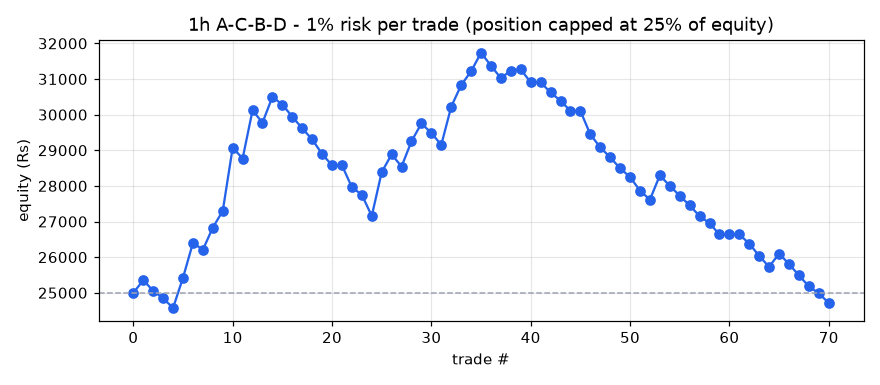
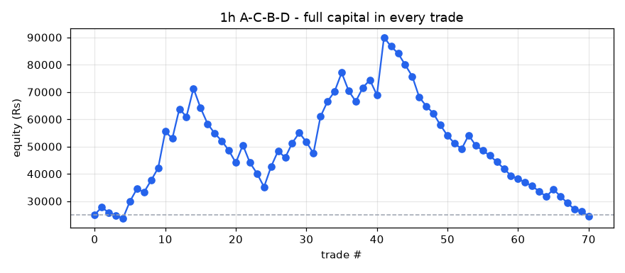

# A-C-B-D backtest report - 1h timeframe

- Stocks scanned: **567** (5 skipped with fewer than 400 candles)
- Data: **26-Oct-2023 09:15 to 01-Oct-2026 15:15, 2,579,969 candles**
- Costs: 0.35% (overnight) / 0.15% (same-day) round trip, plus Rs 15 / Rs 47 flat charges per trade
- Entry at the close of the breakout candle; exit on the first close above the 1.618 target or below the D low.

## Profit / loss: 1% risk per trade (position capped at 25% of equity)

**Rs 25,000 -> Rs 24,714 = LOSS of Rs 286 (-1.14%)**

Trades 65, winners 20, charges paid Rs 2,155, max drawdown -22.13%

| symbol | entry | exit_date | status | qty | position_rs | net_return_pct | charges_rs | pnl_rs | equity_rs |
|---|---|---|---|---|---|---|---|---|---|
| NYKAA | 21-Mar-2024 09:15 | 08-Apr-2024 10:15 | TARGET HIT | 20 | 3165 | 11.59 | 26 | 352 | 25352 |
| LICI | 23-Apr-2024 09:15 | 07-May-2024 10:15 | STOPPED | 7 | 3503 | -8.0 | 27 | -295 | 25057 |
| GNA | 22-Apr-2024 09:15 | 10-May-2024 15:15 | STOPPED | 15 | 6137 | -3.25 | 36 | -214 | 24842 |
| MTARTECH | 23-Apr-2024 12:15 | 13-May-2024 09:15 | STOPPED | 3 | 5530 | -4.54 | 34 | -266 | 24576 |
| ENGINERSIN | 24-Apr-2024 15:15 | 21-May-2024 09:15 | TARGET HIT | 15 | 3238 | 26.61 | 26 | 847 | 25423 |
| GLAXO | 16-May-2024 12:15 | 22-May-2024 12:15 | TARGET HIT | 3 | 6112 | 16.25 | 36 | 978 | 26401 |
| CRAFTSMAN | 14-May-2024 10:15 | 28-May-2024 11:15 | STOPPED | 1 | 4423 | -4.0 | 30 | -192 | 26209 |
| UPL | 10-May-2024 13:15 | 11-Jun-2024 15:15 | TARGET HIT | 10 | 4892 | 13.0 | 32 | 621 | 26830 |
| DCMSHRIRAM | 26-Apr-2024 10:15 | 14-Jun-2024 09:15 | TARGET HIT | 4 | 3860 | 12.48 | 29 | 467 | 27297 |
| NBCC | 19-Apr-2024 13:15 | 20-Jun-2024 09:15 | TARGET HIT | 68 | 5667 | 31.61 | 35 | 1776 | 29073 |
| CLEAN | 26-Sep-2024 14:15 | 07-Oct-2024 10:15 | STOPPED | 4 | 6240 | -4.64 | 37 | -305 | 28769 |
| USHAMART | 20-Sep-2024 09:15 | 11-Oct-2024 10:15 | TARGET HIT | 19 | 6656 | 20.55 | 38 | 1353 | 30121 |
| EXIDEIND | 08-Oct-2024 10:15 | 22-Oct-2024 11:15 | STOPPED | 15 | 7374 | -4.5 | 41 | -347 | 29774 |
| CRISIL | 29-Jul-2024 09:15 | 24-Oct-2024 12:15 | TARGET HIT | 1 | 4320 | 17.13 | 30 | 725 | 30500 |
| BEML | 30-Oct-2024 11:15 | 19-Nov-2024 15:15 | STOPPED | 1 | 2033 | -9.97 | 22 | -218 | 30282 |
| KIRLOSENG | 14-Nov-2024 12:15 | 21-Nov-2024 09:15 | STOPPED | 3 | 3538 | -9.14 | 27 | -338 | 29943 |
| GAIL | 24-Dec-2024 09:15 | 30-Dec-2024 14:15 | STOPPED | 26 | 5196 | -6.01 | 33 | -327 | 29616 |
| ANURAS | 14-Nov-2024 14:15 | 08-Jan-2025 15:15 | STOPPED | 8 | 5883 | -5.03 | 36 | -311 | 29305 |
| KPITTECH | 30-Dec-2024 14:15 | 10-Jan-2025 09:15 | STOPPED | 4 | 5887 | -6.7 | 36 | -409 | 28896 |
| BEL | 25-Nov-2024 09:15 | 13-Jan-2025 09:15 | STOPPED | 11 | 3242 | -9.36 | 26 | -318 | 28577 |
| FORCEMOT | 03-Mar-2025 12:15 | 10-Mar-2025 10:15 | SKIPPED (price above position size) | 0 | 0 | 15.75 | 0 | 0 | 28577 |
| JUBLINGREA | 03-Apr-2025 09:15 | 07-Apr-2025 09:15 | STOPPED | 7 | 4694 | -12.8 | 31 | -616 | 27962 |
| LUPIN | 03-Apr-2025 09:15 | 07-Apr-2025 09:15 | STOPPED | 1 | 2100 | -9.31 | 22 | -210 | 27751 |
| RAILTEL | 03-Apr-2025 10:15 | 07-Apr-2025 09:15 | STOPPED | 15 | 4681 | -12.38 | 31 | -594 | 27157 |
| CEATLTD | 08-Apr-2025 09:15 | 30-Apr-2025 12:15 | TARGET HIT | 2 | 5419 | 22.92 | 34 | 1227 | 28384 |
| CIEINDIA | 12-May-2025 09:15 | 11-Jun-2025 10:15 | TARGET HIT | 9 | 3780 | 13.66 | 28 | 501 | 28885 |
| BATAINDIA | 21-May-2025 09:15 | 04-Aug-2025 09:15 | STOPPED | 5 | 6210 | -5.25 | 37 | -341 | 28544 |
| SBIN | 08-Apr-2025 09:15 | 17-Sep-2025 14:15 | TARGET HIT | 8 | 6113 | 11.83 | 36 | 708 | 29252 |
| M&MFIN | 04-Sep-2025 09:15 | 18-Sep-2025 09:15 | TARGET HIT | 27 | 7120 | 7.27 | 40 | 503 | 29755 |
| POLYMED | 18-Sep-2025 09:15 | 23-Sep-2025 09:15 | STOPPED | 2 | 4118 | -6.27 | 29 | -273 | 29482 |
| VGUARD | 25-Sep-2025 09:15 | 26-Sep-2025 11:15 | STOPPED | 10 | 3889 | -8.03 | 29 | -327 | 29154 |
| SAMMAANCAP | 12-May-2025 09:15 | 29-Sep-2025 13:15 | TARGET HIT | 32 | 3827 | 28.34 | 28 | 1070 | 30224 |
| ASTERDM | 01-Sep-2025 09:15 | 06-Oct-2025 11:15 | TARGET HIT | 11 | 6726 | 9.22 | 39 | 605 | 30829 |
| KOTAKBANK | 01-Oct-2025 09:15 | 06-Oct-2025 12:15 | TARGET HIT | 18 | 7308 | 5.51 | 41 | 388 | 31217 |
| IDBI | 10-Oct-2025 09:15 | 28-Oct-2025 13:15 | TARGET HIT | 58 | 5447 | 9.85 | 34 | 522 | 31738 |
| SJVN | 12-May-2025 09:15 | 06-Nov-2025 09:15 | STOPPED | 43 | 4035 | -8.65 | 29 | -364 | 31374 |
| RECLTD | 01-Oct-2025 09:15 | 06-Nov-2025 11:15 | STOPPED | 16 | 6138 | -5.47 | 36 | -351 | 31024 |
| INDUSTOWER | 27-Oct-2025 11:15 | 12-Nov-2025 11:15 | TARGET HIT | 8 | 3010 | 7.62 | 26 | 214 | 31238 |
| NH | 17-Nov-2025 09:15 | 17-Nov-2025 14:15 | TARGET HIT | 1 | 1922 | 4.07 | 50 | 31 | 31269 |
| MMTC | 03-Oct-2025 10:15 | 19-Nov-2025 09:15 | STOPPED | 68 | 4679 | -7.44 | 31 | -363 | 30906 |
| GRWRHITECH | 16-Oct-2025 09:15 | 20-Nov-2025 09:15 | SKIPPED (price above position size) | 0 | 0 | 31.26 | 0 | 0 | 30906 |
| LICI | 28-Oct-2025 09:15 | 01-Dec-2025 14:15 | STOPPED | 16 | 7308 | -3.66 | 41 | -282 | 30623 |
| OIL | 23-Oct-2025 09:15 | 08-Dec-2025 12:15 | STOPPED | 18 | 7467 | -2.93 | 41 | -234 | 30390 |
| PRUDENT | 05-Jan-2026 09:15 | 09-Jan-2026 13:15 | STOPPED | 2 | 5275 | -5.1 | 33 | -284 | 30106 |
| APARINDS | 03-Oct-2025 09:15 | 12-Jan-2026 09:15 | SKIPPED (price above position size) | 0 | 0 | -5.57 | 0 | 0 | 30106 |
| JKLAKSHMI | 22-Jan-2026 10:15 | 04-Feb-2026 09:15 | STOPPED | 8 | 6376 | -10.11 | 37 | -660 | 29446 |
| HINDUNILVR | 05-Feb-2026 09:15 | 13-Feb-2026 14:15 | STOPPED | 3 | 7226 | -4.83 | 40 | -364 | 29082 |
| DALBHARAT | 13-Jan-2026 09:15 | 27-Feb-2026 09:15 | STOPPED | 3 | 6302 | -4.22 | 37 | -281 | 28801 |
| GOODLUCK | 16-Feb-2026 09:15 | 05-Mar-2026 11:15 | STOPPED | 11 | 4220 | -6.9 | 30 | -306 | 28495 |
| GODREJPROP | 05-Mar-2026 14:15 | 09-Mar-2026 09:15 | STOPPED | 2 | 3490 | -6.64 | 27 | -247 | 28248 |
| STARHEALTH | 25-Feb-2026 09:15 | 09-Mar-2026 09:15 | STOPPED | 15 | 7012 | -5.21 | 40 | -380 | 27868 |
| TRAVELFOOD | 05-Mar-2026 09:15 | 09-Mar-2026 10:15 | STOPPED | 5 | 5900 | -4.05 | 36 | -254 | 27614 |
| TATAPOWER | 05-Mar-2026 09:15 | 20-Mar-2026 09:15 | TARGET HIT | 18 | 6751 | 10.33 | 39 | 682 | 28296 |
| WELCORP | 26-Feb-2026 09:15 | 23-Mar-2026 10:15 | STOPPED | 5 | 4101 | -6.81 | 29 | -294 | 28002 |
| CANBK | 04-May-2026 09:15 | 11-May-2026 09:15 | STOPPED | 51 | 6987 | -3.75 | 39 | -277 | 27725 |
| IEX | 27-Apr-2026 12:15 | 18-May-2026 09:15 | STOPPED | 54 | 6828 | -3.76 | 39 | -272 | 27453 |
| UNOMINDA | 06-May-2026 13:15 | 18-May-2026 14:15 | STOPPED | 5 | 5600 | -5.11 | 35 | -301 | 27152 |
| M&M | 29-Apr-2026 09:15 | 01-Jun-2026 09:15 | STOPPED | 1 | 3176 | -5.77 | 26 | -198 | 26954 |
| ABFRL | 21-May-2026 09:15 | 03-Jun-2026 10:15 | STOPPED | 76 | 4869 | -6.22 | 32 | -318 | 26636 |
| SHREECEM | 04-May-2026 09:15 | 08-Jun-2026 09:15 | SKIPPED (price above position size) | 0 | 0 | -4.25 | 0 | 0 | 26636 |
| AMBER | 07-Jul-2026 11:15 | 23-Jul-2026 12:15 | SKIPPED (price above position size) | 0 | 0 | -4.45 | 0 | 0 | 26636 |
| JMFINANCIL | 15-Jul-2026 09:15 | 23-Jul-2026 14:15 | STOPPED | 52 | 6579 | -3.66 | 38 | -256 | 26380 |
| UPL | 03-Aug-2026 09:15 | 04-Aug-2026 09:15 | STOPPED | 10 | 6193 | -5.35 | 37 | -346 | 26034 |
| BLUESTARCO | 27-Jul-2026 09:15 | 06-Aug-2026 14:15 | STOPPED | 3 | 4990 | -5.83 | 32 | -306 | 25728 |
| GLENMARK | 29-Jul-2026 12:15 | 27-Aug-2026 09:15 | TARGET HIT | 2 | 4516 | 8.58 | 31 | 372 | 26100 |
| AWL | 25-Aug-2026 10:15 | 04-Sep-2026 13:15 | STOPPED | 19 | 3821 | -7.29 | 28 | -294 | 25807 |
| NCC | 07-Sep-2026 13:15 | 11-Sep-2026 09:15 | STOPPED | 25 | 3800 | -7.98 | 28 | -318 | 25489 |
| NCC | 21-Aug-2026 09:15 | 15-Sep-2026 14:15 | STOPPED | 26 | 3842 | -7.65 | 28 | -309 | 25180 |
| KPRMILL | 15-Sep-2026 09:15 | 16-Sep-2026 09:15 | STOPPED | 5 | 5633 | -3.17 | 35 | -194 | 24986 |
| SONATSOFTW | 19-May-2026 09:15 | 01-Oct-2026 12:15 | STOPPED | 15 | 4028 | -6.38 | 29 | -272 | 24714 |

## Profit / loss: full capital in every trade

**Rs 25,000 -> Rs 24,519 = LOSS of Rs 481 (-1.92%)**

Trades 70, winners 22, charges paid Rs 13,114, max drawdown -72.76%

| symbol | entry | exit_date | status | qty | position_rs | net_return_pct | charges_rs | pnl_rs | equity_rs |
|---|---|---|---|---|---|---|---|---|---|
| NYKAA | 21-Mar-2024 09:15 | 08-Apr-2024 10:15 | TARGET HIT | 157 | 24845 | 11.59 | 102 | 2865 | 27865 |
| LICI | 23-Apr-2024 09:15 | 07-May-2024 10:15 | STOPPED | 55 | 27525 | -8.0 | 111 | -2217 | 25648 |
| GNA | 22-Apr-2024 09:15 | 10-May-2024 15:15 | STOPPED | 62 | 25367 | -3.25 | 104 | -839 | 24808 |
| MTARTECH | 23-Apr-2024 12:15 | 13-May-2024 09:15 | STOPPED | 13 | 23962 | -4.54 | 99 | -1103 | 23705 |
| ENGINERSIN | 24-Apr-2024 15:15 | 21-May-2024 09:15 | TARGET HIT | 109 | 23533 | 26.61 | 97 | 6247 | 29952 |
| GLAXO | 16-May-2024 12:15 | 22-May-2024 12:15 | TARGET HIT | 14 | 28524 | 16.25 | 115 | 4620 | 34573 |
| CRAFTSMAN | 14-May-2024 10:15 | 28-May-2024 11:15 | STOPPED | 7 | 30960 | -4.0 | 123 | -1253 | 33319 |
| UPL | 10-May-2024 13:15 | 11-Jun-2024 15:15 | TARGET HIT | 68 | 33266 | 13.0 | 131 | 4310 | 37629 |
| DCMSHRIRAM | 26-Apr-2024 10:15 | 14-Jun-2024 09:15 | TARGET HIT | 38 | 36672 | 12.48 | 143 | 4562 | 42190 |
| NBCC | 19-Apr-2024 13:15 | 20-Jun-2024 09:15 | TARGET HIT | 506 | 42167 | 31.61 | 163 | 13314 | 55504 |
| CLEAN | 26-Sep-2024 14:15 | 07-Oct-2024 10:15 | STOPPED | 35 | 54600 | -4.64 | 206 | -2548 | 52956 |
| USHAMART | 20-Sep-2024 09:15 | 11-Oct-2024 10:15 | TARGET HIT | 151 | 52895 | 20.55 | 200 | 10855 | 63811 |
| EXIDEIND | 08-Oct-2024 10:15 | 22-Oct-2024 11:15 | STOPPED | 129 | 63416 | -4.5 | 237 | -2869 | 60942 |
| CRISIL | 29-Jul-2024 09:15 | 24-Oct-2024 12:15 | TARGET HIT | 14 | 60481 | 17.13 | 227 | 10345 | 71287 |
| BEML | 30-Oct-2024 11:15 | 19-Nov-2024 15:15 | STOPPED | 35 | 71140 | -9.97 | 264 | -7108 | 64180 |
| KIRLOSENG | 14-Nov-2024 12:15 | 21-Nov-2024 09:15 | STOPPED | 54 | 63685 | -9.14 | 238 | -5836 | 58344 |
| GAIL | 24-Dec-2024 09:15 | 30-Dec-2024 14:15 | STOPPED | 291 | 58153 | -6.01 | 219 | -3510 | 54834 |
| ANURAS | 14-Nov-2024 14:15 | 08-Jan-2025 15:15 | STOPPED | 74 | 54420 | -5.03 | 205 | -2752 | 52082 |
| KPITTECH | 30-Dec-2024 14:15 | 10-Jan-2025 09:15 | STOPPED | 35 | 51511 | -6.7 | 195 | -3466 | 48615 |
| BEL | 25-Nov-2024 09:15 | 13-Jan-2025 09:15 | STOPPED | 164 | 48339 | -9.36 | 184 | -4540 | 44076 |
| FORCEMOT | 03-Mar-2025 12:15 | 10-Mar-2025 10:15 | TARGET HIT | 6 | 41148 | 15.75 | 159 | 6466 | 50542 |
| JUBLINGREA | 03-Apr-2025 09:15 | 07-Apr-2025 09:15 | STOPPED | 75 | 50288 | -12.8 | 191 | -6452 | 44090 |
| LUPIN | 03-Apr-2025 09:15 | 07-Apr-2025 09:15 | STOPPED | 20 | 41994 | -9.31 | 162 | -3925 | 40165 |
| RAILTEL | 03-Apr-2025 10:15 | 07-Apr-2025 09:15 | STOPPED | 128 | 39942 | -12.38 | 155 | -4960 | 35205 |
| CEATLTD | 08-Apr-2025 09:15 | 30-Apr-2025 12:15 | TARGET HIT | 12 | 32512 | 22.92 | 129 | 7437 | 42642 |
| CIEINDIA | 12-May-2025 09:15 | 11-Jun-2025 10:15 | TARGET HIT | 101 | 42420 | 13.66 | 163 | 5780 | 48422 |
| BATAINDIA | 21-May-2025 09:15 | 04-Aug-2025 09:15 | STOPPED | 38 | 47192 | -5.25 | 180 | -2493 | 45929 |
| SBIN | 08-Apr-2025 09:15 | 17-Sep-2025 14:15 | TARGET HIT | 60 | 45849 | 11.83 | 175 | 5409 | 51338 |
| M&MFIN | 04-Sep-2025 09:15 | 18-Sep-2025 09:15 | TARGET HIT | 194 | 51158 | 7.27 | 194 | 3704 | 55042 |
| POLYMED | 18-Sep-2025 09:15 | 23-Sep-2025 09:15 | STOPPED | 26 | 53539 | -6.27 | 202 | -3372 | 51670 |
| VGUARD | 25-Sep-2025 09:15 | 26-Sep-2025 11:15 | STOPPED | 132 | 51335 | -8.03 | 195 | -4137 | 47533 |
| SAMMAANCAP | 12-May-2025 09:15 | 29-Sep-2025 13:15 | TARGET HIT | 397 | 47481 | 28.34 | 181 | 13441 | 60974 |
| ASTERDM | 01-Sep-2025 09:15 | 06-Oct-2025 11:15 | TARGET HIT | 99 | 60538 | 9.22 | 227 | 5567 | 66541 |
| KOTAKBANK | 01-Oct-2025 09:15 | 06-Oct-2025 12:15 | TARGET HIT | 163 | 66178 | 5.51 | 247 | 3631 | 70172 |
| IDBI | 10-Oct-2025 09:15 | 28-Oct-2025 13:15 | TARGET HIT | 747 | 70151 | 9.85 | 261 | 6895 | 77067 |
| SJVN | 12-May-2025 09:15 | 06-Nov-2025 09:15 | STOPPED | 821 | 77043 | -8.65 | 285 | -6679 | 70388 |
| RECLTD | 01-Oct-2025 09:15 | 06-Nov-2025 11:15 | STOPPED | 183 | 70199 | -5.47 | 261 | -3855 | 66533 |
| INDUSTOWER | 27-Oct-2025 11:15 | 12-Nov-2025 11:15 | TARGET HIT | 176 | 66211 | 7.62 | 247 | 5030 | 71563 |
| NH | 17-Nov-2025 09:15 | 17-Nov-2025 14:15 | TARGET HIT | 37 | 71110 | 4.07 | 154 | 2847 | 74411 |
| MMTC | 03-Oct-2025 10:15 | 19-Nov-2025 09:15 | STOPPED | 1081 | 74384 | -7.44 | 275 | -5549 | 68862 |
| GRWRHITECH | 16-Oct-2025 09:15 | 20-Nov-2025 09:15 | TARGET HIT | 21 | 67662 | 31.26 | 252 | 21136 | 89998 |
| LICI | 28-Oct-2025 09:15 | 01-Dec-2025 14:15 | STOPPED | 197 | 89985 | -3.66 | 330 | -3308 | 86689 |
| OIL | 23-Oct-2025 09:15 | 08-Dec-2025 12:15 | STOPPED | 208 | 86289 | -2.93 | 317 | -2543 | 84146 |
| PRUDENT | 05-Jan-2026 09:15 | 09-Jan-2026 13:15 | STOPPED | 31 | 81762 | -5.1 | 301 | -4185 | 79961 |
| APARINDS | 03-Oct-2025 09:15 | 12-Jan-2026 09:15 | STOPPED | 9 | 75132 | -5.57 | 278 | -4200 | 75761 |
| JKLAKSHMI | 22-Jan-2026 10:15 | 04-Feb-2026 09:15 | STOPPED | 95 | 75710 | -10.11 | 280 | -7669 | 68092 |
| HINDUNILVR | 05-Feb-2026 09:15 | 13-Feb-2026 14:15 | STOPPED | 28 | 67446 | -4.83 | 251 | -3273 | 64819 |
| DALBHARAT | 13-Jan-2026 09:15 | 27-Feb-2026 09:15 | STOPPED | 30 | 63024 | -4.22 | 236 | -2675 | 62145 |
| GOODLUCK | 16-Feb-2026 09:15 | 05-Mar-2026 11:15 | STOPPED | 162 | 62143 | -6.9 | 233 | -4303 | 57842 |
| GODREJPROP | 05-Mar-2026 14:15 | 09-Mar-2026 09:15 | STOPPED | 33 | 57585 | -6.64 | 217 | -3839 | 54003 |
| STARHEALTH | 25-Feb-2026 09:15 | 09-Mar-2026 09:15 | STOPPED | 115 | 53762 | -5.21 | 203 | -2816 | 51187 |
| TRAVELFOOD | 05-Mar-2026 09:15 | 09-Mar-2026 10:15 | STOPPED | 43 | 50740 | -4.05 | 193 | -2070 | 49117 |
| TATAPOWER | 05-Mar-2026 09:15 | 20-Mar-2026 09:15 | TARGET HIT | 130 | 48756 | 10.33 | 186 | 5022 | 54139 |
| WELCORP | 26-Feb-2026 09:15 | 23-Mar-2026 10:15 | STOPPED | 66 | 54133 | -6.81 | 204 | -3701 | 50437 |
| CANBK | 04-May-2026 09:15 | 11-May-2026 09:15 | STOPPED | 368 | 50416 | -3.75 | 191 | -1906 | 48532 |
| IEX | 27-Apr-2026 12:15 | 18-May-2026 09:15 | STOPPED | 383 | 48427 | -3.76 | 184 | -1836 | 46696 |
| UNOMINDA | 06-May-2026 13:15 | 18-May-2026 14:15 | STOPPED | 41 | 45920 | -5.11 | 176 | -2362 | 44334 |
| M&M | 29-Apr-2026 09:15 | 01-Jun-2026 09:15 | STOPPED | 13 | 41282 | -5.77 | 159 | -2397 | 41937 |
| ABFRL | 21-May-2026 09:15 | 03-Jun-2026 10:15 | STOPPED | 654 | 41895 | -6.22 | 162 | -2621 | 39316 |
| SHREECEM | 04-May-2026 09:15 | 08-Jun-2026 09:15 | STOPPED | 1 | 24745 | -4.25 | 102 | -1067 | 38250 |
| AMBER | 07-Jul-2026 11:15 | 23-Jul-2026 12:15 | STOPPED | 4 | 30760 | -4.45 | 123 | -1384 | 36866 |
| JMFINANCIL | 15-Jul-2026 09:15 | 23-Jul-2026 14:15 | STOPPED | 291 | 36817 | -3.66 | 144 | -1363 | 35503 |
| UPL | 03-Aug-2026 09:15 | 04-Aug-2026 09:15 | STOPPED | 57 | 35300 | -5.35 | 139 | -1904 | 33600 |
| BLUESTARCO | 27-Jul-2026 09:15 | 06-Aug-2026 14:15 | STOPPED | 20 | 33268 | -5.83 | 131 | -1955 | 31645 |
| GLENMARK | 29-Jul-2026 12:15 | 27-Aug-2026 09:15 | TARGET HIT | 14 | 31612 | 8.58 | 126 | 2697 | 34343 |
| AWL | 25-Aug-2026 10:15 | 04-Sep-2026 13:15 | STOPPED | 170 | 34192 | -7.29 | 135 | -2508 | 31835 |
| NCC | 07-Sep-2026 13:15 | 11-Sep-2026 09:15 | STOPPED | 209 | 31768 | -7.98 | 126 | -2550 | 29285 |
| NCC | 21-Aug-2026 09:15 | 15-Sep-2026 14:15 | STOPPED | 198 | 29254 | -7.65 | 117 | -2253 | 27032 |
| KPRMILL | 15-Sep-2026 09:15 | 16-Sep-2026 09:15 | STOPPED | 23 | 25912 | -3.17 | 106 | -836 | 26196 |
| SONATSOFTW | 19-May-2026 09:15 | 01-Oct-2026 12:15 | STOPPED | 97 | 26044 | -6.38 | 106 | -1677 | 24519 |

## Trade statistics (after costs)

| period | setups_entered | target_hit | stopped | open | win_rate_pct | avg_gross_pct | avg_net_pct | avg_win_pct | avg_loss_pct | avg_r | profit_factor | avg_hold_candles |
|---|---|---|---|---|---|---|---|---|---|---|---|---|
| 2024 | 20 | 8 | 12 | 0 | 40.0 | 4.05 | 3.7 | 18.65 | -6.26 | 0.74 | 1.99 | 125.0 |
| 2025 | 24 | 12 | 12 | 0 | 50.0 | 3.66 | 3.31 | 13.94 | -7.31 | 0.51 | 1.91 | 201.4 |
| 2026 | 26 | 2 | 24 | 0 | 7.7 | -4.1 | -4.45 | 9.46 | -5.6 | -0.95 | 0.14 | 94.1 |
| ALL | 70 | 22 | 48 | 0 | 31.4 | 0.89 | 0.54 | 15.25 | -6.2 | 0.04 | 1.13 | 139.7 |

## Trades entered

| symbol | D | entry | entry_close | stop | target | status | exit_date | return_pct | net_return_pct | hold_candles |
|---|---|---|---|---|---|---|---|---|---|---|
| NYKAA | 14-Mar-2024 09:15 | 21-Mar-2024 09:15 | 158.25 | 145.8000030517578 | 176.89 | TARGET HIT | 08-Apr-2024 10:15 | 11.94 | 11.59 | 71.0 |
| LICI | 15-Apr-2024 09:15 | 23-Apr-2024 09:15 | 500.4500122070313 | 466.0249938964844 | 554.67 | STOPPED | 07-May-2024 10:15 | -7.65 | -8.0 | 64.0 |
| ENGINERSIN | 19-Apr-2024 09:15 | 24-Apr-2024 15:15 | 215.8999938964844 | 200.1000061035156 | 270.74 | TARGET HIT | 21-May-2024 09:15 | 26.96 | 26.61 | 113.0 |
| GNA | 19-Apr-2024 09:15 | 22-Apr-2024 09:15 | 409.1499938964844 | 397.5499877929688 | 455.73 | STOPPED | 10-May-2024 15:15 | -2.9 | -3.25 | 97.0 |
| NBCC | 19-Apr-2024 09:15 | 19-Apr-2024 13:15 | 83.33333587646484 | 79.33333587646484 | 109.33 | TARGET HIT | 20-Jun-2024 09:15 | 31.96 | 31.61 | 283.0 |
| MTARTECH | 19-Apr-2024 15:15 | 23-Apr-2024 12:15 | 1843.25 | 1769.5 | 2221.62 | STOPPED | 13-May-2024 09:15 | -4.19 | -4.54 | 88.0 |
| DCMSHRIRAM | 25-Apr-2024 13:15 | 26-Apr-2024 10:15 | 965.0499877929688 | 900.5 | 1077.76 | TARGET HIT | 14-Jun-2024 09:15 | 12.83 | 12.48 | 230.0 |
| CRAFTSMAN | 08-May-2024 09:15 | 14-May-2024 10:15 | 4422.7998046875 | 4261.39990234375 | 5340.75 | STOPPED | 28-May-2024 11:15 | -3.65 | -4.0 | 64.0 |
| UPL | 09-May-2024 15:15 | 10-May-2024 13:15 | 489.2000122070313 | 464.5 | 554.41 | TARGET HIT | 11-Jun-2024 15:15 | 13.35 | 13.0 | 149.0 |
| GLAXO | 10-May-2024 14:15 | 16-May-2024 12:15 | 2037.449951171875 | 1965.0 | 2363.41 | TARGET HIT | 22-May-2024 12:15 | 16.6 | 16.25 | 21.0 |
| CRISIL | 23-Jul-2024 12:15 | 29-Jul-2024 09:15 | 4320.0498046875 | 4134.7998046875 | 5038.43 | TARGET HIT | 24-Oct-2024 12:15 | 17.48 | 17.13 | 430.0 |
| USHAMART | 19-Sep-2024 11:15 | 20-Sep-2024 09:15 | 350.29998779296875 | 335.20001220703125 | 404.56 | TARGET HIT | 11-Oct-2024 10:15 | 20.9 | 20.55 | 99.0 |
| CLEAN | 25-Sep-2024 09:15 | 26-Sep-2024 14:15 | 1560.0 | 1513.449951171875 | 1684.53 | STOPPED | 07-Oct-2024 10:15 | -4.29 | -4.64 | 38.0 |
| EXIDEIND | 07-Oct-2024 10:15 | 08-Oct-2024 10:15 | 491.6000061035156 | 474.2999877929688 | 553.38 | STOPPED | 22-Oct-2024 11:15 | -4.15 | -4.5 | 71.0 |
| BEML | 25-Oct-2024 14:15 | 30-Oct-2024 11:15 | 2032.574951171875 | 1842.074951171875 | 2289.68 | STOPPED | 19-Nov-2024 15:15 | -9.62 | -9.97 | 88.0 |
| ANURAS | 13-Nov-2024 10:15 | 14-Nov-2024 14:15 | 735.4000244140625 | 702.4000244140625 | 788.03 | STOPPED | 08-Jan-2025 15:15 | -4.68 | -5.03 | 253.0 |
| KIRLOSENG | 13-Nov-2024 15:15 | 14-Nov-2024 12:15 | 1179.3499755859375 | 1092.5 | 1333.81 | STOPPED | 21-Nov-2024 09:15 | -8.79 | -9.14 | 18.0 |
| BEL | 21-Nov-2024 09:15 | 25-Nov-2024 09:15 | 294.75 | 270.25 | 333.55 | STOPPED | 13-Jan-2025 09:15 | -9.01 | -9.36 | 238.0 |
| GAIL | 19-Dec-2024 09:15 | 24-Dec-2024 09:15 | 199.83999633789065 | 188.75 | 233.77 | STOPPED | 30-Dec-2024 14:15 | -5.66 | -6.01 | 26.0 |
| KPITTECH | 23-Dec-2024 13:15 | 30-Dec-2024 14:15 | 1471.75 | 1408.9000244140625 | 1736.05 | STOPPED | 10-Jan-2025 09:15 | -6.35 | -6.7 | 58.0 |
| FORCEMOT | 28-Feb-2025 09:15 | 03-Mar-2025 12:15 | 6858.0 | 6472.0498046875 | 7669.73 | TARGET HIT | 10-Mar-2025 10:15 | 16.1 | 15.75 | 33.0 |
| JUBLINGREA | 01-Apr-2025 09:15 | 03-Apr-2025 09:15 | 670.5 | 631.0 | 824.36 | STOPPED | 07-Apr-2025 09:15 | -12.45 | -12.8 | 14.0 |
| LUPIN | 02-Apr-2025 09:15 | 03-Apr-2025 09:15 | 2099.699951171875 | 1938.550048828125 | 2304.9 | STOPPED | 07-Apr-2025 09:15 | -8.96 | -9.31 | 14.0 |
| RAILTEL | 02-Apr-2025 09:15 | 03-Apr-2025 10:15 | 312.04998779296875 | 294.6000061035156 | 385.04 | STOPPED | 07-Apr-2025 09:15 | -12.03 | -12.38 | 13.0 |
| CEATLTD | 07-Apr-2025 09:15 | 08-Apr-2025 09:15 | 2709.35009765625 | 2590.14990234375 | 3331.21 | TARGET HIT | 30-Apr-2025 12:15 | 23.27 | 22.92 | 94.0 |
| SBIN | 07-Apr-2025 12:15 | 08-Apr-2025 09:15 | 764.1500244140625 | 731.0999755859375 | 851.51 | TARGET HIT | 17-Sep-2025 14:15 | 12.18 | 11.83 | 775.0 |
| CIEINDIA | 02-May-2025 09:15 | 12-May-2025 09:15 | 420.0 | 390.7000122070313 | 473.41 | TARGET HIT | 11-Jun-2025 10:15 | 14.01 | 13.66 | 155.0 |
| BATAINDIA | 09-May-2025 09:15 | 21-May-2025 09:15 | 1241.9000244140625 | 1185.0 | 1319.89 | STOPPED | 04-Aug-2025 09:15 | -4.9 | -5.25 | 371.0 |
| SAMMAANCAP | 09-May-2025 09:15 | 12-May-2025 09:15 | 119.5999984741211 | 110.66999816894533 | 153.25 | TARGET HIT | 29-Sep-2025 13:15 | 28.69 | 28.34 | 689.0 |
| SJVN | 09-May-2025 10:15 | 12-May-2025 09:15 | 93.83999633789062 | 86.5199966430664 | 114.85 | STOPPED | 06-Nov-2025 09:15 | -8.3 | -8.65 | 855.0 |
| ASTERDM | 29-Aug-2025 09:15 | 01-Sep-2025 09:15 | 611.5 | 585.8499755859375 | 663.26 | TARGET HIT | 06-Oct-2025 11:15 | 9.57 | 9.22 | 168.0 |
| M&MFIN | 29-Aug-2025 14:15 | 04-Sep-2025 09:15 | 263.70001220703125 | 253.5500030517578 | 283.0 | TARGET HIT | 18-Sep-2025 09:15 | 7.62 | 7.27 | 66.0 |
| POLYMED | 10-Sep-2025 13:15 | 18-Sep-2025 09:15 | 2059.199951171875 | 1939.300048828125 | 2344.76 | STOPPED | 23-Sep-2025 09:15 | -5.92 | -6.27 | 21.0 |
| VGUARD | 24-Sep-2025 12:15 | 25-Sep-2025 09:15 | 388.8999938964844 | 361.1000061035156 | 400.41 | STOPPED | 26-Sep-2025 11:15 | -7.68 | -8.03 | 9.0 |
| RECLTD | 26-Sep-2025 14:15 | 01-Oct-2025 09:15 | 383.6000061035156 | 365.0499877929688 | 416.39 | STOPPED | 06-Nov-2025 11:15 | -5.12 | -5.47 | 158.0 |
| KOTAKBANK | 29-Sep-2025 11:15 | 01-Oct-2025 09:15 | 406.0 | 394.05999755859375 | 428.3 | TARGET HIT | 06-Oct-2025 12:15 | 5.86 | 5.51 | 17.0 |
| IDBI | 29-Sep-2025 12:15 | 10-Oct-2025 09:15 | 93.91000366210938 | 88.58999633789062 | 103.47 | TARGET HIT | 28-Oct-2025 13:15 | 10.2 | 9.85 | 76.0 |
| APARINDS | 30-Sep-2025 13:15 | 03-Oct-2025 09:15 | 8348.0 | 8054.5 | 9789.93 | STOPPED | 12-Jan-2026 09:15 | -5.22 | -5.57 | 471.0 |
| MMTC | 30-Sep-2025 14:15 | 03-Oct-2025 10:15 | 68.80999755859375 | 64.25 | 82.17 | STOPPED | 19-Nov-2025 09:15 | -7.09 | -7.44 | 211.0 |
| GRWRHITECH | 09-Oct-2025 13:15 | 16-Oct-2025 09:15 | 3222.0 | 2908.0 | 4129.37 | TARGET HIT | 20-Nov-2025 09:15 | 31.61 | 31.26 | 156.0 |
| INDUSTOWER | 14-Oct-2025 15:15 | 27-Oct-2025 11:15 | 376.2000122070313 | 337.8500061035156 | 404.75 | TARGET HIT | 12-Nov-2025 11:15 | 7.97 | 7.62 | 77.0 |
| LICI | 17-Oct-2025 13:15 | 28-Oct-2025 09:15 | 456.7749938964844 | 442.0499877929688 | 482.05 | STOPPED | 01-Dec-2025 14:15 | -3.31 | -3.66 | 166.0 |
| OIL | 20-Oct-2025 09:15 | 23-Oct-2025 09:15 | 414.8500061035156 | 405.6499938964844 | 455.47 | STOPPED | 08-Dec-2025 12:15 | -2.58 | -2.93 | 220.0 |
| NH | 12-Nov-2025 10:15 | 17-Nov-2025 09:15 | 1921.9000244140625 | 1736.0 | 1966.47 | TARGET HIT | 17-Nov-2025 14:15 | 4.22 | 4.07 | 5.0 |
| PRUDENT | 02-Jan-2026 09:15 | 05-Jan-2026 09:15 | 2637.5 | 2512.39990234375 | 2975.42 | STOPPED | 09-Jan-2026 13:15 | -4.75 | -5.1 | 32.0 |
| DALBHARAT | 12-Jan-2026 11:15 | 13-Jan-2026 09:15 | 2100.800048828125 | 2020.699951171875 | 2359.25 | STOPPED | 27-Feb-2026 09:15 | -3.87 | -4.22 | 210.0 |
| JKLAKSHMI | 21-Jan-2026 13:15 | 22-Jan-2026 10:15 | 796.9500122070312 | 759.5999755859375 | 861.73 | STOPPED | 04-Feb-2026 09:15 | -9.76 | -10.11 | 48.0 |
| HINDUNILVR | 29-Jan-2026 10:15 | 05-Feb-2026 09:15 | 2408.800048828125 | 2312.300048828125 | 2558.34 | STOPPED | 13-Feb-2026 14:15 | -4.48 | -4.83 | 47.0 |
| GOODLUCK | 12-Feb-2026 11:15 | 16-Feb-2026 09:15 | 383.6000061035156 | 358.6666564941406 | 432.47 | STOPPED | 05-Mar-2026 11:15 | -6.55 | -6.9 | 86.0 |
| STARHEALTH | 24-Feb-2026 12:15 | 25-Feb-2026 09:15 | 467.5 | 450.5499877929688 | 532.29 | STOPPED | 09-Mar-2026 09:15 | -4.86 | -5.21 | 49.0 |
| WELCORP | 24-Feb-2026 13:15 | 26-Feb-2026 09:15 | 820.2000122070312 | 770.0 | 925.12 | STOPPED | 23-Mar-2026 10:15 | -6.46 | -6.81 | 113.0 |
| TATAPOWER | 02-Mar-2026 13:15 | 05-Mar-2026 09:15 | 375.0499877929688 | 362.0 | 411.77 | TARGET HIT | 20-Mar-2026 09:15 | 10.68 | 10.33 | 77.0 |
| TRAVELFOOD | 04-Mar-2026 09:15 | 05-Mar-2026 09:15 | 1180.0 | 1137.5 | 1427.44 | STOPPED | 09-Mar-2026 10:15 | -3.7 | -4.05 | 15.0 |
| GODREJPROP | 04-Mar-2026 13:15 | 05-Mar-2026 14:15 | 1745.0 | 1647.0 | 2152.85 | STOPPED | 09-Mar-2026 09:15 | -6.29 | -6.64 | 9.0 |
| M&M | 23-Apr-2026 14:15 | 29-Apr-2026 09:15 | 3175.5 | 3032.89990234375 | 3552.31 | STOPPED | 01-Jun-2026 09:15 | -5.42 | -5.77 | 147.0 |
| IEX | 24-Apr-2026 13:15 | 27-Apr-2026 12:15 | 126.44000244140624 | 122.33999633789062 | 150.45 | STOPPED | 18-May-2026 09:15 | -3.41 | -3.76 | 95.0 |
| CANBK | 30-Apr-2026 11:15 | 04-May-2026 09:15 | 137.0 | 133.47000122070312 | 162.35 | STOPPED | 11-May-2026 09:15 | -3.4 | -3.75 | 35.0 |
| SHREECEM | 30-Apr-2026 11:15 | 04-May-2026 09:15 | 24745.0 | 23800.0 | 27947.94 | STOPPED | 08-Jun-2026 09:15 | -3.9 | -4.25 | 168.0 |
| UNOMINDA | 05-May-2026 12:15 | 06-May-2026 13:15 | 1120.0 | 1067.0 | 1269.06 | STOPPED | 18-May-2026 14:15 | -4.76 | -5.11 | 57.0 |
| ABFRL | 18-May-2026 10:15 | 21-May-2026 09:15 | 64.05999755859375 | 60.52000045776367 | 78.57 | STOPPED | 03-Jun-2026 10:15 | -5.87 | -6.22 | 57.0 |
| SONATSOFTW | 18-May-2026 10:15 | 19-May-2026 09:15 | 268.5 | 252.5 | 369.21 | STOPPED | 01-Oct-2026 12:15 | -6.03 | -6.38 | 661.0 |
| AMBER | 03-Jul-2026 09:15 | 07-Jul-2026 11:15 | 7690.0 | 7381.0 | 8897.16 | STOPPED | 23-Jul-2026 12:15 | -4.1 | -4.45 | 85.0 |
| JMFINANCIL | 14-Jul-2026 12:15 | 15-Jul-2026 09:15 | 126.5199966430664 | 122.58000183105467 | 144.63 | STOPPED | 23-Jul-2026 14:15 | -3.31 | -3.66 | 47.0 |
| GLENMARK | 22-Jul-2026 09:15 | 29-Jul-2026 12:15 | 2258.0 | 2167.0 | 2454.61 | TARGET HIT | 27-Aug-2026 09:15 | 8.93 | 8.58 | 134.0 |
| BLUESTARCO | 24-Jul-2026 09:15 | 27-Jul-2026 09:15 | 1663.4000244140625 | 1601.5 | 1915.89 | STOPPED | 06-Aug-2026 14:15 | -5.48 | -5.83 | 60.0 |
| UPL | 24-Jul-2026 09:15 | 03-Aug-2026 09:15 | 619.2999877929688 | 595.0499877929688 | 669.6 | STOPPED | 04-Aug-2026 09:15 | -5.0 | -5.35 | 7.0 |
| NCC | 18-Aug-2026 10:15 | 21-Aug-2026 09:15 | 147.75 | 138.24000549316406 | 158.58 | STOPPED | 15-Sep-2026 14:15 | -7.3 | -7.65 | 117.0 |
| AWL | 21-Aug-2026 15:15 | 25-Aug-2026 10:15 | 201.1300048828125 | 187.5800018310547 | 214.88 | STOPPED | 04-Sep-2026 13:15 | -6.94 | -7.29 | 59.0 |
| NCC | 02-Sep-2026 12:15 | 07-Sep-2026 13:15 | 152.0 | 141.85000610351562 | 165.76 | STOPPED | 11-Sep-2026 09:15 | -7.63 | -7.98 | 24.0 |
| KPRMILL | 11-Sep-2026 10:15 | 15-Sep-2026 09:15 | 1126.5999755859375 | 1100.0 | 1309.41 | STOPPED | 16-Sep-2026 09:15 | -2.82 | -3.17 | 7.0 |

## All setups found (A-C-B-D located, with why most were not traded)

| status | setups |
|---|---|
| D broken | 77 |
| STOPPED | 48 |
| TARGET HIT | 22 |
| no breakout | 16 |
| consolidation too wide | 4 |
| WATCH | 2 |

| symbol | A | C | B | D | fib_B | fib_D | status |
|---|---|---|---|---|---|---|---|
| JSWSTEEL | 28-Dec-2023 09:15 | 24-Jan-2024 09:15 | 21-Feb-2024 12:15 | 26-Feb-2024 12:15 | 0.591 | 0.336 | D broken |
| CLEAN | 01-Jan-2024 11:15 | 08-Feb-2024 15:15 | 26-Feb-2024 14:15 | 29-Feb-2024 10:15 | 0.445 | 0.285 | D broken |
| SBICARD | 18-Dec-2023 10:15 | 06-Feb-2024 09:15 | 23-Feb-2024 09:15 | 05-Mar-2024 10:15 | 0.586 | 0.242 | D broken |
| NYKAA | 10-Jan-2024 09:15 | 13-Feb-2024 09:15 | 04-Mar-2024 09:15 | 14-Mar-2024 09:15 | 0.411 | 0.254 | TARGET HIT |
| DALBHARAT | 14-Dec-2023 14:15 | 13-Mar-2024 14:15 | 04-Apr-2024 09:15 | 15-Apr-2024 09:15 | 0.408 | 0.411 | D broken |
| KPITTECH | 12-Feb-2024 09:15 | 22-Mar-2024 09:15 | 02-Apr-2024 11:15 | 15-Apr-2024 09:15 | 0.536 | 0.363 | D broken |
| LICI | 09-Feb-2024 09:15 | 20-Mar-2024 15:15 | 04-Apr-2024 09:15 | 15-Apr-2024 09:15 | 0.487 | 0.444 | STOPPED |
| PFC | 08-Feb-2024 09:15 | 20-Mar-2024 10:15 | 04-Apr-2024 09:15 | 16-Apr-2024 09:15 | 0.596 | 0.441 | no breakout |
| ENGINERSIN | 02-Feb-2024 14:15 | 20-Mar-2024 15:15 | 08-Apr-2024 09:15 | 19-Apr-2024 09:15 | 0.601 | 0.443 | TARGET HIT |
| GNA | 29-Jan-2024 11:15 | 28-Mar-2024 15:15 | 08-Apr-2024 09:15 | 19-Apr-2024 09:15 | 0.383 | 0.409 | STOPPED |
| NBCC | 05-Feb-2024 09:15 | 14-Mar-2024 09:15 | 09-Apr-2024 11:15 | 19-Apr-2024 09:15 | 0.508 | 0.382 | TARGET HIT |
| UPL | 02-Jan-2024 09:15 | 14-Mar-2024 09:15 | 12-Apr-2024 09:15 | 19-Apr-2024 09:15 | 0.399 | 0.294 | no breakout |
| CYIENT | 22-Dec-2023 09:15 | 13-Mar-2024 12:15 | 05-Apr-2024 09:15 | 19-Apr-2024 15:15 | 0.586 | 0.41 | D broken |
| MTARTECH | 19-Dec-2023 09:15 | 27-Mar-2024 15:15 | 04-Apr-2024 10:15 | 19-Apr-2024 15:15 | 0.501 | 0.304 | STOPPED |
| DCMSHRIRAM | 04-Jan-2024 15:15 | 28-Mar-2024 15:15 | 12-Apr-2024 09:15 | 25-Apr-2024 13:15 | 0.435 | 0.37 | TARGET HIT |
| CRAFTSMAN | 22-Dec-2023 12:15 | 20-Mar-2024 10:15 | 25-Apr-2024 09:15 | 08-May-2024 09:15 | 0.556 | 0.498 | STOPPED |
| UPL | 02-Jan-2024 09:15 | 14-Mar-2024 09:15 | 26-Apr-2024 11:15 | 09-May-2024 15:15 | 0.422 | 0.246 | TARGET HIT |
| SCI | 05-Feb-2024 13:15 | 20-Mar-2024 10:15 | 25-Apr-2024 09:15 | 10-May-2024 09:15 | 0.453 | 0.24 | D broken |
| GLAXO | 06-Feb-2024 09:15 | 15-Apr-2024 09:15 | 29-Apr-2024 09:15 | 10-May-2024 14:15 | 0.473 | 0.375 | TARGET HIT |
| CCL | 07-Feb-2024 15:15 | 21-May-2024 15:15 | 27-May-2024 14:15 | 31-May-2024 14:15 | 0.433 | 0.248 | D broken |
| JKLAKSHMI | 16-Feb-2024 11:15 | 13-May-2024 10:15 | 24-May-2024 09:15 | 31-May-2024 14:15 | 0.445 | 0.298 | D broken |
| CRISIL | 18-Mar-2024 14:15 | 04-Jun-2024 12:15 | 15-Jul-2024 09:15 | 23-Jul-2024 12:15 | 0.522 | 0.344 | TARGET HIT |
| JINDALSTEL | 21-Jun-2024 14:15 | 14-Aug-2024 10:15 | 26-Aug-2024 14:15 | 04-Sep-2024 09:15 | 0.456 | 0.364 | no breakout |
| BANKBARODA | 19-Jun-2024 09:15 | 05-Aug-2024 11:15 | 22-Aug-2024 10:15 | 05-Sep-2024 10:15 | 0.43 | 0.373 | D broken |
| RHIM | 30-May-2024 15:15 | 15-Jul-2024 09:15 | 16-Aug-2024 11:15 | 05-Sep-2024 10:15 | 0.555 | 0.295 | D broken |
| RELIANCE | 08-Jul-2024 12:15 | 05-Aug-2024 12:15 | 30-Aug-2024 09:15 | 06-Sep-2024 09:15 | 0.6 | 0.279 | D broken |
| SHREECEM | 23-Jul-2024 11:15 | 09-Aug-2024 13:15 | 05-Sep-2024 09:15 | 19-Sep-2024 11:15 | 0.535 | 0.346 | no breakout |
| USHAMART | 05-Jul-2024 09:15 | 19-Aug-2024 15:15 | 11-Sep-2024 09:15 | 19-Sep-2024 11:15 | 0.49 | 0.321 | TARGET HIT |
| CLEAN | 01-Aug-2024 09:15 | 02-Sep-2024 12:15 | 16-Sep-2024 09:15 | 25-Sep-2024 09:15 | 0.603 | 0.366 | STOPPED |
| ATULAUTO | 04-Jul-2024 09:15 | 14-Aug-2024 10:15 | 04-Sep-2024 10:15 | 25-Sep-2024 13:15 | 0.495 | 0.246 | D broken |
| COALINDIA | 26-Aug-2024 09:15 | 19-Sep-2024 11:15 | 27-Sep-2024 15:15 | 04-Oct-2024 09:15 | 0.616 | 0.44 | D broken |
| EXIDEIND | 09-Jul-2024 14:15 | 19-Sep-2024 12:15 | 01-Oct-2024 13:15 | 07-Oct-2024 10:15 | 0.467 | 0.328 | STOPPED |
| HONAUT | 26-Jun-2024 11:15 | 07-Oct-2024 10:15 | 21-Oct-2024 09:15 | 25-Oct-2024 12:15 | 0.399 | 0.392 | D broken |
| BEML | 12-Jul-2024 09:15 | 07-Oct-2024 14:15 | 21-Oct-2024 09:15 | 25-Oct-2024 14:15 | 0.401 | 0.358 | STOPPED |
| ANURAS | 01-Aug-2024 09:15 | 28-Oct-2024 09:15 | 07-Nov-2024 11:15 | 13-Nov-2024 10:15 | 0.484 | 0.405 | STOPPED |
| KIRLOSENG | 04-Sep-2024 09:15 | 25-Oct-2024 09:15 | 08-Nov-2024 09:15 | 13-Nov-2024 15:15 | 0.508 | 0.423 | STOPPED |
| BEML | 05-Jul-2024 09:15 | 07-Oct-2024 14:15 | 07-Nov-2024 10:15 | 18-Nov-2024 11:15 | 0.446 | 0.245 | D broken |
| BEL | 09-Jul-2024 09:15 | 25-Oct-2024 10:15 | 08-Nov-2024 09:15 | 21-Nov-2024 09:15 | 0.574 | 0.271 | STOPPED |
| NATCOPHARM | 12-Sep-2024 12:15 | 28-Oct-2024 09:15 | 07-Nov-2024 09:15 | 26-Nov-2024 11:15 | 0.492 | 0.377 | D broken |
| ABFRL | 27-Sep-2024 09:15 | 21-Nov-2024 14:15 | 02-Dec-2024 11:15 | 13-Dec-2024 10:15 | 0.516 | 0.291 | D broken |
| TATACHEM | 21-Oct-2024 10:15 | 13-Nov-2024 14:15 | 04-Dec-2024 09:15 | 13-Dec-2024 10:15 | 0.535 | 0.294 | D broken |
| TATAPOWER | 27-Sep-2024 10:15 | 13-Nov-2024 14:15 | 09-Dec-2024 09:15 | 13-Dec-2024 11:15 | 0.518 | 0.464 | D broken |
| MMTC | 19-Aug-2024 14:15 | 25-Oct-2024 10:15 | 06-Dec-2024 09:15 | 16-Dec-2024 15:15 | 0.395 | 0.39 | D broken |
| ASTRAL | 25-Sep-2024 09:15 | 18-Nov-2024 09:15 | 10-Dec-2024 09:15 | 19-Dec-2024 09:15 | 0.503 | 0.459 | D broken |
| GAIL | 30-Sep-2024 12:15 | 21-Nov-2024 09:15 | 06-Dec-2024 10:15 | 19-Dec-2024 09:15 | 0.511 | 0.252 | STOPPED |
| INDUSTOWER | 30-Aug-2024 14:15 | 11-Nov-2024 09:15 | 05-Dec-2024 09:15 | 19-Dec-2024 09:15 | 0.401 | 0.299 | D broken |
| BIRLACABLE | 26-Aug-2024 10:15 | 21-Nov-2024 10:15 | 10-Dec-2024 10:15 | 23-Dec-2024 09:15 | 0.491 | 0.287 | D broken |
| KPITTECH | 28-Aug-2024 10:15 | 21-Nov-2024 10:15 | 12-Dec-2024 09:15 | 23-Dec-2024 13:15 | 0.439 | 0.448 | STOPPED |
| MINDACORP | 26-Aug-2024 12:15 | 25-Oct-2024 10:15 | 11-Dec-2024 13:15 | 24-Dec-2024 09:15 | 0.447 | 0.254 | D broken |
| SBICARD | 13-Sep-2024 09:15 | 29-Oct-2024 09:15 | 10-Dec-2024 10:15 | 24-Dec-2024 09:15 | 0.526 | 0.292 | D broken |
| GNA | 24-Sep-2024 11:15 | 28-Oct-2024 09:15 | 09-Dec-2024 12:15 | 26-Dec-2024 10:15 | 0.608 | 0.28 | D broken |
| TATAELXSI | 27-Aug-2024 14:15 | 18-Nov-2024 09:15 | 05-Dec-2024 13:15 | 01-Jan-2025 10:15 | 0.424 | 0.36 | D broken |
| SHYAMMETL | 24-Sep-2024 09:15 | 10-Jan-2025 09:15 | 21-Jan-2025 14:15 | 27-Jan-2025 10:15 | 0.573 | 0.393 | D broken |
| HDFCBANK | 09-Dec-2024 12:15 | 13-Jan-2025 09:15 | 07-Feb-2025 09:15 | 24-Feb-2025 09:15 | 0.557 | 0.256 | no breakout |
| FORCEMOT | 31-Oct-2024 14:15 | 28-Jan-2025 10:15 | 21-Feb-2025 12:15 | 28-Feb-2025 09:15 | 0.486 | 0.363 | TARGET HIT |
| INDUSTOWER | 20-Jan-2025 09:15 | 03-Mar-2025 11:15 | 24-Mar-2025 09:15 | 28-Mar-2025 13:15 | 0.592 | 0.408 | consolidation too wide |
| JUBLINGREA | 12-Dec-2024 10:15 | 03-Mar-2025 11:15 | 20-Mar-2025 14:15 | 01-Apr-2025 09:15 | 0.504 | 0.447 | STOPPED |
| LUPIN | 02-Jan-2025 14:15 | 28-Feb-2025 09:15 | 24-Mar-2025 09:15 | 02-Apr-2025 09:15 | 0.506 | 0.286 | STOPPED |
| RAILTEL | 17-Dec-2024 09:15 | 03-Mar-2025 11:15 | 24-Mar-2025 09:15 | 02-Apr-2025 09:15 | 0.394 | 0.393 | STOPPED |
| CROMPTON | 02-Dec-2024 11:15 | 03-Mar-2025 10:15 | 26-Mar-2025 13:15 | 03-Apr-2025 11:15 | 0.497 | 0.332 | D broken |
| CEATLTD | 09-Dec-2024 14:15 | 04-Mar-2025 13:15 | 26-Mar-2025 09:15 | 07-Apr-2025 09:15 | 0.495 | 0.401 | TARGET HIT |
| GAIL | 06-Dec-2024 10:15 | 04-Mar-2025 09:15 | 01-Apr-2025 13:15 | 07-Apr-2025 09:15 | 0.579 | 0.3 | consolidation too wide |
| SBIN | 06-Dec-2024 10:15 | 03-Mar-2025 09:15 | 25-Mar-2025 09:15 | 07-Apr-2025 12:15 | 0.543 | 0.482 | TARGET HIT |
| CIEINDIA | 06-Feb-2025 12:15 | 07-Apr-2025 09:15 | 22-Apr-2025 15:15 | 02-May-2025 09:15 | 0.592 | 0.441 | TARGET HIT |
| JPPOWER | 20-Dec-2024 09:15 | 03-Mar-2025 11:15 | 22-Apr-2025 09:15 | 02-May-2025 09:15 | 0.517 | 0.427 | D broken |
| BATAINDIA | 12-Feb-2025 12:15 | 07-Apr-2025 09:15 | 15-Apr-2025 09:15 | 09-May-2025 09:15 | 0.459 | 0.333 | STOPPED |
| CAMS | 03-Jan-2025 09:15 | 03-Mar-2025 11:15 | 22-Apr-2025 09:15 | 09-May-2025 09:15 | 0.483 | 0.352 | consolidation too wide |
| SAMMAANCAP | 21-Jan-2025 09:15 | 07-Apr-2025 09:15 | 24-Apr-2025 14:15 | 09-May-2025 09:15 | 0.515 | 0.369 | TARGET HIT |
| SJVN | 17-Dec-2024 12:15 | 03-Mar-2025 11:15 | 24-Apr-2025 09:15 | 09-May-2025 10:15 | 0.538 | 0.282 | STOPPED |
| AETHER | 12-Mar-2025 09:15 | 21-May-2025 09:15 | 09-Jun-2025 09:15 | 19-Jun-2025 13:15 | 0.428 | 0.247 | no breakout |
| SYNGENE | 03-Apr-2025 09:15 | 09-May-2025 09:15 | 12-Jun-2025 10:15 | 20-Jun-2025 09:15 | 0.445 | 0.347 | no breakout |
| HAVELLS | 22-Apr-2025 13:15 | 05-Jun-2025 14:15 | 25-Jun-2025 09:15 | 09-Jul-2025 10:15 | 0.606 | 0.242 | no breakout |
| TORNTPOWER | 16-Apr-2025 09:15 | 19-Jun-2025 13:15 | 27-Jun-2025 10:15 | 11-Jul-2025 10:15 | 0.473 | 0.337 | D broken |
| BLS | 28-May-2025 09:15 | 19-Jun-2025 14:15 | 10-Jul-2025 10:15 | 25-Jul-2025 10:15 | 0.562 | 0.239 | D broken |
| GESHIP | 13-Jun-2025 10:15 | 01-Aug-2025 14:15 | 21-Aug-2025 09:15 | 26-Aug-2025 09:15 | 0.554 | 0.333 | D broken |
| CHOLAFIN | 27-Jun-2025 15:15 | 01-Aug-2025 11:15 | 20-Aug-2025 12:15 | 28-Aug-2025 09:15 | 0.503 | 0.296 | D broken |
| ASTERDM | 03-Jul-2025 15:15 | 28-Jul-2025 15:15 | 18-Aug-2025 12:15 | 29-Aug-2025 09:15 | 0.549 | 0.242 | TARGET HIT |
| TATACONSUM | 30-Apr-2025 09:15 | 07-Aug-2025 13:15 | 20-Aug-2025 15:15 | 29-Aug-2025 09:15 | 0.479 | 0.251 | no breakout |
| M&MFIN | 09-Jun-2025 11:15 | 29-Jul-2025 10:15 | 21-Aug-2025 09:15 | 29-Aug-2025 14:15 | 0.537 | 0.318 | TARGET HIT |
| POLYMED | 21-May-2025 09:15 | 13-Aug-2025 12:15 | 04-Sep-2025 09:15 | 10-Sep-2025 13:15 | 0.458 | 0.364 | STOPPED |
| MGL | 04-Jul-2025 10:15 | 29-Aug-2025 15:15 | 17-Sep-2025 09:15 | 23-Sep-2025 09:15 | 0.385 | 0.405 | D broken |
| DLF | 09-Jun-2025 09:15 | 01-Sep-2025 09:15 | 17-Sep-2025 09:15 | 23-Sep-2025 11:15 | 0.387 | 0.331 | D broken |
| IDFCFIRSTB | 04-Jul-2025 10:15 | 04-Aug-2025 09:15 | 10-Sep-2025 09:15 | 23-Sep-2025 11:15 | 0.597 | 0.473 | D broken |
| COLPAL | 19-May-2025 10:15 | 14-Aug-2025 15:15 | 04-Sep-2025 09:15 | 24-Sep-2025 10:15 | 0.592 | 0.445 | D broken |
| PRESTIGE | 18-Jul-2025 09:15 | 05-Sep-2025 12:15 | 18-Sep-2025 09:15 | 24-Sep-2025 12:15 | 0.555 | 0.343 | D broken |
| VGUARD | 24-Jul-2025 09:15 | 11-Aug-2025 09:15 | 16-Sep-2025 12:15 | 24-Sep-2025 12:15 | 0.525 | 0.392 | STOPPED |
| GAIL | 08-Jul-2025 09:15 | 07-Aug-2025 13:15 | 12-Sep-2025 09:15 | 26-Sep-2025 12:15 | 0.586 | 0.245 | no breakout |
| IRFC | 09-Jun-2025 12:15 | 29-Aug-2025 09:15 | 18-Sep-2025 09:15 | 26-Sep-2025 14:15 | 0.425 | 0.307 | no breakout |
| RECLTD | 09-Jun-2025 11:15 | 29-Aug-2025 09:15 | 18-Sep-2025 09:15 | 26-Sep-2025 14:15 | 0.523 | 0.393 | STOPPED |
| KOTAKBANK | 10-Jul-2025 09:15 | 08-Sep-2025 10:15 | 18-Sep-2025 11:15 | 29-Sep-2025 11:15 | 0.417 | 0.299 | TARGET HIT |
| IDBI | 30-Jun-2025 11:15 | 29-Aug-2025 13:15 | 10-Sep-2025 10:15 | 29-Sep-2025 12:15 | 0.538 | 0.358 | TARGET HIT |
| APARINDS | 30-Jul-2025 09:15 | 29-Aug-2025 09:15 | 17-Sep-2025 11:15 | 30-Sep-2025 13:15 | 0.587 | 0.279 | STOPPED |
| MMTC | 30-May-2025 09:15 | 29-Aug-2025 15:15 | 22-Sep-2025 10:15 | 30-Sep-2025 14:15 | 0.486 | 0.289 | STOPPED |
| ACE | 26-May-2025 14:15 | 14-Aug-2025 13:15 | 19-Sep-2025 09:15 | 01-Oct-2025 09:15 | 0.521 | 0.498 | no breakout |
| GRWRHITECH | 05-Jun-2025 11:15 | 28-Aug-2025 09:15 | 17-Sep-2025 09:15 | 09-Oct-2025 13:15 | 0.427 | 0.252 | TARGET HIT |
| INDUSTOWER | 03-Jul-2025 10:15 | 03-Sep-2025 09:15 | 15-Sep-2025 09:15 | 14-Oct-2025 15:15 | 0.485 | 0.443 | TARGET HIT |
| LICI | 30-Jun-2025 09:15 | 29-Aug-2025 15:15 | 07-Oct-2025 09:15 | 17-Oct-2025 13:15 | 0.543 | 0.482 | STOPPED |
| OIL | 16-Jun-2025 09:15 | 29-Aug-2025 09:15 | 07-Oct-2025 09:15 | 20-Oct-2025 09:15 | 0.41 | 0.481 | STOPPED |
| KIMS | 24-Jul-2025 13:15 | 03-Oct-2025 11:15 | 29-Oct-2025 15:15 | 06-Nov-2025 10:15 | 0.514 | 0.414 | D broken |
| BECTORFOOD | 06-Aug-2025 12:15 | 03-Oct-2025 11:15 | 27-Oct-2025 14:15 | 11-Nov-2025 09:15 | 0.541 | 0.379 | D broken |
| NH | 14-Jul-2025 10:15 | 26-Sep-2025 09:15 | 04-Nov-2025 10:15 | 12-Nov-2025 10:15 | 0.481 | 0.249 | TARGET HIT |
| CRISIL | 27-Jun-2025 09:15 | 30-Sep-2025 14:15 | 27-Oct-2025 09:15 | 13-Nov-2025 15:15 | 0.397 | 0.345 | D broken |
| AJANTPHARM | 30-Jul-2025 09:15 | 30-Sep-2025 14:15 | 04-Nov-2025 14:15 | 18-Nov-2025 15:15 | 0.538 | 0.4 | no breakout |
| TEGA | 17-Sep-2025 15:15 | 17-Oct-2025 13:15 | 14-Nov-2025 09:15 | 20-Nov-2025 11:15 | 0.539 | 0.401 | D broken |
| SUZLON | 16-Jul-2025 09:15 | 17-Oct-2025 13:15 | 04-Nov-2025 11:15 | 21-Nov-2025 15:15 | 0.574 | 0.32 | D broken |
| KEI | 15-Oct-2025 15:15 | 07-Nov-2025 10:15 | 28-Nov-2025 09:15 | 09-Dec-2025 10:15 | 0.589 | 0.373 | D broken |
| DABUR | 04-Sep-2025 09:15 | 09-Oct-2025 09:15 | 17-Nov-2025 09:15 | 12-Dec-2025 15:15 | 0.52 | 0.291 | D broken |
| GLAXO | 11-Sep-2025 11:15 | 24-Nov-2025 12:15 | 11-Dec-2025 15:15 | 23-Dec-2025 12:15 | 0.481 | 0.351 | D broken |
| PRUDENT | 17-Sep-2025 09:15 | 21-Nov-2025 15:15 | 19-Dec-2025 10:15 | 02-Jan-2026 09:15 | 0.559 | 0.296 | STOPPED |
| PARADEEP | 07-Oct-2025 09:15 | 09-Dec-2025 09:15 | 30-Dec-2025 10:15 | 07-Jan-2026 09:15 | 0.417 | 0.312 | D broken |
| KFINTECH | 28-Oct-2025 09:15 | 09-Dec-2025 09:15 | 24-Dec-2025 10:15 | 08-Jan-2026 11:15 | 0.498 | 0.354 | D broken |
| SARDAEN | 15-Sep-2025 13:15 | 09-Dec-2025 09:15 | 24-Dec-2025 14:15 | 08-Jan-2026 11:15 | 0.445 | 0.341 | D broken |
| SCI | 24-Oct-2025 15:15 | 19-Dec-2025 11:15 | 05-Jan-2026 09:15 | 09-Jan-2026 09:15 | 0.441 | 0.342 | D broken |
| SMARTWORKS | 04-Nov-2025 09:15 | 09-Dec-2025 09:15 | 02-Jan-2026 09:15 | 09-Jan-2026 09:15 | 0.535 | 0.379 | D broken |
| DALBHARAT | 17-Sep-2025 09:15 | 10-Dec-2025 15:15 | 29-Dec-2025 09:15 | 12-Jan-2026 11:15 | 0.467 | 0.329 | STOPPED |
| BLUESTARCO | 24-Oct-2025 10:15 | 31-Dec-2025 09:15 | 05-Jan-2026 12:15 | 13-Jan-2026 10:15 | 0.548 | 0.384 | D broken |
| HAL | 17-Oct-2025 09:15 | 09-Dec-2025 09:15 | 08-Jan-2026 10:15 | 16-Jan-2026 13:15 | 0.495 | 0.467 | D broken |
| THERMAX | 28-Oct-2025 09:15 | 08-Dec-2025 13:15 | 08-Jan-2026 09:15 | 21-Jan-2026 09:15 | 0.611 | 0.287 | D broken |
| JKLAKSHMI | 03-Nov-2025 09:15 | 12-Jan-2026 09:15 | 16-Jan-2026 15:15 | 21-Jan-2026 13:15 | 0.528 | 0.398 | STOPPED |
| HINDUNILVR | 23-Oct-2025 10:15 | 12-Dec-2025 09:15 | 20-Jan-2026 10:15 | 29-Jan-2026 10:15 | 0.459 | 0.344 | STOPPED |
| GOODLUCK | 03-Oct-2025 09:15 | 27-Jan-2026 10:15 | 04-Feb-2026 11:15 | 12-Feb-2026 11:15 | 0.53 | 0.462 | STOPPED |
| STARHEALTH | 17-Nov-2025 09:15 | 27-Jan-2026 09:15 | 11-Feb-2026 12:15 | 24-Feb-2026 12:15 | 0.61 | 0.472 | STOPPED |
| WELCORP | 03-Nov-2025 09:15 | 27-Jan-2026 14:15 | 10-Feb-2026 09:15 | 24-Feb-2026 13:15 | 0.467 | 0.423 | STOPPED |
| DLF | 29-Oct-2025 13:15 | 23-Jan-2026 15:15 | 10-Feb-2026 09:15 | 24-Feb-2026 14:15 | 0.449 | 0.242 | D broken |
| LALPATHLAB | 19-Nov-2025 09:15 | 21-Jan-2026 09:15 | 11-Feb-2026 10:15 | 27-Feb-2026 09:15 | 0.419 | 0.249 | D broken |
| TATAPOWER | 30-Oct-2025 09:15 | 27-Jan-2026 09:15 | 26-Feb-2026 10:15 | 02-Mar-2026 13:15 | 0.605 | 0.454 | TARGET HIT |
| TRAVELFOOD | 27-Nov-2025 10:15 | 27-Jan-2026 09:15 | 23-Feb-2026 09:15 | 04-Mar-2026 09:15 | 0.595 | 0.421 | STOPPED |
| GODREJPROP | 27-Oct-2025 11:15 | 27-Jan-2026 12:15 | 18-Feb-2026 14:15 | 04-Mar-2026 13:15 | 0.478 | 0.408 | STOPPED |
| ENDURANCE | 21-Oct-2025 13:15 | 27-Jan-2026 09:15 | 24-Feb-2026 15:15 | 04-Mar-2026 15:15 | 0.579 | 0.474 | D broken |
| PVRINOX | 30-Oct-2025 14:15 | 27-Jan-2026 09:15 | 11-Feb-2026 14:15 | 09-Mar-2026 09:15 | 0.588 | 0.326 | D broken |
| M&M | 05-Jan-2026 10:15 | 16-Mar-2026 10:15 | 15-Apr-2026 10:15 | 23-Apr-2026 14:15 | 0.43 | 0.336 | STOPPED |
| IEX | 09-Jan-2026 09:15 | 30-Mar-2026 15:15 | 17-Apr-2026 13:15 | 24-Apr-2026 13:15 | 0.486 | 0.349 | STOPPED |
| TATAELXSI | 08-Jan-2026 09:15 | 30-Mar-2026 15:15 | 17-Apr-2026 09:15 | 24-Apr-2026 14:15 | 0.397 | 0.241 | D broken |
| BALKRISIND | 10-Feb-2026 09:15 | 24-Mar-2026 10:15 | 17-Apr-2026 11:15 | 30-Apr-2026 11:15 | 0.46 | 0.348 | D broken |
| CANBK | 26-Feb-2026 09:15 | 02-Apr-2026 09:15 | 22-Apr-2026 11:15 | 30-Apr-2026 11:15 | 0.61 | 0.464 | STOPPED |
| SHREECEM | 06-Jan-2026 11:15 | 23-Mar-2026 14:15 | 21-Apr-2026 10:15 | 30-Apr-2026 11:15 | 0.604 | 0.372 | STOPPED |
| APOLLOTYRE | 11-Feb-2026 09:15 | 16-Mar-2026 10:15 | 17-Apr-2026 11:15 | 30-Apr-2026 13:15 | 0.428 | 0.25 | D broken |
| UNOMINDA | 05-Jan-2026 10:15 | 16-Mar-2026 10:15 | 29-Apr-2026 09:15 | 05-May-2026 12:15 | 0.471 | 0.429 | STOPPED |
| EIDPARRY | 26-Dec-2025 12:15 | 23-Mar-2026 12:15 | 23-Apr-2026 09:15 | 13-May-2026 09:15 | 0.493 | 0.286 | D broken |
| RELIANCE | 05-Jan-2026 09:15 | 06-Apr-2026 12:15 | 05-May-2026 09:15 | 13-May-2026 09:15 | 0.569 | 0.342 | D broken |
| 3MINDIA | 10-Feb-2026 10:15 | 02-Apr-2026 09:15 | 27-Apr-2026 13:15 | 18-May-2026 09:15 | 0.557 | 0.3 | consolidation too wide |
| SAGILITY | 19-Jan-2026 11:15 | 23-Mar-2026 12:15 | 11-May-2026 11:15 | 18-May-2026 09:15 | 0.52 | 0.441 | no breakout |
| ABFRL | 02-Jan-2026 14:15 | 30-Mar-2026 15:15 | 07-May-2026 12:15 | 18-May-2026 10:15 | 0.612 | 0.442 | STOPPED |
| SONATSOFTW | 07-Jan-2026 14:15 | 30-Mar-2026 15:15 | 08-May-2026 13:15 | 18-May-2026 10:15 | 0.599 | 0.444 | STOPPED |
| SHREECEM | 06-Jan-2026 11:15 | 23-Mar-2026 14:15 | 07-May-2026 12:15 | 20-May-2026 09:15 | 0.617 | 0.421 | no breakout |
| JSL | 07-Jan-2026 09:15 | 16-Mar-2026 10:15 | 21-Apr-2026 09:15 | 26-May-2026 09:15 | 0.61 | 0.378 | D broken |
| M&MFIN | 10-Feb-2026 12:15 | 07-Apr-2026 13:15 | 08-May-2026 13:15 | 02-Jun-2026 09:15 | 0.549 | 0.27 | D broken |
| AMBER | 07-May-2026 10:15 | 20-May-2026 10:15 | 19-Jun-2026 09:15 | 03-Jul-2026 09:15 | 0.595 | 0.364 | STOPPED |
| UNIONBANK | 22-Apr-2026 12:15 | 20-May-2026 09:15 | 18-Jun-2026 11:15 | 03-Jul-2026 09:15 | 0.517 | 0.254 | D broken |
| BECTORFOOD | 22-Apr-2026 10:15 | 08-Jun-2026 14:15 | 22-Jun-2026 09:15 | 03-Jul-2026 15:15 | 0.514 | 0.277 | D broken |
| HINDUNILVR | 22-Apr-2026 12:15 | 02-Jun-2026 11:15 | 03-Jul-2026 09:15 | 14-Jul-2026 09:15 | 0.505 | 0.302 | D broken |
| JMFINANCIL | 08-May-2026 11:15 | 02-Jun-2026 09:15 | 06-Jul-2026 09:15 | 14-Jul-2026 12:15 | 0.57 | 0.422 | STOPPED |
| GILLETTE | 27-May-2026 13:15 | 29-Jun-2026 13:15 | 13-Jul-2026 09:15 | 17-Jul-2026 11:15 | 0.489 | 0.465 | no breakout |
| BEML | 08-May-2026 09:15 | 01-Jun-2026 10:15 | 13-Jul-2026 14:15 | 21-Jul-2026 11:15 | 0.594 | 0.364 | D broken |
| GLENMARK | 29-Apr-2026 09:15 | 12-Jun-2026 09:15 | 14-Jul-2026 09:15 | 22-Jul-2026 09:15 | 0.589 | 0.239 | TARGET HIT |
| BLUESTARCO | 28-Apr-2026 09:15 | 02-Jun-2026 09:15 | 15-Jul-2026 09:15 | 24-Jul-2026 09:15 | 0.6 | 0.347 | STOPPED |
| UPL | 11-May-2026 14:15 | 01-Jul-2026 14:15 | 16-Jul-2026 15:15 | 24-Jul-2026 09:15 | 0.551 | 0.483 | STOPPED |
| PFC | 07-May-2026 09:15 | 09-Jul-2026 10:15 | 29-Jul-2026 11:15 | 06-Aug-2026 13:15 | 0.474 | 0.431 | D broken |
| NATCOPHARM | 15-May-2026 09:15 | 11-Jun-2026 13:15 | 08-Jul-2026 12:15 | 10-Aug-2026 15:15 | 0.409 | 0.42 | D broken |
| TMPV | 15-Jun-2026 09:15 | 24-Jul-2026 10:15 | 05-Aug-2026 10:15 | 17-Aug-2026 09:15 | 0.389 | 0.309 | D broken |
| NCC | 08-May-2026 09:15 | 24-Jul-2026 09:15 | 07-Aug-2026 09:15 | 18-Aug-2026 10:15 | 0.403 | 0.269 | STOPPED |
| AWL | 07-May-2026 11:15 | 29-Jun-2026 13:15 | 07-Aug-2026 09:15 | 21-Aug-2026 15:15 | 0.599 | 0.36 | STOPPED |
| NCC | 08-May-2026 09:15 | 24-Jul-2026 09:15 | 24-Aug-2026 09:15 | 02-Sep-2026 12:15 | 0.522 | 0.393 | STOPPED |
| AXISBANK | 25-Jun-2026 10:15 | 14-Aug-2026 10:15 | 31-Aug-2026 15:15 | 09-Sep-2026 09:15 | 0.477 | 0.285 | D broken |
| KPRMILL | 24-Jun-2026 10:15 | 24-Jul-2026 10:15 | 31-Aug-2026 14:15 | 11-Sep-2026 10:15 | 0.581 | 0.467 | STOPPED |
| YESBANK | 18-Jun-2026 09:15 | 02-Sep-2026 11:15 | 16-Sep-2026 09:15 | 24-Sep-2026 11:15 | 0.576 | 0.246 | D broken |
| ANGELONE | 19-Jun-2026 09:15 | 02-Sep-2026 09:15 | 15-Sep-2026 09:15 | 25-Sep-2026 09:15 | 0.401 | 0.317 | D broken |
| HDFCBANK | 07-Jul-2026 09:15 | 11-Sep-2026 09:15 | 22-Sep-2026 09:15 | 29-Sep-2026 09:15 | 0.422 | 0.359 | WATCH |
| ICICIAMC | 29-May-2026 14:15 | 07-Sep-2026 09:15 | 21-Sep-2026 09:15 | 01-Oct-2026 10:15 | 0.518 | 0.345 | WATCH |
