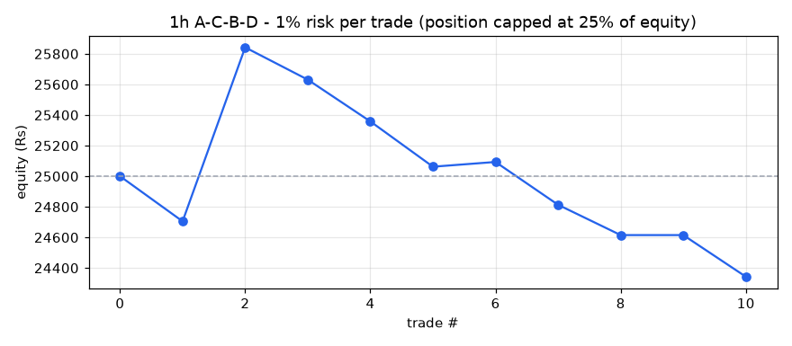
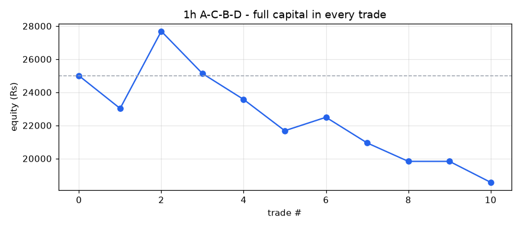

# A-C-B-D backtest report - 1h timeframe

- Stocks scanned: **567** (5 skipped with fewer than 400 candles)
- Data: **26-Oct-2023 09:15 to 01-Oct-2026 15:15, 2,579,969 candles**
- Costs: 0.35% (overnight) / 0.15% (same-day) round trip, plus Rs 15 / Rs 47 flat charges per trade
- Entry at the close of the breakout candle; exit on the first close above the 1.618 target or below the D low.

## Profit / loss: 1% risk per trade (position capped at 25% of equity)

**Rs 25,000 -> Rs 24,343 = LOSS of Rs 657 (-2.63%)**

Trades 9, winners 2, charges paid Rs 273, max drawdown -5.8%

| symbol | entry | exit_date | status | qty | position_rs | net_return_pct | charges_rs | pnl_rs | equity_rs |
|---|---|---|---|---|---|---|---|---|---|
| LICI | 23-Apr-2024 09:15 | 07-May-2024 10:15 | STOPPED | 7 | 3503 | -8.0 | 27 | -295 | 24705 |
| USHAMART | 20-Sep-2024 09:15 | 11-Oct-2024 10:15 | TARGET HIT | 16 | 5605 | 20.55 | 35 | 1137 | 25842 |
| LUPIN | 03-Apr-2025 09:15 | 07-Apr-2025 09:15 | STOPPED | 1 | 2100 | -9.31 | 22 | -210 | 25631 |
| POLYMED | 18-Sep-2025 09:15 | 23-Sep-2025 09:15 | STOPPED | 2 | 4118 | -6.27 | 29 | -273 | 25358 |
| VGUARD | 25-Sep-2025 09:15 | 26-Sep-2025 11:15 | STOPPED | 9 | 3500 | -8.03 | 27 | -296 | 25062 |
| NH | 17-Nov-2025 09:15 | 17-Nov-2025 14:15 | TARGET HIT | 1 | 1922 | 4.07 | 50 | 31 | 25093 |
| GOODLUCK | 16-Feb-2026 09:15 | 05-Mar-2026 11:15 | STOPPED | 10 | 3836 | -6.9 | 28 | -280 | 24813 |
| M&M | 29-Apr-2026 09:15 | 01-Jun-2026 09:15 | STOPPED | 1 | 3176 | -5.77 | 26 | -198 | 24615 |
| SHREECEM | 07-May-2026 09:15 | 08-Jun-2026 09:15 | SKIPPED (price above position size) | 0 | 0 | -8.04 | 0 | 0 | 24615 |
| SONATSOFTW | 19-May-2026 09:15 | 01-Oct-2026 12:15 | STOPPED | 15 | 4028 | -6.38 | 29 | -272 | 24343 |

## Profit / loss: full capital in every trade

**Rs 25,000 -> Rs 18,561 = LOSS of Rs 6,439 (-25.75%)**

Trades 9, winners 2, charges paid Rs 843, max drawdown -32.96%

| symbol | entry | exit_date | status | qty | position_rs | net_return_pct | charges_rs | pnl_rs | equity_rs |
|---|---|---|---|---|---|---|---|---|---|
| LICI | 23-Apr-2024 09:15 | 07-May-2024 10:15 | STOPPED | 49 | 24522 | -8.0 | 101 | -1977 | 23023 |
| USHAMART | 20-Sep-2024 09:15 | 11-Oct-2024 10:15 | TARGET HIT | 65 | 22769 | 20.55 | 95 | 4664 | 27687 |
| LUPIN | 03-Apr-2025 09:15 | 07-Apr-2025 09:15 | STOPPED | 13 | 27296 | -9.31 | 111 | -2556 | 25131 |
| POLYMED | 18-Sep-2025 09:15 | 23-Sep-2025 09:15 | STOPPED | 12 | 24710 | -6.27 | 101 | -1564 | 23567 |
| VGUARD | 25-Sep-2025 09:15 | 26-Sep-2025 11:15 | STOPPED | 60 | 23334 | -8.03 | 97 | -1889 | 21678 |
| NH | 17-Nov-2025 09:15 | 17-Nov-2025 14:15 | TARGET HIT | 11 | 21141 | 4.07 | 79 | 813 | 22491 |
| GOODLUCK | 16-Feb-2026 09:15 | 05-Mar-2026 11:15 | STOPPED | 58 | 22249 | -6.9 | 93 | -1550 | 20941 |
| M&M | 29-Apr-2026 09:15 | 01-Jun-2026 09:15 | STOPPED | 6 | 19053 | -5.77 | 82 | -1114 | 19827 |
| SHREECEM | 07-May-2026 09:15 | 08-Jun-2026 09:15 | SKIPPED (price above position size) | 0 | 0 | -8.04 | 0 | 0 | 19827 |
| SONATSOFTW | 19-May-2026 09:15 | 01-Oct-2026 12:15 | STOPPED | 73 | 19600 | -6.38 | 84 | -1266 | 18561 |

## Trade statistics (after costs)

| period | setups_entered | target_hit | stopped | open | win_rate_pct | avg_gross_pct | avg_net_pct | avg_win_pct | avg_loss_pct | avg_r | profit_factor | avg_hold_candles |
|---|---|---|---|---|---|---|---|---|---|---|---|---|
| 2024 | 2 | 1 | 1 | 0 | 50.0 | 6.62 | 6.28 | 20.55 | -8.0 | 1.8 | 2.57 | 81.5 |
| 2025 | 4 | 1 | 3 | 0 | 25.0 | -4.59 | -4.88 | 4.07 | -7.87 | -0.75 | 0.17 | 12.2 |
| 2026 | 4 | 0 | 4 | 0 | 0.0 | -6.42 | -6.77 |  | -6.77 | -1.12 | 0.0 | 260.2 |
| ALL | 10 | 2 | 8 | 0 | 20.0 | -3.08 | -3.41 | 12.31 | -7.34 | -0.39 | 0.42 | 125.3 |

## Trades entered

| symbol | D | entry | entry_close | stop | target | status | exit_date | return_pct | net_return_pct | hold_candles |
|---|---|---|---|---|---|---|---|---|---|---|
| LICI | 15-Apr-2024 09:15 | 23-Apr-2024 09:15 | 500.4500122070313 | 466.0249938964844 | 554.67 | STOPPED | 07-May-2024 10:15 | -7.65 | -8.0 | 64.0 |
| USHAMART | 19-Sep-2024 11:15 | 20-Sep-2024 09:15 | 350.29998779296875 | 335.20001220703125 | 404.56 | TARGET HIT | 11-Oct-2024 10:15 | 20.9 | 20.55 | 99.0 |
| LUPIN | 02-Apr-2025 09:15 | 03-Apr-2025 09:15 | 2099.699951171875 | 1938.550048828125 | 2304.9 | STOPPED | 07-Apr-2025 09:15 | -8.96 | -9.31 | 14.0 |
| POLYMED | 10-Sep-2025 13:15 | 18-Sep-2025 09:15 | 2059.199951171875 | 1939.300048828125 | 2344.76 | STOPPED | 23-Sep-2025 09:15 | -5.92 | -6.27 | 21.0 |
| VGUARD | 24-Sep-2025 12:15 | 25-Sep-2025 09:15 | 388.8999938964844 | 361.1000061035156 | 400.41 | STOPPED | 26-Sep-2025 11:15 | -7.68 | -8.03 | 9.0 |
| NH | 12-Nov-2025 10:15 | 17-Nov-2025 09:15 | 1921.9000244140625 | 1736.0 | 1966.47 | TARGET HIT | 17-Nov-2025 14:15 | 4.22 | 4.07 | 5.0 |
| GOODLUCK | 12-Feb-2026 11:15 | 16-Feb-2026 09:15 | 383.6000061035156 | 358.6666564941406 | 432.47 | STOPPED | 05-Mar-2026 11:15 | -6.55 | -6.9 | 86.0 |
| M&M | 23-Apr-2026 14:15 | 29-Apr-2026 09:15 | 3175.5 | 3032.89990234375 | 3552.31 | STOPPED | 01-Jun-2026 09:15 | -5.42 | -5.77 | 147.0 |
| SHREECEM | 30-Apr-2026 11:15 | 07-May-2026 09:15 | 25760.0 | 23800.0 | 27947.94 | STOPPED | 08-Jun-2026 09:15 | -7.69 | -8.04 | 147.0 |
| SONATSOFTW | 18-May-2026 10:15 | 19-May-2026 09:15 | 268.5 | 252.5 | 369.21 | STOPPED | 01-Oct-2026 12:15 | -6.03 | -6.38 | 661.0 |

## All setups found (A-C-B-D located, with why most were not traded)

| status | setups |
|---|---|
| D broken | 42 |
| no breakout | 20 |
| STOPPED | 8 |
| consolidation too wide | 6 |
| TARGET HIT | 2 |
| WATCH | 1 |

| symbol | A | C | B | D | fib_B | fib_D | status |
|---|---|---|---|---|---|---|---|
| CLEAN | 01-Jan-2024 11:15 | 08-Feb-2024 15:15 | 26-Feb-2024 14:15 | 29-Feb-2024 10:15 | 0.445 | 0.285 | D broken |
| KPITTECH | 12-Feb-2024 09:15 | 22-Mar-2024 09:15 | 02-Apr-2024 11:15 | 15-Apr-2024 09:15 | 0.536 | 0.363 | D broken |
| LICI | 09-Feb-2024 09:15 | 20-Mar-2024 15:15 | 04-Apr-2024 09:15 | 15-Apr-2024 09:15 | 0.487 | 0.444 | STOPPED |
| ENGINERSIN | 02-Feb-2024 14:15 | 20-Mar-2024 15:15 | 08-Apr-2024 09:15 | 19-Apr-2024 09:15 | 0.601 | 0.443 | no breakout |
| NBCC | 05-Feb-2024 09:15 | 14-Mar-2024 09:15 | 09-Apr-2024 11:15 | 19-Apr-2024 09:15 | 0.508 | 0.382 | consolidation too wide |
| DCMSHRIRAM | 04-Jan-2024 15:15 | 28-Mar-2024 15:15 | 12-Apr-2024 09:15 | 19-Apr-2024 15:15 | 0.435 | 0.429 | D broken |
| UPL | 02-Jan-2024 09:15 | 14-Mar-2024 09:15 | 26-Apr-2024 11:15 | 07-May-2024 11:15 | 0.422 | 0.336 | D broken |
| JKLAKSHMI | 16-Feb-2024 13:15 | 13-May-2024 10:15 | 24-May-2024 09:15 | 30-May-2024 15:15 | 0.445 | 0.308 | D broken |
| JINDALSTEL | 21-Jun-2024 14:15 | 14-Aug-2024 10:15 | 26-Aug-2024 14:15 | 04-Sep-2024 09:15 | 0.456 | 0.364 | no breakout |
| CLEAN | 01-Aug-2024 09:15 | 02-Sep-2024 12:15 | 16-Sep-2024 09:15 | 19-Sep-2024 11:15 | 0.603 | 0.371 | D broken |
| USHAMART | 05-Jul-2024 09:15 | 19-Aug-2024 15:15 | 11-Sep-2024 09:15 | 19-Sep-2024 11:15 | 0.49 | 0.321 | TARGET HIT |
| COALINDIA | 26-Aug-2024 09:15 | 19-Sep-2024 11:15 | 27-Sep-2024 15:15 | 04-Oct-2024 09:15 | 0.616 | 0.44 | D broken |
| EXIDEIND | 09-Jul-2024 14:15 | 19-Sep-2024 12:15 | 01-Oct-2024 13:15 | 07-Oct-2024 10:15 | 0.467 | 0.328 | consolidation too wide |
| HONAUT | 26-Jun-2024 11:15 | 07-Oct-2024 10:15 | 21-Oct-2024 09:15 | 25-Oct-2024 12:15 | 0.399 | 0.392 | D broken |
| BEML | 12-Jul-2024 09:15 | 07-Oct-2024 14:15 | 21-Oct-2024 09:15 | 25-Oct-2024 14:15 | 0.401 | 0.358 | consolidation too wide |
| NATCOPHARM | 12-Sep-2024 12:15 | 28-Oct-2024 09:15 | 07-Nov-2024 09:15 | 13-Nov-2024 14:15 | 0.492 | 0.449 | D broken |
| KIRLOSENG | 04-Sep-2024 09:15 | 25-Oct-2024 09:15 | 08-Nov-2024 09:15 | 13-Nov-2024 15:15 | 0.508 | 0.423 | consolidation too wide |
| BEL | 09-Jul-2024 09:15 | 25-Oct-2024 10:15 | 08-Nov-2024 09:15 | 14-Nov-2024 09:15 | 0.574 | 0.384 | D broken |
| BEML | 12-Jul-2024 09:15 | 07-Oct-2024 14:15 | 07-Nov-2024 10:15 | 14-Nov-2024 09:15 | 0.519 | 0.317 | D broken |
| BIRLACABLE | 26-Aug-2024 10:15 | 21-Nov-2024 10:15 | 10-Dec-2024 10:15 | 23-Dec-2024 09:15 | 0.491 | 0.287 | D broken |
| KPITTECH | 28-Aug-2024 10:15 | 21-Nov-2024 10:15 | 12-Dec-2024 09:15 | 23-Dec-2024 13:15 | 0.439 | 0.448 | no breakout |
| MINDACORP | 26-Aug-2024 12:15 | 25-Oct-2024 10:15 | 11-Dec-2024 13:15 | 24-Dec-2024 09:15 | 0.447 | 0.254 | D broken |
| SHYAMMETL | 24-Sep-2024 09:15 | 10-Jan-2025 09:15 | 21-Jan-2025 14:15 | 27-Jan-2025 10:15 | 0.573 | 0.393 | D broken |
| FORCEMOT | 31-Oct-2024 14:15 | 28-Jan-2025 10:15 | 21-Feb-2025 12:15 | 28-Feb-2025 09:15 | 0.486 | 0.363 | consolidation too wide |
| INDUSTOWER | 20-Jan-2025 09:15 | 03-Mar-2025 11:15 | 24-Mar-2025 09:15 | 28-Mar-2025 13:15 | 0.592 | 0.408 | no breakout |
| LUPIN | 02-Jan-2025 14:15 | 28-Feb-2025 09:15 | 24-Mar-2025 09:15 | 02-Apr-2025 09:15 | 0.506 | 0.286 | STOPPED |
| GAIL | 06-Dec-2024 10:15 | 04-Mar-2025 09:15 | 01-Apr-2025 13:15 | 07-Apr-2025 09:15 | 0.579 | 0.3 | consolidation too wide |
| SBIN | 06-Dec-2024 10:15 | 03-Mar-2025 09:15 | 25-Mar-2025 09:15 | 07-Apr-2025 12:15 | 0.543 | 0.482 | no breakout |
| BATAINDIA | 12-Feb-2025 12:15 | 07-Apr-2025 09:15 | 15-Apr-2025 09:15 | 21-Apr-2025 15:15 | 0.459 | 0.479 | no breakout |
| CIEINDIA | 06-Feb-2025 12:15 | 07-Apr-2025 09:15 | 22-Apr-2025 15:15 | 02-May-2025 09:15 | 0.592 | 0.441 | no breakout |
| JPPOWER | 20-Dec-2024 09:15 | 03-Mar-2025 11:15 | 22-Apr-2025 09:15 | 02-May-2025 09:15 | 0.517 | 0.427 | D broken |
| SYNGENE | 03-Apr-2025 09:15 | 09-May-2025 09:15 | 12-Jun-2025 10:15 | 20-Jun-2025 09:15 | 0.445 | 0.347 | no breakout |
| HAVELLS | 22-Apr-2025 13:15 | 05-Jun-2025 14:15 | 25-Jun-2025 09:15 | 30-Jun-2025 11:15 | 0.606 | 0.462 | D broken |
| TORNTPOWER | 16-Apr-2025 09:15 | 19-Jun-2025 13:15 | 27-Jun-2025 10:15 | 09-Jul-2025 11:15 | 0.473 | 0.368 | D broken |
| GESHIP | 13-Jun-2025 10:15 | 01-Aug-2025 14:15 | 21-Aug-2025 09:15 | 26-Aug-2025 09:15 | 0.554 | 0.333 | D broken |
| CHOLAFIN | 27-Jun-2025 15:15 | 01-Aug-2025 11:15 | 20-Aug-2025 12:15 | 26-Aug-2025 11:15 | 0.503 | 0.499 | D broken |
| ASTERDM | 03-Jul-2025 15:15 | 28-Jul-2025 15:15 | 18-Aug-2025 12:15 | 28-Aug-2025 09:15 | 0.549 | 0.262 | D broken |
| TATACONSUM | 30-Apr-2025 09:15 | 07-Aug-2025 13:15 | 20-Aug-2025 15:15 | 29-Aug-2025 09:15 | 0.479 | 0.251 | no breakout |
| POLYMED | 21-May-2025 09:15 | 13-Aug-2025 12:15 | 04-Sep-2025 09:15 | 10-Sep-2025 13:15 | 0.458 | 0.364 | STOPPED |
| MGL | 04-Jul-2025 10:15 | 29-Aug-2025 15:15 | 17-Sep-2025 09:15 | 23-Sep-2025 09:15 | 0.385 | 0.405 | D broken |
| DLF | 09-Jun-2025 09:15 | 01-Sep-2025 09:15 | 17-Sep-2025 09:15 | 23-Sep-2025 11:15 | 0.387 | 0.331 | D broken |
| VGUARD | 24-Jul-2025 09:15 | 11-Aug-2025 09:15 | 16-Sep-2025 12:15 | 24-Sep-2025 12:15 | 0.525 | 0.392 | STOPPED |
| KOTAKBANK | 10-Jul-2025 09:15 | 08-Sep-2025 10:15 | 18-Sep-2025 11:15 | 26-Sep-2025 10:15 | 0.417 | 0.444 | D broken |
| IRFC | 09-Jun-2025 12:15 | 29-Aug-2025 09:15 | 18-Sep-2025 09:15 | 26-Sep-2025 14:15 | 0.425 | 0.307 | no breakout |
| KIMS | 24-Jul-2025 13:15 | 03-Oct-2025 11:15 | 29-Oct-2025 15:15 | 06-Nov-2025 10:15 | 0.514 | 0.414 | D broken |
| CRISIL | 16-Jul-2025 09:15 | 30-Sep-2025 14:15 | 27-Oct-2025 09:15 | 10-Nov-2025 09:15 | 0.398 | 0.489 | D broken |
| NH | 14-Jul-2025 10:15 | 26-Sep-2025 09:15 | 04-Nov-2025 10:15 | 12-Nov-2025 10:15 | 0.481 | 0.249 | TARGET HIT |
| KEI | 15-Oct-2025 15:15 | 07-Nov-2025 10:15 | 28-Nov-2025 09:15 | 09-Dec-2025 10:15 | 0.589 | 0.373 | D broken |
| KFINTECH | 28-Oct-2025 09:15 | 09-Dec-2025 09:15 | 24-Dec-2025 10:15 | 01-Jan-2026 13:15 | 0.498 | 0.491 | D broken |
| PARADEEP | 07-Oct-2025 09:15 | 09-Dec-2025 09:15 | 30-Dec-2025 10:15 | 07-Jan-2026 09:15 | 0.417 | 0.312 | D broken |
| SCI | 24-Oct-2025 15:15 | 19-Dec-2025 11:15 | 05-Jan-2026 09:15 | 09-Jan-2026 09:15 | 0.441 | 0.342 | D broken |
| SMARTWORKS | 04-Nov-2025 09:15 | 09-Dec-2025 09:15 | 02-Jan-2026 09:15 | 09-Jan-2026 09:15 | 0.535 | 0.379 | D broken |
| BLUESTARCO | 24-Oct-2025 10:15 | 31-Dec-2025 09:15 | 05-Jan-2026 12:15 | 13-Jan-2026 10:15 | 0.548 | 0.384 | D broken |
| HAL | 17-Oct-2025 09:15 | 09-Dec-2025 09:15 | 08-Jan-2026 10:15 | 16-Jan-2026 13:15 | 0.495 | 0.467 | D broken |
| JKLAKSHMI | 03-Nov-2025 09:15 | 12-Jan-2026 09:15 | 16-Jan-2026 15:15 | 21-Jan-2026 13:15 | 0.528 | 0.398 | no breakout |
| GOODLUCK | 03-Oct-2025 09:15 | 27-Jan-2026 10:15 | 04-Feb-2026 11:15 | 12-Feb-2026 11:15 | 0.53 | 0.462 | STOPPED |
| DLF | 29-Oct-2025 13:15 | 23-Jan-2026 15:15 | 10-Feb-2026 09:15 | 13-Feb-2026 10:15 | 0.449 | 0.412 | D broken |
| LALPATHLAB | 19-Nov-2025 09:15 | 21-Jan-2026 09:15 | 11-Feb-2026 10:15 | 13-Feb-2026 13:15 | 0.419 | 0.345 | no breakout |
| GODREJPROP | 27-Oct-2025 11:15 | 27-Jan-2026 12:15 | 18-Feb-2026 14:15 | 02-Mar-2026 09:15 | 0.478 | 0.475 | D broken |
| M&M | 05-Jan-2026 10:15 | 16-Mar-2026 10:15 | 15-Apr-2026 10:15 | 23-Apr-2026 14:15 | 0.43 | 0.336 | STOPPED |
| IEX | 09-Jan-2026 09:15 | 30-Mar-2026 15:15 | 17-Apr-2026 13:15 | 24-Apr-2026 13:15 | 0.486 | 0.349 | no breakout |
| CANBK | 26-Feb-2026 09:15 | 02-Apr-2026 09:15 | 22-Apr-2026 11:15 | 30-Apr-2026 11:15 | 0.61 | 0.464 | D broken |
| SHREECEM | 06-Jan-2026 11:15 | 23-Mar-2026 14:15 | 21-Apr-2026 10:15 | 30-Apr-2026 11:15 | 0.604 | 0.372 | STOPPED |
| APOLLOTYRE | 11-Feb-2026 09:15 | 16-Mar-2026 10:15 | 17-Apr-2026 11:15 | 30-Apr-2026 13:15 | 0.428 | 0.25 | D broken |
| UNOMINDA | 05-Jan-2026 10:15 | 16-Mar-2026 10:15 | 29-Apr-2026 09:15 | 05-May-2026 12:15 | 0.471 | 0.429 | no breakout |
| ABFRL | 02-Jan-2026 14:15 | 30-Mar-2026 15:15 | 07-May-2026 12:15 | 18-May-2026 10:15 | 0.612 | 0.442 | no breakout |
| SHREECEM | 06-Jan-2026 11:15 | 23-Mar-2026 14:15 | 07-May-2026 12:15 | 18-May-2026 10:15 | 0.617 | 0.471 | D broken |
| SONATSOFTW | 07-Jan-2026 14:15 | 30-Mar-2026 15:15 | 08-May-2026 13:15 | 18-May-2026 10:15 | 0.599 | 0.444 | STOPPED |
| M&MFIN | 10-Feb-2026 12:15 | 07-Apr-2026 13:15 | 08-May-2026 13:15 | 22-May-2026 09:15 | 0.549 | 0.316 | no breakout |
| AMBER | 07-May-2026 10:15 | 20-May-2026 10:15 | 19-Jun-2026 09:15 | 29-Jun-2026 15:15 | 0.595 | 0.38 | D broken |
| HINDUNILVR | 22-Apr-2026 12:15 | 02-Jun-2026 11:15 | 03-Jul-2026 09:15 | 08-Jul-2026 15:15 | 0.505 | 0.37 | D broken |
| GILLETTE | 27-May-2026 13:15 | 29-Jun-2026 13:15 | 13-Jul-2026 09:15 | 17-Jul-2026 11:15 | 0.489 | 0.465 | no breakout |
| GLENMARK | 29-Apr-2026 09:15 | 12-Jun-2026 09:15 | 14-Jul-2026 09:15 | 22-Jul-2026 09:15 | 0.589 | 0.239 | no breakout |
| BLUESTARCO | 28-Apr-2026 09:15 | 02-Jun-2026 09:15 | 15-Jul-2026 09:15 | 24-Jul-2026 09:15 | 0.6 | 0.347 | no breakout |
| UPL | 11-May-2026 14:15 | 01-Jul-2026 14:15 | 16-Jul-2026 15:15 | 24-Jul-2026 09:15 | 0.551 | 0.483 | no breakout |
| PFC | 07-May-2026 09:15 | 09-Jul-2026 10:15 | 29-Jul-2026 11:15 | 05-Aug-2026 11:15 | 0.474 | 0.482 | D broken |
| AWL | 07-May-2026 11:15 | 29-Jun-2026 13:15 | 07-Aug-2026 09:15 | 19-Aug-2026 13:15 | 0.599 | 0.372 | D broken |
| AXISBANK | 25-Jun-2026 10:15 | 14-Aug-2026 10:15 | 31-Aug-2026 15:15 | 09-Sep-2026 09:15 | 0.477 | 0.285 | D broken |
| HDFCBANK | 07-Jul-2026 09:15 | 11-Sep-2026 09:15 | 22-Sep-2026 09:15 | 29-Sep-2026 09:15 | 0.422 | 0.359 | WATCH |
